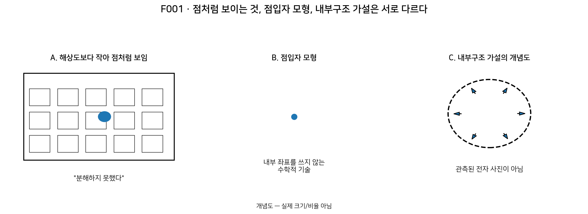

# 1장 · 입자는 무엇일까?

> **Migration note:** 본문 안의 과거 `현재 상태`/`다음 작업` 문구는 DOCX 원문 보존을 위해 그대로 남긴다. 공식 현재 진행상태는 저장소 루트의 [`STATUS.md`](../STATUS.md)만 기준으로 한다.

| **현재 상태**                                                                                                                                 |
|-----------------------------------------------------------------------------------------------------------------------------------------------|
| DRAFT · 이 장은 제1권 전체 FINAL이 아니다. 제1권 전체 초안 후 SCIENTIFIC → EDUCATIONAL → ILLUSTRATION → SOURCE AUDIT를 통과해야 FINAL이 된다. |

## 이번 장에서 알아낼 질문

전자처럼 아주 작은 대상을 실험에서 “점처럼 보인다”고 말하는 것과, 자연에 정말로 “내부구조가 전혀 없는 수학적 점”이 존재한다고 말하는 것은 같은 주장일까? 그리고 Planck-S²는 이 둘 사이의 어디에서 새로운 가정을 시작할까?

## 앞 장에서 배운 것

이 책의 첫 장이므로 선행 수학은 없다. 필요한 것은 “관찰한 것”과 “그 관찰을 설명하기 위해 만든 모형”이 다를 수 있다는 한 가지 태도뿐이다.

## 왜 새로운 문제가 생겼을까?

물리학에서 “입자”라는 말은 일상어의 작은 알갱이와 완전히 같지 않다. 전자는 검출기에서 한 번의 상호작용으로 에너지와 전하를 전달하고, 표준모형에서는 기본적인 물질입자(lepton)로 분류된다. 현대 입자물리의 표준 기술은 전자를 내부 부품을 가진 작은 고전적 공으로 다루지 않는다.

하지만 여기서 조심해야 한다. “현재 실험과 이론이 전자를 점입자처럼 다룬다”는 문장과 “전자에는 어떤 더 깊은 내부 자유도도 절대로 있을 수 없다”는 문장은 논리적으로 다르다. 실제로 입자물리학은 더 작은 substructure가 있는지를 계속 시험하며, 발견되지 않았다는 사실과 존재 불가능의 증명은 구분한다.

Planck-S²는 바로 이 틈을 연구 질문으로 삼는다. 외부에서는 점입자처럼 보이는 기본입자가 더 근본적인 층에서는 닫힌 2차원 내부/경계 자유도를 가질 수 있는지 시험한다. 이 문장은 관측 결과가 아니라 프로젝트의 가설이다.

## 먼저 생각해 보기

밤에 아주 멀리 있는 가로등을 보면 작은 점 하나처럼 보인다. 그 점을 확대할 수 없는 상황에서 우리는 무엇을 확실히 말할 수 있을까? “내 눈으로 구조를 분해하지 못했다”는 말은 가능하다. 하지만 “가로등의 크기는 정확히 0이다”라고 말할 수는 없다. 반대로, 점처럼 보인다고 해서 “분명히 복잡한 내부구조가 숨어 있다”고 말할 수도 없다. 관측은 두 극단 가운데 하나를 자동으로 선택해 주지 않는다.

**그림 F001. 점입자 vs 내부구조 개념도 — 개념도, 실제 크기/비율 아님**

| **이 그림에서 볼 것**                                                                                                                            |
|--------------------------------------------------------------------------------------------------------------------------------------------------|
| ① 해상도보다 작은 대상은 점처럼 보일 수 있다. ② “점입자 모형”은 내부 좌표를 쓰지 않는 수학적 기술이다. ③ “내부구조 가설”은 별도의 추가 주장이다. |

| **이 그림이 뜻하는 것**                                                                  |
|------------------------------------------------------------------------------------------|
| “점처럼 보임”, “점입자 모형”, “실제 내부구조 없음”은 서로 다른 문장이라는 것을 구분한다. |

| **이 그림이 뜻하지 않는 것**                                                                                              |
|---------------------------------------------------------------------------------------------------------------------------|
| 오른쪽의 구면 그림은 전자의 실제 사진이나 관측된 내부구조가 아니다. Planck-S²의 가설을 시각적으로 표시한 개념도일 뿐이다. |

## 쉬운 비유: 카메라의 해상도

카메라 한 픽셀보다 훨씬 작은 무늬를 찍으면 사진에는 무늬가 하나의 점처럼 뭉쳐 보일 수 있다. 여기서 카메라가 알려주는 것은 “이 해상도에서는 무늬를 분해하지 못했다”는 사실이다.

물리 실험도 비슷한 질문을 한다. 더 짧은 거리 구조를 보려면 그 구조를 구별할 수 있는 실험적 분해능이 필요하다. 그래서 “점처럼 보인다”는 표현에는 언제나 “현재의 측정 방법과 범위에서”라는 뜻이 숨어 있다.

| **비유의 한계**                                                                                                                                                                           |
|-------------------------------------------------------------------------------------------------------------------------------------------------------------------------------------------|
| 가로등이나 카메라 무늬는 실제 크기와 내부구조가 이미 있는 고전적 물체다. 전자는 그렇다고 미리 가정할 수 없다. 이 비유는 오직 “분해하지 못함과 구조 부재는 다른 명제”라는 논리만 보여준다. |

## 실제 과학에서는: 전자는 무엇인가?

표준모형에서 전자는 렙톤(lepton)이라는 기본입자 계열에 속한다. 현재 표준 기술에서는 전자를 양성자처럼 더 작은 알려진 구성요소로 이루어진 복합입자로 취급하지 않는다. CERN의 표준모형 설명은 전자를 물질을 이루는 elementary particle 가운데 하나로 분류한다. 또한 CERN의 2000년 「The LEP story」 첫 문단은 전자와 양전자를 “as far as we know, point-like particles”라고 기술한다. 이 책은 이 역사적 표현을 “현재 실험과 표준 기술에서 분해된 내부구조가 없고 elementary particle로 취급된다”는 범위로만 사용한다.

여기서 “기본입자”는 “앞으로도 영원히 더 깊은 구조가 발견될 수 없음이 증명된 물체”라는 철학적 선언이 아니다. 현재의 성공적인 이론과 실험이 더 작은 구성요소를 요구하지 않는다는 뜻으로 읽는 것이 안전하다. CERN도 compositeness, 즉 표준모형 입자보다 더 작은 하부구조 가능성을 실험적으로 완전히 배제한 것은 아니라고 설명한다. 따라서 point-like라는 표현을 자연의 모든 더 깊은 층에서 내부구조가 절대 없다는 증명으로 읽지 않는다.

<table>
<colgroup>
<col style="width: 100%" />
</colgroup>
<thead>
<tr class="header">
<th><strong>출처 종류 구분</strong></th>
</tr>
</thead>
<tbody>
<tr class="odd">
<td>[외부 문헌/기관 설명] 전자의 표준모형 분류와 point-like 기술. 
[프로젝트 가정] 전자 후보가 더 근본적인 S²형 내부/경계 자유도를 가질 수 있다는 생각. 
[적대적 감사] 이 내부/경계가 실제 전자의 구조라는 결론은 아직 OPEN.</td>
</tr>
</tbody>
</table>

## 점입자라는 말에는 세 층이 있다

| **1. 관측 언어**                                                                   |
|------------------------------------------------------------------------------------|
| 현재 실험에서 내부 크기나 form factor를 분해해 보지 못해 “점처럼 보인다”고 말한다. |

| **2. 모형 언어**                                                                                                    |
|---------------------------------------------------------------------------------------------------------------------|
| 계산에서 입자를 위치와 양자수로 기술하고 별도의 내부 공간 좌표를 넣지 않는 “point-particle description”을 사용한다. |

| **3. 존재론적 주장**                                                                                       |
|------------------------------------------------------------------------------------------------------------|
| 자연의 더 깊은 층에도 내부 자유도가 전혀 없다고 주장한다. 이것은 1번이나 2번에서 자동으로 따라오지 않는다. |

## 최소한의 수학

아직 복잡한 수식은 필요 없다. 단 하나의 부등식만 생각하자.

$R \ll \delta$

R은 어떤 가설적 내부구조의 특징적 크기, δ는 실험이 구별할 수 있는 거리 척도라고 하자. R이 δ보다 훨씬 작다면 그 실험은 내부구조를 분해하지 못할 수 있다. 하지만 이 식은 R이 실제로 존재한다고 증명하지 않는다. 단지 “있다고 가정했을 때 너무 작으면 보이지 않을 수 있다”는 조건문이다.

| **이 식으로 알 수 없는 것**                                                                                                             |
|-----------------------------------------------------------------------------------------------------------------------------------------|
| R의 실제 값, 전자에 R이라는 내부 크기가 존재하는지, 그 내부가 구면인지, 그 구조가 전하·질량·스핀을 만드는지는 이 부등식으로 알 수 없다. |

## Planck-S²에서는

프로젝트의 v0.1은 “기본입자의 근본 자유도가 플랑크 규모의 닫힌 2차원 경계에 놓여 있을 수 있는가?”라는 질문에서 시작했다. 이 경계는 반드시 3차원 공간 속에 떠 있는 물질막일 필요가 없으며, 내부 자유도를 나타내는 추상적 정보공간이나 더 근본적인 경계 자유도일 가능성도 열어 두었다.

이 책에서는 아직 S²라는 기호의 정확한 뜻을 사용하지 않는다. 3장에서 “구의 표면”을 수학적으로 정의한 뒤 S²라는 이름을 붙일 것이다. 지금 필요한 핵심은 하나다. Planck-S²는 “전자 내부에서 실제 구면을 관측했다”는 보고가 아니라, 점입자 기술 아래에 더 근본적인 내부/경계 자유도가 있을 가능성을 수학적으로 시험하는 연구 프로그램이다.

## 당시 연구에서는 무엇을 얻었나

v0.1은 가능한 내부 자유도를 넓게 열어 두었다. 스칼라장, 스피너장, 게이지장, 위상적 양자수 같은 후보를 한꺼번에 검토하면서, 가장 먼저 해결해야 할 문제로 “왜 전자가 실험에서 점입자처럼 보이는가?”, “로런츠 대칭과 충돌하지 않는가?”, “전하·질량·스핀을 실제로 유도할 수 있는가?”를 등록했다.

즉 초기 문서의 성과는 전자의 내부구조를 증명한 것이 아니라, 가설이 살아남으려면 어떤 질문을 통과해야 하는지 연구 의제를 만든 데 있다.

## 후속 감사에서는 무엇이 바뀌었나

전수 적대적 감사 A01은 “S² 내부/경계가 전자의 성질을 창발시킨다”는 핵심 물리적 연결을 OPEN으로 유지했다. 또한 블랙홀의 면적 법칙이 맞다는 사실을 기본입자에 그대로 옮겨 쓰는 것은 허용하지 않았다. 다시 말해 초기 동기는 보존되지만, 동기에서 전자 구조로 가는 화살표는 아직 증명되지 않았다.

## 현재 판정

| **명제/항목**                                         | **상태**           | **이 장에서의 의미**                                                        |
|-------------------------------------------------------|--------------------|-----------------------------------------------------------------------------|
| 전자는 표준모형의 렙톤/기본 물질입자다                | SOURCE VERIFIED    | 표준 입자물리 배경. Planck-S²가 새로 유도한 결과가 아니다.                  |
| 전자는 현재 지식에서 point-like하게 취급된다          | SOURCE VERIFIED    | 관측·표준모형 기술의 범위. “절대적으로 구조 없음”의 형이상학적 증명과 구분. |
| 전자에 Planck-S²형 내부/경계 자유도가 실제로 존재한다 | OPEN               | 프로젝트의 핵심 가설이며 아직 실험·동역학·3+1D 연결이 없다.                 |
| 그 내부/경계가 전자의 질량·전하·스핀을 만든다         | OPEN               | 각각 별도 bridge가 필요하다.                                                |
| Planck-S² 전체                                        | WORKING HYPOTHESIS | 부분 수학이 살아남아도 전자 이론 전체가 증명된 것은 아니다.                 |

## 이것으로 말할 수 있는 것

• “점처럼 보인다”와 “내부구조가 없다”는 동일한 문장이 아니다.

• 표준모형은 전자를 기본 렙톤으로 다루며 알려진 구성요소를 요구하지 않는다.

• Planck-S²는 더 깊은 내부/경계 자유도의 가능성을 시험하는 가설이다.

• 가설의 존재만으로 전자 내부구조가 실제라는 증거가 생기지는 않는다.

## 이것으로 말할 수 없는 것

• “전자에는 반드시 구면 내부구조가 있다.”

• “플랑크 길이보다 작으면 실험에서 영원히 볼 수 없다.”

• “파동함수가 퍼져 있으니 전자 자체가 그만큼 큰 공이다.”

• “블랙홀 엔트로피가 면적에 비례하므로 전자도 반드시 2차원 경계에 정보를 저장한다.”

## 자주 하는 오해

| **오해 1 · 점처럼 보임 = 크기 0**                                               |
|---------------------------------------------------------------------------------|
| 아니다. “현재 실험에서 분해되지 않음”과 “수학적으로 정확한 점”을 구분해야 한다. |

| **오해 2 · 내부구조 가설 = 내부구조 발견**           |
|------------------------------------------------------|
| 아니다. 가설은 검증할 질문을 만드는 출발점일 뿐이다. |

| **오해 3 · 파동함수의 퍼짐 = 내부 반지름**                                                      |
|-------------------------------------------------------------------------------------------------|
| 아니다. 외부 위치에 대한 양자상태의 퍼짐과 입자의 가설적 내부 자유도 크기는 서로 다른 개념이다. |

| **오해 4 · Planck scale = 자동 holography/black hole**     |
|------------------------------------------------------------|
| 아니다. G01도 블랙홀은 동기일 뿐 증명이 아니라고 명시한다. |

## 다음 장이 필요한 이유

Planck-S²의 첫 단어는 “2차원”이다. 그런데 구는 우리가 3차원으로 그리는 물체처럼 보인다. 어떻게 구의 표면이 2차원일 수 있을까? 다음 장에서는 0D·1D·2D·3D를 처음부터 다시 쌓아, “차원”이라는 말을 정확히 준비한다.

| **한 문장 기억**                                                                                                                                        |
|---------------------------------------------------------------------------------------------------------------------------------------------------------|
| “점처럼 보인다”는 관측의 말이고, “내부구조가 없다”는 더 강한 주장이다. Planck-S²는 그 사이에서 아직 검증되지 않은 내부/경계 자유도의 가능성을 시험한다. |

## 용어 카드

| **용어**                     | **이 책에서의 뜻**                                                                                 |
|------------------------------|----------------------------------------------------------------------------------------------------|
| 입자 particle                | 실험과 이론에서 하나의 양자적 개체/여기로 다루는 대상. 고전적인 작은 구슬과 항상 같은 뜻은 아니다. |
| 전자 electron                | 표준모형의 첫 세대 렙톤. 음전하를 가진 기본 물질입자로 기술된다.                                   |
| 기본입자 elementary particle | 현재 표준모형에서 더 작은 알려진 구성요소로 분해하지 않는 기본 자유도.                             |
| 점입자 point particle        | 내부 공간 크기나 모양을 명시하지 않고 한 위치의 자유도로 이상화하는 기술.                          |
| 내부구조 internal structure  | 더 작은 구성요소, 내부 좌표, 내부 장/자유도처럼 외부 운동과 구별되는 구조.                         |
| 해상도 resolution            | 실험이 서로 다른 두 구조를 구별할 수 있는 능력/거리 척도.                                          |
| WORKING HYPOTHESIS           | 일부 아이디어를 수학적으로 시험 중이지만 전체 이론이 증명되지 않은 연구 가설 상태.                 |

## 확인문제

1\. 아주 먼 별이 맨눈에 점처럼 보였다. 이것만으로 별의 실제 크기가 0이라고 결론내릴 수 있을까?

2\. “현재 실험에서 전자의 내부구조를 분해하지 못했다”와 “전자에는 어떤 내부 자유도도 절대 없다”는 같은 주장인가?

3\. Planck-S²의 구면 그림을 보았다고 해서 전자 내부에 실제 물질 껍질이 관측됐다고 말할 수 있을까?

4\. 입자의 외부 파동함수가 넓게 퍼져 있는 것과 입자의 가설적 내부 크기는 같은 개념인가?

5\. R≪δ라는 조건은 무엇을 말하고, 무엇을 말하지 않는가?

6\. 현재 “전자에 Planck-S²형 내부/경계가 실제로 존재한다”의 증명상태 라벨은 무엇인가?

## 정답과 설명

1\. 아니다. 관측 해상도가 충분하지 않아 점처럼 보일 수 있다. “분해하지 못함”만 말할 수 있다.

2\. 아니다. 첫 문장은 실험 범위에 대한 주장이고, 둘째는 자연의 모든 더 깊은 층을 부정하는 훨씬 강한 주장이다.

3\. 말할 수 없다. 그림 F001의 내부구조 패널은 검증되지 않은 프로젝트 가설을 나타내는 개념도다.

4\. 다르다. 외부 위치의 양자적 퍼짐과 내부 자유도의 공간/크기는 별도로 정의해야 한다.

5\. 가설적 구조가 실험 분해능보다 훨씬 작으면 그 실험에서 보이지 않을 수 있음을 말한다. R이 실제 존재하거나 그 값이 얼마인지는 말하지 않는다.

6\. OPEN. Planck-S² 전체는 WORKING HYPOTHESIS이며, 실제 전자 구조로의 연결은 아직 닫히지 않았다.

## 이 장의 근거 자료

| **파일/자료**                                                                 | **절/사용 범위**                                                                                                                                   | **자료 종류**           |
|-------------------------------------------------------------------------------|----------------------------------------------------------------------------------------------------------------------------------------------------|-------------------------|
| Planck_S2_Quantum_Particle_Hypothesis_v0.1.docx                               | §0 문서의 성격; §2 핵심 가설; §4 파동함수와 내부 구조의 구분; §14–15 검증 문제/구조적 위험                                                         | \[일반 연구\]           |
| Planck_S2_양자입자_가설_v0.2_한국어(1).docx                                   | §1 가설의 범위와 현재 상태; §2 핵심 가설; §10 동역학·안정성·점입자 극한                                                                            | \[일반 연구\]           |
| Planck_S2_일반연구_MASTER_전수_적대적_논리감사_보고서_v1.0_2026-08-27(1).docx | §3 G01 전수 감사; §5.1 기존 핵심 상태의 최신 통합판; §10 최종 결론                                                                                 | \[적대적 감사\]         |
| CERN · The Standard Model                                                     | Matter particles: electron을 lepton/elementary matter particle로 분류                                                                              | \[외부 문헌/기관 설명\] |
| CERN · Compositeness                                                          | 표준모형 입자의 더 작은 substructure 가능성은 완전히 배제되지 않았다는 설명                                                                        | \[외부 문헌/기관 설명\] |
| CERN · The LEP story                                                          | 2000-10-09 첫 문단의 “as far as we know, point-like particles” 문구를 원문에서 재확인. 이 책에서는 현재 지식/실험 범위의 point-like 기술로만 사용. | \[외부 문헌/기관 설명\] |

| **제1장 제작 기록**                                                                                                                                                                                                                                                                                                                       |
|-------------------------------------------------------------------------------------------------------------------------------------------------------------------------------------------------------------------------------------------------------------------------------------------------------------------------------------------|
| 상태: DRAFT COMPLETE. 감사 지적의 CERN source ledger를 재검증해 반영했다. 「The LEP story」의 정확 문구는 CERN 원문 첫 문단에서 확인했으며, point-like 표현의 해석 범위는 “현재 실험에서 분해된 내부구조가 없고 표준모형에서 elementary particle로 취급됨”을 넘지 않도록 제한한다. F001·증명상태·OPEN/WORKING HYPOTHESIS 경계는 유지한다. |
