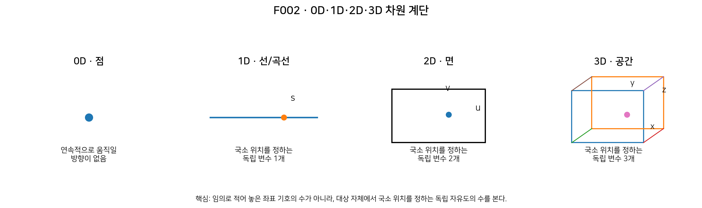
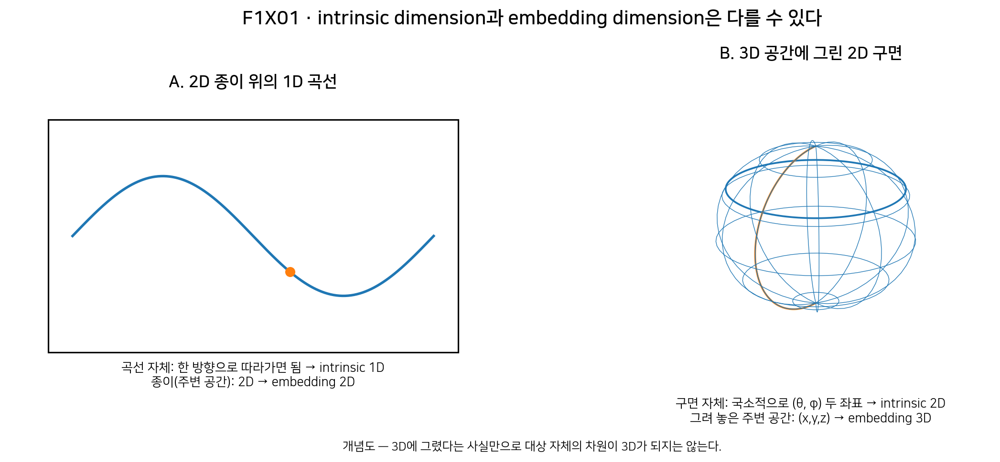

# 2장 · 차원이라는 말부터 다시 시작하기

> **Migration note:** 본문 안의 과거 `현재 상태`/`다음 작업` 문구는 DOCX 원문 보존을 위해 그대로 남긴다. 공식 현재 진행상태는 저장소 루트의 [`STATUS.md`](../STATUS.md)만 기준으로 한다.

| **현재 상태**                                                                                                                                                                                                    |
|------------------------------------------------------------------------------------------------------------------------------------------------------------------------------------------------------------------|
| DRAFT COMPLETE · 제1장 감사 수정과 제2장 후속 0D 수정까지 반영되었다. intrinsic/embedding dimension, 구면의 국소 두 좌표, 좌표 singularity와 차원 변화의 구분, Planck-S² physical 2D claim=OPEN 경계를 유지한다. |

## 이번 장에서 알아낼 질문

0차원·1차원·2차원·3차원은 정확히 무엇이 다를까? 그리고 눈앞의 구면은 3차원 공간에 둥글게 그려지는데, 왜 수학에서는 “2차원”이라고 부를까?

## 앞 장에서 배운 것

1장에서는 관찰과 모형을 구분했다. 어떤 대상이 그림에서 어떻게 보이는지와 그 대상 자체가 어떤 수학적 구조를 가지는지는 같지 않을 수 있었다. 이번 장에서는 바로 그 구분을 “차원”에 적용한다.

## 왜 새로운 문제가 생겼을까?

Planck-S²라는 이름에는 “S²”가 들어 있다. S²는 나중에 “구의 표면”이라는 뜻으로 정의할 텐데, 구면은 우리가 3차원 공간 속에 그리는 둥근 표면이다. 여기서 “3차원 공간에 놓여 있다”와 “그 표면 자체가 3차원이다”를 섞으면 이후의 모든 수학이 흔들린다.

또 하나의 함정이 있다. 어떤 대상을 (x,y,z) 세 숫자로 적었다고 해서 그 대상의 차원이 자동으로 3이 되는 것은 아니다. 세 숫자 사이에 제약식이 있으면 독립적으로 바꿀 수 있는 자유도는 더 적을 수 있다. 차원은 단순히 “기호를 몇 개 썼는가”를 세는 문제가 아니다.

## 먼저 생각해 보기: 몇 개의 손잡이가 필요한가?

기차가 하나의 선로 위에서만 움직인다고 하자. 기차의 위치를 정하려면 선로를 따라 얼마나 갔는지 숫자 하나면 된다. 넓은 운동장 위의 점을 찾으려면 가로와 세로, 두 개의 독립적인 정보가 필요하다. 방 안의 드론 위치를 정하려면 가로·세로·높이 세 값이 필요하다.

이 “독립 손잡이의 개수”가 차원을 이해하는 첫 직관이다. 하지만 이 직관은 반드시 “독립적”이라는 말을 포함해야 한다. 같은 위치를 중복해서 표현하는 좌표를 여러 개 써도 차원이 늘어나지는 않는다.

**그림 F002. 0D·1D·2D·3D 차원 계단**

| **이 그림에서 볼 것**                                                                                          |
|----------------------------------------------------------------------------------------------------------------|
| 점에서는 연속적인 이동 방향이 없고, 선에서는 하나, 면에서는 둘, 공간에서는 셋의 독립적인 국소 방향이 필요하다. |

| **이 그림이 뜻하는 것**                                                                                 |
|---------------------------------------------------------------------------------------------------------|
| 매끄러운 대상의 차원은 아주 작은 이웃을 보았을 때 몇 개의 독립 좌표로 위치를 정할 수 있는지와 연결된다. |

| **이 그림이 뜻하지 않는 것**                                                                                                            |
|-----------------------------------------------------------------------------------------------------------------------------------------|
| 그림에 적힌 좌표 기호를 무조건 세면 차원이 나온다는 뜻이 아니다. 중복 좌표나 제약식이 있으면 좌표 기호의 수와 내재 차원이 다를 수 있다. |

## 쉬운 비유: 독립 슬라이더

게임 속 물체의 위치를 정하는 설정창을 상상하자. 선 위의 캐릭터라면 “앞-뒤” 슬라이더 하나로 충분하다. 평면 지도라면 “동-서”와 “남-북” 두 슬라이더가 필요하다. 방 안이라면 높이까지 세 슬라이더가 필요하다.

| **비유의 한계**                                                                                                                                                                                                 |
|-----------------------------------------------------------------------------------------------------------------------------------------------------------------------------------------------------------------|
| 실제 수학의 좌표는 반드시 슬라이더처럼 전역적으로 한 세트로 잡히는 것이 아니다. 구면처럼 한 좌표계가 전체를 매끄럽게 덮지 못하는 공간도 있다. 차원은 “좋은 국소 좌표가 몇 개인가”라는 뜻으로 이해해야 안전하다. |

## 실제 수학에서는: 차원은 “국소적으로 몇 변수인가”

매끄러운 곡선이나 표면, 더 일반적으로 manifold를 생각할 때 n차원이라는 말은 각 점의 충분히 작은 이웃이 n개의 독립 좌표로 기술될 수 있다는 뜻이다. 수학적으로는 그 작은 이웃이 Rⁿ의 열린 부분처럼 보인다고 말한다.

따라서 “차원 = 좌표의 개수”라는 문장은 절반만 맞다. 정확히는 “대상 자체의 한 점 근처를 중복 없이 기술하는 독립적인 국소 좌표의 개수”다. 같은 점을 나타내는 데 쓸데없이 좌표를 더 붙이거나, 좌표들 사이에 제약을 걸어 놓은 표현은 그대로 세면 안 된다.

| **좌표 개수 함정**                                                                                                                                                         |
|----------------------------------------------------------------------------------------------------------------------------------------------------------------------------|
| 원의 점을 (x,y) 두 숫자로 적어도 x²+y²=R²라는 제약이 있다. 한 숫자를 마음대로 정하면 다른 숫자는 마음대로 독립적으로 정할 수 없다. 원은 2D 종이에 그려져도 그 자체는 1D다. |

## intrinsic dimension과 embedding dimension

여기서 두 종류의 “몇 차원”을 분리해야 한다. intrinsic dimension(내재 차원)은 대상 위에 붙어서 움직인다고 생각했을 때 필요한 독립 방향의 수다. embedding dimension(임베딩 차원)은 그 대상을 그려 넣거나 배치한 주변 공간의 차원이다.

예를 들어 종이 위에 그린 곡선은 2차원 종이에 놓여 있지만 곡선을 벗어나지 않고 움직이면 앞/뒤 한 방향만 필요하다. 그래서 곡선의 intrinsic dimension은 1이고, 그것을 그린 종이의 embedding dimension은 2다.

**그림 F1X01. intrinsic dimension과 embedding dimension**

| **이 그림에서 볼 것**                                                                                                    |
|--------------------------------------------------------------------------------------------------------------------------|
| 왼쪽 곡선은 2D 바탕에 있지만 자체는 1D다. 오른쪽 구면은 3D 공간에 그렸지만 구면 위의 국소 위치는 두 좌표로 정할 수 있다. |

| **이 그림이 뜻하는 것**                                                               |
|---------------------------------------------------------------------------------------|
| 대상의 차원과 그 대상을 시각화하기 위해 사용한 주변 공간의 차원은 서로 다른 개념이다. |

| **이 그림이 뜻하지 않는 것**                                                                                                                                      |
|-------------------------------------------------------------------------------------------------------------------------------------------------------------------|
| Planck-S²가 실제 3차원 공간 속에 떠 있는 얇은 물질막이라는 뜻이 아니다. S²는 추상적 내부 정보공간일 수도 있으며, 그것이 실제 전자의 물리공간인지 자체가 OPEN이다. |

## 왜 구면은 2차원일까?

반지름이 고정된 구면 위의 한 점을 생각하자. 3차원 공간에서는 그 점을 (x,y,z)로 적을 수 있다. 하지만 세 값은 서로 독립이 아니다. 구면에서는 x²+y²+z²=R²를 만족해야 한다. 이 한 제약 때문에 세 좌표를 마음대로 모두 움직일 수 없다.

더 직접적인 방법은 각도를 쓰는 것이다. 반지름 R이 고정되어 있다면 한 점의 위치는 “얼마나 동서 방향으로 돌았는가”와 “얼마나 북극-남극 방향으로 내려왔는가”에 해당하는 두 각도 θ와 φ로 국소적으로 나타낼 수 있다. 그래서 구면 S²의 intrinsic dimension은 2다.

| **중요: “국소적으로” 두 좌표**                                                                                                                                                                                                                                                                              |
|-------------------------------------------------------------------------------------------------------------------------------------------------------------------------------------------------------------------------------------------------------------------------------------------------------------|
| 극각·방위각형 좌표는 극점에서 한 좌표가 겹쳐 보이는 문제가 있다. 여기서 θ는 지리적 위도(latitude)가 아니라 북극 방향에서 재는 극각(polar angle / colatitude)이다. 이것은 구면의 차원이 극점에서 줄어든다는 뜻이 아니다. 한 좌표계가 전체 구면을 매끄럽게 덮지 못한다는 뜻이다. 다른 좌표 chart를 쓰면 된다. |

## 최소한의 수학

이번 장의 수학은 “독립 변수”와 “제약”을 구분하는 데만 사용한다.

| **0D: 대표 예는 한 점**                                                                                                                 |
|-----------------------------------------------------------------------------------------------------------------------------------------|
| 더 일반적으로는 여러 고립된 점으로 이루어진 이산적 0차원 공간도 있다. 핵심은 각 점 근처에서 필요한 연속적인 국소 좌표가 0개라는 것이다. |

| **1D: r = r(s)**                                    |
|-----------------------------------------------------|
| 국소적으로 매개변수 s 하나로 곡선 위 위치를 정한다. |

| **2D: r = r(u,v)**                              |
|-------------------------------------------------|
| 국소적으로 두 변수 u,v로 표면 위 위치를 정한다. |

| **3D: (x,y,z)**                                         |
|---------------------------------------------------------|
| 일반적인 3차원 공간의 위치에는 세 독립 좌표가 필요하다. |

| **S²_R: x² + y² + z² = R²**                                              |
|--------------------------------------------------------------------------|
| 세 embedding 좌표를 쓰지만 제약식 하나가 있어 intrinsic dimension은 2다. |

| **S²_R: (θ,φ) \[국소 좌표\]**                            |
|----------------------------------------------------------|
| 반지름이 고정된 구면 위 위치를 두 각도로 기술할 수 있다. |

| **이 식들로 알 수 없는 것**                                                                                                                     |
|-------------------------------------------------------------------------------------------------------------------------------------------------|
| Planck-S²의 S²가 실제 전자 내부에 존재하는지, 그 반지름이 플랑크 길이인지, 이 2D 구조가 전하·질량·스핀을 만드는지는 차원 정의만으로 알 수 없다. |

## Planck-S²에서는

G01 §3은 “2차원 구면 S²는 3차원 유클리드 공간에 x²+y²+z²=R²로 임베딩할 수 있지만, 그 자체의 내재적 좌표는 두 개면 충분하므로 차원은 2”라는 구분을 명시했다. 그리고 3차원 그림의 중심이나 내부 체적이 반드시 기본 정보공간의 일부일 필요는 없다고 적었다.

이것은 중요한 모델 설계 원칙이지만 곧바로 물리적 발견이 되는 것은 아니다. “S²를 2차원 manifold로 쓰겠다”는 수학적 정의와 “실제 전자가 그런 2차원 내부공간을 가진다”는 물리 주장은 서로 다른 단계다.

## 당시 연구에서는 무엇을 얻었나

v0.1은 초기부터 “구의 표면”과 “구의 내부 부피”를 구분하려 했다. 내부 체적의 모든 점을 기본 자유도로 두는 대신, S² 위의 상태 Φ(θ,φ)를 후보 자유도로 놓는 방향을 제시했다. 이 선택이 이후 “구 위의 장”, “S²→S² map”으로 가는 출발점이 되었다.

하지만 이 단계의 성과는 2차원 구면이라는 수학 언어를 정리한 것이다. 왜 자연의 전자가 바로 그 공간을 가져야 하는지에 대한 동역학적·실험적 근거는 아직 주어지지 않았다.

## 후속 감사에서는 무엇이 바뀌었나

제작 기준선의 적대적 감사들은 Planck-S²의 실제 전자 연결을 계속 OPEN으로 유지한다. 따라서 G01의 “2차원 구면” 설명은 수학적/모델적 정의로 사용할 수 있지만, 이를 “전자 내부가 2차원임이 증명됐다”로 승격하지 않는다. 이번 장에서도 이 경계를 그대로 유지한다.

## 현재 판정

| **명제/항목**                               | **상태**                         | **이 장에서의 의미**                                                    |
|---------------------------------------------|----------------------------------|-------------------------------------------------------------------------|
| 0D·1D·2D·3D 및 manifold의 국소 차원 개념    | SOURCE VERIFIED                  | 표준 수학. 독립적인 국소 좌표/자유도의 수로 이해한다.                   |
| S²는 3D에 임베딩할 수 있는 2D manifold다    | SOURCE VERIFIED                  | S² 자체의 intrinsic dimension은 2이며 embedding R³의 차원 3과 구분한다. |
| G01이 S²를 내부/경계 후보 공간으로 채택했다 | PROJECT ASSUMPTION / CONDITIONAL | Planck-S² 모델의 선택이다.                                              |
| 실제 전자가 2D 내부공간을 가진다            | OPEN                             | 현재 기준선에서 실험적·동역학적 physical bridge가 없다.                 |
| Planck-S² 전체                              | WORKING HYPOTHESIS               | 차원 수학이 맞아도 전자 가설 전체가 증명되는 것은 아니다.               |

## 이것으로 말할 수 있는 것

• 1D 곡선을 2D 종이나 3D 공간에 그려도 곡선 자체의 intrinsic dimension은 1일 수 있다.

• 구면 S²는 3D 공간에 그릴 수 있지만 그 표면 자체는 국소적으로 두 좌표로 기술되는 2D manifold다.

• 좌표 기호의 개수와 차원을 무조건 동일시하면 안 된다. 좌표의 독립성과 제약을 확인해야 한다.

• Planck-S²는 S²를 후보 내부/경계 공간으로 선택하지만, 이것은 모델 선택이다.

## 이것으로 말할 수 없는 것

• “(x,y,z) 세 좌표로 썼으므로 구면은 3D다.”

• “3D 그림에 그렸으므로 대상 자체가 3D다.”

• “구면은 2D이므로 실제 전자 내부가 2D라는 것이 증명됐다.”

• “S²라고 썼으므로 실제 공간 안에 얇은 물질 껍질이 존재한다.”

## 자주 하는 오해

| **오해 1 · 좌표 세 개 = 무조건 3D**                                                   |
|---------------------------------------------------------------------------------------|
| 아니다. (x,y,z)를 써도 제약식이 있으면 독립 자유도는 둘일 수 있다. 구면이 대표적이다. |

| **오해 2 · 3D에 그렸으니 대상도 3D**                               |
|--------------------------------------------------------------------|
| 아니다. embedding dimension과 intrinsic dimension을 분리해야 한다. |

| **오해 3 · 극점에서 경도가 이상하니 차원이 변한다**                                    |
|----------------------------------------------------------------------------------------|
| 아니다. 좌표계의 singularity와 공간 자체의 차원은 다른 문제다. 다른 chart를 쓰면 된다. |

| **오해 4 · 2D 내부공간 = 관측된 얇은 막**                                                   |
|---------------------------------------------------------------------------------------------|
| 아니다. Planck-S²의 physical 2D internal space는 현재 OPEN이며 추상적 내부공간일 수도 있다. |

## 다음 장이 필요한 이유

이제 “구면이 왜 2차원인가?”라는 질문의 답을 얻었다. 하지만 아직 S²라는 기호를 정확히 정의하지 않았다. 다음 장에서는 원의 둘레와 원판, 구의 표면과 속이 찬 공을 분리하여 S¹과 S²가 정확히 어떤 집합인지 배운다. 이제 이 구분을 실제 수학 기호 S¹과 S²의 정의로 이어 간다.

| **한 문장 기억**                                                                                                  |
|-------------------------------------------------------------------------------------------------------------------|
| 차원은 그림을 그린 주변 공간의 차원이 아니라, 대상 자체의 한 점 근처에서 위치를 정하는 독립적인 좌표의 수를 본다. |

## 용어 카드

| **용어**                          | **이 책에서의 뜻**                                                                        |
|-----------------------------------|-------------------------------------------------------------------------------------------|
| 차원 dimension                    | 대상 자체의 한 점 근처를 기술하는 독립적인 국소 좌표/자유도의 수.                         |
| intrinsic dimension               | 대상 위에서만 움직일 때 드러나는 내재적 차원.                                             |
| embedding dimension               | 대상을 그려 넣거나 배치한 주변 공간의 차원.                                               |
| 좌표 coordinate                   | 공간의 점에 위치 정보를 붙이는 숫자/변수. 좌표 기호의 수가 항상 차원과 같지는 않다.       |
| 독립 좌표 independent coordinates | 한 좌표를 바꾸는 것이 다른 좌표의 값으로 강제되지 않는, 실제 위치 자유도를 나타내는 좌표. |
| 제약 constraint                   | 가능한 좌표값을 제한하는 관계. 예: 구면의 x²+y²+z²=R².                                    |
| 국소 local                        | 공간 전체가 아니라 한 점 주변의 충분히 작은 영역을 보는 것.                               |
| chart                             | manifold의 한 부분을 Rⁿ의 열린 영역 좌표로 표현하는 국소 좌표 지도.                       |
| embedding                         | 어떤 대상을 더 높은 차원의 주변 공간 안에 겹침 없이 놓아 표현하는 것.                     |

## 확인문제

1\. 종이 위에 그린 하나의 매끄러운 곡선은 보통 intrinsic dimension이 몇 차원인가? 종이는 몇 차원인가?

2\. 구면의 점을 (x,y,z)로 적는다고 해서 구면 자체가 3D라고 결론내리면 왜 틀릴까?

3\. 반지름이 고정된 구면의 한 점을 국소적으로 정하는 데 θ와 φ 두 좌표가 충분하다는 사실은 무엇을 보여 주는가?

4\. 좌표를 네 개 사용하면 반드시 4차원 공간일까? 이유를 설명하라.

5\. 구면의 극점에서 극각·방위각형 좌표가 불편해지는 것은 구면의 차원이 바뀐다는 뜻일까?

6\. “Planck-S²는 S²를 사용한다. 따라서 전자의 실제 내부가 2D임이 증명됐다.” 이 문장의 오류는 무엇인가?

7\. 다음 중 intrinsic/embedding을 올바르게 구분한 문장을 고르라: (가) 3D 공간에 그린 원은 3D다. (나) 3D 공간에 놓인 구면은 intrinsic 2D, embedding 3D일 수 있다.

## 정답과 설명

1\. 곡선은 1D, 종이는 2D다. 곡선을 따라 움직일 때는 한 개의 독립 매개변수면 충분하다.

2\. 세 좌표가 x²+y²+z²=R²라는 제약을 만족해야 하므로 셋을 독립적으로 바꿀 수 없다. 구면의 intrinsic dimension은 2다.

3\. 구면의 각 점 근처가 두 독립 좌표로 기술되는 2D manifold임을 보여 준다.

4\. 아니다. 좌표가 중복되거나 제약식으로 묶여 있을 수 있다. 차원은 독립적인 국소 자유도를 세어야 한다.

5\. 아니다. 특정 좌표계의 singularity일 뿐이다. 다른 chart를 사용하면 같은 2D 구면을 계속 매끄럽게 기술할 수 있다.

6\. S²를 선택한 것은 모델의 수학적 가정이다. 실제 전자가 그런 2D 내부공간을 가진다는 physical claim은 현재 OPEN이다.

7\. (나). 대상 자체의 내재 차원과 주변 공간의 임베딩 차원을 분리한 문장이다.

## 이 장의 근거 자료

| **파일/자료**                                                                 | **절/사용 범위**                                                                                          | **자료 종류**                   |
|-------------------------------------------------------------------------------|-----------------------------------------------------------------------------------------------------------|---------------------------------|
| Planck_S2_Quantum_Particle_Hypothesis_v0.1.docx                               | §3 “2차원 구의 의미: 표면과 내부” — S²⊂R³ 임베딩, (θ,φ) 두 내재 좌표, 3D 그림의 내부 체적과 기본공간 구분 | \[일반 연구\]                   |
| MIT OpenCourseWare · 18.745 Lecture 01: Manifolds                             | 정의와 Example 1.3 — n-manifold의 국소 Rⁿ 구조, Sⁿ⊂Rⁿ⁺¹가 n차원 manifold라는 표준 예                      | \[외부 수학 / SOURCE VERIFIED\] |
| Wolfram MathWorld · Sphere                                                    | 고정 반지름 구면의 spherical-coordinate 표현에서 두 각도 좌표 사용                                        | \[외부 수학 / SOURCE VERIFIED\] |
| Math Insight · Introduction to a surface integral of a scalar-valued function | 곡선은 1D 매개변수, 표면은 2D (u,v) 매개변수로 기술한다는 교육적 비교                                     | \[외부 수학 / SOURCE VERIFIED\] |
| Planck-S2_교과서_제1권_구위의화살표에서위상수학까지.감사.docx                 | OUTLINE audit: 2장 차원 선행배치 PASS; 제1장 source-ledger minor revision 요구                            | \[적대적 감사\]                 |

| **제2장 제작 기록**                                                                                                                                                                                                                                                                                                 |
|---------------------------------------------------------------------------------------------------------------------------------------------------------------------------------------------------------------------------------------------------------------------------------------------------------------------|
| 상태: DRAFT COMPLETE. 제작 MASTER-1의 계약에 따라 F002와 F1X01을 삽입했고, intrinsic/embedding dimension, 좌표 독립성, 구면의 국소 두 좌표, 좌표 singularity와 차원 변화의 구분, Planck-S²의 physical 2D claim=OPEN 경계를 유지했다. 후속 적대적 감사의 0D 지적을 반영하여 “0D=반드시 점 하나”라는 오해를 제거했다. |
