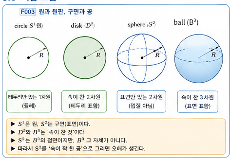
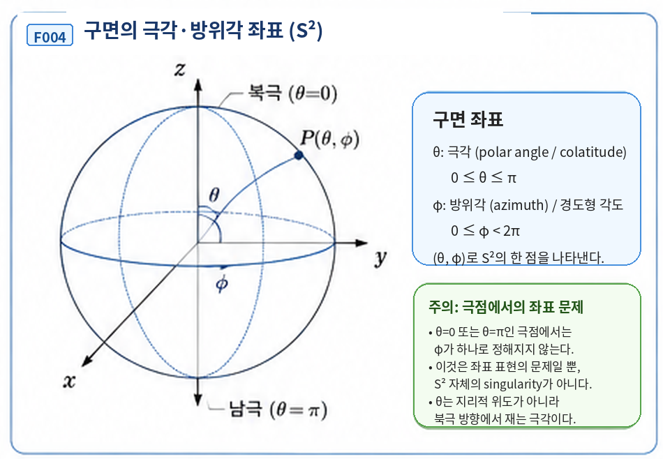

# 3장 · 원과 구, 공과 구의 표면

> **Migration note:** 본문 안의 과거 `현재 상태`/`다음 작업` 문구는 DOCX 원문 보존을 위해 그대로 남긴다. 공식 현재 진행상태는 저장소 루트의 [`STATUS.md`](../STATUS.md)만 기준으로 한다.

## 이번 장에서 알아낼 질문

“원”과 “원판”은 같은 것일까? “구면”과 “속이 찬 공”은 같은 것일까? 그리고 Planck-S²에서 쓰는 S²는 정확히 어느 쪽을 뜻할까?

## 앞 장에서 배운 것

2장에서는 차원이 “그림에 몇 개의 좌표 문자를 썼는가”가 아니라, 대상 자체의 한 점 근처를 정하는 독립적인 국소 좌표의 수라는 것을 배웠다. 또한 intrinsic dimension과 embedding dimension을 분리했다. 이번 장에서는 그 구분을 원과 구에 적용한다.

## 왜 새로운 문제가 생겼을까?

일상어에서는 “원”을 동그란 넓이 전체로 부르기도 하고, “구”를 속까지 꽉 찬 공 전체로 부르기도 한다. 하지만 위상수학[^v1c03-topology]과 미분기하[^v1c03-differential-geometry]에서 S¹과 S²는 훨씬 정확한 뜻을 가진다. 이 구분을 놓치면 이후 S²→S²를 “공 하나가 다른 공 안에 들어간다”는 식으로 잘못 상상하기 쉽다.

| **먼저 생각해 보기 · 철사 고리와 동전**                                                                                                                                       |
|-------------------------------------------------------------------------------------------------------------------------------------------------------------------------------|
| 철사로 만든 둥근 고리와 동전을 생각해 보자. 둘 다 위에서 보면 둥글지만, 고리는 테두리만 있고 동전은 안쪽 영역까지 포함한다. 수학에서는 이 둘을 같은 대상으로 취급하지 않는다. |

## 그림으로 이해하기 · circle/disk, sphere/ball

**그림 F003. 원(circle)과 원판(disk), 구면(sphere)과 공(ball) — 개념도, 실제 크기/비율 아님**

| **이 그림에서 볼 것**                                                                                                          |
|--------------------------------------------------------------------------------------------------------------------------------|
| circle S¹은 테두리만, disk D²는 테두리와 안쪽을 함께 포함한다. sphere S²는 표면만, ball B³는 표면과 내부 부피를 함께 포함한다. |

| **이 그림이 뜻하는 것**                                                                                                |
|------------------------------------------------------------------------------------------------------------------------|
| “경계/표면”과 “속까지 포함한 영역”은 서로 다른 수학적 대상이다. S¹은 D²의 경계이고, S²는 B³의 경계라고 생각할 수 있다. |

| **이 그림이 뜻하지 않는 것**                                                                                                                                                       |
|------------------------------------------------------------------------------------------------------------------------------------------------------------------------------------|
| Planck-S²의 S²가 실제 전자 안에 고무막·금속 껍질 같은 물질막으로 존재한다는 뜻이 아니다. 프로젝트에서 S²는 내부 정보공간 또는 경계 자유도의 후보이며, 그 물리적 실재성은 OPEN이다. |

## 쉬운 비유 · 풍선의 고무 표면과 풍선 안의 부피

풍선을 떠올리면 구면과 공의 차이를 쉽게 볼 수 있다. 고무막의 표면만 따라 움직이는 작은 개미는 두 방향으로 움직이면 표면의 위치를 정할 수 있다. 반면 풍선 안쪽의 공기 중 점은 높이까지 포함한 세 방향이 필요하다.

이 비유에서 “고무막”은 오직 surface와 volume을 구분하기 위한 도구다. Planck-S²의 S²가 실제 고무막 같은 물질 껍질이라는 뜻으로 읽으면 안 된다.

## 실제 수학에서는 · S¹과 S²의 정확한 뜻

반지름 R, 중심이 원점인 경우를 생각하자. 원 S¹은 평면 R²에서 중심으로부터 거리가 정확히 R인 점들의 집합이다. 구면 S²는 공간 R³에서 중심으로부터 거리가 정확히 R인 점들의 집합이다.

<table>
<colgroup>
<col style="width: 100%" />
</colgroup>
<thead>
<tr class="header">
<th><strong>S¹과 S²의 핵심</strong></th>
</tr>
</thead>
<tbody>
<tr class="odd">
<td>S¹_R = {(x,y) ∈ R² | x² + y² = R²} 
S²_R = {(x,y,z) ∈ R³ | x² + y² + z² = R²} 
등호 “=”가 핵심이다. 거리가 정확히 R인 경계/표면만 고른다.</td>
</tr>
</tbody>
</table>

반대로 원판과 공은 내부까지 포함하므로 부등호를 사용한다. 닫힌 원판 D²_R과 닫힌 공 B³_R을 쓰면 다음과 같다.

<table>
<colgroup>
<col style="width: 100%" />
</colgroup>
<thead>
<tr class="header">
<th><strong>disk와 ball</strong></th>
</tr>
</thead>
<tbody>
<tr class="odd">
<td>D²_R = {(x,y) ∈ R² | x² + y² ≤ R²} 
B³_R = {(x,y,z) ∈ R³ | x² + y² + z² ≤ R²} 
부등호 “≤”는 중심에서 반지름 R 안쪽까지 모두 포함한다.</td>
</tr>
</tbody>
</table>

| **표기 주의**                                                                                                                                                                                                             |
|---------------------------------------------------------------------------------------------------------------------------------------------------------------------------------------------------------------------------|
| 책에 따라 n차원 disk/ball의 기호를 Dⁿ 또는 Bⁿ으로 다르게 쓰기도 한다. 이 책에서는 교육적 혼동을 줄이기 위해 2차원 채운 원판은 D², 3차원 채운 공은 B³라고 표기한다. 핵심은 기호보다 “경계만인가, 내부까지 포함하는가”이다. |

## 제2장과 연결 · 왜 S¹은 1D이고 S²는 2D일까?

S¹을 평면의 (x,y) 두 좌표로 쓰더라도 x²+y²=R²라는 제약이 하나 있다. 한 점 근처에서는 각도 하나만 정하면 원 위의 위치가 정해진다. 그래서 S¹의 intrinsic dimension은 1이다.

S²도 (x,y,z) 세 좌표를 쓰지만 x²+y²+z²=R²라는 제약이 있다. 한 점 근처에서는 두 개의 독립 좌표로 위치를 정할 수 있다. 그래서 S²의 intrinsic dimension은 2다. S²를 R³ 안에 그린다는 사실은 embedding dimension이 3이라는 뜻이지, S² 자체가 3D라는 뜻이 아니다.

## 그림으로 이해하기 · 구면 위의 두 좌표

**그림 F004. 구면 S²의 극각·방위각 국소 좌표 — 개념도, 실제 크기/비율 아님**

| **이 그림에서 볼 것**                                                                                 |
|-------------------------------------------------------------------------------------------------------|
| 구면의 한 점을 두 각도 (θ,φ)로 표시할 수 있다. 이는 S²의 intrinsic dimension이 2라는 사실과 연결된다. |

| **극점에서 생기는 좌표 문제**                                                                                                                                                                                       |
|---------------------------------------------------------------------------------------------------------------------------------------------------------------------------------------------------------------------|
| 북극과 남극에서는 여러 경도선이 한 점에 모여 φ가 잘 정해지지 않는다. 그러나 이것은 좌표표(chart)의 문제다. 구면 자체에 구멍이 생기거나 차원이 줄어드는 것이 아니며, 다른 좌표 chart를 쓰면 매끄럽게 기술할 수 있다. |

| **이 그림이 뜻하지 않는 것**                                                                                                                                            |
|-------------------------------------------------------------------------------------------------------------------------------------------------------------------------|
| 좌표축과 중심점, 극각·방위각을 나타내는 보조선이 Planck-S² 내부에 실제 물리적 막대나 선으로 존재한다는 뜻이 아니다. 이것들은 수학적으로 S²를 표현하기 위한 좌표 장치다. |

## 최소한의 수학 · 구면 좌표

반지름 R이 고정된 구면에서는 두 각도 θ와 φ로 점을 다음처럼 나타낼 수 있다. 여기서 θ는 지리적 위도(latitude)가 아니라 +z축, 즉 북극 방향에서 재는 극각(polar angle / colatitude)이고, φ는 방위각(azimuth), 즉 경도형 각도다.

<table>
<colgroup>
<col style="width: 100%" />
</colgroup>
<thead>
<tr class="header">
<th><strong>S²의 한 좌표 표현</strong></th>
</tr>
</thead>
<tbody>
<tr class="odd">
<td>x = R sinθ cosφ 
y = R sinθ sinφ 
z = R cosθ 
보통 0 ≤ θ ≤ π, 0 ≤ φ &lt; 2π로 둔다. 이 한 좌표계가 극점에서 불편하다는 사실은 S² 자체의 singularity를 뜻하지 않는다.</td>
</tr>
</tbody>
</table>

| **이 식으로 알 수 없는 것**                                                                                                                                                            |
|----------------------------------------------------------------------------------------------------------------------------------------------------------------------------------------|
| 실제 전자가 S²형 내부/경계를 가지는지, 그 반지름이 얼마인지, S²의 중심이나 “안쪽”이 물리적으로 존재하는지, 이 구조가 전하·질량·스핀을 만드는지는 S¹/S²의 표준 정의만으로는 알 수 없다. |

## Planck-S²에서는

프로젝트는 S²를 닫힌 2차원 내부/경계 다양체 후보로 사용한다. 여기서 중요한 것은 “S²”라는 수학적 형식이지, 일반 3차원 공간 속의 얇은 물질 껍질을 이미 관측했다는 뜻이 아니다. 프로젝트 문서 자체도 이 S²가 더 근본적인 이론의 내부 정보공간 또는 경계 자유도일 수 있다고 구분한다.

따라서 “Planck-S²가 S²를 쓴다”는 문장은 프로젝트의 모델 선택을 설명한다. “실제 전자가 그런 S² 내부/경계를 가진다”는 문장은 별도의 물리 주장이고, 현재 기준선에서는 OPEN이다.

## 현재 판정

| **명제/항목**                                              | **상태**                             | **이 장에서의 의미**                                                                              |
|------------------------------------------------------------|--------------------------------------|---------------------------------------------------------------------------------------------------|
| circle S¹ / disk D² / sphere S² / ball B³의 표준 정의      | **SOURCE VERIFIED**                  | 표준 기하·위상수학의 정의다. circle/sphere는 경계, disk/ball은 내부를 포함하는 영역으로 구분한다. |
| S¹의 intrinsic dimension = 1, S²의 intrinsic dimension = 2 | **SOURCE VERIFIED**                  | 국소 좌표 수와 표준 manifold 구조에서 따르는 수학적 사실이다.                                     |
| 구면 좌표의 극점 singularity는 좌표 표현의 문제            | **SOURCE VERIFIED**                  | 극점에서 특정 chart가 실패할 뿐 S² 자체의 공간 singularity가 아니다.                              |
| Planck-S²가 S²를 내부/경계 후보 공간으로 선택              | **PROJECT ASSUMPTION / CONDITIONAL** | 프로젝트의 모델링 선택이다.                                                                       |
| 실제 전자가 S² 내부/경계를 가진다                          | **OPEN**                             | 현재 기준선에서 직접 실험·동역학적 physical bridge가 닫히지 않았다.                               |
| Planck-S² 전체                                             | **WORKING HYPOTHESIS**               | 표준 S² 수학이 맞는 것과 전자 가설 전체의 타당성은 별개다.                                        |

## 이것으로 말할 수 있는 것

• S¹은 원의 테두리이며 1차원 manifold다.

• S²는 구의 표면이며 2차원 manifold다.

• D²와 B³는 각각 내부까지 포함하는 원판과 공이므로 S¹, S²와 다르다.

• S²를 R³에 그릴 수 있어도 S² 자체의 intrinsic dimension은 2다.

• 극점에서 특정 구면 좌표가 불편해지는 것은 좌표 표현의 문제다.

## 이것으로 말할 수 없는 것

• 실제 전자 내부에 구형 물질 껍질이 존재한다고 말할 수 없다.

• S²의 수학적 중심이나 내부 부피가 Planck-S²의 물리적 공간에 반드시 존재한다고 말할 수 없다.

• S²를 선택했다는 사실만으로 전자의 전하, 질량, 스핀, 크기가 유도됐다고 말할 수 없다.

## 자주 하는 오해

| **오해 1 · circle = disk**                                 |
|------------------------------------------------------------|
| 아니다. circle은 테두리이고 disk는 안쪽 영역까지 포함한다. |

| **오해 2 · sphere = ball**                                                    |
|-------------------------------------------------------------------------------|
| 아니다. 이 책의 수학 용어에서 sphere S²는 표면이고 ball B³는 속까지 포함한다. |

| **오해 3 · S²는 3D 공간에 그리니 3D다**                                |
|------------------------------------------------------------------------|
| 아니다. embedding dimension은 3일 수 있지만 intrinsic dimension은 2다. |

| **오해 4 · 구면 좌표 극점은 실제 구면의 구멍이다**                                 |
|------------------------------------------------------------------------------------|
| 아니다. 한 좌표 chart가 불편해지는 현상일 뿐이며 구면 자체의 singularity가 아니다. |

| **오해 5 · Planck-S²의 S²는 전자 속 물질 껍질이다**                                                                                                         |
|-------------------------------------------------------------------------------------------------------------------------------------------------------------|
| 아니다. 그것은 현재 증명되지 않은 물리적 해석이다. 프로젝트의 S²는 추상적 내부 정보공간 또는 경계 자유도로도 해석될 수 있고, 실제 전자와의 연결은 OPEN이다. |

## 다음 장이 필요한 이유

이제 S¹과 S²가 어떤 공간인지 정확히 알았다. 다음에는 “한 공간의 점을 다른 공간의 점으로 보낸다”는 말을 배워야 한다. 제4장에서 함수, domain, target, map의 최소 언어를 익힌 뒤에야 제6장의 S²→S²를 정확히 읽을 수 있다. 제4장 본문은 아직 시작하지 않는다.

| **한 문장 기억**                                                                                 |
|--------------------------------------------------------------------------------------------------|
| S²는 속이 찬 공이 아니라 구면이며, 3D 공간에 그릴 수 있어도 그 자체의 intrinsic dimension은 2다. |

## 용어 카드

| **용어**                   | **이 책에서의 뜻**                                                                     |
|----------------------------|----------------------------------------------------------------------------------------|
| **circle / 원**            | 중심에서 일정한 거리 R에 있는 평면 위 점들의 모임. 이 책에서는 S¹과 연결한다.          |
| **disk / 원판**            | 원 둘레와 그 안쪽 영역을 포함하는 2차원 영역. 닫힌 원판을 D²로 표기한다.               |
| **sphere / 구면**          | 중심에서 일정한 거리 R에 있는 3차원 공간의 점들의 모임. 표면만을 뜻하며 S²와 연결한다. |
| **ball / 공**              | 구면과 그 내부 부피를 함께 포함하는 3차원 영역. 닫힌 공을 B³로 표기한다.               |
| **S¹**                     | 1-sphere. 원의 둘레와 같은 1차원 manifold.                                             |
| **S²**                     | 2-sphere. 보통 우리가 말하는 구의 표면과 같은 2차원 manifold.                          |
| **boundary / 경계**        | 어떤 영역의 바깥 테두리 또는 표면. 예: ∂D²=S¹, ∂B³=S².                                 |
| **intrinsic dimension**    | 대상 자체 위에서 국소적으로 필요한 독립 좌표의 수.                                     |
| **embedding dimension**    | 대상을 그려 넣거나 놓은 주변 공간의 차원.                                              |
| **coordinate singularity** | 특정 좌표표가 한 지점에서 불편해지는 현상. 공간 자체의 singularity와 구분한다.         |

## 확인문제

1\. 동전의 테두리만 생각한 것과 동전의 둥근 면 전체를 생각한 것은 각각 circle과 disk 중 무엇에 더 가깝나?

2\. S²는 “속이 꽉 찬 공”일까, “구의 표면”일까?

3\. S¹_R과 D²_R의 식에서 =와 ≤가 어떤 차이를 만드는지 설명하라.

4\. 구면 S²를 (x,y,z) 세 좌표로 쓴다고 해서 intrinsic dimension이 3이 아닌 이유는 무엇인가?

5\. 구면의 북극에서 경도 φ가 하나로 정해지지 않는 것은 구면 자체의 singularity인가?

6\. “Planck-S²가 S²를 사용하므로 전자 속에 실제 구형 물질막이 있다.”라는 문장은 왜 현재 말할 수 없는가?

7\. S²와 B³ 중 내부 부피까지 포함하는 것은 어느 쪽인가?

## 정답과 설명

1\. 테두리만은 circle, 면 전체는 disk에 가깝다.

2\. 구의 표면이다. 속까지 포함한 3차원 영역은 ball B³로 구분한다.

3\. =는 중심에서 거리가 정확히 R인 경계만 고르고, ≤는 거리 R 이하의 내부까지 모두 포함한다.

4\. x²+y²+z²=R²라는 제약 때문에 세 좌표를 독립적으로 바꿀 수 없다. 국소적으로 두 좌표면 충분하다.

5\. 아니다. 특정 좌표계의 coordinate singularity다. 다른 chart로 바꾸면 같은 S²를 매끄럽게 기술할 수 있다.

6\. S²를 채택한 것은 프로젝트의 모델 가정이다. 실제 전자 내부/경계의 물리적 실재성은 현재 OPEN이다.

7\. B³다. S²는 그 경계인 구면이다.

## 이 장의 근거 자료

| **파일/자료**                                                   | **절/사용 범위**                                                                                          | **자료 종류**                   |
|-----------------------------------------------------------------|-----------------------------------------------------------------------------------------------------------|---------------------------------|
| Planck_S2_Quantum_Particle_Hypothesis_v0.1.docx                 | §2–3의 S² 내부/경계 후보 및 “표면과 내부” 구분. S²를 실제 물질 껍질로 확정하지 않는 프로젝트 가정의 범위. | \[일반 연구\]                   |
| MIT OpenCourseWare · 18.745 Lecture 01: Manifolds               | Example 1.3 — S¹⊂R² 및 일반 Sⁿ⊂Rⁿ⁺¹가 n차원 manifold라는 표준 예.                                         | \[외부 수학 / SOURCE VERIFIED\] |
| Wolfram MathWorld · Circle                                      | circle은 평면에서 중심으로부터 일정한 거리에 있는 점들의 집합이며 interior는 disk라는 표준 정의.          | \[외부 수학 / SOURCE VERIFIED\] |
| Wolfram MathWorld · Disk                                        | closed disk는 중심으로부터 거리 ≤R인 점들의 집합이라는 정의.                                              | \[외부 수학 / SOURCE VERIFIED\] |
| Wolfram MathWorld · Sphere                                      | sphere는 표면만을 뜻하고 interior/solid sphere는 ball로 구분한다는 정의 및 x²+y²+z²=R².                   | \[외부 수학 / SOURCE VERIFIED\] |
| Wolfram MathWorld · Ball                                        | ball Bⁿ은 sphere의 내부 영역이며 sphere가 ball의 경계라는 정의.                                           | \[외부 수학 / SOURCE VERIFIED\] |
| Planck-S2_교과서_제1권_구위의화살표에서위상수학까지-1.감사.docx | 제2장 0D 서술 MINOR REVISION 및 제3장 진행 승인.                                                          | \[적대적 감사\]                 |

| **제3장 제작 기록**                                                                                                                                                                                                                                                                                                                                                                                                                                                                                                                                                      |
|--------------------------------------------------------------------------------------------------------------------------------------------------------------------------------------------------------------------------------------------------------------------------------------------------------------------------------------------------------------------------------------------------------------------------------------------------------------------------------------------------------------------------------------------------------------------------|
| 상태: DRAFT COMPLETE. 제작 MASTER-1의 OUTLINE 계약에 따라 F003·F004를 포함했고, circle/disk, sphere/ball, S¹/S², intrinsic/embedding dimension, 구면 좌표 극점 singularity의 범위를 구분했다. 적대적 감사 지적에 따라 F004의 θ를 지리적 위도가 아닌 극각(polar angle / colatitude), φ를 방위각(azimuth) / 경도형 각도로 바로잡고 그림 원본과 본문·캡션을 동기화했다. Planck-S²의 S²를 실제 물질 껍질로 묘사하지 않았으며 실제 전자의 S² 내부/경계 주장은 OPEN, 전체 이론은 WORKING HYPOTHESIS로 유지한다. 다음 작업은 제4장 DRAFT이며 제4장 본문은 아직 시작하지 않는다. |

[^v1c03-topology]: 길이·각도보다, 찢거나 붙이지 않는 연속 변형에도 유지되는 연결·구멍 같은 성질을 연구하는 수학 분야다.

[^v1c03-differential-geometry]: 곡선·곡면처럼 매끄러운 공간을 미분을 이용해 연구하는 수학 분야다. 이 장에서는 S¹과 S² 같은 공간을 정확히 기술하는 배경 정도로만 등장한다.
