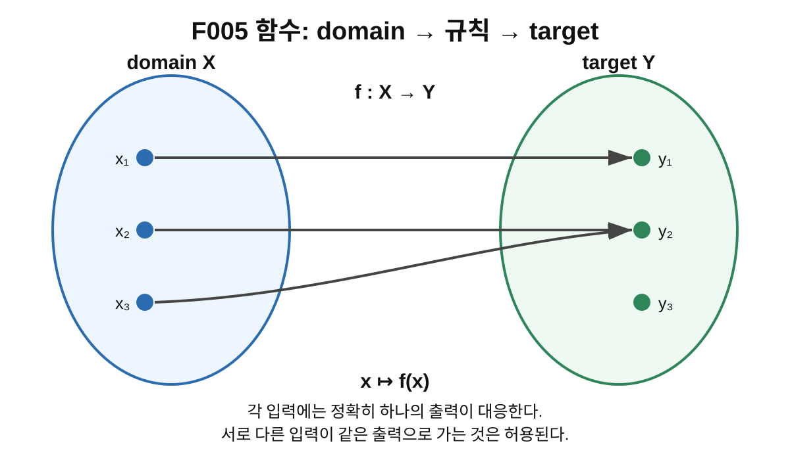
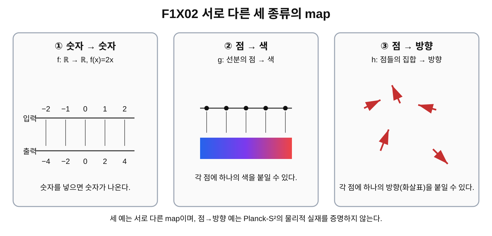

# 4장 · 함수는 입력을 출력으로 보내는 규칙

> **STATUS: DRAFT COMPLETE · AUDIT PASS**
>
> 2026-08-29 독립 감사에서 이전 `RECOVERY REQUIRED`가 해소되었다. 복구 근거는 `Planck-S2_교과서_제1권_구위의화살표에서위상수학까지-7.docx`의 제4장 본문과 F005/F1X02 실제 삽입본이다.

## 이번 장에서 알아낼 질문

“한 점을 다른 곳의 한 값으로 보낸다”는 말을 수학에서는 어떻게 정확히 적을까? domain과 target은 무엇이며, 함수와 map은 어떻게 읽어야 할까? 왜 이 언어가 나중의 $n:S^2\to S^2$를 읽는 준비가 될까?

## 앞 장에서 배운 것

3장에서는 $S^1$이 원의 테두리이고 $S^2$가 구의 표면이라는 뜻을 배웠다. 또한 $S^2$는 3차원 공간에 그릴 수 있어도 자체의 intrinsic dimension은 2라는 점을 확인했다. 이제는 “그 공간의 한 점을 다른 공간의 점이나 값으로 대응시킨다”는 언어가 필요하다.

## 왜 새로운 문제가 생겼을까?

Planck-S² 자료에는 $n:S^2_{\rm domain}\to S^2_{\rm internal}$ 같은 표기가 등장한다. 이 표기를 바로 물리적으로 해석하기 전에 화살표 $\to$가 무엇을 뜻하는지 배워야 한다. 여기서 화살표는 물체가 실제 공간을 날아간다는 표시가 아니라 **입력 하나에 출력 하나를 정해 주는 규칙**을 나타낸다.

G02는 각 domain $S^2$의 점에 internal $S^2$의 방향 하나를 대응시키는 map을 후보 언어로 사용한다. 하지만 이 장에서는 그 물리적 타당성을 증명하지 않는다. 먼저 표준 수학의 함수/사상 언어만 익힌다.

## 먼저 생각해 보기

1. 숫자 3을 넣으면 9가 나오도록 “제곱하기” 규칙을 만든다.
2. 지도 위의 한 점을 넣으면 그 지점의 색 하나가 나오도록 규칙을 만든다.
3. 공간의 한 점을 넣으면 그 점에서 가리킬 방향 하나가 나오도록 규칙을 만든다.

세 경우 모두 출력의 종류는 다르지만 **입력마다 정해진 출력 하나**라는 공통 구조가 있다.

## 그림으로 이해하기 · domain에서 target으로

**그림 F005. 함수 $f:X\to Y$ — domain $X$의 각 입력에 target $Y$의 출력 하나를 대응시킨다. 개념도, 실제 크기/비율 아님**

### 이 그림에서 볼 것

- domain $X$의 모든 입력점은 화살표를 하나씩 가진다.
- $x_2$와 $x_3$처럼 서로 다른 입력이 같은 $y_2$로 가도 함수일 수 있다.
- target $Y$ 안의 모든 점이 실제 출력으로 사용될 필요는 없다.

### 이 그림이 뜻하는 것

함수의 핵심은 domain의 각 입력에 target 안의 출력이 **정확히 하나** 정해진다는 것이다. 서로 다른 입력이 같은 출력으로 가는 many-to-one 대응도 함수가 될 수 있다. target은 가능한 출력의 공간이고, 실제 출력들의 집합 image는 그 일부일 수 있다.

### 이 그림이 뜻하지 않는 것

- 화살표가 실제 공간에서 이동하는 물체의 경로라는 뜻이 아니다.
- 함수가 반드시 일대일이어야 한다는 뜻이 아니다.
- target $Y$의 모든 원소가 반드시 어떤 입력의 출력이 된다는 뜻도 아니다.

## 쉬운 비유 · 자판기

자판기의 버튼 하나를 입력이라고 하고 그 버튼을 눌렀을 때 정해져 나오는 음료를 출력이라고 생각할 수 있다. “버튼을 누르면 어떤 결과가 정해진다”는 점이 함수의 가장 쉬운 직관이다.

### 비유의 한계

수학 함수는 실제 기계가 아니다. 버튼이나 음료가 있어야 하는 것도 아니며, 출력은 숫자에 한정되지 않는다. 점, 색, 방향, 또 다른 함수처럼 매우 다양한 수학적 대상이 출력이 될 수 있다. 자판기 비유는 오직 **입력마다 정해진 출력 하나**라는 구조만 보여 준다.

## 실제 수학에서는 · 함수와 사상(map)

수학에서는 function과 map(mapping)을 거의 같은 뜻으로 사용한다. 특히 기하학과 위상수학에서는 숫자 함수만 생각하지 않기 때문에 map이라는 말을 자주 쓴다.

핵심 조건은 domain의 각 원소 $x$에 target 안의 원소 $f(x)$가 **정확히 하나** 대응한다는 것이다.

### 최소 정의

$$
f:X\to Y
$$

- $X$ = domain(정의역): 입력을 고르는 집합
- $Y$ = target 또는 codomain(공역): 출력이 들어가도록 미리 지정한 집합
- $x\mapsto f(x)$: “입력 $x$를 출력 $f(x)$로 보낸다”는 뜻

실제로 나타나는 출력들의 집합 $f(X)$를 image(상)라고 한다. image는 target 전체와 같을 수도 있고 target의 일부일 수도 있다. 이 책에서는 `range`가 자료마다 target 또는 image를 뜻할 수 있어 혼동을 줄이기 위해 **domain / target(codomain) / image**를 구분해서 쓴다.

예를 들어 $f:\mathbb R\to\mathbb R$, $f(x)=x^2$라면

$$
f(-2)=f(2)=4.
$$

서로 다른 입력이 같은 출력으로 가는 것은 허용된다. 따라서 함수가 반드시 injective일 필요는 없다. 반대로 한 입력이 동시에 서로 다른 두 출력으로 정해진다면, 추가 규칙 없이는 보통의 함수가 아니다.

## 그림으로 이해하기 · 출력은 숫자만이 아니다

**그림 F1X02. 숫자→숫자, 점→색, 점→방향의 세 가지 map 비교 — 개념도, 실제 크기/비율 아님**

### 이 그림에서 볼 것

1. $f:\mathbb R\to\mathbb R$처럼 숫자를 숫자에 대응시킬 수 있다.
2. 어떤 공간의 점마다 하나의 색을 대응시킬 수도 있다.
3. 어떤 공간의 점마다 하나의 방향을 대응시킬 수도 있다.

따라서 “함수 = 숫자를 넣어 숫자를 얻는 공식”보다 훨씬 넓은 개념이다.

### 이 그림이 뜻하는 것

함수(map)의 출력 대상은 숫자에 한정되지 않는다. 점마다 색을 붙이는 규칙과 점마다 방향을 붙이는 규칙도 같은 함수 언어로 표현할 수 있다. 그래서 이후 $S^2$의 각 점에 방향을 대응시키는 표기를 읽을 수 있다.

### 이 그림이 뜻하지 않는 것

- 세 예가 서로 같은 함수라는 뜻은 아니다. domain과 target, 규칙이 서로 다르다.
- 점→방향 예가 실제 전자의 내부 방향장을 관측했다는 뜻이 아니다.
- 이 그림은 표준 함수 언어의 범위를 보여 주는 수학 개념도이며 Planck-S²의 물리 가설을 증명하지 않는다.

## domain과 target이 같은 모양이어도 역할은 다르다

함수 $f:X\to Y$에서 $X$와 $Y$가 우연히 같은 모양이거나 같은 종류의 집합일 수 있다. 예를 들어 $S^2\to S^2$처럼 양쪽에 모두 $S^2$가 적힐 수 있다. 그래도 왼쪽 $S^2$는 **입력을 어디서 고르는가**라는 domain 역할이고, 오른쪽 $S^2$는 **출력이 어디에 들어가는가**라는 target 역할이다.

따라서 두 $S^2$가 같은 모양이라는 이유만으로 입력 구와 출력 구가 같은 물리적 물체라고 결론내리면 안 된다.

## Planck-S²에서는 · $n:S^2\to S^2$를 읽기 위한 준비

G02의 후보 언어에는

$$
n:S^2_{\rm domain}\to S^2_{\rm internal}
$$

이 등장한다. 지금 단계에서 필요한 해석은 다음뿐이다.

> domain $S^2$의 한 점 $x$를 고르면, $n$이라는 규칙이 target $S^2$ 안의 점 $n(x)$ 하나를 정한다.

이것만으로 target $S^2$가 실제 전자의 내부 물질 구면이라고 말할 수는 없다. 그것은 별도의 물리 가정이며 현재 **OPEN**이다.

## 현재 판정

| 주장/항목 | 상태 | 범위 |
|---|---|---|
| 함수/사상과 $f:X\to Y$, $x\mapsto f(x)$ 표기 | SOURCE VERIFIED | 표준 수학 정의 |
| domain / target(codomain) / image의 구분 | SOURCE VERIFIED | 표준 수학 정의 |
| G02에서 $n:S^2_{domain}\to S^2_{internal}$을 모델 언어로 사용 | PROJECT MODEL CHOICE | 수학적 표기 채택 |
| 그 map이 실제 전자의 물리적 내부 자유도라는 주장 | OPEN | 아직 물리적 증명 없음 |
| Planck-S² 전체 | WORKING HYPOTHESIS | 프로젝트 전체 상태 |

## 이것으로 말할 수 있는 것

- 함수/사상은 domain의 각 입력에 target의 출력 하나를 대응시키는 표준 수학적 규칙이다.
- 출력은 숫자뿐 아니라 점, 색, 방향 등 다양한 수학적 대상일 수 있다.
- 서로 다른 입력이 같은 출력으로 가는 many-to-one 함수도 가능하다.
- $f:X\to Y$에서 $X$와 $Y$의 모양이 같아도 domain과 target의 역할은 구분된다.
- $n:S^2\to S^2$ 같은 표기를 읽기 위한 최소 언어를 갖추었다.

## 이것으로 말할 수 없는 것

- 함수 개념을 배웠다는 사실만으로 Planck-S²의 물리적 내부공간이 존재한다고 말할 수 없다.
- $S^2\to S^2$라는 표기만으로 전자의 전하, 질량, 스핀 또는 실제 내부구조를 유도할 수 없다.
- domain과 target이 모두 $S^2$라는 이유만으로 두 공간이 물리적으로 같은 공간이라고 말할 수 없다.

## 자주 하는 오해

1. **함수의 출력은 숫자여야 한다?** → 아니다. 점·색·방향도 가능하다.
2. **함수는 반드시 일대일이어야 한다?** → 아니다. 여러 입력이 같은 출력으로 갈 수 있다.
3. **target의 모든 점이 반드시 출력으로 사용되어야 한다?** → 아니다. image가 target의 일부일 수 있다.
4. **$X$와 $Y$가 같은 모양이면 역할도 같다?** → 아니다. domain과 target은 표기에서 역할이 다르다.
5. **$n:S^2\to S^2$를 썼으니 실제 전자 내부구조가 증명됐다?** → 아니다. 물리적 해석은 OPEN이다.

## 다음 장이 필요한 이유

지금까지는 입력 하나에 출력 하나를 붙이는 규칙을 배웠다. 하지만 Planck-S²에서 중요한 것은 한 점 하나가 아니라 공간의 모든 점에 값이 붙어 있는 전체 배치다. 제5장에서는 온도 지도와 바람 지도를 이용해 scalar field와 방향장의 차이를 배우고 “구 위의 화살표”라는 표현을 준비한다.

## 한 문장 기억

**함수(map)는 domain에서 입력을 하나 고르면 target 안의 출력 하나를 정해 주는 규칙이며, 출력은 숫자에 한정되지 않는다.**

## 용어 카드

| 용어 | 뜻 |
|---|---|
| function / map | 입력마다 출력 하나를 정하는 규칙 |
| domain $X$ | 입력을 고르는 집합 |
| target / codomain $Y$ | 출력이 들어가도록 미리 지정한 집합 |
| image $f(X)$ | 실제로 나타나는 출력들의 집합 |
| $f:X\to Y$ | $f$의 domain이 $X$이고 target이 $Y$라는 표기 |
| $x\mapsto f(x)$ | 입력 $x$가 출력 $f(x)$에 대응한다는 표기 |
| injective | 서로 다른 입력이 서로 다른 출력으로 가는 특별한 함수 |

## 확인문제

1. $f:X\to Y$에서 $X$와 $Y$는 각각 어떤 역할을 하는가?
2. 함수의 출력은 반드시 숫자여야 하는가? 점→색 예를 사용해 설명하라.
3. $f(x)=x^2$에서 $f(-2)=f(2)=4$다. 이 때문에 $f$가 함수가 아니게 되는가?
4. target과 image의 차이를 한 문장으로 설명하라.
5. domain과 target이 둘 다 $S^2$라면 두 $S^2$는 반드시 같은 물리적 물체인가?
6. $x\mapsto f(x)$는 무엇을 뜻하는가?
7. “$n:S^2\to S^2$라는 식을 썼으므로 전자의 내부 $S^2$가 증명됐다.”라는 문장의 오류를 설명하라.

## 정답과 설명

1. $X$는 입력을 고르는 domain, $Y$는 출력이 들어가도록 지정한 target(codomain)이다.
2. 아니다. 공간의 한 점을 하나의 색에 대응시키는 규칙도 함수가 될 수 있다.
3. 아니다. 서로 다른 입력이 같은 출력으로 가는 것은 허용된다. 각 입력에 출력이 정확히 하나면 함수다.
4. target은 가능한 출력이 들어가도록 미리 지정한 집합이고 image는 실제로 나온 출력들의 집합이다.
5. 아니다. 같은 종류의 공간이어도 왼쪽은 domain, 오른쪽은 target 역할이다. 물리적 동일성은 별도 문제다.
6. 입력 $x$를 함수 $f$가 출력 $f(x)$에 대응시킨다는 뜻이다.
7. 그 식은 수학적 모델 언어다. 그 map이 실제 전자의 물리적 내부 자유도인지 여부는 별도 검증이 필요하며 현재 OPEN이다.

## 이 장의 근거 자료

| 파일/자료 | 사용 범위 | 자료 종류 | 판정 |
|---|---|---|---|
| `Planck_S2_양자입자_가설_v0.2_한국어(1).docx` | §4 $n:S^2_{domain}\to S^2_{internal}$ 사상 언어 | 일반 연구 | CONDITIONAL |
| Encyclopedia of Mathematics · Mapping | map/function, $f:A\to B$, $a\mapsto f(a)$, domain/codomain | 외부 문헌 | SOURCE VERIFIED |
| Wolfram MathWorld · Function / Codomain | 각 입력의 유일한 출력, many-to-one 가능, codomain과 image 구분 | 외부 문헌 | SOURCE VERIFIED |
| OpenStax Calculus Vol. 1 · §1.1 Review of Functions | input/output, domain, function notation | 외부 문헌 | SOURCE VERIFIED |

## 제4장 제작 기록

상태: **DRAFT COMPLETE · AUDIT PASS**.

이전 독립 감사의 `RECOVERY REQUIRED`를 해소했다. 저장된 제4장 작업본이 최신 제1권 artifact에 복원되었고 F005/F1X02가 실제 그림으로 삽입되었다. 함수/map, input/output, domain/target, $f:X\to Y$, $x\mapsto f(x)$, 비일대일 함수, domain/target/image 구분 및 Planck-S² 물리 주장과의 경계를 확인했다.

**다음 작업: 제5장 DRAFT. 제6장은 아직 시작하지 않는다.**
