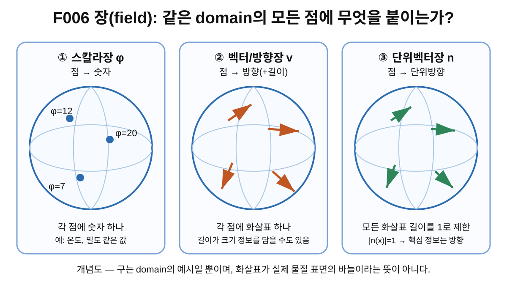
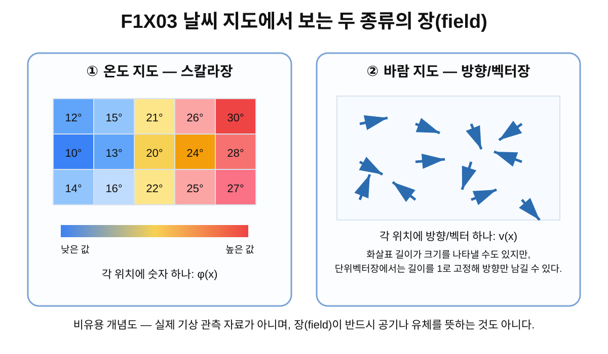

> **STATUS: DRAFT COMPLETE · AUDIT PASS**
>
> 이 장은 작성 Chat의 초안이다. 아직 독립 감사 PASS가 아니다. 제6장은 이 장의 독립 감사가 끝나기 전까지 시작하지 않는다.

# 5장 · 장(field)은 공간의 모든 점에 값을 붙인다

## 현재 상태

- **작성 상태:** DRAFT COMPLETE
- **감사 상태:** PASS
- **선행 장:** 제4장 「함수는 입력을 출력으로 보내는 규칙」 — PASS
- **다음 허용 작업:** 제5장 독립 감사
- **아직 시작하지 않는 것:** 제6장 본문

---

## 이번 장에서 알아낼 질문

1. 물리와 수학에서 **장(field)** 이란 무엇일까?
2. 한 점에서의 값 하나와 **장 전체**는 무엇이 다를까?
3. scalar field, vector/direction field, unit-vector field는 어떻게 다를까?
4. 왜 온도 지도와 바람 지도가 모두 “장”의 좋은 비유가 될까?
5. 다음과 같은 표기는 무엇을 뜻할까?

$$
\phi:x\mapsto \phi(x),\qquad n:x\mapsto n(x),\qquad |n(x)|=1.
$$

6. Planck-S²에서 말하는 “구 위의 화살표”는 실제 전자 표면에 작은 바늘이 꽂혀 있다는 뜻일까?
7. 왜 이 장의 수학을 배워도 아직 Planck-S²의 물리 가설이 증명되는 것은 아닐까?

---

## 앞 장에서 배운 것

제4장에서는 함수를 **입력 하나에 출력 하나를 정해 주는 규칙**으로 배웠다.

$$
f:X\to Y,\qquad x\mapsto f(x)
$$

에서

- $X$는 **domain**: 입력을 고르는 곳,
- $Y$는 **target(codomain)**: 출력이 들어가도록 정한 곳,
- $f(x)$는 입력 $x$에 대응하는 출력

이었다.

또한 함수의 출력은 숫자일 필요가 없었다. 점, 색, 방향처럼 다른 종류의 대상도 출력이 될 수 있었다.

이제 그 생각을 한 단계 확장한다.

> 입력이 “공간 속의 한 점”이고, 공간의 **모든 점**에 값이 하나씩 붙어 있다면 어떻게 부를까?

이때 등장하는 말이 **장(field)** 이다.

---

## 왜 새로운 문제가 생겼을까?

한 도시의 오늘 기온을 한 숫자로만 말하면 많은 정보가 사라진다.

- 학교 앞: 24°C
- 강가: 22°C
- 운동장: 26°C
- 산 근처: 20°C

처럼 위치마다 온도가 다를 수 있기 때문이다.

바람도 마찬가지다. “오늘 바람은 동쪽으로 분다”라고 한 문장으로 끝내기 어려운 경우가 있다. 어떤 장소에서는 북동쪽, 다른 장소에서는 남쪽으로 불 수 있고, 바람의 세기도 장소마다 달라질 수 있다.

따라서 우리는 한 값만 보는 대신 이렇게 묻는다.

> **공간의 각 점에 어떤 값이 붙어 있는가?**

이 질문을 수학적으로 다루는 가장 기본적인 언어가 장이다.

Planck-S²에서도 비슷한 이유로 장 언어가 필요해졌다. 프로젝트의 초기 보고서 G02는 후보 내부 자유도를

$$
n:S^2_{\rm domain}\to S^2_{\rm internal}
$$

처럼 쓴다. 즉 domain의 한 점만 보는 것이 아니라, **domain 전체의 모든 점에서 값 $n(x)$이 어떻게 배치되어 있는지**를 보려 한다. G02 §4는 이를 “각 domain $S^2$의 점에 internal $S^2$의 방향 하나를 대응시키는 비스피너 방향장”으로 설명한다. 이 장에서는 이 표현을 프로젝트 source의 모델 언어로만 사용한다. 자세한 source ID와 역할은 [source index](../sources/source-index.md)를 따른다.

하지만 여기서 곧바로 Planck-S²의 물리 가설을 받아들이면 안 된다. 먼저 표준적인 장의 뜻부터 배운다.

---

## 먼저 생각해 보기

큰 학교 지도를 하나 그렸다고 하자.

### 지도 A — 온도

지도 위의 각 위치마다 숫자를 적는다.

- 21°C
- 23°C
- 25°C
- 19°C

한 위치를 고르면 그 위치의 온도라는 **숫자 하나**를 읽을 수 있다.

### 지도 B — 바람

지도 위의 각 위치마다 화살표를 하나 그린다.

- 화살표가 가리키는 쪽: 바람의 방향
- 화살표 길이: 바람의 세기를 나타내도록 선택할 수도 있음

한 위치를 고르면 그 위치의 **벡터 하나**를 읽을 수 있다.

두 지도는 겉보기에는 다르지만 공통점이 있다.

> 위치 $x$를 하나 고르면, 그 위치에 대응하는 값이 정해진다.

제4장의 함수 언어가 이제 공간 전체에 적용되고 있다.

---

## 그림으로 이해하기 · 같은 domain, 서로 다른 종류의 값

**그림 F006. 같은 구형 domain 위에서 스칼라장, 벡터/방향장, 단위벡터장을 비교한 개념도 — 실제 크기/비율 아님**

### [이 그림에서 볼 것]

- 왼쪽에서는 각 점에 **숫자**가 하나씩 붙어 있다.
- 가운데에서는 각 점에 **화살표**가 하나씩 붙어 있다.
- 오른쪽에서는 각 점의 화살표 길이가 모두 1로 제한되어 **방향** 정보가 핵심이 된다.
- 세 경우 모두 “domain의 각 점 → 어떤 값 하나”라는 함수 구조를 가진다.

### [이 그림이 뜻하는 것]

장(field)은 “공간의 모든 점에 어떤 종류의 값을 하나씩 배정한 전체 규칙”으로 이해할 수 있다. 어떤 값을 붙이는지에 따라 스칼라장, 벡터장, 단위벡터장처럼 부르는 이름이 달라진다.

### [이 그림이 뜻하지 않는 것]

- 구가 실제 전자 표면이라는 뜻이 아니다.
- 화살표가 실제 물질로 된 작은 바늘이라는 뜻이 아니다.
- 모든 벡터장이 반드시 구 위에 정의된다는 뜻도 아니다.
- 그림 속 화살표 방향이 Planck-S²의 실제 해답 또는 관측 결과라는 뜻이 아니다.

---

## 쉬운 비유 · 날씨 지도

장(field)을 처음 배울 때는 **날씨 지도**가 좋은 비유다.

날씨 앱에서 지도를 확대하면 장소마다 다른 정보를 볼 수 있다.

- 온도 지도: 각 위치에 온도 숫자 하나
- 기압 지도: 각 위치에 기압 숫자 하나
- 바람 지도: 각 위치에 방향과 세기를 가진 화살표 하나

그래서 장은 “지도 전체에 값이 퍼져 있는 것”처럼 생각할 수 있다.

### 비유의 한계

하지만 장이 반드시 날씨나 공기 흐름 같은 실제 물질을 뜻하는 것은 아니다.

수학과 물리에서 장은 훨씬 더 일반적이다. 공간의 각 점에

- 숫자,
- 벡터,
- 방향,
- 복소수,
- 행렬,
- 더 복잡한 내부 상태

등을 붙일 수 있다.

따라서 “field”라는 단어 때문에 들판이나 공기 같은 물질이 공간에 차 있다고 상상할 필요는 없다. 핵심은 **각 점에 어떤 값이 대응한다는 구조**다.

---

## 그림으로 이해하기 · 온도 지도와 바람 지도

**그림 F1X03. 온도 스칼라장과 바람 방향/벡터장의 비교 — 교육용 개념도, 실제 기상 관측 자료 아님**

### [이 그림에서 볼 것]

- 온도 지도에서는 위치마다 숫자 하나가 적혀 있다.
- 바람 지도에서는 위치마다 화살표 하나가 있다.
- “한 점의 값”은 지도 전체 가운데 한 위치의 정보이고, “장 전체”는 모든 위치의 정보를 한꺼번에 포함한다.

### [이 그림이 뜻하는 것]

스칼라장과 벡터장은 모두 함수 언어로 다룰 수 있다. 차이는 각 점에 붙이는 **값의 종류**다.

### [이 그림이 뜻하지 않는 것]

- 그림이 실제 오늘의 날씨 데이터라는 뜻이 아니다.
- 모든 vector field가 바람이라는 뜻이 아니다.
- Planck-S²의 $n$장이 공기의 흐름이라는 뜻이 아니다.
- 화살표가 눈에 보이는 물질 조각이어야 한다는 뜻이 아니다.

---

## 한 점의 값과 장 전체는 다르다

이 구분은 앞으로 매우 중요하다.

온도장이 $\phi$라고 하자.

어떤 한 점 $x_0$에서

$$
\phi(x_0)=23^\circ{\rm C}
$$

라고 쓸 수 있다.

이것은 **한 점에서의 값 하나**다.

하지만 장 $\phi$ 자체는 그 한 숫자와 같지 않다. 장 전체는 domain의 모든 점에 대해

$$
x\mapsto \phi(x)
$$

라는 대응을 전부 포함한다.

쉽게 말하면:

- $\phi(x_0)$ = 지도에서 한 장소를 찍어 읽은 숫자 하나
- $\phi$ = 지도 전체의 모든 장소에 온도가 어떻게 배치되어 있는지를 담은 규칙 전체

이다.

방향장 $n$에서도 마찬가지다.

- $n(x_0)$ = 한 점에서 선택된 방향 하나
- $n$ = 모든 점의 방향 배치를 통째로 포함하는 장 전체

이다.

이 차이를 놓치면 나중에 **configuration**이라는 말을 배울 때 “한 점”과 “장 전체 배치”를 혼동하게 된다.

---

## 실제 수학에서는 · field를 함수로 보는 첫 단계

초보 단계에서는 장을 다음처럼 이해하면 충분하다.

> **장(field)은 공간의 각 점을 입력으로 받아 어떤 값을 출력하는 함수다.**

### 1. 스칼라장 scalar field

스칼라장은 각 점에 숫자 하나를 붙인다.

예를 들어 domain이 공간 $M$이라면

$$
\phi:M\to \mathbb R
$$

처럼 쓸 수 있다.

한 점 $x\in M$에서

$$
x\mapsto \phi(x)
$$

이다.

온도나 밀도처럼 “크기를 숫자 하나로 나타내는 값”이 대표적인 비유다.

MIT의 벡터미적분 보조 자료는 위치에 따라 변하는 온도를 scalar quantity의 예로 설명한다. 표준 vector field 정의와 함께 아래 source ledger에 기록한다.

### 2. 벡터장 vector field

평면이나 3차원 공간에서 가장 단순하게 생각하면 벡터장은

$$
x\mapsto v(x)
$$

처럼 각 점에 벡터 하나를 붙인다.

벡터에는 보통

- 방향
- 크기

가 함께 들어 있다.

바람의 속도장을 그릴 때 화살표 방향으로 바람 방향을, 화살표 길이로 속력의 크기를 표시할 수 있다.

[OpenStax Calculus Volume 3, §6.1 “Vector Fields”](https://openstax.org/books/calculus-volume-3/pages/6-1-vector-fields)는 $\mathbb R^2$ 또는 $\mathbb R^3$의 각 점에 벡터를 하나씩 배정하는 방식으로 vector field를 정의한다.

### 조금 더 정확한 주의

굽은 다양체 위의 **접벡터장(tangent vector field)** 은 각 점 $x$마다 그 점의 접공간 $T_xM$에 속하는 벡터를 고른다. 그래서 엄밀하게는 단순히 모든 벡터가 하나의 고정된 $\mathbb R^n$ target에 들어간다고만 말하면 부족할 수 있고, tangent bundle $TM$의 section으로 표현한다.

이 책에서는 아직 fiber bundle을 배우지 않았으므로 여기서는 이 사실을 “각 점에서 허용되는 벡터 공간이 달라질 수도 있다”는 경고 정도로만 남긴다.

그리고 이것은 Planck-S²의 $n$장과도 중요한 차이가 있다. 프로젝트의 $n(x)$는 **domain 구면의 접벡터라고 자동으로 가정하지 않는다.** G02에서 $n$은 별도의 internal $S^2$ 값을 고르는 방향장 후보다.

### 3. 단위벡터장 unit-vector field

벡터의 길이를 항상 1로 제한하면

$$
|n(x)|=1
$$

이라고 쓸 수 있다.

이때 크기는 고정되어 있으므로 남는 핵심 정보는 **방향**이다.

그래서 단위벡터는 3차원에서 방향의 집합인 단위구면 $S^2$의 점으로 생각할 수 있다.

$$
n(x)\in S^2.
$$

OpenStax의 같은 절은 모든 벡터의 magnitude가 1인 vector field를 unit vector field라고 설명하며, 이 경우 핵심 정보가 방향이라고 설명한다.

---

## 최소한의 수학

이 장에서 꼭 기억해야 하는 수식은 많지 않다.

### 스칼라장

$$
\phi:x\mapsto \phi(x)
$$

- 입력: 공간의 점 $x$
- 출력: 숫자 $\phi(x)$

보다 명확히 쓰면

$$
\phi:M\to \mathbb R.
$$

### 방향/단위벡터장

$$
n:x\mapsto n(x),
$$

그리고 단위 길이 조건

$$
|n(x)|=1.
$$

3차원 단위벡터라면

$$
n(x)=(n_1(x),n_2(x),n_3(x)),
$$

$$
n_1(x)^2+n_2(x)^2+n_3(x)^2=1
$$

이다.

따라서 각 $n(x)$는 단위구면 $S^2$ 위의 한 점으로 볼 수 있다.

### 아주 중요한 구분

$$
n(x)\in S^2
$$

는 **한 점 $x$에서의 값**을 말한다.

반면

$$
n
$$

은 모든 $x$에 대해 $n(x)$가 어떻게 정해지는지를 포함하는 **장 전체**다.

---

## “구 위의 화살표”는 무엇을 뜻할까?

이 책 제목에 등장하는 “구 위의 화살표”는 시각화 표현이다.

구면의 각 점 $x$에서 단위 방향 $n(x)$ 하나가 정해져 있다고 생각하면, 그 방향을 화살표로 그릴 수 있다.

하지만 여기서 반드시 세 가지를 분리해야 한다.

1. **domain의 점 $x$** — 어디에서 값을 읽는가
2. **값 $n(x)$** — 그 점에 어떤 방향이 대응하는가
3. **장 전체 $n$** — 모든 점의 방향이 어떻게 배치되어 있는가

그리고 화살표는 그림을 위한 표시다. 실제 전자의 표면에 미세한 금속 바늘 같은 물체가 박혀 있다는 뜻이 아니다.

더 나아가 Planck-S²의 $S^2$ 자체도 실제 3차원 공간에 놓인 물질 껍질이라고 확정된 것이 아니다. G02 §2는 이를 내부 정보공간 또는 경계 자유도로 해석할 수도 있다고 명시한다.

---

## Planck-S²에서는 · 왜 $n$장을 선택했을까?

프로젝트의 v0.2 연구 G02는 이전 U(1) phase toy가 3차원 회전의 비가환 구조를 충분히 설명하지 못한다는 이유로, 다음 후보를 전면에 놓았다.

$$
n:S^2_{\rm domain}\to S^2_{\rm internal}.
$$

G02 §4의 모델 언어를 풀면 다음과 같다.

> domain $S^2$의 각 점에 internal $S^2$의 방향 하나를 대응시키는 non-spinorial direction field $n$을 둔다.

이 선택에는 중요한 연구 전략이 있었다.

- 처음부터 2성분 spinor를 넣지 않는다.
- 처음부터 $e^{i\theta/2}$ 같은 반각 변환법칙을 가정하지 않는다.
- 대신 장 전체의 배치가 만드는 configuration space의 topology가 2π/4π 구조를 만들 수 있는지 시험한다.

그러나 이것은 어디까지나 **후보 모델의 선택**이다.

“$n$장을 쓰기로 했다”와 “실제 전자에 그런 $n$장이 존재한다”는 전혀 다른 문장이다.

---

## 당시 연구에서는 무엇을 얻었나

### G01 — 내부/경계 자유도라는 최초 아이디어

초기 G01은 Planck 규모 $S^2$형 내부/경계와 그 위의 내부 자유도를 후보로 두었다. 이 단계는 아직 구체적인 $n:S^2\to S^2$ 방향장 구조가 완성된 단계가 아니라, **낮은 차원의 내부/경계 자유도라는 아이디어를 시험하기 시작한 단계**였다. 프로젝트 연대기에서도 이 단계 전체는 WORKING HYPOTHESIS로 기록된다.

### G02 — 방향장 $n$을 1순위 후보로 구체화

G02에서 후보가 더 구체화된다.

$$
n:S^2_{\rm domain}\to S^2_{\rm internal}.
$$

이제 “구 위의 어떤 정보가 있다” 수준을 넘어, 각 domain 점에서 하나의 internal direction을 고르는 **장 전체**를 수학적 연구 대상으로 삼게 되었다.

이 선택 덕분에 다음 질문이 가능해졌다.

- 장 전체를 하나의 configuration으로 볼 수 있는가?
- 서로 다른 configuration들을 모으면 어떤 공간이 되는가?
- 그 공간에서 loop가 어떤 종류로 나뉘는가?

하지만 이 질문들은 제6장 이후에 하나씩 배운다.

### G05 — 장의 “모양” 자체가 연구 대상이 됨

후속 G05에서는 degree-one configuration의 moduli와 shape/concentration 문제가 등장한다. 즉 같은 topological sector 안에서도 장의 분포가 여러 방식으로 달라질 수 있다는 문제가 중요해졌다. 이 책에서는 그 상세한 moduli와 양자화 문제를 제3권에서 다룬다. 여기서는 “장 전체의 배치가 단순한 한 방향보다 훨씬 많은 정보를 가진다”는 사실만 기억하면 된다. G05의 정확한 source 역할은 [source index](../sources/source-index.md)에 기록되어 있다.

---

## 후속 감사에서는 무엇이 바뀌었나

프로젝트가 발전하면서 “기본 동역학 field는 $n$ 하나”라는 가정 자체도 감사 대상이 되었다.

A10.8 계열의 selection-axiom 정리는 baseline model class에서

- 기본 동역학 field를 $n$ 하나로 두고,
- $n\cdot n=1$을 요구하며,
- 독립 gauge/auxiliary field를 두지 않는

조건을 **선택 공리**로 명시했다.

그러나 R07/R08 계열 감사와 frozen baseline은 이것이 자연법칙에서 증명된 사실이 아니라 모델 class를 정의하는 선택이라고 분명히 경고한다. 즉 **final field content의 필연성은 OPEN**이다. 현재 상세 판정은 [proof-status ledger](../sources/proof-status.md)를 따른다.

이 구분은 매우 중요하다.

> “이 가정 아래 어떤 수학이 성립하는가?”를 증명하는 것과 “자연이 실제로 이 가정을 따른다”를 증명하는 것은 다른 일이다.

---

## 현재 판정

| 주장/항목 | 현재 상태 | 정확한 범위 |
|---|---|---|
| scalar field / vector field / unit-vector field의 기본 개념 | **SOURCE VERIFIED** | 표준 수학·벡터미적분 언어 |
| $\phi:M\to\mathbb R$, $x\mapsto\phi(x)$ 같은 스칼라장 표기 | **SOURCE VERIFIED** | 표준 수학 표기 |
| 각 점에 벡터를 하나 배정하는 vector field 개념 | **SOURCE VERIFIED** | 표준 수학 정의 |
| $|n(x)|=1$인 unit-vector field에서 방향이 핵심이라는 설명 | **SOURCE VERIFIED** | 표준 unit-vector field 개념 |
| G02가 $n:S^2_{domain}\to S^2_{internal}$을 후보 자유도로 선택 | **CONDITIONAL · PROJECT MODEL CHOICE** | 프로젝트의 모델 선택 |
| “기본 동역학 field는 $n$ 하나”라는 later n-only baseline | **PROVED UNDER ASSUMPTIONS인 분류정리의 가정 중 하나** | 선택 공리 자체의 물리적 필연성은 증명되지 않음 |
| 실제 전자에 이 $n$장이 physical field로 존재 | **OPEN** | 관측·독립 물리 유도 없음 |
| Planck-S² 전체 | **WORKING HYPOTHESIS** | 부분 수학 결과와 전체 전자 이론을 구분 |

---

## 이것으로 말할 수 있는 것

이 장을 끝내면 다음은 말할 수 있다.

- 장은 공간의 각 점에 값을 배정하는 구조로 이해할 수 있다.
- 한 점의 값과 장 전체는 다르다.
- 스칼라장은 각 점에 숫자를, 벡터장은 각 점에 벡터를 배정하는 대표적인 장이다.
- unit-vector field는 각 점의 벡터 길이가 1로 제한된 장이며 방향 정보가 핵심이다.
- $\phi:x\mapsto\phi(x)$와 $n:x\mapsto n(x)$ 표기를 읽을 수 있다.
- $|n(x)|=1$이면 각 $n(x)$를 방향공간 $S^2$의 점으로 생각할 수 있다.
- Planck-S²가 후보 모델에서 $n$장을 사용한다는 사실을 읽을 수 있다.

---

## 이것으로 말할 수 없는 것

그러나 아직 다음은 말할 수 없다.

- 실제 전자가 물질로 된 $S^2$ 껍질을 가진다고 말할 수 없다.
- 실제 전자 표면에 작은 화살표나 바늘이 있다고 말할 수 없다.
- 프로젝트의 $n$장이 실제 자연의 fundamental field라고 증명되었다고 말할 수 없다.
- $n$장을 선택했다는 사실만으로 spin-1/2이 설명되었다고 말할 수 없다.
- $|n|=1$만으로 degree $Q$, configuration-space topology, FR quantization이 자동으로 따라온다고 말할 수 없다.
- 함수/장 언어를 배웠다는 사실 자체가 Planck-S²의 물리 가설을 지지하는 실험 증거가 되지는 않는다.

---

## 자주 하는 오해

### 오해 1 — “장”은 뭔가 물질이 공간에 퍼져 있다는 뜻이다

**아니다.** 장은 수학적으로 각 점에 값을 배정하는 구조다. 실제 물질이나 유체를 묘사하는 데 사용할 수도 있지만 반드시 그래야 하는 것은 아니다.

### 오해 2 — 한 점의 값 $n(x)$와 장 $n$은 같다

**아니다.** $n(x)$는 한 점에서의 값 하나이고, $n$은 모든 점의 값을 포함하는 규칙 전체다.

### 오해 3 — vector field의 화살표는 실제 화살이다

**아니다.** 화살표는 벡터 또는 방향을 그림으로 표시하는 기호다.

### 오해 4 — unit-vector field는 모든 화살표가 같은 방향이라는 뜻이다

**아니다.** 길이가 모두 1이라는 뜻이다. 방향은 점마다 달라질 수 있다.

### 오해 5 — Planck-S²의 $n(x)$는 domain 구면에 접하는 바람 화살표다

**아니다.** 프로젝트의 $n$은 internal $S^2$의 방향값을 고르는 후보다. domain의 tangent vector field와 자동으로 동일시하지 않는다.

### 오해 6 — $n:S^2\to S^2$를 쓰면 실제 전자 내부장이 증명된다

**아니다.** 이는 프로젝트가 채택한 후보 모델 언어다. 실제 physical field인지 여부는 OPEN이다.

---

## 다음 장이 필요한 이유

이제 우리는 두 가지를 배웠다.

1. 제4장: 함수는 입력을 출력으로 보내는 규칙이다.
2. 제5장: 장은 공간의 모든 점에서 그런 값을 정해 주는 전체 배치다.

하지만 아직

$$
n:S^2\to S^2
$$

에서 **왼쪽 $S^2$와 오른쪽 $S^2$가 각각 정확히 무슨 역할을 하는지**를 충분히 분해하지 않았다.

제6장에서는

- domain sphere
- target sphere
- 한 domain 점 $x$
- 그 점의 값 $n(x)$

을 따로 떼어 놓고, $S^2\to S^2$라는 표기 자체를 천천히 읽는다.

**단, 제6장은 이 제5장의 독립 감사가 PASS되기 전에는 시작하지 않는다.**

---

## 한 문장 기억

> **장은 한 점의 값이 아니라, 공간의 모든 점에 어떤 값을 하나씩 붙이는 규칙 전체다.**

Planck-S²에서 “구 위의 화살표”는 이 규칙을 눈으로 보기 쉽게 표현한 개념도이며, 실제 전자 표면의 물질 바늘을 뜻하지 않는다.

---

## 용어 카드

| 용어 | 이 책에서의 뜻 |
|---|---|
| **field, 장** | 공간의 각 점에 어떤 값을 배정하는 전체 규칙 |
| **field value** | 특정 한 점 $x$에서의 값 $\phi(x)$ 또는 $n(x)$ |
| **scalar field** | 각 점에 숫자 하나를 배정하는 장 |
| **vector field** | 각 점에 벡터 하나를 배정하는 장 |
| **direction field** | 각 점에 방향 정보를 배정하는 장이라는 직관적 표현 |
| **unit vector** | 길이가 1인 벡터 |
| **unit-vector field** | 모든 점에서 벡터 길이가 1인 벡터장 |
| **$|n(x)|=1$** | 각 점에서 $n(x)$가 단위 길이를 가진다는 조건 |
| **internal direction** | 프로젝트 모델에서 target $S^2$의 점으로 표현하는 후보 내부 방향값 |
| **tangent vector field** | 각 점 $x$의 접공간 $T_xM$에서 벡터를 고르는 장; 일반적인 vector field의 더 엄밀한 기하학적 형태 중 하나 |

---

## 확인문제

### 문제 1

학교 운동장 전체에서 위치마다 온도 숫자를 하나씩 기록했다. 이것은 어떤 종류의 장에 가장 가깝나?

A. 스칼라장  
B. 단위벡터장  
C. loop  
D. degree

### 문제 2

어떤 점 $x_0$에서 $\phi(x_0)=18$이라는 사실을 알았다. 이것만으로 장 $\phi$ 전체를 알고 있다고 할 수 있을까?

### 문제 3

두 서로 다른 점 $x_1,x_2$에서 같은 값 $\phi(x_1)=\phi(x_2)$가 나왔다. 그러면 $\phi$는 함수가 아닌가?

### 문제 4

$|n(x)|=1$의 가장 직접적인 뜻은 무엇인가?

A. 모든 점의 $n(x)$ 방향이 같다.  
B. 모든 점에서 $n(x)$의 길이가 1이다.  
C. domain에 점이 하나뿐이다.  
D. degree가 자동으로 1이다.

### 문제 5

바람 지도에서 화살표를 사용하는 이유와, Planck-S² 그림의 화살표를 실제 바늘로 해석하면 안 되는 이유를 각각 설명해 보자.

### 문제 6

다음 둘의 차이를 자신의 말로 설명해 보자.

$$
n(x_0)
$$

과

$$
n.
$$

### 문제 7

Planck-S²가 $n:S^2\to S^2$를 사용한다는 사실만으로 실제 전자에 그러한 physical field가 존재한다고 결론내릴 수 있는가?

### 문제 8

“unit-vector field”와 “모든 화살표가 같은 방향인 field”는 같은 뜻인가? 이유를 설명하라.

---

## 정답과 설명

### 1번

**A. 스칼라장.**

각 위치에 온도라는 숫자 하나를 대응시키므로 가장 단순한 scalar field 예다.

### 2번

**아니다.**

$\phi(x_0)$는 한 점에서의 값 하나다. 장 $\phi$ 전체를 알려면 domain의 다른 점들에서 값이 어떻게 정해지는지도 알아야 한다.

### 3번

**함수일 수 있다.**

서로 다른 입력이 같은 출력으로 가는 것은 허용된다. 제4장에서 배운 many-to-one 함수와 같다.

### 4번

**B. 모든 점에서 $n(x)$의 길이가 1이다.**

길이가 같다는 것과 방향이 같다는 것은 다르다. 방향은 점마다 달라질 수 있다. 또한 $|n|=1$은 degree가 1이라는 뜻이 아니다.

### 5번

바람 지도의 화살표는 각 위치의 방향 또는 속도 벡터를 눈으로 표시하기 위한 시각 기호다. Planck-S²의 화살표도 마찬가지로 방향값을 시각화하는 기호이며, 실제 전자 표면에 물질 바늘이 꽂혀 있다는 관측을 뜻하지 않는다.

### 6번

$n(x_0)$는 특정 한 점 $x_0$에서의 방향값 하나다. $n$은 domain의 모든 점에서 $n(x)$가 어떻게 정해지는지를 포함하는 장 전체다.

### 7번

**결론내릴 수 없다.**

$n:S^2\to S^2$는 프로젝트가 연구를 위해 채택한 후보 field language다. 실제 전자의 physical internal field라는 주장은 현재 **OPEN**이다.

### 8번

**같지 않다.**

unit-vector field는 각 벡터의 **길이**가 1이라는 뜻이다. 벡터의 **방향**은 위치마다 달라질 수 있다.

---

## 이 장의 근거 자료

### 프로젝트 source

| ID | 자료 | 이 장에서 사용하는 범위 | 종류 |
|---|---|---|---|
| **G01** | *Planck-S² Quantum Particle Hypothesis v0.1* | S² 내부/경계 자유도라는 초기 working hypothesis의 연구사적 출발점 | [일반 연구] |
| **G02** | *Planck-S² 양자입자 가설 v0.2* | $n:S^2_{domain}\to S^2_{internal}$ 방향장 후보와 “각 domain 점에 internal direction 하나”라는 모델 언어 | [일반 연구] |
| **G05** | *Planck-S² 양자입자 가설 v0.5* | 이후 field configuration의 shape/moduli 문제가 연구 대상으로 이어졌다는 연구사적 연결 | [일반 연구] |
| **R07/R08 계열** | A10.8 action-selection axioms 및 후속 감사 | n-only field content가 자연법칙의 증명이 아니라 model-class selection assumption이라는 현재 경계 | [적대적 감사/검증] |
| **C02 frozen baseline** | Gate C 최신 기준선 | target ontology/physical interpretation이 최종 폐쇄되지 않았다는 프로젝트 전체 경계 유지 | [적대적 감사] |

G02는 프로젝트를 exploratory theoretical model로 규정하고, 기본입자의 실제 S² 내부/경계를 확립된 사실로 제시하지 않는다. 또한 $n:S^2\to S^2$를 non-spinorial direction field 후보로 둔다. 프로젝트 문서의 파일명·역할·판정 우선순위는 [source index](../sources/source-index.md)와 [proof-status ledger](../sources/proof-status.md)를 기준으로 한다.

### 외부 표준 source

| Source | 이 장에서 확인하는 표준 내용 | 자료 종류 |
|---|---|---|
| [OpenStax, *Calculus Volume 3*, §6.1 “Vector Fields”](https://openstax.org/books/calculus-volume-3/pages/6-1-vector-fields) | domain의 각 점에 vector를 배정하는 vector field 정의; unit vector field의 magnitude가 1이라는 정의 | [외부 문헌] |
| [MIT OpenCourseWare, *Calculus*, Chapter 15 “Vector Fields”](https://ocw.mit.edu/courses/res-18-001-calculus-fall-2023/mitres_18_001_f17_full_book.pdf) | 점마다 vector가 하나씩 있는 field라는 직관과 표준 vector-field 정의 | [외부 문헌] |
| [MIT OpenCourseWare, *An Introduction to Vector Calculus*](https://ocw.mit.edu/courses/res-18-007-calculus-revisited-multivariable-calculus-fall-2011/5723c1da890523f30122615ae8458e16_MITRES_18_007_supp_notes03.pdf) | 위치에 따라 달라지는 temperature를 scalar quantity/function의 예로 사용하는 표준 설명 | [외부 문헌] |

외부 source의 역할은 **field라는 수학 개념 자체의 표준 정의를 확인하는 것**이다. 이 표준 정의가 Planck-S²의 실제 전자 모델을 증명하는 것은 아니다.

---

## 제5장 제작 기록

- **작성일:** 2026-08-29
- **canonical file:** `volume-1/05-field.md`
- **기준:** `STATUS.md`에서 Chapter 4 `DRAFT COMPLETE / PASS`, Chapter 5 제작 승인 확인 후 작성
- **필수 그림:** F006, F1X03 실제 asset 추가
- **과학적 경계:** standard field concept = SOURCE VERIFIED / Planck-S²의 n-field 선택 = CONDITIONAL model choice / actual electron physical field = OPEN / 전체 = WORKING HYPOTHESIS
- **작성자 판정:** DRAFT COMPLETE
- **독립 감사:** PASS — 2026-08-29
- **다음 작업:** 제6장 DRAFT 제작 허용
- **감사 결과:** PASS — Chapter 6 DRAFT APPROVED
