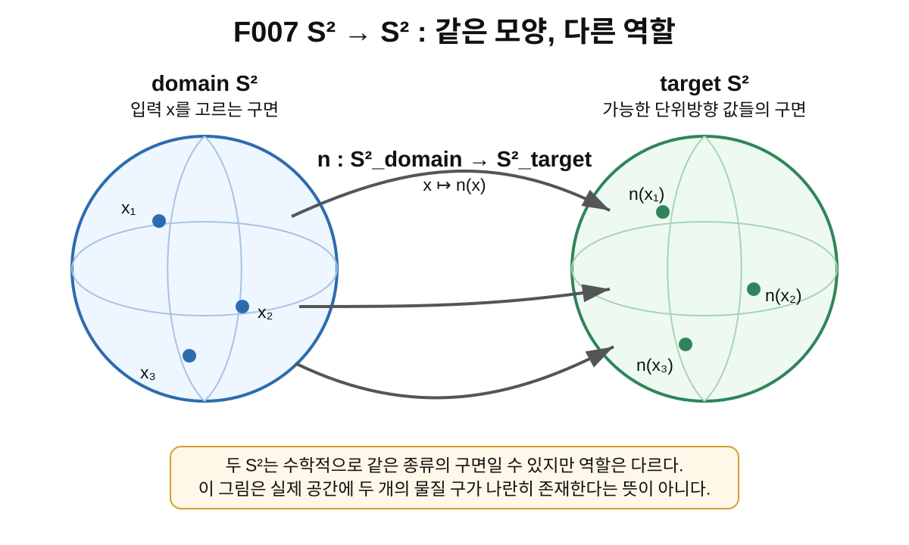
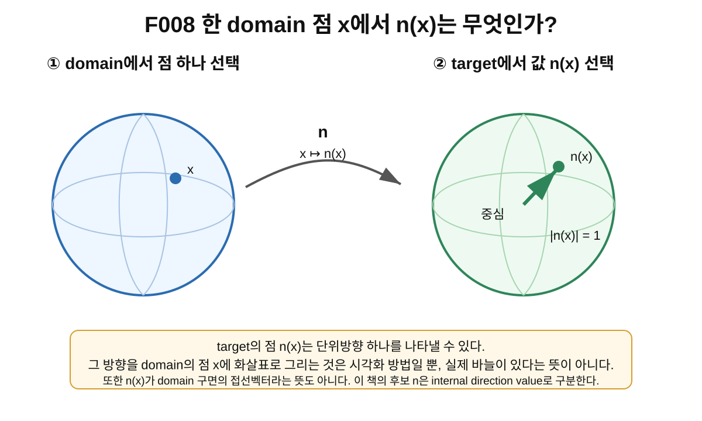

> **STATUS: DRAFT COMPLETE · AUDIT PENDING**
>
> 이 장은 작성 Chat의 초안이다. 아직 독립 감사 PASS가 아니다. 제7장은 이 장의 독립 감사가 끝나기 전까지 시작하지 않는다.

# 6장 · S²→S²는 무엇을 뜻할까?

## 현재 상태

- **작성 상태:** DRAFT COMPLETE
- **감사 상태:** AUDIT PENDING
- **선행 장:** 제5장 「장(field)은 공간의 모든 점에 값을 붙인다」 — PASS
- **다음 허용 작업:** 제6장 독립 감사
- **아직 시작하지 않는 것:** 제7장 본문

---

## 이번 장에서 알아낼 질문

1. $S^2\to S^2$에서 왼쪽 구와 오른쪽 구는 왜 따로 생각해야 할까?
2. **domain $S^2$**와 **target $S^2$**는 각각 어떤 역할을 할까?
3. $n:S^2_{\rm domain}\to S^2_{\rm target}$과 $x\mapsto n(x)$는 어떻게 읽을까?
4. target $S^2$가 “가능한 단위방향들의 공간”이라는 말은 무슨 뜻일까?
5. $n(x)$는 한 점에서의 값이고 $n$은 장 전체라는 차이를 어떻게 유지할까?
6. 두 $S^2$가 같은 모양이라고 해서 같은 물리적 물체라고 말해도 될까?
7. $S^2\to S^2$라는 표기만으로 Planck-S²의 실제 전자 내부구조가 증명될까?

---

## 앞 장에서 배운 것

제4장에서는 함수를

$$
f:X\to Y,\qquad x\mapsto f(x)
$$

처럼 적는 법을 배웠다.

- $X$는 **domain**: 입력을 고르는 곳
- $Y$는 **target(codomain)**: 출력이 들어가는 곳
- $f(x)$는 입력 $x$에 대응하는 출력

이었다.

제5장에서는 이 함수 언어를 공간 전체에 적용해 **장(field)** 을 배웠다.

예를 들어

$$
\phi:x\mapsto \phi(x)
$$

는 각 점에 숫자를 붙이는 스칼라장의 예였고,

$$
n:x\mapsto n(x),\qquad |n(x)|=1
$$

은 각 점에 길이 1인 방향 값을 붙이는 unit-vector field의 기본 표기였다.

또 아주 중요한 구분을 배웠다.

> $n(x_0)$는 **한 점에서의 값 하나**이고, $n$은 **모든 점의 값을 함께 담은 장 전체**다.

이제 Planck-S² 문서에 반복해서 등장하는

$$
n:S^2\to S^2
$$

를 정확히 읽을 준비가 되었다.

---

## 왜 새로운 문제가 생겼을까?

처음 이 식을 보면 이상하게 느껴질 수 있다.

> “구에서 구로 간다니, 구 하나가 다른 구로 이동한다는 뜻인가?”

아니다.

$S^2\to S^2$의 화살표는 물체의 이동 경로가 아니라 **함수의 대응 규칙**을 뜻한다.

더 큰 문제는 양쪽이 똑같이 $S^2$라고 적혀 있다는 것이다. 그래서 독자는 쉽게 두 구를 같은 역할로 합쳐 버릴 수 있다.

하지만 함수에서 domain과 target은 역할이 다르다.

- 왼쪽 $S^2$: **어디의 점을 입력으로 고르는가?**
- 오른쪽 $S^2$: **그 점에 어떤 값을 붙일 수 있는가?**

Planck-S²의 후보 장에서는 이 두 역할을 분리해서 읽는 것이 핵심이다.

---

## 먼저 생각해 보기 · 지구본과 “방향 지구본”

실제 지구본 하나를 생각해 보자.

지구본 표면의 한 장소를 손가락으로 짚는다.

- 서울
- 북극 근처
- 태평양의 한 점

이런 장소들은 **입력을 고르는 곳**이다. 이것을 domain에 비유할 수 있다.

이번에는 또 다른 구를 상상하자. 이 두 번째 구는 실제 행성이 아니다. 가능한 모든 방향을 정리한 **방향표**다.

- 위쪽 방향
- 오른쪽 위 방향
- 아래쪽 방향
- 왼쪽 뒤 방향

처럼 3차원에서 가능한 단위방향 하나하나를 구면의 점으로 나타낸다고 생각한다.

이제 규칙을 만든다.

> “domain 지구본의 각 장소를 고르면, 방향표 구면에서 방향 하나를 골라 준다.”

이 규칙 전체가 $S^2\to S^2$ map의 직관이 될 수 있다.

### 비유의 한계

이 비유에는 매우 중요한 한계가 있다.

- 두 번째 “방향 지구본”은 실제 우주 공간에 떠 있는 두 번째 물질 구가 아니다.
- target $S^2$는 **값들을 정리한 추상적인 공간**일 수 있다.
- domain $S^2$ 역시 실제 전자의 표면이라고 이미 확인된 것이 아니다.
- 두 구를 나란히 그리는 것은 역할을 구분하기 위한 교육용 표현이다.

따라서 그림에서 구가 두 개 보인다고 해서 “전자 안에 구가 두 개 있다”고 해석하면 안 된다.

---

## 그림으로 이해하기 · 같은 모양, 다른 역할

**그림 F007. $n:S^2_{\rm domain}\to S^2_{\rm target}$ — 같은 종류의 구면을 domain과 target이라는 서로 다른 역할로 분리한 개념도. 실제 크기/비율 아님**

### [이 그림에서 볼 것]

- 왼쪽 구면은 입력 $x$를 고르는 **domain $S^2$**다.
- 오른쪽 구면은 가능한 출력 $n(x)$가 들어가는 **target $S^2$**다.
- $x_1,x_2,x_3$ 같은 서로 다른 domain 점들이 각각 target의 점을 하나씩 고른다.
- 양쪽이 모두 $S^2$여도 왼쪽과 오른쪽의 역할은 다르다.

### [이 그림이 뜻하는 것]

$S^2\to S^2$는 “한 구면의 각 점을 입력으로 받아 다른 역할의 구면에서 값 하나를 고르는 함수”로 읽을 수 있다. Planck-S² 후보 언어에서는 오른쪽 $S^2$를 단위방향 값들의 공간으로 해석하는 모델을 사용한다.

### [이 그림이 뜻하지 않는 것]

- 실제 공간에 물질 구 두 개가 나란히 존재한다는 뜻이 아니다.
- domain과 target이 둘 다 $S^2$라고 해서 같은 물리적 공간이라는 뜻이 아니다.
- 그림의 화살표가 입자나 정보가 실제 공간을 이동하는 궤적이라는 뜻이 아니다.
- 이 그림만으로 실제 전자에 이런 구조가 존재한다는 것이 증명되는 것도 아니다.

---

## 실제 수학에서는 · $S^2$를 두 번 쓰는 법

제3장에서 단위구면을

$$
S^2=\{u\in\mathbb R^3:|u|=1\}
$$

처럼 생각할 수 있다고 배웠다.

$S^2\to S^2$에서는 같은 종류의 수학적 공간이 양쪽에 나타난다. 역할을 분명히 하기 위해 이 책에서는 필요할 때 아래처럼 아래첨자를 붙인다.

$$
S^2_{\rm domain},\qquad S^2_{\rm target}.
$$

그리고 장 $n$을

$$
n:S^2_{\rm domain}\to S^2_{\rm target}
$$

라고 쓴다.

이 식은 다음 뜻이다.

1. 먼저 $x\in S^2_{\rm domain}$을 하나 고른다.
2. $n$이라는 규칙을 적용한다.
3. 결과 $n(x)$는 target 안의 한 점이다.

즉

$$
x\mapsto n(x),\qquad n(x)\in S^2_{\rm target}.
$$

이다.

만약 target $S^2$를 3차원 단위벡터의 집합으로 표현한다면

$$
n(x)=\bigl(n_1(x),n_2(x),n_3(x)\bigr),
$$

그리고

$$
|n(x)|^2=n_1(x)^2+n_2(x)^2+n_3(x)^2=1
$$

이라고 쓸 수 있다.

이 식에서 중요한 것은 **각 점의 값이 길이 1이라는 것**이다. 모든 점에서 같은 방향이라는 뜻은 아니다.

---

## 그림으로 이해하기 · 한 점 $x$를 고르면 무엇이 나올까?

**그림 F008. domain의 한 점 $x$가 target의 점 $n(x)$ 하나를 고르는 과정과, target의 점을 단위방향으로 읽는 방법 — 개념도, 실제 크기/비율 아님**

### [이 그림에서 볼 것]

- domain에서 $x$ 하나를 고른다.
- map $n$은 target에서 $n(x)$ 하나를 정한다.
- target 구의 중심에서 $n(x)$를 향한 단위벡터를 그리면 한 방향을 시각화할 수 있다.
- $|n(x)|=1$은 그 방향벡터의 길이가 1이라는 뜻이다.

### [이 그림이 뜻하는 것]

Planck-S²의 후보 표기에서 $n(x)$는 domain 위치 $x$에 대응하는 **internal direction value 하나**로 읽을 수 있다. 모든 $x$에 대한 $n(x)$를 모으면 장 $n$ 전체가 된다.

### [이 그림이 뜻하지 않는 것]

- $n(x)$가 domain 구면을 따라 누워 있는 접선벡터라는 뜻은 아니다.
- domain 점에 실제 바늘이 꽂혀 있다는 뜻도 아니다.
- target 구가 실제 전자 안에 있는 두 번째 물질 표면이라는 뜻도 아니다.
- 특정 $n(x)$ 방향이 실험으로 관측되었다는 뜻도 아니다.

---

## domain의 구와 target의 구가 왜 같은 $S^2$일까?

이 질문은 매우 자연스럽다.

domain이 $S^2$인 이유와 target이 $S^2$인 이유는 **서로 다른 역할에서** 나온다.

### domain 쪽

후보 모델은 입력 위치를 $S^2$ 위의 점으로 표시한다. 즉 domain의 점 $x$는 “장 값을 어디에서 읽을 것인가?”를 정한다.

### target 쪽

한편 길이 1인 3차원 방향은

$$
(n_1,n_2,n_3),\qquad n_1^2+n_2^2+n_3^2=1
$$

을 만족한다.

이런 모든 단위방향의 집합도 수학적으로 $S^2$다.

따라서 양쪽이 모두 $S^2$일 수 있지만,

> **왼쪽은 위치 역할, 오른쪽은 값 역할**

이라는 차이가 남는다.

이것은 “두 공간의 모양이 같다”와 “두 공간의 물리적 의미가 같다”가 전혀 다른 문장이라는 좋은 예다.

---

## 같은 target 값을 여러 domain 점이 골라도 될까?

된다.

제4장에서 배운 것처럼 함수는 반드시 일대일일 필요가 없다.

예를 들어

$$
x_1\ne x_2
$$

인데도

$$
n(x_1)=n(x_2)
$$

일 수 있다.

반대로 target $S^2$의 어떤 점은 아무 domain 점에서도 선택되지 않을 수도 있다.

즉 단순히

$$
n:S^2\to S^2
$$

라고 썼다는 사실만으로

- target의 모든 점을 반드시 한 번씩 방문한다,
- map이 일대일이다,
- map이 target 전체를 반드시 덮는다

라고 결론내릴 수 없다.

“target을 몇 번, 어떤 방향성을 가지고 덮는가?”라는 질문은 다음 단계에서 **degree $Q$**라는 개념으로 이어진다. 그러나 이 장에서는 아직 degree를 계산하거나 특정 값을 주장하지 않는다.

---

## 중요한 구분 · $n(x)$와 $n$은 다시 다르다

제5장의 구분을 여기서 한 번 더 확인하자.

### 한 점의 값

$$
n(x_0)\in S^2_{\rm target}
$$

은 한 domain 점 $x_0$에서 선택된 target 값 하나다.

### 장 전체

$$
n:S^2_{\rm domain}\to S^2_{\rm target}
$$

은 모든 domain 점에서 어떤 target 값을 고르는지를 통째로 포함하는 규칙이다.

따라서 장 $n$ 전체를 안다는 것은 target 점 하나를 아는 것보다 훨씬 많은 정보를 안다는 뜻이다.

이 차이는 뒤에서 **configuration**을 배울 때 다시 중요해진다. 한 configuration은 한 개의 화살표가 아니라, 구 전체에 걸친 장의 한 배치다.

---

## 방향 화살표는 어디에 있는 화살표일까?

여기서 자주 생기는 오해가 하나 더 있다.

구 위에 화살표를 그리면 독자는 흔히 화살표가 구면의 접선 방향을 따라야 한다고 생각한다. 실제로 일반적인 tangent vector field에서는 각 점 $x$에서 $T_xM$이라는 접공간의 벡터를 고른다.

하지만 이 책에서 Planck-S² 후보 $n$을 설명할 때의 화살표는 그런 의미로 자동 해석하지 않는다.

후보 표기는

$$
n(x)\in S^2_{\rm internal}
$$

처럼 **별도의 internal direction value**를 고르는 것으로 읽는다.

따라서 그림에서 domain 점 근처에 화살표를 그려 놓더라도 그것은 target 값을 눈으로 보기 쉽게 옮겨 그린 시각화일 뿐이다.

> **“구 위에 그려졌다”는 사실과 “구면에 접한 벡터다”는 문장은 다르다.**

제5장 독립 감사도 이 구분을 유지하도록 요구했다.

---

## Planck-S²에서는 · 왜 이 map을 골랐을까?

frozen production baseline의 G02는 프로젝트의 후보 자유도를

$$
n:S^2_{\rm domain}\to S^2_{\rm internal}
$$

형태로 사용한다.

이 선택으로 프로젝트는 “한 숫자”가 아니라 **구 전체에 배치된 방향장**을 후보 상태 변수로 다룰 수 있게 된다.

이후 G03은 이 map들의 공간과 위상적 경로를 연구하는 방향으로 진행하고, G05도 같은 기본 $n$-field 언어 위에서 후속 구조를 논의한다. 여기서 중요한 것은 연구가 이 언어를 **사용했다**는 사실과, 이 언어가 실제 전자의 정확한 물리 자유도라고 **증명되었다**는 주장을 구분하는 것이다.

현재 교과서 기준선에서는 다음처럼 읽는다.

- $n:S^2\to S^2$를 후보 자유도로 채택: **PROJECT MODEL CHOICE / CONDITIONAL**
- 표준 함수·장·구면 언어: **SOURCE VERIFIED**
- 실제 전자가 이런 physical $n$-field를 가진다는 주장: **OPEN**
- 실제 physical configuration space가 이상적인 mapping space와 정확히 같다는 주장: **OPEN**
- 전체 Planck-S²: **WORKING HYPOTHESIS**

---

## 당시 연구에서는 무엇을 얻었나

G02 단계의 중요한 변화는 후보 구조를 더 명시적인 수학 언어로 적었다는 점이다.

초기 아이디어를

> “어떤 구형 내부/경계 구조에 정보가 있다”

정도로만 말하는 것보다

$$
n:S^2\to S^2
$$

라고 쓰면 훨씬 많은 질문을 정확하게 만들 수 있다.

예를 들어:

- 어떤 map을 허용할 것인가?
- map 전체를 연속적으로 변형할 수 있는가?
- 서로 다른 map들을 어떻게 분류할 것인가?
- map이 target을 어떻게 덮는가?
- map들의 공간 안에서 loop를 만들 수 있는가?

같은 질문이 가능해진다.

즉 G02의 성과는 **실제 전자 구조를 관측했다는 것**이 아니라, 가설을 검증 가능한 수학 문제들로 바꾸기 위한 후보 언어를 더 구체화했다는 데 있다.

---

## 후속 감사에서는 무엇이 바뀌었나

후속 감사들은 이 map 언어 자체를 없애지는 않았지만, 그 물리적 지위를 매우 엄격하게 제한했다.

현재 canonical proof ledger는

> 실제 physical configuration space가 이상적인 $\mathrm{Map}_1(S^2,S^2)$와 같다는 주장은 **OPEN**

으로 유지한다.

그 이유는 실제 물리 이론에서는 단순한 smooth map 전체보다 더 많은 조건이 필요할 수 있기 때문이다.

예를 들어 뒤 권에서 다룰 문제에는

- 어떤 field configuration이 finite energy를 갖는가?
- 어떤 completion이나 function space를 써야 하는가?
- target 자유도가 물리적인가, quotient해야 하는가?
- 실제 observable과 어떻게 연결되는가?
- EFT가 유효한 subset 안에서도 같은 위상 구조가 남는가?

같은 문제가 있다.

따라서 제6장에서 배우는 $S^2\to S^2$는 **후속 수학을 시작하기 위한 모델 언어**이지, 물리적 ontology가 완전히 확정되었다는 선언이 아니다.

---

## 현재 판정

| 주장/항목 | 상태 | 정확한 범위 |
|---|---|---|
| $S^2$의 표준 수학적 정의 | SOURCE VERIFIED | 제3장에서 검증한 표준 수학 |
| 함수/사상 $f:X\to Y$, $x\mapsto f(x)$ | SOURCE VERIFIED | 제4장에서 검증한 표준 수학 |
| field를 각 점에 값이 대응되는 구조로 읽는 기본 언어 | SOURCE VERIFIED | 제5장에서 검증한 범위 |
| $n:S^2_{domain}\to S^2_{internal}$을 Planck-S² 후보 자유도로 사용 | CONDITIONAL · PROJECT MODEL CHOICE | G02 이후 모델 정의 |
| target $S^2$를 단위 internal direction 값의 공간으로 읽는 후보 해석 | CONDITIONAL · PROJECT MODEL CHOICE | 현재 n-field 모델 언어 안의 해석 |
| domain $S^2$가 실제 전자의 2차원 내부/경계 공간이라는 주장 | OPEN | 물리적 실재 연결 미완성 |
| 실제 전자가 physical $n$-field를 가진다는 주장 | OPEN | 독립 물리 유도·실험 연결 미완성 |
| actual physical configuration space = ideal mapping space | OPEN | canonical proof-status 기준 |
| Planck-S² 전체 | WORKING HYPOTHESIS | 프로젝트 전체 상태 |

---

## 이것으로 말할 수 있는 것

- $n:S^2_{\rm domain}\to S^2_{\rm target}$을 함수로 정확하게 읽을 수 있다.
- domain의 점 $x$와 target의 값 $n(x)$를 구분할 수 있다.
- $n(x)\in S^2$를 길이 1인 방향 값으로 표현할 수 있다.
- $n(x)$ 하나와 장 $n$ 전체를 구분할 수 있다.
- domain과 target이 같은 종류의 $S^2$여도 역할이 다르다는 것을 말할 수 있다.
- Planck-S²가 이 언어를 후보 모델 자유도로 사용한다는 사실을 설명할 수 있다.

---

## 이것으로 말할 수 없는 것

- 두 $S^2$가 실제 전자 안의 두 물질 구라고 말할 수 없다.
- domain $S^2$가 실제 전자 표면이라고 확정할 수 없다.
- target $S^2$가 실제 공간의 두 번째 위치 공간이라고 말할 수 없다.
- $n(x)$를 실제 전자 표면에 박힌 물리적 바늘이라고 말할 수 없다.
- $n:S^2\to S^2$라는 표기만으로 전하 $-e$, 질량, 스핀, 자기모멘트를 유도할 수 없다.
- map을 하나 적었다는 사실만으로 $Q=1$이라고 말할 수 없다.
- ideal mapping space의 위상 결과를 actual physical configuration space에 자동 적용할 수 없다.

---

## 오해 방지 상자

### 오해 1 · $S^2\to S^2$는 구 하나가 다른 구로 이동한다

**아니다.** 화살표 $\to$는 함수의 domain과 target을 표시한다.

### 오해 2 · 양쪽이 둘 다 $S^2$니까 같은 물리 공간이다

**아니다.** 수학적 모양이 같아도 역할과 물리적 해석은 다를 수 있다.

### 오해 3 · target $S^2$는 전자 안에 있는 두 번째 껍질이다

**아니다.** 후보 모델에서는 target을 가능한 internal direction 값들의 공간으로 읽는다.

### 오해 4 · $|n(x)|=1$이면 모든 화살표 방향이 같다

**아니다.** 길이만 1이라는 뜻이다. 방향은 $x$에 따라 달라질 수 있다.

### 오해 5 · 구 위에 화살표가 있으니 tangent vector field다

**자동으로 그렇지 않다.** 이 책의 후보 $n$은 internal direction value로 구분한다.

### 오해 6 · $S^2\to S^2$를 썼으니 $Q=1$이다

**아니다.** degree는 map의 추가적인 전역 성질이다. 다음 장에서 따로 배운다.

### 오해 7 · 이 map 언어가 잘 정의되므로 Planck-S²도 증명됐다

**아니다.** 표준 수학 언어가 잘 정의되는 것과 그 언어가 실제 전자를 기술한다는 것은 별개의 문제다.

---

## 다음 장이 필요한 이유

이제 우리는 “domain 구면의 각 점이 target 구면의 점 하나를 고른다”는 말을 읽을 수 있다.

하지만 아직 map들의 **전체 모양을 분류**하지 않았다.

어떤 map은 target의 한 작은 영역만 사용할 수 있고, 어떤 map은 target 전체를 한 번 감싸는 식으로 배치될 수도 있다. 또 방향을 뒤집으며 덮거나 여러 번 덮는 경우도 생각할 수 있다.

이 차이를 단순 그림이 아니라 정수로 구분하는 대표적인 도구가 **degree $Q$**다.

따라서 제7장의 질문은 다음과 같다.

> “구에서 구로 가는 map이 target을 몇 번, 어떤 방향성으로 덮는지를 어떻게 숫자로 기록할까?”

하지만 **제7장 본문은 제6장 독립 감사 PASS 전까지 시작하지 않는다.**

---

## 한 문장 기억

> **$n:S^2\to S^2$는 구 하나가 다른 구로 이동한다는 뜻이 아니라, domain 구면의 각 점 $x$에 target 구면의 값 $n(x)$ 하나를 대응시키는 장이며, 두 $S^2$의 역할은 반드시 구분해야 한다.**

---

## 용어 카드

| 용어 | 이 장에서의 뜻 |
|---|---|
| domain $S^2$ | 입력 $x$를 고르는 구면 |
| target $S^2$ | 가능한 출력 $n(x)$가 속하는 구면 |
| $n$ | 모든 domain 점에 target 값을 정하는 장 전체 |
| $n(x)$ | 한 domain 점 $x$에서의 target 값 하나 |
| internal direction | 후보 모델에서 target $S^2$의 점으로 나타내는 단위방향 값 |
| unit-vector condition | $|n(x)|=1$이라는 길이 조건 |
| map $S^2\to S^2$ | 한 구면의 각 점에 다른 역할의 구면 점을 대응시키는 함수 |
| PROJECT MODEL CHOICE | 프로젝트가 계산과 검증을 위해 채택한 모델 언어이며 물리적 실재의 증명과는 다른 것 |

---

## 확인문제

### 문제 1

$$
n:S^2_A\to S^2_B
$$

에서 $S^2_A$와 $S^2_B$가 같은 모양이라고 하자. 그러면 두 공간의 역할도 같은가?

### 문제 2

$x\in S^2_{\rm domain}$일 때 $n(x)$는 어디에 속하는가?

### 문제 3

$$
n(x)=(0,0,1)
$$

이고 $|n(x)|=1$이라고 하자. 이것은 장 전체 $n$을 모두 안다는 뜻인가?

### 문제 4

서로 다른 두 점 $x_1\ne x_2$가

$$
n(x_1)=n(x_2)
$$

를 만족하면 함수가 아닌가?

### 문제 5

target $S^2$를 “방향들의 공간”이라고 했을 때, 이것이 실제 공간에 두 번째 물질 구가 존재한다는 뜻인가?

### 문제 6

구 위에 그려진 $n(x)$ 화살표는 반드시 domain 구면에 접해야 하는가?

### 문제 7

$n:S^2\to S^2$라는 표기만 보고 $Q=1$이라고 결론내려도 되는가?

### 문제 8

다음 중 현재 교과서 기준선에서 **OPEN**인 것을 모두 고르자.

A. $S^2$라는 표준 수학적 구면의 정의  
B. $x\mapsto n(x)$라는 함수 표기  
C. 실제 전자가 physical $n$-field를 가진다는 주장  
D. 실제 physical configuration space가 이상적인 mapping space와 정확히 같다는 주장

---

## 정답과 설명

### 1번

**아니다.** 모양이 같아도 domain은 입력 역할, target은 출력 값의 공간 역할이다.

### 2번

$$
n(x)\in S^2_{\rm target}
$$

이다.

### 3번

**아니다.** $n(x)$는 한 점에서의 값 하나다. 장 전체 $n$은 모든 domain 점에서의 값을 포함한다.

### 4번

**함수일 수 있다.** 함수는 반드시 일대일일 필요가 없다. 서로 다른 입력이 같은 출력을 가질 수 있다.

### 5번

**아니다.** target은 가능한 값들을 정리한 추상적인 수학적 공간일 수 있다.

### 6번

**아니다.** Planck-S² 후보 $n$은 domain의 tangent vector라고 자동 해석하지 않고 internal direction value로 구분한다.

### 7번

**안 된다.** degree $Q$는 map의 추가적인 전역 성질이다. 단지 domain과 target이 $S^2$라는 사실만으로 $Q$가 결정되지 않는다.

### 8번

**C, D.** 표준 $S^2$와 함수 표기는 SOURCE VERIFIED 범위지만, actual physical field와 actual physical configuration-space 동일성은 OPEN이다.

---

## 이 장의 근거 자료

| 자료 | 절/역할 | 자료 종류 | 이 장에서 사용하는 범위 |
|---|---|---|---|
| G02 · Planck-S² 양자입자 가설 v0.2 | §4 | [일반 연구] | $n:S^2_{domain}\to S^2_{internal}$ 후보 장·map 언어 |
| G03 · Planck-S² 양자입자 가설 v0.3 | §4 및 후속 mapping-space 전개 | [일반 연구] | $S^2\to S^2$ map을 이후 topology 문제로 연결하는 연구 흐름 |
| G05 · Planck-S² 양자입자 가설 v0.5 | §2 | [일반 연구] | 같은 $n$-field 모델 언어의 후속 사용 |
| `sources/proof-status.md` | canonical baseline | [적대적 감사 통합 판정] | actual physical configuration space 및 physical ontology의 OPEN 경계 |
| 제3장·제4장·제5장 PASS본 | $S^2$, function/map, field | [SOURCE VERIFIED 선행 개념] | 표준 구면·함수·장 언어의 재사용 |
| `figures/volume-1/F007.svg` | domain/target 분리 | [교육용 그림] | 두 $S^2$의 역할 차이를 시각화 |
| `figures/volume-1/F008.svg` | $x\mapsto n(x)$ | [교육용 그림] | 한 domain 점과 한 target 값의 대응 시각화 |

> 이 장에서는 G02/G03/G05의 모델 언어를 설명하기 위해 사용한다. 해당 문서가 이 언어를 사용했다는 사실을 “실제 전자에 그런 field가 존재한다”는 증거로 바꾸지 않는다.

---

## 제6장 제작 기록

- canonical file: `volume-1/06-s2-to-s2.md`
- 작성 단계: **DRAFT COMPLETE**
- 감사 단계: **AUDIT PENDING**
- 선행 감사 조건: 제5장 PASS 확인 후 작성
- 실제 그림 asset: `F007.svg`, `F008.svg`
- proof boundary: 표준 map 언어 `SOURCE VERIFIED`; Planck-S²의 $n:S^2\to S^2$ 채택 `CONDITIONAL · PROJECT MODEL CHOICE`; actual physical field/configuration space `OPEN`; 전체 `WORKING HYPOTHESIS`
- 다음 작업: **Independent audit of Chapter 6**
- 금지 작업: **Chapter 7 본문 시작 금지 — Chapter 6 audit PASS 필요**
