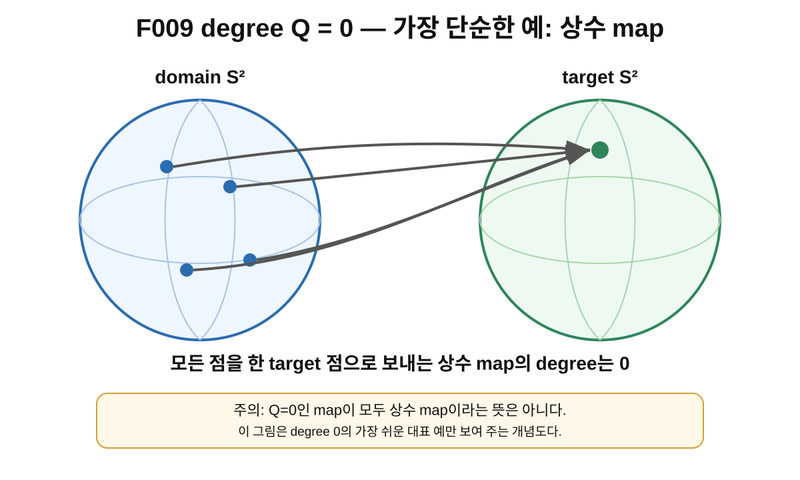
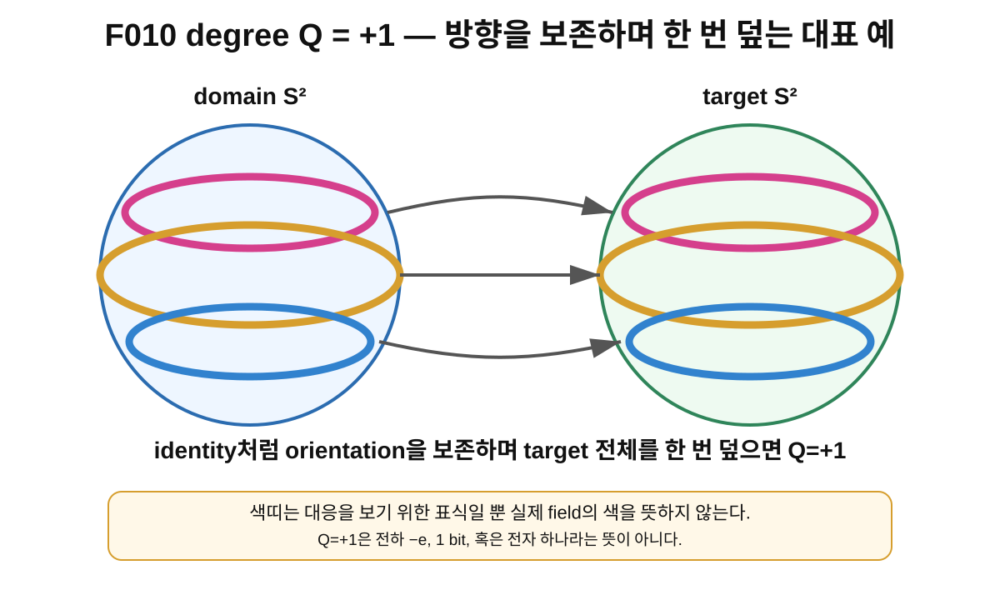
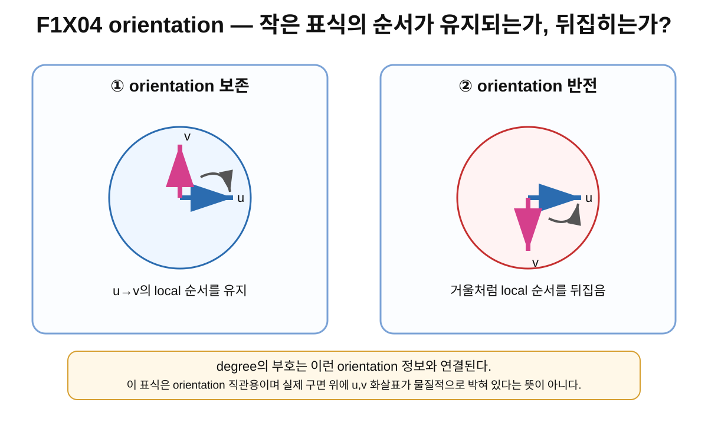
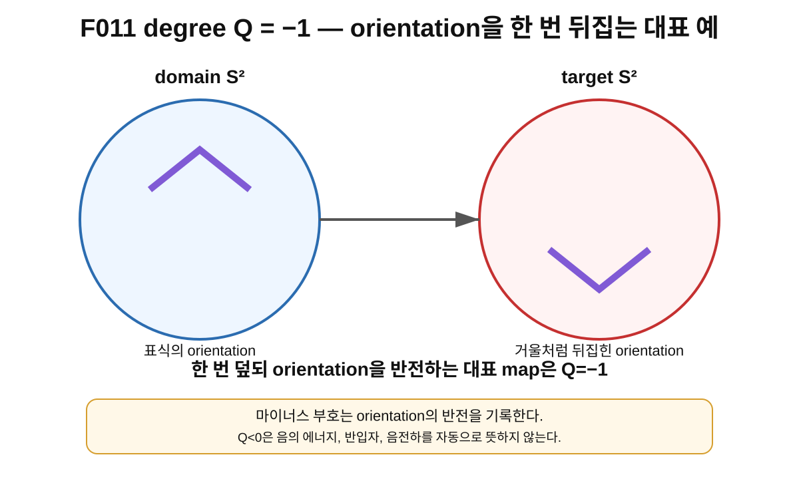
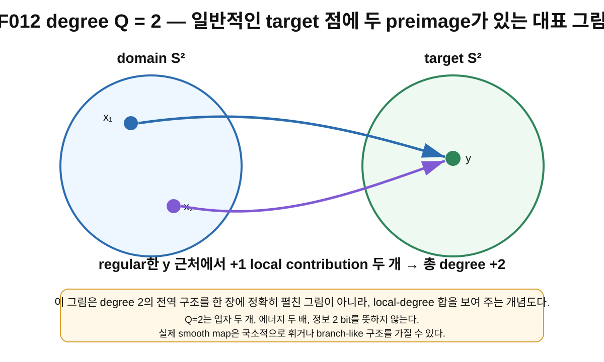

> **STATUS: DRAFT COMPLETE · AUDIT PENDING**
>
> 이 장은 작성 Chat의 초안이다. 아직 독립 감사 PASS가 아니다. 제8장은 이 장의 독립 감사가 끝나기 전까지 시작하지 않는다.

# 7장 · 구를 몇 번 감았는가: degree Q

## 현재 상태

- **작성 상태:** DRAFT COMPLETE
- **감사 상태:** AUDIT PENDING
- **선행 장:** 제6장 「S²→S²는 무엇을 뜻할까?」 — PASS
- **다음 허용 작업:** 제7장 독립 감사
- **아직 시작하지 않는 것:** 제8장 본문

---

## 이번 장에서 알아낼 질문

1. $S^2\to S^2$ map 전체의 성질을 정수 하나로 요약할 수 있을까?
2. **degree** 또는 **차수** $Q$는 무엇을 세는 수일까?
3. 왜 $Q$는 $0,+1,-1,2,\ldots$ 같은 정수가 될까?
4. $Q=+1$과 $Q=-1$은 무엇이 다를까?
5. $Q=0$이면 장이 아무 구조도 없다는 뜻일까?
6. $Q=2$이면 입자가 두 개라는 뜻일까?
7. 왜 서로 아주 다르게 생긴 두 map이 같은 $Q$를 가질 수 있을까?
8. Planck-S²가 $Q=1$ sector를 고른다는 것은 무엇을 뜻하고, 무엇을 뜻하지 않을까?

---

## 앞 장에서 배운 것

제6장에서는

$$
n:S^2_{\rm domain}\to S^2_{\rm target}
$$

을 읽는 법을 배웠다.

- 왼쪽 $S^2$는 **domain**: 입력점 $x$를 고르는 곳
- 오른쪽 $S^2$는 **target**: 출력값 $n(x)$이 들어가는 곳
- $x\mapsto n(x)$는 domain의 한 점에 target의 한 점을 대응시키는 규칙
- $n(x)$는 한 점의 값이고, $n$은 전체 map 또는 장 전체

였다.

또 중요한 경계를 배웠다.

> $S^2\to S^2$라고 썼다는 사실만으로 map의 성질이 모두 정해지는 것은 아니다.

어떤 map은 target을 한 번 덮는 듯 보일 수 있고, 어떤 map은 뒤집을 수 있고, 어떤 map은 여러 번 덮을 수도 있다. 이제 그 **전역적 차이**를 정수 하나로 기록하는 방법을 배운다.

그 정수가 바로 **degree $Q$**다.

---

## 왜 새로운 문제가 생겼을까?

$S^2\to S^2$ map을 점 하나씩만 들여다보면 정보가 너무 많다.

어떤 점 $x_1$은 target의 북쪽으로 갈 수 있고,
어떤 점 $x_2$는 남쪽으로 갈 수 있고,
또 다른 점은 적도 부근으로 갈 수 있다.

map 전체를 정확히 기록하려면 사실상 domain의 모든 점에서 $n(x)$를 알아야 한다.

그런데 때로는 map의 세세한 모양을 조금 바꾸어도 변하지 않는 **큰 특징**이 있다.

예를 들어 고무판에 그린 세계지도를 조금 늘이거나 찌그러뜨렸다고 하자. 나라의 모양이나 거리 비율은 달라질 수 있지만, 지도를 찢거나 붙이지 않는 한 “구 전체를 몇 번, 어떤 orientation으로 덮고 있는가?”와 같은 전역적인 정보는 유지될 수 있다.

수학에서는 이런 전역적 정보를 정수로 기록하는 대표적인 방법이 degree다.

---

## 먼저 생각해 보기 · 네 가지 map

아직 수식은 생각하지 말고 네 장면만 상상해 보자.

### 장면 A

domain의 모든 점이 target의 한 점 근처로 모인다.

가장 단순한 경우에는 모든 점이 target의 정확히 한 점으로 간다. 이런 상수 map의 degree는 $0$이다.

### 장면 B

domain의 북쪽은 target의 북쪽으로, 적도는 적도로, 남쪽은 남쪽으로 가는 식으로 구 전체를 orientation을 유지하며 한 번 대응시킨다.

대표적인 identity map은 degree가 $+1$이다.

### 장면 C

구 전체를 한 번 대응시키지만 거울에 비친 것처럼 orientation이 뒤집힌다.

대표적인 reflection-type map은 degree가 $-1$이다.

### 장면 D

target의 평범한 한 점을 골랐더니 domain에 그 점으로 가는 preimage가 두 곳 나타나고, 두 곳 모두 local orientation을 같은 방향으로 보탠다.

이런 대표적인 degree-$2$ map에서는 두 local contribution이 합쳐져 $Q=2$가 된다.

이 네 장면을 그림으로 하나씩 확인해 보자.

---

## 그림으로 이해하기 · $Q=0$

**그림 F009. degree $Q=0$의 가장 단순한 대표 예 — 모든 domain 점을 target의 한 점으로 보내는 상수 map. 개념도, 실제 크기/비율 아님**

### [이 그림에서 볼 것]

- domain에는 여러 입력점이 있다.
- 가장 단순한 상수 map에서는 그 모든 입력이 target의 같은 점으로 간다.
- target 전체를 orientation 있게 덮는 전역적 감김은 없다.

### [이 그림이 뜻하는 것]

상수 map은 degree $0$을 갖는 가장 쉬운 예다. degree $0$이라는 값이 실제로 가능한 정수임을 보여 준다.

### [이 그림이 뜻하지 않는 것]

- **모든 $Q=0$ map이 상수 map이라는 뜻은 아니다.** 훨씬 복잡하게 생긴 degree-$0$ map도 있다.
- $Q=0$이라고 해서 $n(x)=0$이라는 뜻이 아니다. 특히 unit-vector field라면 $|n(x)|=1$이다.
- $Q=0$이 에너지 $0$, 정보량 $0$, 입자 수 $0$을 뜻하는 것도 아니다.

---

## 그림으로 이해하기 · $Q=+1$

**그림 F010. degree $Q=+1$의 대표 예 — orientation을 보존하며 target을 한 번 덮는 identity-type map. 개념도, 실제 크기/비율 아님**

### [이 그림에서 볼 것]

- domain과 target의 대응 표식 순서가 유지된다.
- target 전체가 한 번 대응되는 대표 상황이다.
- 부호 $+$는 orientation 보존과 연결된다.

### [이 그림이 뜻하는 것]

identity map $S^2\to S^2$는 degree $+1$의 대표 예다. 더 일반적으로 degree $+1$인 map은 세부 모양이 identity와 전혀 같지 않아도 같은 전역적 degree를 가질 수 있다.

### [이 그림이 뜻하지 않는 것]

- $Q=1$이 “map이 정확히 identity 하나뿐”이라는 뜻은 아니다.
- $Q=1$이 전하 $-e$라는 뜻은 아니다.
- $Q=1$이 정보량 $1$ bit라는 뜻도 아니다.
- $Q=1$이라고 해서 실제 전자가 이미 설명되었다는 뜻은 아니다.

---

## orientation이란 무엇일까?

$+1$과 $-1$을 구분하려면 **orientation**이라는 말을 아주 조금 알아야 한다.

orientation은 공간의 작은 부분에서 “어느 순서를 같은 방향으로 볼 것인가”를 정하는 약속이라고 생각할 수 있다.

평면의 작은 표식에 두 방향 $u,v$를 그려 놓았다고 하자.

- map 뒤에도 $u\to v$의 local 순서가 유지되면 **orientation-preserving**
- 거울처럼 순서가 뒤집히면 **orientation-reversing**

이라고 부른다.

**그림 F1X04. 작은 표식으로 보는 orientation 보존과 반전 — 개념도, 실제 크기/비율 아님**

### [이 그림에서 볼 것]

- 왼쪽에서는 두 방향 표식의 순서가 유지된다.
- 오른쪽에서는 한 축이 거울처럼 뒤집혀 local orientation이 반전된다.
- degree의 부호는 이런 local orientation contribution의 부호와 연결된다.

### [이 그림이 뜻하는 것]

orientation은 단순히 “북쪽/남쪽”을 말하는 것이 아니라, 공간의 local 방향 순서를 비교하는 수학적 구조다. degree는 target을 덮는 횟수뿐 아니라 orientation 보존/반전의 부호까지 함께 기록한다.

### [이 그림이 뜻하지 않는 것]

- 실제 구면에 $u,v$ 화살표가 물질적으로 붙어 있다는 뜻이 아니다.
- orientation 반전이 에너지의 부호 반전이나 전하의 부호 반전을 뜻하지 않는다.
- 이 장의 표식만으로 정식 미분기하학의 orientation 정의 전체를 대신하는 것은 아니다.

---

## 그림으로 이해하기 · $Q=-1$

**그림 F011. degree $Q=-1$의 대표 예 — 한 번 덮되 orientation을 뒤집는 reflection-type map. 개념도, 실제 크기/비율 아님**

### [이 그림에서 볼 것]

- target을 한 번 대응시키는 대표 상황은 $Q=+1$과 비슷하다.
- 하지만 local orientation이 거울처럼 뒤집힌다.
- 그래서 degree의 부호가 음수가 된다.

### [이 그림이 뜻하는 것]

$Q=-1$은 “한 번”의 전역적 감김에 orientation reversal이 들어간 대표적인 경우다.

### [이 그림이 뜻하지 않는 것]

- $Q=-1$은 **음의 에너지**라는 뜻이 아니다.
- $Q=-1$은 **전자 전하가 음수**라는 사실의 수학적 원인이라고 자동 해석할 수 없다.
- $Q=-1$이 반입자를 자동으로 뜻하는 것도 아니다.

---

## 그림으로 이해하기 · $Q=2$

**그림 F012. degree $Q=2$의 local-degree 직관 — 일반적인 target 점 $y$에 두 preimage가 있고 두 local contribution이 $+1$씩 더해지는 대표 그림. 개념도, 실제 크기/비율 아님**

### [이 그림에서 볼 것]

- target의 한 점 $y$로 가는 domain 점이 $x_1,x_2$ 두 곳 있을 수 있다.
- 두 곳의 local orientation contribution이 모두 $+1$이라면 합은 $+2$다.
- degree는 한 점의 화살표가 아니라 map 전체의 전역적 수다.

### [이 그림이 뜻하는 것]

충분히 좋은 target 점을 골라 preimage들의 local degree를 더하면 전체 degree를 계산할 수 있다는 표준 수학의 직관을 보여 준다.

### [이 그림이 뜻하지 않는 것]

- $S^2$가 실제 종이 두 장처럼 물리적으로 겹쳐 있다는 뜻이 아니다.
- $Q=2$가 입자 두 개, 에너지 두 배, 정보량 2 bit라는 뜻이 아니다.
- 모든 degree-$2$ map이 그림과 똑같은 local 모양을 가진다는 뜻도 아니다.

---

## 쉬운 비유 · 고무 세계지도를 구면에 펼치기

고무로 된 세계지도가 있다고 상상하자.

고무는 늘이고 줄일 수 있지만 찢거나 새 조각을 붙이지는 않는다고 하자.

그 고무 지도를 또 다른 구면 위에 펼친다.

- target 구면을 전역적으로 한 번 같은 orientation으로 덮는다면 $Q\sim +1$
- 한 번 덮지만 거울처럼 orientation을 뒤집는다면 $Q\sim -1$
- 전역적으로 두 번 같은 부호로 덮는다면 $Q\sim 2$
- 감김이 서로 상쇄되어 전체 degree가 $0$이 되는 map도 가능

이라고 생각할 수 있다.

이 비유의 장점은 **세부 모양보다 전역적 감김**이 중요하다는 점을 보여 준다는 것이다.

### 비유의 한계

하지만 실제 degree는 종이의 실제 겹 수를 세는 것이 아니다.

실제 $S^2\to S^2$ map은

- 늘어나고,
- 접히는 듯 보이고,
- 한 target 점에 여러 preimage를 가질 수 있고,
- local orientation contribution이 서로 다른 부호를 가질 수도 있다.

따라서 degree를 “구 위에 종이를 몇 장 포개 놓았는가”로 문자 그대로 이해하면 틀린다.

수학적으로 중요한 것은 **orientation을 포함한 전역적 map의 위상적 차수**다.

---

## 실제 수학에서는 · degree는 정수다

orientation이 정해진 두 구면 사이의 연속 map

$$
f:S^2\to S^2
$$

에는 정수

$$
\deg(f)\in\mathbb Z
$$

를 대응시킬 수 있다.

이 책의 Planck-S² 표기에서는 그 정수를 주로

$$
Q=\deg(n)
$$

이라고 쓴다.

### 왜 정수일까?

조금 더 높은 수준의 수학에서는 $S^2$의 top-dimensional homology group이

$$
H_2(S^2)\cong\mathbb Z
$$

이고, map $f:S^2\to S^2$가 이 정수 생성자를 몇 배로 보내는지를 degree로 정의할 수 있다.

초등학생 단계에서 homology를 이해할 필요는 없다. 지금은 다음만 기억하면 충분하다.

> **degree는 $S^2\to S^2$ map 전체에 붙는 정수 라벨이며, orientation까지 포함한 전역적 감김을 기록한다.**

homology 자체는 이 시리즈의 필수 계산 도구로 전개하지 않는다.

---

## 한 점의 값 $n(x)$와 degree $Q$는 완전히 다른 종류의 정보다

이 구분은 매우 중요하다.

어떤 점 $x_0$에서

$$
n(x_0)\in S^2
$$

는 target의 **점 하나**, 즉 방향값 하나다.

반면

$$
Q=\deg(n)
$$

는 domain 전체에서 target 전체로 가는 **map 전체**를 보고 얻는 정수다.

그래서 한 점의 $n(x_0)$만 보고는 $Q$를 알 수 없다.

예를 들어 서로 다른 두 map이 어떤 특정 점 $x_0$에서는 우연히 같은 $n(x_0)$ 값을 가져도, map 전체가 다르면 degree가 다를 수 있다.

반대로 서로 굉장히 다른 모양의 두 map도 같은 degree를 가질 수 있다.

---

## 최소한의 수학 · 적분으로 쓰는 degree

Planck-S² 문서에서 사용하는 unit-vector field를 생각하자.

$$
n:S^2\to S^2,\qquad |n|=1.
$$

domain 구면에 orientation-compatible한 각도 좌표 $(\theta,\phi)$를 쓰면, 매끄러운 map의 degree를 다음과 같은 형태로 적을 수 있다.

$$
Q
=\frac{1}{4\pi}
\int_{S^2}
 n\cdot
\left(\partial_\theta n\times\partial_\phi n\right)
\,d\theta\,d\phi.
$$

### 기호를 하나씩 읽어 보자

- $n$ : domain의 각 점에서 선택된 target 단위방향
- $\partial_\theta n$ : $\theta$ 방향으로 조금 움직였을 때 $n$이 어떻게 변하는가
- $\partial_\phi n$ : $\phi$ 방향으로 조금 움직였을 때 $n$이 어떻게 변하는가
- $\partial_\theta n\times\partial_\phi n$ : 두 변화가 만드는 oriented area 정보
- $n\cdot(\cdots)$ : 그 orientation을 부호까지 포함해 센 값
- $1/(4\pi)$ : 단위 구면 전체의 oriented area가 $4\pi$인 것에 맞춘 정규화

identity map의 경우 integrand가 적절히 구면의 area element를 재현해 전체 적분이 $4\pi$가 되고 $Q=1$이 된다.

### 이 식에서 특히 조심할 점

이 식은 좌표 convention과 orientation을 함께 정한 뒤 읽어야 한다. 단순히 식 모양만 외우는 것이 목적이 아니다.

또한 이 적분이 “에너지 적분”이라는 뜻도 아니다. degree를 계산하는 위상적 적분과 실제 action/energy functional은 서로 다른 수학 객체다.

---

## 조금 더 정확한 직관 · local degree의 합

표준 위상수학에서는 target에서 충분히 좋은 점 $y$를 고르고 그 preimage들을

$$
f^{-1}(y)=\{x_1,x_2,\ldots,x_k\}
$$

라고 할 수 있는 상황에서, 각 $x_i$ 근처의 local orientation contribution을 더해

$$
\deg(f)=\sum_i \deg(f|_{x_i})
$$

처럼 생각할 수 있다.

각 local contribution은 orientation을 보존하면 $+1$, 반전하면 $-1$이 되는 단순한 경우가 많다.

그래서

- $+1+1=2$
- $+1+(-1)=0$

처럼 local 감김이 더해지거나 상쇄될 수 있다.

F012는 이 아이디어만을 교육적으로 단순화해 그린 것이다.

---

## degree가 같은 map은 모양도 같을까?

아니다.

이것이 degree의 가장 중요한 성질 중 하나다.

map의 local 모양을 조금씩 바꾸어도, 중간 과정이 계속 연속적이고 위상적 sector를 바꾸지 않는다면 degree는 유지된다.

나중에 우리는 이런 “연속적인 변형”을 **homotopy**라고 부를 것이다.

아직 13장의 정식 정의를 배우지 않았으므로 지금은 다음 문장만 기억하자.

> map을 끊거나 불연속적으로 바꾸지 않고 계속 변형하는 동안 degree는 쉽게 바뀌지 않는 전역적 정수다.

정확히 말하면 $S^2\to S^2$ 연속 map의 homotopy class는 degree 정수로 분류된다. 이 사실은 표준 위상수학의 결과다.

하지만 **실제 Planck-S²의 physical configuration space가 이상적인 모든 smooth/continuous $S^2\to S^2$ map의 공간과 같은가**는 별도의 문제이며 현재 OPEN이다.

---

## Planck-S²에서는 · 왜 $Q=1$을 골랐을까?

프로젝트의 G02 이후 문서에서는 후보 field

$$
n:S^2_{\rm domain}\to S^2_{\rm internal}
$$

를 도입하고, 그 가운데 **degree $Q=1$ sector**를 전자 후보를 탐색하는 주된 sector로 선택한다.

여기서 “sector”는 대략

> degree가 같은 map들을 한 부류로 묶어 생각하는 구역

이라고 이해하면 된다.

따라서 $Q=1$ sector라고 말하는 것은 “map 하나를 완전히 정했다”는 뜻이 아니다. degree가 1인 map은 아주 많이 있을 수 있다.

또 $Q=1$을 선택했다는 것 자체는 표준 수학의 정리가 아니라 **프로젝트의 모델 선택**이다.

표준 수학이 말해 주는 것은 다음이다.

- $S^2\to S^2$ map에는 integer degree를 붙일 수 있다.
- $Q=1$인 map들이 수학적으로 존재한다.
- degree는 연속적 변형 아래 유지되는 위상적 정수다.

하지만 표준 수학만으로 다음은 나오지 않는다.

- 실제 전자가 왜 반드시 $Q=1$이어야 하는가
- $Q=1$이 electric charge $-e$와 왜 같아야 하는가
- $Q=1$이 전자 정보량 1 bit라는 주장
- $Q=1$ sector의 어떤 상태가 실제 전자의 ground state인가

이들은 별도의 물리적 bridge가 필요하다.

---

## 당시 연구에서는 무엇을 얻었나

frozen production baseline의 연구 흐름에서 제1권과 직접 연결되는 부분만 정리하면 다음과 같다.

### G02

- $n:S^2\to S^2$ 후보장을 주된 언어로 도입했다.
- degree $Q=1$ sector를 전자 후보 탐색의 중심 sector로 놓았다.
- 이후 mapping space와 위상 구조를 조사할 출발점을 만들었다.

### G03

- degree-one mapping sector를 바탕으로 configuration-space의 loop와 위상 구조를 더 조사하려 했다.
- 하지만 그 다음 단계의 rotation-loop 논리는 제2권에서 별도로 감사 이력과 함께 다룬다.

### G05

- $Q=1$이라는 topological label만으로 field의 세부 모양이 하나로 정해지지 않는다는 문제가 더 분명해졌다.
- 이후 moduli와 shape parameter 문제로 연구가 이동한다. 이것은 제3권의 주제가 된다.

이 장에서는 그 후속 계산을 미리 증명하지 않는다. 여기서는 오직 **degree가 map 전체의 전역적 정수 라벨이라는 언어**만 확실히 세운다.

---

## 후속 감사에서는 무엇이 바뀌었나

A01 전수 적대적 감사와 현재 proof-status ledger는 degree 자체의 표준 수학을 부정하지 않는다.

대신 **degree에 물리적 의미를 과도하게 붙이는 것**을 강하게 제한한다.

현재 반드시 지켜야 할 경계는 다음과 같다.

### $Q=1=1$ bit

**FALSIFIED AS WRITTEN**

$Q$는 topological degree다. 정보량 단위인 bit와 같은 종류의 수가 아니다.

### $Q=1=$ electric charge $-e$

**OPEN**

$Q$라는 topological integer와 전자기 $U(1)$ charge 사이의 물리적 연결이 아직 유도되지 않았다.

### 실제 전자의 physical field가 $Q=1$ sector인가

**OPEN / CONDITIONAL model choice**

프로젝트는 후보 모델에서 $Q=1$ sector를 선택하지만, 실제 전자의 내부 자유도가 정말 이 $n$-field이며 그 physical configuration space가 이상적 mapping space와 일치하는지는 아직 증명되지 않았다.

---

## 현재 판정

| 주장/항목 | 상태 | 정확한 범위 |
|---|---|---|
| oriented $S^2\to S^2$ 연속 map에 integer degree를 붙일 수 있음 | SOURCE VERIFIED | 표준 위상수학 |
| degree가 homotopy class를 분류함 | SOURCE VERIFIED | 표준 $S^2\to S^2$ 연속 map 범위 |
| identity-type map의 $Q=+1$, reflection-type map의 $Q=-1$, constant map의 $Q=0$ | SOURCE VERIFIED | 표준 대표 예 |
| G02 이후 $Q=1$ sector를 전자 후보 탐색의 중심으로 선택 | CONDITIONAL · PROJECT MODEL CHOICE | 프로젝트 모델 선택 |
| $Q=1=1$ bit | FALSIFIED AS WRITTEN | 현재 proof-status 기준 |
| $Q=1=$ electric charge $-e$ | OPEN | U(1) electromagnetic bridge 미유도 |
| 실제 전자가 physical $n$-field와 $Q=1$ sector를 가짐 | OPEN | 물리적 실재성 미증명 |
| actual physical configuration space = ideal mapping space | OPEN | completion/quotient/ontology 문제 미폐쇄 |
| Planck-S² 전체 | WORKING HYPOTHESIS | 전체 프로젝트 상태 |

---

## 이것으로 말할 수 있는 것

- $S^2\to S^2$ map 전체에는 integer degree를 붙일 수 있다.
- degree는 map의 한 점 값이 아니라 **전역적 위상 정보**다.
- degree의 부호는 orientation 보존/반전과 연결된다.
- $Q=0,+1,-1,2$ 등 다양한 degree가 가능하다.
- 세부 모양이 달라도 같은 degree를 가질 수 있다.
- Planck-S² 프로젝트가 $Q=1$ sector를 모델 후보로 선택했다는 사실은 말할 수 있다.

---

## 이것으로 말할 수 없는 것

- $Q=1$이라는 사실만으로 실제 전자임을 증명할 수 없다.
- $Q=1$을 electric charge $-e$라고 부를 수 없다.
- $Q=1$을 정보량 1 bit라고 부를 수 없다.
- $Q=-1$을 음의 에너지나 반입자라고 자동 해석할 수 없다.
- $Q=2$를 입자 두 개라고 자동 해석할 수 없다.
- degree만으로 에너지, 질량, 반지름, 스핀, ground state를 결정할 수 없다.
- ideal $S^2\to S^2$ map의 위상 결과를 actual physical electron configuration space에 자동 이식할 수 없다.

---

## 오해 방지 상자

> ### 반드시 구분하기
>
> **$Q=1\neq1$ bit**
>
> **$Q=1\neq$ electric charge $-e$**
>
> **$Q=2\neq$ 입자 두 개**
>
> **$Q<0\neq$ 음의 에너지**
>
> **degree = map 전체의 위상적 정수 라벨**
>
> **Planck-S²가 $Q=1$을 고르는 것 = 모델 선택**

---

## 자주 하는 오해

### 오해 1 · “Q는 target을 진짜 종이처럼 몇 겹 덮었는지 세는 수다.”

아니다. “몇 번 감는다”는 말은 직관이다. 정확한 degree는 orientation과 local contribution을 포함한 위상적 정수다.

### 오해 2 · “Q=0이면 아무 일도 없는 map이다.”

아니다. 상수 map은 가장 쉬운 $Q=0$ 예일 뿐이다. 복잡하지만 전체 degree가 0인 map도 가능하다.

### 오해 3 · “Q=1인 map은 identity map 하나뿐이다.”

아니다. local 모양이 매우 다른 수많은 degree-one map이 존재할 수 있다.

### 오해 4 · “Q=-1이니까 전자의 음전하를 설명했다.”

아니다. degree의 부호와 electric charge의 부호는 자동으로 같은 물리량이 아니다.

### 오해 5 · “Q=2는 전자 두 개다.”

아니다. degree는 한 map의 위상적 분류값이다. 입자 수와 별개다.

### 오해 6 · “Planck-S²가 Q=1을 선택했으니 전자가 증명됐다.”

아니다. $Q=1$ sector 선택은 프로젝트의 후보 모델 선택이며 실제 전자의 physical field 여부는 OPEN이다.

---

## 다음 장이 필요한 이유

이제 우리는 $Q$가 무엇인지 알았다.

그런데 바로 다음 오해가 생긴다.

> “Q=1이 특별하다면, 그게 곧 전하 $-e$나 정보 1 bit나 전자 하나를 뜻하는 것 아닐까?”

그렇지 않다.

제8장에서는 **$Q=1$이 말해 주는 것과 말해 주지 않는 것**을 따로 떼어 정리한다.

특히

- $Q=1\neq1$ bit
- $Q=1\neq$ electric charge $-e$
- $Q=1\neq$ 실제 전자 전체 증명

이라는 경계를 연구 발전사와 후속 감사에 맞춰 확실히 잠근다.

**제8장 본문은 제7장 독립 감사 PASS 전까지 시작하지 않는다.**

---

## 한 문장 기억

> **degree $Q$는 $S^2\to S^2$ map 전체가 가진 전역적 위상 정수이며, Planck-S²가 $Q=1$ sector를 선택한다는 사실은 전하·정보량·전자 실재를 자동으로 증명하지 않는다.**

---

## 용어 카드

| 용어 | 이 장에서의 뜻 |
|---|---|
| degree / 차수 | oriented $S^2\to S^2$ map의 전역적 정수 라벨 |
| $Q$ | Planck-S² 문서에서 degree를 나타내는 기호 |
| orientation | local 방향 순서를 정하는 구조 |
| orientation-preserving | local orientation을 유지하는 map |
| orientation-reversing | local orientation을 뒤집는 map |
| preimage | target 점 $y$로 보내지는 domain의 점들 |
| local degree | 각 preimage 근처가 전체 degree에 기여하는 signed 정수 |
| sector | 같은 degree 같은 전역적 분류를 공유하는 map들을 묶어 부르는 말 |
| homotopy | map을 연속적으로 변형하는 개념. 정식 정의는 뒤 장에서 배움 |

---

## 확인문제

### 1번
모든 domain 점을 target의 한 점으로 보내는 상수 map의 degree는 가장 단순한 경우 얼마인가?

A. $-1$  
B. $0$  
C. $1$  
D. 무조건 $2$

### 2번
identity map $S^2\to S^2$의 대표적인 degree는 무엇인가?

### 3번
구를 한 번 대응시키지만 orientation을 뒤집는 reflection-type map의 대표 degree는 무엇인가?

### 4번
$Q=0$이면 반드시 $n(x)=0$인가?

### 5번
서로 다른 두 map이 같은 $Q$를 가질 수 있는가?

### 6번
$Q=2$이면 전자가 두 개 있다는 뜻인가?

### 7번
다음 가운데 현재 프로젝트에서 올바른 문장을 고르자.

A. $Q=1$이면 electric charge가 자동으로 $-e$다.  
B. $Q=1$이면 정보량은 정확히 1 bit다.  
C. $Q=1$은 후보 map의 topological degree sector이며, 전자와의 물리적 연결은 별도 검증이 필요하다.  
D. $Q=1$이면 실제 전자 내부구조가 관측되었다.

### 8번
왜 한 점의 $n(x_0)$만 보고 전체 degree $Q$를 알 수 없는가?

### 9번
local contribution이 $+1$과 $-1$ 하나씩 있다면 합으로 보는 degree 직관에서는 얼마가 되는가?

### 10번
이 장에서 degree가 연속적 변형 아래 유지된다고 설명했다. 뒤에서 이 “연속적 변형”을 정식으로 무엇이라고 부를까?

---

## 정답과 설명

### 1번 정답 · B

상수 map은 degree $0$의 가장 쉬운 대표 예다. 하지만 모든 degree-$0$ map이 상수 map인 것은 아니다.

### 2번 정답 · $+1$

orientation이 정해진 $S^2$의 identity map은 degree $+1$이다.

### 3번 정답 · $-1$

한 번 덮더라도 orientation을 반전하면 부호가 음수가 되는 대표 예가 된다.

### 4번 정답 · 아니다

$Q$는 map 전체의 degree다. $n(x)$ 한 점의 값과 다르다. unit-vector field라면 오히려 $|n(x)|=1$이다.

### 5번 정답 · 가능하다

많은 서로 다른 map이 같은 degree를 가질 수 있다. degree는 local 모양 전체를 기록하는 값이 아니라 전역적 위상 라벨이다.

### 6번 정답 · 아니다

$Q=2$는 degree가 2라는 뜻이지 입자 수 2라는 뜻이 아니다.

### 7번 정답 · C

Planck-S²는 $Q=1$ sector를 후보로 선택한다. 하지만 $Q=1=$ charge $-e$는 OPEN이고, $Q=1=1$ bit는 FALSIFIED AS WRITTEN이다.

### 8번 정답

$n(x_0)$는 domain의 한 점에서의 target 값 하나뿐이다. degree는 domain 전체에서 map이 target 전체를 어떻게 감는지를 보는 전역적 정보이므로 한 점 값만으로 정할 수 없다.

### 9번 정답 · $0$

$+1+(-1)=0$이다. 이 때문에 degree $0$ map도 local하게는 복잡할 수 있다.

### 10번 정답 · homotopy

정식 정의는 뒤 장에서 배운다. 지금은 “map을 끊지 않고 연속적으로 변형하는 것”이라는 직관만 기억하면 된다.

---

## 이 장의 근거 자료

| 자료 | 위치/주제 | 종류 | 이 장에서 사용하는 범위 |
|---|---|---|---|
| Allen Hatcher, *Algebraic Topology* | Chapter 2의 degree / local degree 논의 | [외부 문헌] | oriented sphere map의 degree가 정수이며 local degree 합으로 계산되는 표준 결과 |
| G02 · Planck-S² 양자입자 가설 v0.2 | §4–5 | [일반 연구] | $n:S^2\to S^2$, degree $Q=1$ sector, mapping-space 후보 언어 |
| G03 · Planck-S² 양자입자 가설 v0.3 | §4–5 | [일반 연구] | degree-one sector를 후속 configuration-space 위상 연구의 출발점으로 사용 |
| G05 · Planck-S² 양자입자 가설 v0.5 | §2 | [일반 연구] | $Q=1$ sector 내부에도 shape/moduli 문제가 남는 연구 흐름 |
| A01 · 일반연구 MASTER 전수 적대적 논리감사 | §2.1, §5.1 및 proof ledger 반영사항 | [적대적 감사] | $Q=1$을 charge/bit/전자 전체 증명으로 확대하지 않는 현재 경계 |
| `sources/proof-status.md` | canonical baseline | [증명상태 원장] | $Q=1=1$ bit FALSIFIED AS WRITTEN, $Q=1=$ charge $-e$ OPEN, 전체 WORKING HYPOTHESIS |

> 외부 수학 source는 degree라는 표준 수학 구조만 뒷받침한다. Planck-S²가 실제 전자에 적용된다는 물리적 증거로 사용하지 않는다.

---

## 제7장 제작 기록

- **Canonical file:** `volume-1/07-degree-q.md`
- **Required figures:** F009, F010, F011, F012
- **Additional figure:** F1X04
- **Figure assets:** `figures/volume-1/F009.svg` ~ `F012.svg`, `F1X04.svg`
- **작성 판정:** DRAFT COMPLETE
- **감사 판정:** AUDIT PENDING
- **고정한 경계:** degree의 표준 수학과 Planck-S²의 $Q=1$ 모델 선택을 분리
- **금지 승격:** $Q=1\not\Rightarrow1$ bit, charge $-e$, 실제 전자 증명
- **다음 작업:** Independent audit of Chapter 7
- **DO NOT START:** Chapter 8 before Chapter 7 audit PASS
