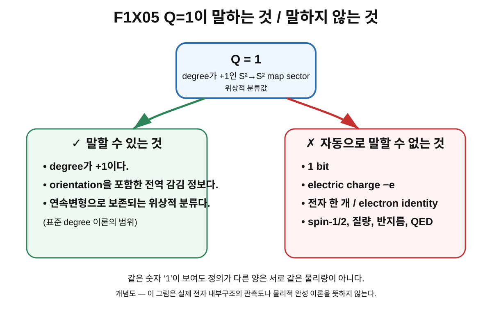

> **STATUS: DRAFT COMPLETE · PASS**
>
> 이 장은 독립 감사 PASS를 받았다. 과학적 경계와 proof-status는 frozen baseline을 따른다.

# 8장 · Q=1이 뜻하는 것과 뜻하지 않는 것

## 현재 상태

- **작성 상태:** DRAFT COMPLETE
- **감사 상태:** PASS
- **선행 장:** 제7장 「구를 몇 번 감았는가: degree Q」 — PASS
- **다음 허용 작업:** 제8장 독립 감사
- **아직 시작하지 않는 것:** 제9장 본문

---

## 이번 장에서 알아낼 질문

1. $Q=1$에서 숫자 **1**은 정확히 무엇을 뜻할까?
2. 왜 $Q=1$을 곧바로 **1 bit**라고 부르면 안 될까?
3. 왜 $Q=1$을 전자의 전기전하 **$-e$**와 같다고 하면 안 될까?
4. 왜 $Q=1$이라고 해서 **전자 한 개** 또는 **electron identity**가 자동으로 따라오지 않을까?
5. 서로 다른 양에 똑같이 숫자 1이 나타나도 왜 같은 물리량이 아닐까?
6. 그렇다면 Planck-S²에서 $Q=1$을 고르는 것은 아무 의미도 없는 선택일까?
7. $Q=1$에서 실제로 살아남는 수학적 의미는 무엇이고, 아직 OPEN인 물리적 연결은 무엇일까?

---

## 앞 장에서 배운 것

제7장에서는 연속 map

$$
n:S^2_{\rm domain}\to S^2_{\rm target}
$$

에 정수 **degree**를 붙일 수 있다는 것을 배웠다.

$$
Q=\deg(n)\in\mathbb Z.
$$

여기서 $Q$는 map 전체의 전역적 위상 정보를 나타낸다.

- $Q=0$: degree가 0인 sector
- $Q=+1$: orientation을 포함해 degree가 +1인 sector
- $Q=-1$: orientation을 뒤집는 degree −1의 대표적 경우
- $Q=2$: global degree가 2인 sector

또 degree는 map의 세부 모양을 조금씩 연속적으로 바꾸어도 쉽게 변하지 않는 **homotopy invariant**라는 점을 배웠다.

그리고 아주 중요한 경계도 배웠다.

> $Q$는 한 점의 값 $n(x)$가 아니다.
>
> $Q$는 map 전체에 붙는 전역적 정수다.

이번 장에서는 이 정수 **1**을 다른 종류의 “1”과 섞지 않는 법을 배운다.

---

## 왜 새로운 문제가 생겼을까?

수학과 물리에서는 같은 숫자가 여러 곳에 반복해서 등장한다.

예를 들어 다음 문장들은 모두 숫자 1을 포함할 수 있다.

- degree가 1이다.
- 정보량이 1 bit다.
- 입자가 1개다.
- 어떤 상태공간의 차원이 2라서 $\log_2 2=1$ bit라고 계산한다.
- 전하의 크기를 어떤 단위로 나누었더니 1이라고 쓸 수 있다.

겉으로 보면 전부 “1”이므로 서로 연결하고 싶어진다.

하지만 **숫자가 같다는 것과 물리량이 같다는 것은 전혀 다른 문제**다.

예를 들어 한 교실에

- 학생이 30명 있고,
- 온도가 30°C이고,
- 책상이 30개

라고 하자.

세 값은 모두 30이지만,

$$
30\;\text{명}\neq30^\circ\mathrm C\neq30\;\text{개}
$$

다.

숫자 모양만 같을 뿐, 무엇을 세는지와 정의가 다르기 때문이다.

$Q=1$에서도 똑같은 주의가 필요하다.

---

## 먼저 생각해 보기 · 숫자 1은 하나인데 뜻은 여러 개다

다음 네 문장을 비교해 보자.

### 문장 A

> 어떤 $S^2\to S^2$ map의 degree가 $Q=1$이다.

여기서 1은 **위상적 degree**의 값이다.

### 문장 B

> 어떤 시스템이 서로 완전히 구별되는 두 상태만 가진다면, 상태를 고르는 데 필요한 정보량을 $\log_2 2=1$ bit라고 표현할 수 있다.

여기서 1은 **정보량**의 단위 bit와 관련된 값이다.

### 문장 C

> 전자의 전기전하는 $q_e=-e$다.

여기서 $e$는 **전기전하의 물리적 단위와 결합 구조**에 관련된 양이다.

### 문장 D

> 상자 안에 전자가 한 개 있다.

여기서 1은 **입자 개수**다.

네 문장에 모두 1이 등장할 수 있지만, 서로 같은 정의가 아니다.

이 장의 가장 중요한 기술은 바로 이것이다.

> **숫자를 보기 전에 그 숫자가 무엇의 값인지 먼저 묻는다.**

---

## 그림으로 다시 보기 · F010의 Q=+1

**그림 F010. degree $Q=+1$의 대표적인 orientation-preserving $S^2\to S^2$ map 개념도 — 제7장 재사용**

### [이 그림에서 볼 것]

- domain $S^2$와 target $S^2$가 map으로 연결된다.
- 대표적인 degree-one map에서는 target의 regular point를 셀 때 전체 local contribution의 합이 $+1$이 된다.
- 그림의 숫자 1은 **degree**를 표시한다.

### [이 그림이 뜻하는 것]

이 map이 표준 degree 이론에서 $Q=+1$ sector에 속한다는 뜻이다.

### [이 그림이 뜻하지 않는 것]

이 그림만으로는 다음을 말할 수 없다.

- 정보량이 1 bit다.
- electric charge가 $-e$다.
- 전자가 한 개 존재한다.
- 이 map이 실제 전자의 내부장이다.
- spin이 자동으로 $1/2$다.
- 질량, 반지름, 자기모멘트가 전자와 일치한다.

이 경계가 이번 장의 핵심이다.

---

## 쉬운 비유 · 도서관 분류번호

도서관에 책 한 권이 있고 분류 스티커에 **1**이라고 적혀 있다고 하자.

그 숫자 1은 무엇을 뜻할까?

그것은 도서관이 정한 **분류 규칙 안에서의 번호**일 수 있다.

그런데 그 숫자를 보고 다음처럼 말하면 이상하다.

> “분류번호가 1이니까 이 책은 1쪽짜리야.”

또는

> “분류번호가 1이니까 가격은 1원일 거야.”

또는

> “분류번호가 1이니까 책 안에 글자가 하나뿐이야.”

모두 틀렸다.

분류번호, 페이지 수, 가격, 글자 수는 **서로 다른 규칙으로 정의된 양**이기 때문이다.

$Q=1$도 비슷하다.

$Q$는 map을 위상적으로 분류하는 degree다. 그 숫자가 1이라고 해서 정보량, 전기전하, 입자 개수까지 자동으로 1이 되는 것은 아니다.

### 비유의 한계

하지만 degree를 단순한 임의의 분류번호와 완전히 같다고 생각하면 안 된다.

도서관 분류번호는 사람이 마음대로 바꿀 수 있다. 반면 degree는 연속 map의 구조에서 정의되는 **수학적 위상 불변량**이다.

즉 비유가 알려주는 것은 오직 이것이다.

> **“같은 숫자가 붙었다고 서로 다른 정의의 양을 동일시하면 안 된다.”**

비유는 degree의 위상수학적 깊이까지 설명하지는 못한다.

---

## 그림으로 이해하기 · Q=1이 말하는 것 / 말하지 않는 것

**그림 F1X05. $Q=1$의 안전한 결론과 금지된 자동 등치를 분리한 개념도**

### [이 그림에서 볼 것]

왼쪽에는 $Q=1$에서 실제로 말할 수 있는 degree의 수학적 의미가 있다.

- degree가 +1이다.
- 전역적인 orientation/감김 정보를 갖는다.
- 같은 homotopy class 안의 연속변형에서 유지되는 위상적 분류다.

오른쪽에는 **자동으로 결론내릴 수 없는 것**이 있다.

- 1 bit
- electric charge $-e$
- electron identity
- spin-1/2
- 질량, 반지름, QED[^v1c08-qed] 성질

### [이 그림이 뜻하는 것]

$Q=1$이라는 한 문장을 다른 물리량들과 분리해서 읽어야 한다는 뜻이다.

### [이 그림이 뜻하지 않는 것]

오른쪽 항목들이 영원히 연결될 수 없다는 뜻은 아니다.

미래에 어떤 완성된 이론이

$$
Q=1\quad\Longrightarrow\quad\text{특정 전하, 특정 스핀, 특정 관측량}
$$

을 **추가 동역학과 물리적 연결법칙을 통해 유도**할 가능성 자체를 금지하는 것은 아니다.

다만 현재 Planck-S² 기준선에서는 그런 bridge가 증명되지 않았으므로 **자동 등치가 허용되지 않는다**는 뜻이다.

---

## 실제 수학에서는 · 먼저 “무엇의 함수인가?”를 묻는다

서로 다른 양을 섞지 않으려면 정의를 나란히 놓으면 된다.

### 1. degree

$$
Q=\deg(n).
$$

$Q$는 map

$$
n:S^2\to S^2
$$

전체에 붙는 정수다.

이 수는 map의 위상적 homotopy class를 분류한다.

### 2. 정보량

아주 단순한 유한 상태 예에서, 서로 구별 가능한 상태가 $d$개라면 상태 수와 관련한 정보량을

$$
I=\log_2 d
$$

처럼 쓸 수 있다.[^v1c08-log-state-count]

예를 들어 $d=2$이면

$$
I=\log_2 2=1\;\text{bit}.
$$

여기서 중요한 점은 **$I$를 계산하려면 상태 수 $d$가 필요하다**는 것이다.

$Q=1$이라는 사실만으로는 $d=2$가 나오지 않는다.

따라서

$$
Q=1
$$

과

$$
I=1\;\text{bit}
$$

은 정의부터 다르다.

### 3. electric charge

전자의 전기전하는 보통

$$
q_e=-e
$$

라고 쓴다.

이것은 전자기적 상호작용에서의 전하를 뜻한다.

$Q$는 $S^2\to S^2$ map의 degree이고, $q_e$는 전자기적 charge다.

기호도, 정의도, 측정되는 물리적 역할도 다르다.

현재 프로젝트에서

$$
Q=1\stackrel{?}{\Longrightarrow}q_e=-e
$$

를 만드는 물리적 bridge는 **OPEN**이다.

### 4. 입자 개수

입자 수를 $N$이라고 쓰면

$$
N=1
$$

은 어떤 계에 입자가 한 개 있다는 의미가 될 수 있다.

하지만

$$
Q=1
$$

은 map의 degree가 1이라는 의미다.

따라서

$$
Q=1\neq N=1
$$

이라고 읽어야 한다.

물론 어떤 특정 이론에서 topological charge[^v1c08-topological-charge] 하나를 soliton[^v1c08-soliton] 하나와 연결하는 구조가 있을 수 있다. 그러나 그 경우에도 **그 연결은 별도의 이론적 정의와 동역학을 통해 증명해야 한다.** 숫자 1이 같기 때문에 자동으로 생기는 연결이 아니다.

---

## 왜 “Q=1 = 1 bit”가 특히 위험한가

이 프로젝트의 연구 발전사에서는 정보량과 상태수 문제가 실제로 중요한 감사 대상이 되었다.

초기에 “1”이라는 숫자를 정보량과 연결하려는 직관이 등장했지만, 후속 연구와 감사에서는 **degree와 상태수/힐베르트공간 차원을 분리해야 한다**는 점이 명확해졌다.

canonical proof ledger는 현재 다음을 고정한다.

> **$Q=1=1$ bit — FALSIFIED AS WRITTEN**

이 판정은 아주 정확하게 읽어야 한다.

“정보량이라는 질문을 연구하면 안 된다”는 뜻이 아니다.

뜻은 다음과 같다.

> $Q=1$이라는 topological degree만 보고, 별도의 상태공간 계산 없이 곧바로 정보량이 1 bit라고 결론내리는 문장은 그대로는 틀렸다.

정보량을 말하려면 적어도 무엇을 상태로 세는지, 어떤 Hilbert space[^v1c08-hilbert-space] 또는 유효 상태공간을 사용하는지, 독립 상태가 몇 개인지 등을 별도로 정해야 한다.

이 문제는 뒤의 제3권에서 rotor state counting과 함께 더 깊게 다룬다.

---

## “Q=1 = charge −e”도 왜 아직 OPEN인가

전기전하는 단순한 정수 라벨이 아니다.

실제 전자 이론에서 charge $-e$를 설명하려면 적어도 전자기적 $U(1)$[^v1c08-em-u1] 구조와 그 장에 대한 coupling[^v1c08-coupling]을 다뤄야 한다.

Planck-S²의 현재 frozen baseline에서 $Q$는

$$
S^2\to S^2
$$

map의 degree다.

그러나 전자기적 charge를 얻으려면 다음과 같은 질문이 추가로 필요하다.

- 어떤 $U(1)$ gauge field[^v1c08-gauge-field]와 결합하는가?
- 그 coupling constant[^v1c08-coupling-constant]는 어떻게 정해지는가?
- 왜 전하의 부호가 음수인가?
- 왜 크기가 정확히 $e$인가?
- 이 전하가 표준 QED의 전하와 동일한 observable인가?

현재 기준선에서는 이 bridge가 닫히지 않았다.

따라서 현재 판정은

> **$Q=1=$ electric charge $-e$: OPEN**

이다.

---

## “Q=1 = 전자 한 개”도 자동으로 말할 수 없다

이 부분도 매우 중요하다.

Planck-S²의 이름과 연구 목표 때문에 독자는 쉽게 이렇게 생각할 수 있다.

> “전자 후보를 만들려고 Q=1을 골랐으니 Q=1 자체가 전자라는 뜻 아닌가?”

아니다.

현재 단계에서 $Q=1$은 **전자 후보 모델을 탐색하기 위해 선택한 topological sector**다.

실제 전자라는 정체성을 얻으려면 훨씬 많은 물리적 조건이 필요하다.

예를 들어 최소한 다음 질문들이 남는다.

- charge가 정말 $-e$인가?
- spin-1/2가 완전히 유도되는가?
- Lorentz covariance가 성립하는가?
- Dirac dynamics와 어떤 관계인가?
- QED와 일치하는가?
- Fermi statistics[^v1c08-fermi-statistics]와 Pauli exclusion[^v1c08-pauli-exclusion]이 나오는가?
- 질량이 전자 질량과 연결되는가?
- 크기나 form factor가 실험 제한과 맞는가?
- magnetic moment와 $g$-factor를 설명하는가?
- 표준 이론과 구별되는 예측이 있는가?

현재 이 연결들은 대부분 **OPEN**이다.

그러므로

$$
Q=1\quad\text{sector}
$$

와

$$
\text{physical electron}
$$

사이에는 아직 많은 다리가 필요하다.

---

## Planck-S²에서는 · Q=1은 무엇을 위해 선택되었나

여기서 반대로 너무 멀리 가서 “그러면 $Q=1$은 아무 의미도 없네”라고 생각해도 안 된다.

$Q=1$은 분명 수학적으로 의미가 있다.

Planck-S²의 초기 연구 흐름에서는 후보장

$$
n:S^2\to S^2
$$

의 degree-one sector를 중심으로 configuration space와 topology를 연구했다.

즉 $Q=1$을 고르면

- degree가 다른 sector들과 분리된 특정 위상 sector를 다룰 수 있고,
- 그 sector 내부의 configuration들을 모아 configuration space를 만들 수 있으며,
- 이후 loop와 homotopy, $\pi_1$, FR 양자화 후보를 조사할 출발점이 된다.

따라서 $Q=1$은 프로젝트의 수학적 구조에서 **중요한 모델 선택**이다.

하지만 이 중요성을 다음과 같이 과장하면 안 된다.

> “중요한 sector다”
>
> $\neq$
>
> “실제 전자의 모든 성질이 이미 들어 있다.”

---

## 당시 연구에서는 무엇을 얻었나

프로젝트의 초기 연구는 $S^2\to S^2$ 후보장을 도입하고 degree $Q$를 이용해 sector를 나누는 방향으로 발전했다.

그 과정에서 $Q=1$ sector가 중심 연구 대상으로 선택되었다.

이 선택 덕분에 이후에는

- degree-one configuration들의 공간,
- $\mathrm{Map}_1(S^2,S^2)$,
- 그 안의 path와 loop,
- 기본군 후보,
- 회전 loop와 FR 양자화 후보

같은 질문을 구체적으로 던질 수 있게 되었다.

즉 $Q=1$의 가장 확실한 역할은 **연구할 configuration sector를 지정했다는 것**이다.

---

## 후속 감사에서는 무엇이 바뀌었나

후속 감사의 가장 중요한 역할은 “Q=1이라는 숫자에 너무 많은 물리적 의미를 한꺼번에 얹는 것”을 막은 것이다.

현재 canonical baseline에서는 다음을 분리한다.

| 주장 | 현재 판정 |
|---|---|
| degree라는 표준 수학적 개념 | **SOURCE VERIFIED** |
| Planck-S²가 $Q=1$ sector를 후보로 선택 | **CONDITIONAL · PROJECT MODEL CHOICE** |
| $Q=1=1$ bit | **FALSIFIED AS WRITTEN** |
| $Q=1=$ charge $-e$ | **OPEN** |
| $Q=1=$ 실제 전자 identity | **OPEN** |
| 실제 전자가 physical $n$-field와 $Q=1$ sector를 가진다 | **OPEN** |
| 전체 Planck-S² | **WORKING HYPOTHESIS** |

이 표가 이번 장의 결론이다.

---

## 현재 판정

### SOURCE VERIFIED

표준 degree 이론에서 $Q=\deg(n)$는 $S^2\to S^2$ map의 위상적 정수 불변량으로 사용할 수 있다.

쉬운 번역:

> **“Q가 무엇을 세는 수인지는 표준 수학으로 알려져 있어요.”**

### CONDITIONAL · PROJECT MODEL CHOICE

Planck-S²가 전자 후보 연구를 위해 $Q=1$ sector를 선택한다.

쉬운 번역:

> **“이 프로젝트는 우선 Q=1인 경우를 연구 대상으로 골랐어요.”**

### FALSIFIED AS WRITTEN

$$
Q=1=1\;\text{bit}
$$

이라고 직접 동일시하는 주장.

쉬운 번역:

> **“예전에 숫자 1을 정보량 1 bit와 바로 같은 것으로 읽는 방식은 그대로는 틀렸어요.”**

### OPEN

$$
Q=1\Longrightarrow q_e=-e
$$

및 실제 전자 identity와의 연결.

쉬운 번역:

> **“Q=1이 실제 전자의 전하와 정체성으로 어떻게 이어지는지는 아직 모릅니다.”**

### WORKING HYPOTHESIS

전체 Planck-S² 전자 가설.

쉬운 번역:

> **“일부 수학 구조를 시험 중인 연구 가설이지, 완성된 전자 이론은 아닙니다.”**

---

## 이것으로 말할 수 있는 것

현재 우리는 안전하게 다음을 말할 수 있다.

1. $Q=1$은 degree-one $S^2\to S^2$ map sector를 뜻한다.
2. degree는 표준 위상수학에서 정의되는 정수 불변량이다.
3. Planck-S²는 이 $Q=1$ sector를 후보 연구 대상으로 선택했다.
4. 이후 configuration-space topology를 연구하려면 어느 degree sector를 볼지 정해야 하므로 이 선택은 수학적으로 중요하다.
5. 서로 다른 물리량에 같은 숫자 1이 나타난다고 해서 동일한 양은 아니다.

---

## 이것으로 말할 수 없는 것

현재 $Q=1$만으로는 다음을 말할 수 없다.

1. 정보량이 1 bit다.
2. electric charge가 $-e$다.
3. 입자가 정확히 한 개다.
4. 그 입자가 전자다.
5. spin이 정확히 $1/2$다.
6. 실제 전자가 2차원 $S^2$ 내부공간을 가진다.
7. 실제 전자의 physical configuration space가 ideal $\mathrm{Map}_1(S^2,S^2)$와 같다.
8. 전자 질량, 반지름, magnetic moment, form factor가 나온다.
9. QED가 유도된다.

이 목록은 “절대로 불가능하다”는 뜻이 아니다.

현재 프로젝트에서 **아직 유도되지 않았다**는 뜻이다.

---

## 오해 방지 상자

> ### Q=1에 붙이면 안 되는 등호
>
> $$
> Q=1\neq 1\;\text{bit}
> $$
>
> $$
> Q=1\neq q_e=-e
> $$
>
> $$
> Q=1\neq \text{electron identity}
> $$
>
> $$
> Q=1\neq \text{particle number }1
> $$
>
> **Q는 degree다.**
>
> 다른 물리량과의 연결이 필요하다면 별도의 물리적 bridge를 유도해야 한다.

---

## 자주 하는 오해

### 오해 1 · “Q=1이면 숫자가 1이니까 1 bit 아닌가?”

아니다. bit는 상태 수나 확률분포 등 정보론적 정의가 필요하다. degree의 숫자 1과는 정의가 다르다.

### 오해 2 · “topological charge라고 부르면 electric charge 아닌가?”

아니다. 물리학에서 “charge”라는 단어는 여러 보존량에 넓게 쓰일 수 있다. topological charge와 electromagnetic $U(1)$ charge는 자동으로 같은 양이 아니다.

### 오해 3 · “Q=1 sector면 soliton 하나라는 뜻 아닌가?”

특정 모델에서는 topological sector와 soliton counting 사이에 관계가 있을 수 있지만, 그 관계는 모델의 에너지·경계조건·동역학을 따로 분석해야 한다. degree 숫자만으로 실제 입자 수를 결정할 수 없다.

### 오해 4 · “Q=1이 전자를 뜻하지 않으면 왜 연구하는가?”

전자 후보가 될 수 있는 구조를 시험하기 위해 먼저 특정 위상 sector를 고른 것이다. 후보를 고르는 것과 후보가 실제 전자임을 증명하는 것은 다른 단계다.

### 오해 5 · “FALSIFIED AS WRITTEN이면 프로젝트 전체가 틀렸다는 뜻인가?”

아니다. 특정 문장 또는 등치가 그대로는 틀렸다는 뜻이다. degree-one sector 자체의 표준 수학적 의미는 그대로 남는다.

---

## 다음 장이 필요한 이유

이제 우리는 $Q=1$을 정확히 읽을 수 있다.

하지만 아직 중요한 질문이 남아 있다.

> $Q=1$인 **하나의 장 전체**를 무엇이라고 부를까?

그리고

> 가능한 $Q=1$ 장들이 아주 많이 있다면, 그중 하나와 “가능한 모든 장의 집합”을 어떻게 구분할까?

이 질문에서 **configuration**이라는 말이 등장한다.

제9장에서는

- domain의 한 점 $x$,
- 한 점의 field value $n(x)$,
- 장 전체 $n$,
- 하나의 configuration

을 정확히 구분한다.

제8장의 독립 감사가 PASS되기 전에는 제9장 본문을 시작하지 않는다.

---

## 한 문장 기억

> **$Q=1$은 degree가 1이라는 뜻이다. 숫자가 같다는 이유만으로 1 bit, charge $-e$, 전자 한 개와 같은 것으로 바꿀 수 없다.**

---

## 용어 카드

| 용어 | 이 장에서의 뜻 |
|---|---|
| **degree $Q$** | $S^2\to S^2$ map 전체에 붙는 정수 위상 불변량 |
| **$Q=1$ sector** | degree가 +1인 map들의 부류/연구 sector |
| **bit** | 정보량의 단위; degree와 정의가 다름 |
| **state count $d$** | 구별 가능한 상태 수; 단순 경우 정보량 $\log_2 d$와 연결 가능 |
| **electric charge $q_e$** | 전자기적 상호작용과 관련된 물리량; 전자에서는 $-e$ |
| **particle number** | 계에 몇 개의 입자가 있는지를 세는 수; degree와 별개 |
| **electron identity** | 전자의 전체 물리적 성질을 만족한다는 정체성 주장; $Q=1$만으로는 미도출 |
| **model choice** | 이론을 탐색하기 위해 특정 구조나 sector를 연구 대상으로 선택하는 것 |
| **bridge** | 서로 다른 수학/물리 구조를 실제 이론 안에서 연결해 주는 추가 유도 |

---

## 확인문제

### 문제 1

$Q=1$의 숫자 1은 무엇을 뜻하는가?

A. 1 bit  
B. 전자 한 개  
C. $S^2\to S^2$ map의 degree가 +1  
D. 전기전하가 $-e$

### 문제 2

어떤 시스템의 상태 수가 $d=2$라서 $\log_2d=1$ bit가 나왔다. 이것만으로 그 시스템의 degree가 $Q=1$이라고 말할 수 있는가?

### 문제 3

$Q=1$과 $q_e=-e$를 직접 동일시하려면 무엇이 추가로 필요한가?

### 문제 4

다음 중 현재 canonical 판정이 `FALSIFIED AS WRITTEN`인 것은?

A. degree는 정수다.  
B. $Q=1=1$ bit.  
C. 실제 전자 charge와 $Q$의 연결은 OPEN이다.  
D. 전체 Planck-S²는 WORKING HYPOTHESIS다.

### 문제 5

“Q=1 sector를 연구한다”와 “Q=1이 실제 전자임을 증명했다”는 같은 말인가?

### 문제 6

도서관 분류번호 비유의 좋은 점과 한계를 각각 한 가지씩 말해 보자.

### 문제 7

다음 세 식이 서로 다른 종류의 양이라는 것을 설명하라.

$$
Q=1,
$$

$$
I=\log_2 2=1\;\text{bit},
$$

$$
q_e=-e.
$$

### 문제 8

현재 $Q=1$ sector에서 안전하게 말할 수 있는 것 두 가지와, 아직 말할 수 없는 것 두 가지를 적어 보자.

---

## 정답과 설명

### 1번 정답: C

$Q$는 degree다. 숫자 1은 map의 전역적 위상 분류값을 뜻한다.

### 2번 정답: 말할 수 없다

$d=2$는 상태 수에 관한 정보이고 $Q$는 map의 degree다. 둘을 연결하는 별도 정리가 없다면 서로 독립된 정의다.

### 3번 정답

적어도 $Q$와 전자기적 $U(1)$ charge 사이의 물리적 bridge가 필요하다. coupling, 부호, normalization[^v1c08-normalization], observable identification 등을 별도로 유도해야 한다.

### 4번 정답: B

canonical proof ledger는 $Q=1=1$ bit라는 등치를 **FALSIFIED AS WRITTEN**으로 기록한다.

### 5번 정답: 아니다

첫 문장은 연구 대상을 고른 모델 선택이다. 두 번째 문장은 실제 전자 정체성을 확립했다는 훨씬 강한 물리적 주장이다.

### 6번 예시 답

좋은 점: 같은 숫자라도 무엇을 분류하는지 다르면 같은 양이 아니라는 점을 보여 준다.  
한계: degree는 사람이 임의로 붙인 번호가 아니라 homotopy에 보존되는 수학적 불변량이다.

### 7번 예시 답

- $Q=1$: map의 degree
- $I=1$ bit: 상태 수에서 계산한 정보량
- $q_e=-e$: 전자기적 charge

숫자나 기호 일부가 비슷해도 정의와 물리적 역할이 다르다.

### 8번 예시 답

말할 수 있는 것:

- degree가 +1이다.
- Planck-S²가 이 sector를 후보 연구 대상으로 선택했다.

말할 수 없는 것:

- 1 bit라는 것.
- 실제 전자의 electric charge $-e$가 자동으로 나온다는 것.

그 밖에 electron identity, spin-1/2 완성, 질량, QED 연결도 현재는 자동으로 말할 수 없다.

---

## 이 장의 근거 자료

| 자료 | 위치/역할 | 종류 |
|---|---|---|
| **G05 — Planck-S² 양자입자 가설 v0.5** | §2, §12, §14; $Q=1$ sector와 정보량 문제의 연구 맥락 | [일반 연구] |
| **G06 — 전자 정보량 계산 보고서 v0.1** | 상태수/정보량 문제의 역사적 연구 자료; 후속 감사와 함께 읽음 | [일반 연구] |
| **A01 — 일반연구 MASTER 전수 적대적 논리감사 v1.0** | G05/G06의 정보량·상태수 주장 감사 및 Q=1 확대해석 제한 | [적대적 감사] |
| **sources/proof-status.md** | $Q=1=1$ bit = FALSIFIED AS WRITTEN, $Q=1=$ charge $-e$ = OPEN의 canonical 판정 | [프로젝트 상태] |
| **제7장 degree 감사 완료본** | degree의 표준 수학적 의미를 SOURCE VERIFIED로 전달하는 선행 장 | [교과서 선행 장] |

> 이 source ledger는 $Q=1$을 실제 전자로 증명하는 자료 목록이 아니다. 각 source가 뒷받침하는 범위만 사용한다.

---

## 제8장 제작 기록

- **OUTLINE 계약:** `volume-1/08-q1-meaning.md` 기존 placeholder
- **필수 재사용 그림:** F010
- **추가 그림:** F1X05
- **핵심 경계:** $Q=1\neq1$ bit, $Q=1\neq$ charge $-e$, $Q=1\neq$ electron identity
- **표준 degree:** SOURCE VERIFIED — 제7장 독립 감사 PASS 결과를 선행 입력으로 사용
- **Planck-S² $Q=1$ 선택:** CONDITIONAL · PROJECT MODEL CHOICE
- **실제 electron bridge:** OPEN
- **전체 이론:** WORKING HYPOTHESIS
- **작성자 자체 최종 PASS:** 부여하지 않음
- **현재 상태:** DRAFT COMPLETE · PASS
- **독립 감사:** PASS — 2026-08-29
- **후속 상태:** Chapters 9–12 batch audit completed separately

[^v1c08-qed]: quantum electrodynamics(양자전기역학). 전자와 빛(전자기장)의 상호작용을 기술하는 표준 양자장이론이다. 이 장에서는 Planck-S²가 QED와 아직 연결되지 않았다는 경계를 말할 때만 사용한다.

[^v1c08-log-state-count]: 이 식은 일반적인 확률분포의 Shannon entropy 전체 정의가 아니다. 서로 구별 가능한 $d$개 상태를 같은 후보로 놓는 단순한 유한 상태 그림에서의 로그 상태수, 즉 최대 상태 식별 정보의 예로만 사용한다.

[^v1c08-topological-charge]: 장이나 map의 전역적 위상 구조에서 정의되는 보존량 또는 분류값을 가리키는 말. 이름에 charge가 들어가도 전기전하와 자동으로 같은 양은 아니다.

[^v1c08-soliton]: 비선형 장이론에서 모양을 유지하는 국소화된 해를 가리키는 말. 어떤 위상 sector가 soliton 하나와 대응하는지는 모델의 동역학을 따로 확인해야 한다.

[^v1c08-hilbert-space]: 양자상태를 벡터처럼 다루기 위해 사용하는 상태공간. 어떤 상태들을 서로 독립으로 세는지는 이 공간과 물리적 제약을 정한 뒤 판단해야 한다.

[^v1c08-em-u1]: $U(1)$은 위상 하나로 표현되는 회전 대칭의 수학적 군이다. 전자기학에서는 이 대칭이 전하와 전자기 gauge 구조를 기술하는 데 사용되지만, Planck-S²의 degree $Q$와 자동으로 동일하지 않다.

[^v1c08-coupling]: 두 자유도나 장이 서로 얼마나, 어떤 방식으로 상호작용하는지를 이론 안에 연결하는 것을 뜻한다.

[^v1c08-gauge-field]: 위치마다 정한 내부 기준의 변화에 맞추어 물리 법칙을 일관되게 만드는 장. 전자기학에서는 전자기 퍼텐셜이 $U(1)$ gauge field의 역할을 한다.

[^v1c08-coupling-constant]: 상호작용의 세기를 정하는 계수. 어떤 이론에서 그 값과 부호가 무엇인지 별도로 정하거나 유도해야 한다.

[^v1c08-fermi-statistics]: 서로 같은 fermion 여러 개를 바꾸어 놓았을 때 양자상태가 특정 부호 규칙을 따르는 통계적 성질. 단일 입자의 회전 성질만으로 자동 확정되는 내용은 아니다.

[^v1c08-pauli-exclusion]: 같은 종류의 fermion 두 개가 완전히 같은 단일입자 양자상태를 동시에 차지할 수 없다는 원리. 여기서는 Planck-S²가 아직 이 다입자 성질을 유도하지 않았다는 경계로 등장한다.

[^v1c08-normalization]: 어떤 양의 전체 크기나 기준 단위를 맞추기 위해 계수를 정하는 절차. 여기서는 $Q$에서 실제 전하의 정확한 크기 $e$를 얻으려면 그 비례 기준까지 별도로 정해져야 한다는 뜻이다.
