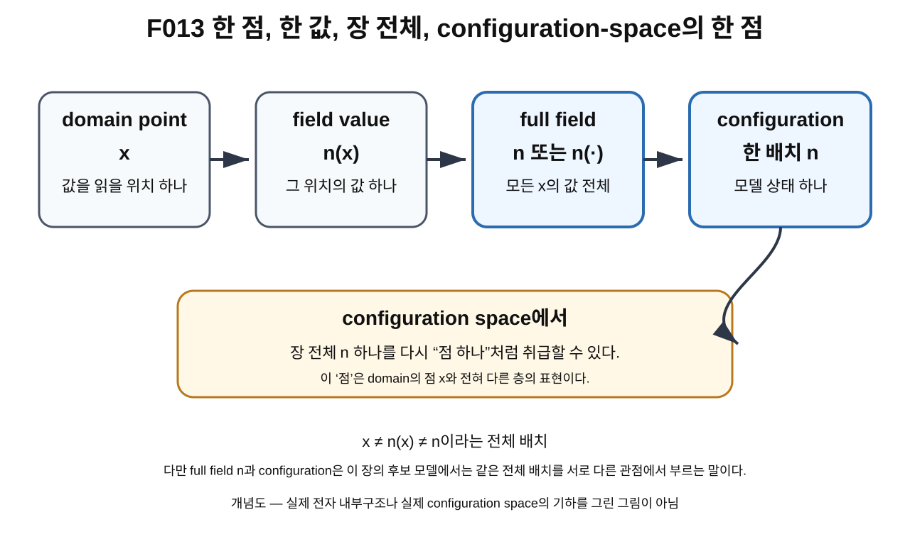

> **STATUS: DRAFT COMPLETE · AUDIT PENDING**
>
> OVERNIGHT BATCH DRAFT MODE에서 작성한 초안이다. 작성 Chat은 PASS를 부여하지 않는다. 제8~12장은 순차 독립 감사가 필요하다.

# 9장 · configuration: 화살표 전체 배치 하나

## 현재 상태

- **작성 상태:** DRAFT COMPLETE
- **감사 상태:** AUDIT PENDING
- **선행 장 사용 방식:** 제8장 초안과 frozen baseline을 참고하되, 미감사 내용을 새 확정 사실로 승격하지 않는다.
- **다음 배치 대상:** 제10장 DRAFT
- **과학적 경계:** 실제 physical configuration의 ontology는 **OPEN**

---

## 이번 장에서 알아낼 질문

1. domain의 한 점 $x$와 그 점의 값 $n(x)$는 어떻게 다를까?
2. 장 전체 $n$은 한 점의 값과 어떻게 다를까?
3. **configuration**[^v1c09-configuration] 하나란 무엇일까?
4. 왜 하나의 field configuration 전체를 나중에는 configuration space의 “점 하나”라고 부를 수 있을까?
5. domain의 점과 configuration-space의 점은 왜 완전히 다른 층의 말일까?
6. Planck-S²에서 configuration 언어를 쓰는 것과 실제 전자의 물리 상태를 확정하는 것은 왜 다른가?

---

## 앞 장에서 배운 것

제5장에서는 장(field)을 “공간의 각 점에 값을 붙이는 규칙 전체”로 배웠다. 제6장에서는

$$
n:S^2_{\rm domain}\to S^2_{\rm target}
$$

을 읽었고, 제7장과 제8장에서는 map 전체에 붙는 degree $Q$와 $Q=1$의 의미 경계를 배웠다.

이제 표현의 층을 정확히 나눌 수 있다.

- $x$ : domain의 점 하나
- $n(x)$ : 그 점에서의 field value 하나
- $n$ : 모든 domain 점의 값을 포함하는 장 전체

이번 장에서 새로 붙이는 이름이 **configuration**이다.

후보 모델에서 한 번의 “전체 상태 배치”를 나타내는 장 $n$ 하나를 하나의 configuration이라고 부를 수 있다.

---

## 왜 새로운 문제가 생겼을까?

지금까지 그림에는 구 위에 많은 화살표가 등장했다.

그런데 화살표 하나만 보고서는 장 전체를 알 수 없다. 어떤 점 $x_0$에서

$$
n(x_0)
$$

를 하나 아는 것은 지도에서 한 장소의 바람 방향 하나를 아는 것과 비슷하다.

하지만 연구에서 필요한 것은 종종 “그 순간 가능한 전체 배치 하나”다.

예를 들어 구 위의 모든 점에서 방향이 어떻게 정해져 있는지를 한꺼번에 고정했다고 하자. 그러면 우리는 하나의 완전한 장 배치를 얻는다.

바로 이 전체 배치를 configuration이라고 부른다.

---

## 먼저 생각해 보기 · 체스판의 말 하나와 판 전체

체스판을 생각해 보자.

- 특정 칸 하나: 위치 하나
- 그 칸에 놓인 말 하나: 그 위치의 값에 비유 가능
- 모든 말이 어디에 놓였는지 적은 전체 판 배치: 게임 상태 하나

체스에서 “e4 칸” 하나와 “e4에 백 폰이 있다”는 문장은 다르다. 그리고 이것들은 “현재 체스판 전체 상태”와도 다르다.

field에서도 비슷하다.

- $x$는 위치
- $n(x)$는 그 위치의 값
- $n$은 모든 위치의 값을 함께 적은 전체 배치

이다.

### 비유의 한계

체스판에는 유한한 칸과 말이 있다. 반면 연속적인 field는 보통 domain의 연속적으로 많은 점에 값을 붙인다. 그래서 가능한 field configuration 전체를 다루는 공간은 보통 유한한 몇 개 좌표만으로는 표현되지 않으며, 뒤 장에서는 function space[^v1c09-function-space] 또는 무한차원 공간이라는 언어가 필요해진다.

또 체스 규칙에서 가능한 배치와 물리 이론에서 허용되는 configuration은 같은 개념이 아니다. 물리 이론에서는 경계조건, 에너지, 정칙성 등 추가 조건이 들어갈 수 있다.

---

## 그림으로 이해하기 · F013

**그림 F013. domain의 점 $x$, 한 점의 값 $n(x)$, 장 전체 $n$, configuration이라는 표현 층의 차이 — 개념도, 실제 크기/비율 아님**

### [이 그림에서 볼 것]

1. $x$는 값을 읽는 domain 위치 하나다.
2. $n(x)$는 그 위치에서의 출력값 하나다.
3. $n$ 또는 $n(\cdot)$는 모든 $x$의 값을 포함하는 field 전체다.
4. 후보 모델에서 이 field 전체 하나를 하나의 configuration으로 볼 수 있다.
5. 다음 장에서는 이 configuration 하나를 configuration space의 “점 하나”처럼 취급한다.

### [이 그림이 뜻하는 것]

같은 “점”이라는 단어라도 어떤 공간의 점인지에 따라 의미가 다르다는 것을 보여 준다. domain의 점 $x$와 configuration-space에서의 한 점은 서로 다른 수학적 층에 있다.

### [이 그림이 뜻하지 않는 것]

- $x$, $n(x)$, $n$이 서로 완전히 무관한 네 개의 물리 물체라는 뜻이 아니다.
- full field $n$과 configuration을 이 장의 모델 언어에서 서로 다른 두 상태로 세라는 뜻도 아니다. 같은 전체 배치를 “함수” 관점과 “상태” 관점에서 부르는 표현이다.
- configuration space가 그림처럼 실제 2차원 방이나 박물관으로 생겼다는 뜻이 아니다.
- 이 그림이 실제 전자의 물리 configuration을 관측했다는 뜻은 아니다.

---

## 실제 수학에서는 · 기호를 층별로 읽기

### 1. domain point

$$
x\in S^2_{\rm domain}
$$

는 입력 위치 하나다.

### 2. field value

$$
n(x)\in S^2_{\rm target}
$$

는 그 입력 위치에 대응하는 값 하나다.

### 3. full field

$$
n:S^2_{\rm domain}\to S^2_{\rm target}
$$

는 모든 $x$에 대해 $n(x)$가 어떻게 정해지는지를 포함한다.

함수의 입력 자리를 비워 둔다는 뜻으로

$$
n(\cdot)
$$

라고 써서 “함수 전체”임을 강조하기도 한다.

### 4. configuration

이 책의 후보 field 모델에서는 특정한 전체 장

$$
n(\cdot)
$$

하나를 **configuration 하나**로 부른다.

즉 이 장에서

$$
\text{configuration}=\text{허용된 full field 하나}
$$

라는 언어를 사용한다.

다만 “허용된”이라는 말에는 이후 중요한 문제가 숨어 있다. 모든 수학적 map을 허용할지, finite-energy[^v1c09-finite-energy] 조건을 넣을지, 어떤 함수공간을 택할지, 물리적으로 같은 상태를 quotient할지 등은 아직 별도 문제다.

---

## domain의 한 점 ≠ field value 하나 ≠ field 전체

이 구분을 표로 잠그자.

| 표현 | 무엇인가? | 예시 질문 |
|---|---|---|
| $x$ | domain의 입력점 하나 | “어디에서 값을 읽는가?” |
| $n(x)$ | 그 점의 field value 하나 | “그 위치에서 방향은 무엇인가?” |
| $n$ 또는 $n(\cdot)$ | field 전체 | “모든 위치의 값 배치는 어떻게 되어 있는가?” |
| configuration 하나 | 모델의 전체 field 배치 하나 | “가능한 전체 상태 하나는 무엇인가?” |

여기서 $n$과 configuration은 이 장의 후보 모델에서 같은 전체 배치를 가리킬 수 있다. 하지만 단어의 역할은 다르다.

- **field**라고 부를 때는 “점마다 값을 주는 함수”라는 구조를 강조한다.
- **configuration**이라고 부를 때는 “가능한 전체 상태 하나”라는 역할을 강조한다.

---

## configuration-space의 “점 하나”라는 말은 왜 나오나?

다음 장에서 가능한 configuration들을 전부 모아 새로운 공간을 만든다고 하자.

그 공간에서는 각 configuration 전체를 하나의 원소로 취급한다.

그러면

$$
n_0,\;n_1,\;n_2,\ldots
$$

같은 서로 다른 full field 각각이 새 공간의 “점” 역할을 한다.

여기서 매우 중요한 문장이 나온다.

> **configuration-space의 한 점은 domain의 한 점이 아니라, field 전체 하나다.**

이 표현은 처음 보면 이상하다. “구 전체의 화살표 수없이 많은 배치가 어떻게 점 하나야?”라고 생각할 수 있다.

하지만 수학에서 공간의 “점”은 꼭 작은 물리적 점이어야 하는 것이 아니다. 어떤 집합의 원소를 새로운 공간의 점으로 부를 수 있다.

예를 들어 함수들의 집합을 공간처럼 다룰 때 함수 하나가 그 공간의 점이 된다.

---

## Planck-S²에서는

frozen baseline의 G02/G03 연구 흐름은 후보장

$$
n:S^2\to S^2
$$

를 도입한 뒤, degree $Q=1$인 configuration들을 모아 mapping space를 연구하는 방향으로 진행했다.

여기서 안전하게 말할 수 있는 것은 다음 정도다.

- 프로젝트가 field 전체 하나를 configuration으로 다루는 수학 언어를 사용했다.
- $Q=1$인 configuration들을 한 sector에서 연구했다.
- 이후 configuration space, path, loop를 조사하는 출발점이 되었다.

그러나 다음은 아직 말할 수 없다.

- 모든 smooth $S^2\to S^2$ map이 실제 물리상태다.
- actual physical electron configuration space가 ideal mapping space와 정확히 같다.
- 물리적으로 중복된 target 자유도를 quotient해야 하는지 이미 끝났다.

이 문제는 canonical proof ledger에서 **OPEN**이다.

---

## 당시 연구에서는 무엇을 얻었나

### G02

G02는 $n:S^2\to S^2$와 degree $Q=1$을 사용하면서 단순히 한 점의 방향이 아니라 **field 전체**를 연구 대상으로 바꾸었다.

이 변화가 중요했던 이유는 topology를 한 점의 값이 아니라 configuration 전체에 적용할 수 있게 했기 때문이다.

### G03

G03은 이런 configuration들을 모은 공간에서 경로와 loop를 연구하는 방향으로 나아갔다.

하지만 이 장에서는 아직 그 loop의 특정 위상 분류나 회전 generator를 증명하지 않는다. 우선 “configuration 하나가 무엇인가”만 고정한다.

---

## 후속 감사에서는 무엇이 바뀌었나

A01과 C02를 반영한 현재 proof ledger는 **ideal mapping space와 actual physical configuration space의 동일성**을 OPEN으로 유지한다.

따라서 configuration이라는 수학 언어 자체는 사용할 수 있지만, 어떤 configuration들이 진짜 물리상태인지에 대해서는 아직 다음 문제가 남는다.

- finite-energy 조건
- 적절한 completion[^v1c09-completion]
- physical quotient[^v1c09-quotient]
- EFT-valid subset[^v1c09-eft-subset]
- 실제 observable과의 연결

이 조건들이 어떻게 정해지는지는 뒤 권의 Gate 문제와 연결된다.

---

## 현재 판정

| 주장/항목 | 상태 | 정확한 범위 |
|---|---|---|
| full field 하나를 configuration 하나로 부르는 언어 | **SOURCE VERIFIED / MODELING LANGUAGE** | 장·함수공간에서 사용하는 표준적인 상태 기술 언어 |
| G02/G03가 $Q=1$ field configuration을 후속 topology 연구 대상으로 사용 | **SOURCE VERIFIED AS PROJECT HISTORY** | 프로젝트 문서가 사용한 연구 언어 |
| Planck-S²가 $Q=1$ sector를 후보 모델로 선택 | **CONDITIONAL · PROJECT MODEL CHOICE** | 실제 전자와의 동일성은 별도 |
| actual physical configuration space = ideal $\mathrm{Map}_1(S^2,S^2)$ | **OPEN** | completion/finite-energy/quotient/EFT-valid subset/ontology 미폐쇄 |
| 실제 전자가 이 configuration 가운데 하나로 기술됨 | **OPEN** | 물리적 bridge 미완성 |
| Planck-S² 전체 | **WORKING HYPOTHESIS** | 전체 전자 이론 미완성 |

> **AUDIT NOTE:** 이 표의 표준 수학/프로젝트 역사 범위는 독립 감사에서 다시 source 대조가 필요하다. 작성 Chat은 PASS를 부여하지 않는다.

---

## 이것으로 말할 수 있는 것

- $x$는 domain point 하나다.
- $n(x)$는 그 점의 field value 하나다.
- $n$은 field 전체다.
- 후보 field 모델에서는 full field $n$ 하나를 configuration 하나로 부를 수 있다.
- configuration들을 모으면 다음 장의 configuration space를 생각할 수 있다.

---

## 이것으로 말할 수 없는 것

- configuration이라는 말을 썼다는 이유만으로 실제 전자의 상태공간이 확정됐다고 말할 수 없다.
- 모든 수학적 map이 물리적으로 허용된다고 말할 수 없다.
- configuration 하나를 실제 전자 한 개와 자동 동일시할 수 없다.
- $Q=1$ configuration이라는 이유만으로 charge $-e$, spin-1/2, 질량, QED가 따라온다고 말할 수 없다.
- ideal mapping space의 위상 결과를 actual physical configuration space에 자동 이식할 수 없다.

---

## 자주 하는 오해

### 오해 1 · “$x$와 $n(x)$는 둘 다 점이니까 같은 종류다.”

아니다. $x$는 domain의 점이고 $n(x)$는 target의 점/값이다.

### 오해 2 · “$n(x_0)$ 하나를 알면 configuration 전체를 안다.”

아니다. configuration 전체를 알려면 모든 domain 점에서의 값 배치를 알아야 한다.

### 오해 3 · “configuration과 field는 완전히 다른 물리 물체다.”

이 장의 후보 모델에서는 같은 full field를 함수로 강조하면 field, 가능한 상태 하나로 강조하면 configuration이라고 부를 수 있다.

### 오해 4 · “configuration-space의 한 점은 구면 위의 점 하나다.”

아니다. 다음 장에서 configuration-space의 한 점은 full field configuration 하나다.

### 오해 5 · “configuration을 정의했으니 actual physical configuration space도 정해졌다.”

아니다. 어떤 configuration을 물리적으로 허용하고 어떤 중복을 제거해야 하는지는 현재 OPEN 문제를 포함한다.

---

## 다음 장이 필요한 이유

이제 configuration 하나를 정의했다.

하지만 가능한 configuration은 하나뿐이 아니다.

$$
n_0,\;n_1,\;n_2,\ldots
$$

처럼 서로 다른 전체 배치가 많이 있을 수 있다.

그렇다면 이 모든 configuration을 한데 모아 하나의 “공간”으로 볼 수 있을까?

제10장에서는 바로 그 공간, **configuration space**를 배운다.

---

## 한 문장 기억

> **domain의 점 $x$는 위치 하나, $n(x)$는 그 위치의 값 하나, configuration $n$은 모든 위치의 값을 포함하는 field 전체 하나다.**

---

## 용어 카드

| 용어 | 이 장에서의 뜻 |
|---|---|
| configuration | 허용된 full field 배치 하나 |
| domain point $x$ | 값을 읽을 입력 위치 하나 |
| field value $n(x)$ | 한 domain 점에서의 값 하나 |
| full field $n$ | 모든 domain 점의 값을 포함하는 함수 전체 |
| configuration-space point | configuration space에서 원소 하나로 취급되는 full configuration |
| function space | 함수 자체들을 원소로 모아 만든 공간 |
| finite energy | 특정 에너지 함수값이 유한하다는 물리/수학 조건 |
| completion | 극한 상태까지 포함하도록 함수공간을 완성하는 절차 |
| quotient | 물리적으로 같은 것으로 볼 상태들을 하나로 묶는 공간 구성 |

---

## 확인문제

### 문제 1

다음 가운데 domain의 점 하나는 무엇인가?

A. $x$  
B. $n(x)$  
C. $n$ 전체  
D. configuration space 전체

### 문제 2

$n(x_0)$와 $n$의 차이를 설명하라.

### 문제 3

후보 field 모델에서 configuration 하나를 가장 잘 설명한 것은?

A. domain 점 하나  
B. target 점 하나  
C. field 전체 배치 하나  
D. degree 숫자 하나

### 문제 4

configuration space에서 “점 하나”라고 부르는 것은 다음 장에서 무엇이 되는가?

### 문제 5

“actual physical configuration space = ideal mapping space”의 현재 판정은 무엇인가?

### 문제 6

체스판 비유의 한계를 한 가지 설명하라.

---

## 정답과 설명

### 1번 정답: A

$x$는 domain의 입력 위치 하나다.

### 2번

$n(x_0)$는 특정 위치 $x_0$의 값 하나다. $n$은 모든 위치 $x$에 대해 $n(x)$가 어떻게 정해지는지 포함하는 field 전체다.

### 3번 정답: C

이 장의 후보 모델에서 full field 배치 하나를 configuration 하나라고 부른다.

### 4번

full configuration 하나가 configuration space의 한 원소, 즉 “점 하나” 역할을 한다.

### 5번 정답: OPEN

canonical proof ledger에서 physical completion, quotient, finite-energy/EFT-valid 조건 등이 아직 닫히지 않았다.

### 6번 예시

체스는 유한한 칸과 말의 배치지만 연속 field는 보통 훨씬 많은 자유도를 가지므로 가능한 configuration들의 공간을 단순한 유한 체스 상태표처럼 생각하면 부족하다.

---

## 이 장의 근거 자료

| 자료 | 위치/역할 | 종류 |
|---|---|---|
| G02 · Planck-S² 양자입자 가설 v0.2 | $n:S^2\to S^2$, degree $Q=1$, Map₁ 후보 언어 | [일반 연구] |
| G03 · Planck-S² 양자입자 가설 v0.3 | configuration-space/path/loop 연구로 이어지는 프로젝트 흐름 | [일반 연구] |
| A01 · 일반연구 MASTER 전수 적대적 논리감사 | ideal mapping space를 physical space로 자동 승격하지 않는 경계 | [적대적 감사] |
| C02 · Gate C 최신 frozen baseline | physical quotient/ontology 미폐쇄 경계 | [적대적 감사] |
| `sources/proof-status.md` | actual physical configuration space = ideal Map₁ = OPEN | [canonical proof ledger] |

> 프로젝트 source가 configuration 언어를 사용했다는 사실과 실제 전자의 physical configuration ontology가 확정됐다는 주장은 서로 다르다.

---

## 제9장 제작 기록

- **Canonical file:** `volume-1/09-configuration.md`
- **Required figure:** `figures/volume-1/F013.svg`
- **작성 모드:** OVERNIGHT BATCH DRAFT MODE
- **작성 상태:** DRAFT COMPLETE
- **감사 상태:** AUDIT PENDING
- **핵심 경계:** $x\neq n(x)$; $n(x)$는 한 점 값, $n$은 full field/configuration; physical configuration ontology는 OPEN
- **작성자 PASS:** 부여하지 않음

[^v1c09-configuration]: 한 점의 값 하나가 아니라, 공간 전체에 걸친 field의 한 배치 전체를 뜻한다. 이 장에서는 full field $n$ 하나를 모델의 configuration 하나로 본다.

[^v1c09-function-space]: 숫자나 위치 대신 함수 자체를 원소로 갖는 공간. 함수 하나를 그 공간의 “점 하나”처럼 다룬다.

[^v1c09-finite-energy]: 이론이 정한 에너지 식에 넣었을 때 에너지가 무한대로 발산하지 않는다는 조건. 어떤 field를 물리적으로 허용할지 제한하는 데 쓰일 수 있다.

[^v1c09-completion]: 어떤 함수들의 극한도 빠뜨리지 않도록 함수공간에 필요한 극한 원소를 보충하는 절차. 어떤 종류의 극한 configuration을 허용하는지와 연결된다.

[^v1c09-quotient]: 서로 다른 수학적 표현 가운데 물리적으로 같은 상태라고 보기로 한 것들을 하나의 점으로 묶는 구성이다.

[^v1c09-eft-subset]: EFT(effective field theory)가 믿을 만한 에너지·길이 범위 안에 있는 configuration만 골라 만든 부분집합을 뜻한다. 실제 Planck-S²에서 그 위상 구조가 ideal mapping space와 같은지는 OPEN이다.
