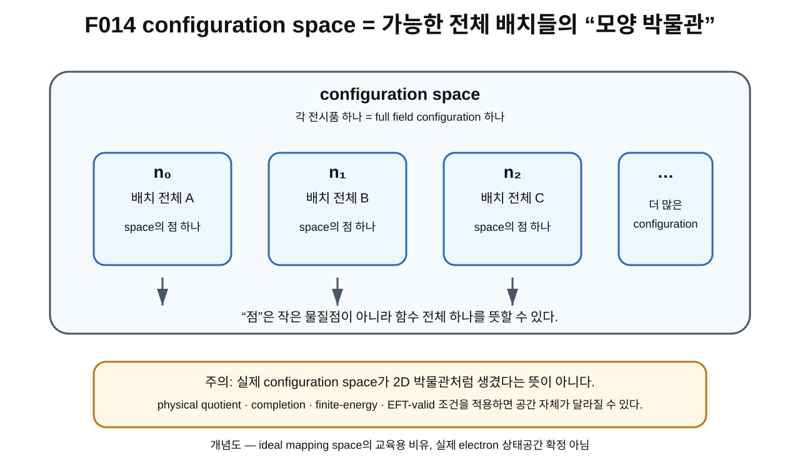
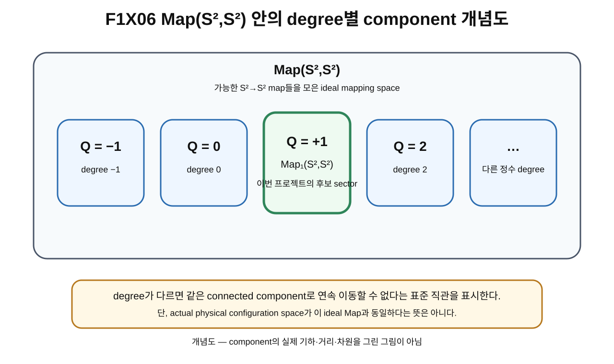

> **STATUS: DRAFT COMPLETE · PASS**
>
> OVERNIGHT BATCH DRAFT MODE에서 작성한 초안이다. 작성 Chat은 PASS를 부여하지 않는다. 실제 physical configuration space와 ideal mapping space의 동일성은 계속 OPEN이다.

# 10장 · configuration space: 가능한 모양들의 박물관

## 현재 상태

- **작성 상태:** DRAFT COMPLETE
- **감사 상태:** PASS
- **선행 장 사용 방식:** 제9장 초안 기준의 configuration 언어를 사용하되 frozen baseline과 `sources/proof-status.md`의 OPEN 경계를 우선한다.
- **다음 배치 대상:** 제11장 DRAFT
- **핵심 금지 등치:** actual physical configuration space $\neq$ confirmed ideal $\mathrm{Map}_1(S^2,S^2)$

---

## 이번 장에서 알아낼 질문

1. 가능한 configuration 전부를 하나의 집합으로 모으면 무엇이 될까?
2. configuration 하나가 왜 configuration space[^v1c10-configuration-space]에서는 “점 하나”가 될까?
3. mapping space[^v1c10-mapping-space]와 function space는 어떤 뜻일까?
4. $\mathrm{Map}_1(S^2,S^2)$의 아래첨자 1은 무엇을 뜻할까?
5. 왜 이런 공간은 보통 무한차원[^v1c10-infinite-dimensional]이라고 생각해야 할까?
6. ideal mapping space와 실제 electron의 physical configuration space를 왜 자동 동일시하면 안 될까?
7. quotient, completion, finite-energy, EFT-valid subset은 왜 계속 남아 있어야 할까?

---

## 앞 장에서 배운 것

제9장에서는 다음 네 층을 구분했다.

- $x$: domain의 점 하나
- $n(x)$: 그 점에서의 field value 하나
- $n$: field 전체
- configuration: 모델의 full field 배치 하나

이번 장에서는 마지막 줄을 한 단계 더 밀어붙인다.

> 가능한 full field configuration들을 전부 모아 하나의 공간처럼 다룬다.

이렇게 얻는 공간을 **configuration space**라고 부른다.

---

## 왜 새로운 문제가 생겼을까?

configuration 하나만 고르면 “현재 배치” 하나만 알 수 있다.

하지만 위상수학은 흔히 하나의 상태보다 **가능한 상태들의 전체 공간**을 보고 질문한다.

예를 들어 다음을 묻고 싶을 수 있다.

- 한 configuration에서 다른 configuration으로 연속적으로 바뀔 수 있는가?
- 출발 configuration으로 돌아오는 loop를 만들 수 있는가?
- 서로 다른 loop를 연속적으로 바꾸어 같은 종류로 만들 수 있는가?

이 질문을 하려면 먼저 configuration들을 “어떤 공간 안의 점들”처럼 놓아야 한다.

---

## 먼저 생각해 보기 · 모양 박물관

아주 큰 박물관이 있다고 상상하자.

이 박물관에는 구 위의 화살표 배치가 가능한 모든 방식으로 전시되어 있다.

- 전시품 A: configuration $n_0$
- 전시품 B: configuration $n_1$
- 전시품 C: configuration $n_2$
- …

여기서 전시품 하나는 작은 화살표 하나가 아니라 **구 전체에 걸친 배치 하나**다.

이제 박물관 자체를 configuration space라고 생각한다.

### 비유의 한계

실제 configuration space가 3차원 건물이나 2차원 평면처럼 생겼다는 뜻은 아니다.

함수 하나를 정하려면 domain의 모든 점에서 값을 정해야 하므로 자유도가 매우 많다. 따라서 함수들의 공간은 보통 무한차원 구조를 가진다.

또 실제 물리 이론에서는 “전시 가능한 모든 수학적 map”과 “물리적으로 허용되는 상태”가 같지 않을 수 있다.

---

## 그림으로 이해하기 · F014

**그림 F014. 가능한 full field configuration들을 전시한 ‘모양 박물관’으로 configuration space를 이해하는 개념도 — 실제 기하/차원 아님**

### [이 그림에서 볼 것]

- $n_0,n_1,n_2,\ldots$는 각각 field 전체 하나다.
- configuration space에서는 이 full field 각각을 점 하나처럼 취급한다.
- “점”이라는 말의 대상이 제9장의 domain point와 달라졌다.

### [이 그림이 뜻하는 것]

함수나 장 전체를 새로운 공간의 원소로 모을 수 있다는 function-space 직관을 보여 준다.

### [이 그림이 뜻하지 않는 것]

- configuration space가 실제 박물관 모양이라는 뜻이 아니다.
- configuration 사이에 그림에 보이는 유클리드 거리나 방향이 실제로 정의됐다는 뜻이 아니다.
- 모든 전시품이 actual electron의 물리 상태라는 뜻이 아니다.
- quotient/completion/finite-energy/EFT 조건을 적용한 physical space가 이 그림과 동일하다는 뜻이 아니다.

---

## 실제 수학에서는 · 함수들의 공간

제4장에서는 함수 하나를

$$
f:X\to Y
$$

라고 썼다.

이제는 이런 함수 **자체들을 원소로 갖는 집합**을 생각한다.

이를 흔히

$$
\mathrm{Map}(X,Y)
$$

처럼 쓸 수 있다.

즉

$$
\mathrm{Map}(S^2,S^2)
$$

는 허용된 $S^2\to S^2$ map들을 모은 mapping space다.

여기서 “허용된”의 정확한 뜻은 문맥에 따라 연속 map, smooth map 등으로 구체화되어야 한다. frozen baseline의 위상 정리는 표준 smooth/compact-open 설정 등 명시된 가정 아래 읽어야 한다.

---

## Map₁(S²,S²)의 아래첨자 1

제7장에서 degree를 배웠다.

$$
Q=\deg(n)\in\mathbb Z.
$$

따라서 전체 mapping space를 degree에 따라 나누어 생각할 수 있다.

이 책에서는 degree $1$인 component[^v1c10-component]를

$$
\mathcal C_1=\mathrm{Map}_1(S^2,S^2)
$$

처럼 쓴다.

여기서 아래첨자 1은

> **degree $Q=1$인 map들을 모은 부분**

이라는 뜻이다.

아래첨자 1이

- 1 bit,
- 입자 1개,
- 전하 단위 1

을 뜻하는 것은 아니다.

---

## 그림으로 이해하기 · F1X06

**그림 F1X06. ideal $\mathrm{Map}(S^2,S^2)$ 안에서 degree $Q$에 따라 component를 나눈 교육용 개념도**

### [이 그림에서 볼 것]

- $Q=-1,0,1,2,\ldots$처럼 서로 다른 degree sector가 표시되어 있다.
- 그중 $Q=1$ component를 $\mathrm{Map}_1(S^2,S^2)$로 표시했다.
- Planck-S² 초기 연구는 이 degree-one sector를 중심 후보로 삼았다.

### [이 그림이 뜻하는 것]

표준 $S^2\to S^2$ 연속 map의 homotopy class가 degree로 분류된다는 제7장 선행 결과를 configuration-space 언어로 다시 표현한다.

### [이 그림이 뜻하지 않는 것]

- 각 component가 실제로 네모난 방이라는 뜻이 아니다.
- component의 물리적 크기나 거리, metric을 그린 것이 아니다.
- actual physical configuration space가 이 ideal mapping space와 동일하다는 뜻이 아니다.
- $Q=1$ component가 실제 electron sector로 확정됐다는 뜻이 아니다.

---

## 왜 무한차원이라고 부를까?

평면의 점 하나는 $(x,y)$ 두 숫자로 정할 수 있다.

3차원 공간의 점 하나는 $(x,y,z)$ 세 숫자로 정할 수 있다.

하지만 함수 $n(x)$ 하나를 완전히 정하려면 domain의 모든 $x$에서 값을 정해야 한다.

즉 몇 개의 숫자만으로 일반적인 함수를 완전히 지정할 수 없고, 사실상 연속적으로 많은 자유도가 필요하다.

이 때문에 configuration space는 보통 **무한차원 공간**이라고 표현한다.

다만 실제 계산에서는 대칭, 모드 전개, truncation[^v1c10-truncation], collective coordinates 같은 방법으로 유한한 변수만 남겨 근사할 수 있다. 그런 근사가 full physical configuration space를 완전히 대신하는지는 별도 검증 문제다.

---

## ideal space와 physical space는 왜 구분해야 할까?

이 장의 가장 중요한 과학적 경계다.

표준 수학에서는

$$
\mathrm{Map}_1(S^2,S^2)
$$

를 잘 정의된 연구 대상으로 둘 수 있다.

하지만 실제 물리상태 공간을 만들려면 추가 질문이 생긴다.

### 1. finite-energy 조건

모든 smooth map이 실제 action에서 유한한 에너지를 가지는가?

### 2. completion

어떤 함수공간의 극한까지 포함해야 하는가?

### 3. quotient

서로 다른 수학적 표현 중 실제로 같은 물리상태를 나타내는 것이 있는가?

### 4. EFT-valid subset

유효장이론이 믿을 수 있는 범위의 configuration만 골라야 하는가?

### 5. ontology와 observable

어떤 자유도가 실제 물리 자유도이고, 무엇이 관측 가능한가?

현재 canonical proof ledger는 이 문제가 닫히지 않았다고 기록한다.

> **actual physical configuration space = ideal/unquotiented $\mathrm{Map}_1(S^2,S^2)$: OPEN**

이 경계는 각주가 아니라 본문에 직접 남긴다.

---

## Planck-S²에서는

G02/G03의 초기 연구 흐름에서는 degree-one mapping sector를

$$
\mathcal C_1=\mathrm{Map}_1(S^2,S^2)
$$

처럼 이상적인 configuration space 후보로 사용했다.

이렇게 두면 configuration-space 안의 path와 loop, 그리고 뒤의 기본군 문제를 수학적으로 질문할 수 있다.

하지만 frozen baseline 이후의 감사들은 이 ideal space를 actual physical electron space로 자동 승격하지 않는다.

특히 C02는 target ontology와 quotient 선택이 configuration-space topology 자체를 바꿀 수 있음을 강조한다.

---

## 당시 연구에서는 무엇을 얻었나

G02는 $Q=1$ mapping space의 위상 구조를 후보로 제시했다.

G03은 그 공간 안의 loop, evaluation fibration, 회전 loop와 generator 문제를 더 깊게 조사했다.

현재 교과서에서는 이 역사적 흐름을 다음처럼 분리한다.

1. **ideal/unquotiented mapping space 수학**
2. **그 공간을 실제 물리 configuration space로 채택하는 bridge**

첫 번째에는 조건부로 증명된 수학 결과가 있지만, 두 번째는 현재 OPEN이다.

---

## 후속 감사에서는 무엇이 바뀌었나

A01과 C02의 핵심 교정은 “수학 공간이 존재한다”와 “그 공간이 실제 물리 상태공간이다”를 분리한 것이다.

현재 proof ledger에서

$$
\pi_1(\mathrm{Map}_1(S^2,S^2))\cong\mathbb Z_2
$$

는 명시된 ideal/unquotiented mapping-space 가정 아래 **PROVED UNDER ASSUMPTIONS**이지만,

$$
\text{physical configuration space}=\mathrm{Map}_1(S^2,S^2)
$$

는 **OPEN**이다.

이 장에서는 아직 $\pi_1$을 배우지 않는다. 단지 앞으로 결과의 적용 범위를 혼동하지 않도록 이 경계를 미리 표시한다.

---

## 현재 판정

| 주장/항목 | 상태 | 정확한 범위 |
|---|---|---|
| 함수들을 원소로 모아 function/mapping space를 만드는 수학 언어 | **SOURCE VERIFIED** | 표준 수학 언어 |
| $S^2\to S^2$ map을 degree별 component로 나누는 구조 | **SOURCE VERIFIED** | 제7장 PASS 수학의 재사용 |
| $\mathrm{Map}_1(S^2,S^2)$를 ideal degree-one mapping component로 사용하는 것 | **SOURCE VERIFIED / PROJECT MODEL LANGUAGE** | ideal/unquotiented 후보 공간 |
| ideal/unquotiented $\pi_1(\mathrm{Map}_1)\cong\mathbb Z_2$ | **PROVED UNDER ASSUMPTIONS** | proof ledger의 명시 조건 아래; 이 장에서는 증명하지 않음 |
| actual physical configuration space = ideal $\mathrm{Map}_1$ | **OPEN** | completion/quotient/finite-energy/EFT-valid/ontology 미폐쇄 |
| Planck-S² 전체 | **WORKING HYPOTHESIS** | 전체 전자 이론 미완성 |

> **AUDIT NOTE:** 제10장은 이 표의 범위를 독립 감사에서 다시 source 대조해야 하며, 작성 Chat은 PASS를 부여하지 않는다.

---

## 이것으로 말할 수 있는 것

- 가능한 configuration들을 모아 configuration space를 생각할 수 있다.
- configuration 하나가 그 공간에서는 점 하나처럼 취급된다.
- $\mathrm{Map}(S^2,S^2)$는 $S^2\to S^2$ map들을 모은 함수공간을 뜻한다.
- $\mathrm{Map}_1(S^2,S^2)$의 1은 degree-one component를 뜻한다.
- 일반적인 field configuration space는 보통 무한차원이다.

---

## 이것으로 말할 수 없는 것

- ideal $\mathrm{Map}_1$이 actual electron의 physical configuration space라고 확정할 수 없다.
- smooth map 전체가 물리적으로 허용된다고 확정할 수 없다.
- quotient가 필요 없다고 확정할 수 없다.
- finite-energy/completion/EFT-valid 조건을 생략할 수 없다.
- $\mathrm{Map}_1$의 위상 결과가 실제 electron에 자동 적용된다고 말할 수 없다.

---

## 자주 하는 오해

### 오해 1 · “configuration space의 점은 domain 구면의 점이다.”

아니다. configuration space의 점 하나는 full field configuration 하나다.

### 오해 2 · “Map₁의 1은 입자 한 개다.”

아니다. 아래첨자 1은 degree $Q=1$을 뜻한다.

### 오해 3 · “무한차원이면 실제 무한한 공간 방향이 있다는 뜻이다.”

아니다. 함수 하나를 지정하는 데 필요한 독립 정보가 유한한 몇 좌표로 끝나지 않는다는 뜻이다.

### 오해 4 · “수학적으로 Map₁을 정의했으니 physical configuration space도 끝났다.”

아니다. 이것이 현재 가장 중요한 OPEN 경계다.

---

## 다음 장이 필요한 이유

configuration space를 만들었으니 이제 그 안에서 한 configuration에서 다른 configuration으로 **연속적으로 이동하는 경로**를 생각할 수 있다.

그 경로가 바로 다음 장의 **path**다.

여기서 “이동”은 실제 물체가 공간 속을 날아가는 것과 다를 수 있다. configuration 전체가 조금씩 바뀌는 수학적 family를 뜻할 수 있다.

---

## 한 문장 기억

> **configuration space는 가능한 full configuration들을 점으로 모은 공간이며, $\mathrm{Map}_1(S^2,S^2)$는 ideal degree-one 후보 공간이지 actual physical electron configuration space로 확정된 것이 아니다.**

---

## 용어 카드

| 용어 | 이 장에서의 뜻 |
|---|---|
| configuration space | 가능한 configuration 전체를 원소로 갖는 공간 |
| function space | 함수 자체를 원소로 갖는 공간 |
| mapping space | map들을 모아 만든 function space |
| $\mathrm{Map}_1(S^2,S^2)$ | degree $1$인 $S^2\to S^2$ map들의 ideal component |
| component | 서로 연속 경로로 연결되는 한 덩어리라는 직관적 구역 |
| infinite-dimensional | 일반 원소를 유한 개 좌표만으로 지정하기 어려운 함수공간 성질 |
| completion | 필요한 극한 함수까지 포함하도록 공간을 완성하는 절차 |
| quotient | 같은 물리상태로 볼 표현들을 하나로 묶는 구성 |
| finite-energy condition | 에너지 함수값이 유한한 상태만 허용하는 조건 |
| EFT-valid subset | 유효장이론이 신뢰되는 범위의 configuration 부분집합 |

---

## 확인문제

### 문제 1

configuration space에서 점 하나는 무엇인가?

### 문제 2

$\mathrm{Map}_1(S^2,S^2)$의 아래첨자 1은 무엇을 뜻하는가?

### 문제 3

함수공간이 보통 무한차원이라고 말하는 직관적 이유는 무엇인가?

### 문제 4

actual physical configuration space = ideal $\mathrm{Map}_1$의 현재 판정은?

### 문제 5

왜 quotient와 completion 문제가 configuration-space topology에 중요할 수 있는가?

### 문제 6

F014의 박물관 비유가 뜻하지 않는 것을 한 가지 쓰라.

---

## 정답과 설명

### 1번

full field configuration 하나다. domain의 한 점과 다르다.

### 2번

degree $Q=1$인 component라는 뜻이다.

### 3번

일반적인 함수 하나를 정하려면 domain의 모든 점에서 값을 지정해야 하므로 몇 개의 유한 좌표만으로는 충분하지 않기 때문이다.

### 4번 정답: OPEN

canonical proof ledger에서 physical space와 ideal Map₁의 동일성은 증명되지 않았다.

### 5번

어떤 상태를 포함하거나 서로 같은 것으로 묶는지가 바뀌면 경로와 loop의 존재, 따라서 위상 구조 자체도 달라질 수 있기 때문이다.

### 6번 예시

실제 configuration space가 2D 박물관 건물처럼 생겼다는 뜻이 아니다.

---

## 이 장의 근거 자료

| 자료 | 위치/역할 | 종류 |
|---|---|---|
| G02 · Planck-S² 양자입자 가설 v0.2 | $n:S^2\to S^2$, $Q=1$, Map₁ 후보 | [일반 연구] |
| G03 · Planck-S² 양자입자 가설 v0.3 | mapping-space topology/path/loop 연구 | [일반 연구] |
| A01 · 일반연구 MASTER 전수 적대적 논리감사 | ideal Map₁ 수학과 physical 적용 범위 분리 | [적대적 감사] |
| C02 · Gate C 최신 frozen baseline | target quotient/ontology가 physical configuration space에 미치는 영향 | [적대적 감사] |
| `sources/proof-status.md` | ideal π₁ 정리와 physical-space OPEN의 canonical 구분 | [canonical proof ledger] |
| 제7장 PASS본 | degree가 homotopy class를 분류하는 선행 표준 수학 | [교과서 선행 장] |

---

## 제10장 제작 기록

- **Canonical file:** `volume-1/10-configuration-space.md`
- **Required figure:** `figures/volume-1/F014.svg`
- **Additional figure:** `figures/volume-1/F1X06.svg`
- **작성 상태:** DRAFT COMPLETE
- **감사 상태:** PASS
- **핵심 경계:** actual physical configuration space = ideal $\mathrm{Map}_1$는 OPEN
- **작성자 PASS:** 부여하지 않음

[^v1c10-configuration-space]: 가능한 전체 상태 각각을 점 하나처럼 모아 만든 공간. 이 책의 field 모델에서는 full field configuration 하나가 이 공간의 점 하나가 된다.

[^v1c10-mapping-space]: map 자체들을 원소로 모아 만든 함수공간. 예를 들어 $\mathrm{Map}(S^2,S^2)$는 $S^2\to S^2$ map들을 모은 공간이다.

[^v1c10-infinite-dimensional]: 일반적인 원소를 정하는 데 필요한 독립 좌표가 유한 개로 끝나지 않는다는 뜻. 실제 무한 개의 물리 공간축이 있다는 뜻은 아니다.

[^v1c10-component]: 공간 안에서 서로 연속 경로로 이어질 수 있는 한 덩어리라는 뜻. $S^2\to S^2$ 연속 map에서는 degree가 같은 map들이 같은 homotopy component를 이룬다는 표준 결과와 연결된다.

[^v1c10-truncation]: 무한히 많은 자유도 중 일정 부분만 남겨 유한한 계산문제로 줄이는 근사. 계산 편의를 위한 절단이므로 결과가 원래 공간을 충분히 잘 대표하는지는 따로 확인해야 한다.
