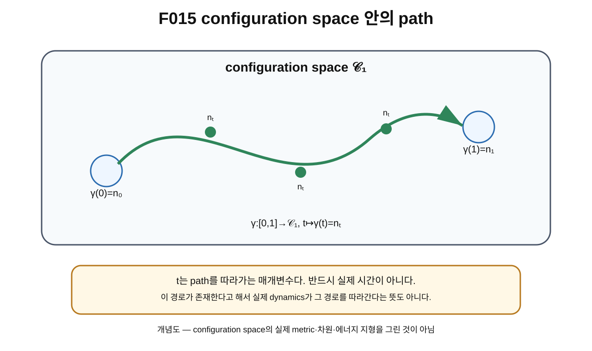

> **STATUS: DRAFT COMPLETE · AUDIT PENDING**
>
> OVERNIGHT BATCH DRAFT MODE에서 작성한 초안이다. 작성 Chat은 PASS를 부여하지 않는다. 수학적 path와 실제 dynamics를 구분한다.

# 11장 · 박물관 안에서 움직이기: path

## 현재 상태

- **작성 상태:** DRAFT COMPLETE
- **감사 상태:** AUDIT PENDING
- **선행 장 사용 방식:** 제10장 초안의 configuration-space 언어를 사용하되 physical-space OPEN 경계를 그대로 유지한다.
- **다음 배치 대상:** 제12장 DRAFT
- **핵심 경계:** path parameter $t$는 반드시 physical time이 아니며, path의 존재는 dynamics의 존재를 뜻하지 않는다.

---

## 이번 장에서 알아낼 질문

1. configuration space 안에서 한 configuration에서 다른 configuration으로 “조금씩” 바뀌는 것을 어떻게 적을까?
2. path[^v1c11-path]는 무엇인가?
3. $\gamma(t)$와 $n_t$는 어떻게 읽을까?
4. parameter[^v1c11-parameter] $t$는 왜 반드시 실제 시간이 아닐까?
5. 연속적인 configuration family[^v1c11-continuous-family]와 실제 시간진화는 왜 다른가?
6. path의 시작점과 끝점만 안다고 path 전체를 아는 것은 왜 아닐까?

---

## 앞 장에서 배운 것

제10장에서는 가능한 configuration들을 모아 configuration space를 생각했다.

예를 들어 ideal degree-one 후보 공간을

$$
\mathcal C_1=\mathrm{Map}_1(S^2,S^2)
$$

처럼 쓸 수 있었다.

그 공간의 점 하나는 작은 domain 점이 아니라 full field configuration 하나였다.

이제 그 공간에서 두 점

$$
n_0,\qquad n_1
$$

을 골라 보자.

질문은 다음이다.

> $n_0$에서 $n_1$으로 configuration 전체를 끊김 없이 조금씩 바꾸어 갈 수 있을까?

이 연속적인 변화의 기록이 path다.

---

## 왜 새로운 문제가 생겼을까?

두 configuration이 있다는 사실만으로는 둘 사이의 관계를 충분히 알 수 없다.

예를 들어 사진 두 장만 있다고 하자.

- 첫 사진: 팔을 내리고 있음
- 마지막 사진: 팔을 올리고 있음

이 두 사진만으로 중간에 팔이 어떻게 움직였는지는 알 수 없다.

configuration에서도 같다.

$$
n_0,\quad n_1
$$

두 endpoint[^v1c11-endpoint]만 적으면 시작과 끝만 안다.

중간에 어떤 configuration들을 거쳤는지까지 기록하려면 path가 필요하다.

---

## 먼저 생각해 보기 · 박물관 안에서 걷기

제10장의 “모양 박물관”을 다시 떠올리자.

전시품 $n_0$ 앞에서 출발해 전시품 $n_1$ 앞으로 걸어간다고 하자.

한 순간에 순간이동하지 않고 복도를 따라 계속 걷는다면, 우리는 중간 위치를 모두 이어 하나의 경로로 만들 수 있다.

configuration space에서는 각 중간 위치가 또 다른 full configuration이다.

즉 path를 따라가면

$$
n_0\to n_{t_1}\to n_{t_2}\to\cdots\to n_1
$$

처럼 field 전체가 조금씩 변한다.

### 비유의 한계

실제 박물관에서는 사람이 물리적 시간에 따라 움직인다. 하지만 수학적 path의 parameter $t$는 단순히 경로 위 순서를 표시하는 숫자일 수 있다.

따라서

> path가 있다 = 실제 물리 시스템이 그 시간진화를 한다

라고 결론내리면 안 된다.

---

## 그림으로 이해하기 · F015

**그림 F015. configuration space 안에서 $n_0$에서 $n_1$까지 이어지는 연속 path $\gamma$ — 개념도, 실제 차원/metric 아님**

### [이 그림에서 볼 것]

- 시작점은 $\gamma(0)=n_0$다.
- 끝점은 $\gamma(1)=n_1$이다.
- 중간의 각 점 $\gamma(t)=n_t$도 full configuration 하나다.
- path는 configuration 전체가 조금씩 변하는 family를 기록한다.

### [이 그림이 뜻하는 것]

configuration space의 path는

$$
\gamma:[0,1]\to\mathcal C_1
$$

처럼 parameter 구간의 각 값에 configuration 하나를 대응시키는 연속 map으로 생각할 수 있다.

### [이 그림이 뜻하지 않는 것]

- $t$가 반드시 초(second) 단위의 실제 시간이라는 뜻이 아니다.
- 그림 속 곡선의 길이가 에너지나 작용을 뜻하지 않는다.
- 실제 dynamics가 이 경로를 따라간다는 뜻이 아니다.
- 실제 physical configuration space가 그림의 2차원 바탕과 같다는 뜻도 아니다.

---

## 실제 수학에서는 · path의 최소 정의

어떤 공간 $\mathcal C$ 안의 path는 보통 연속함수

$$
\gamma:[0,1]\to\mathcal C
$$

로 정의한다.

$t\in[0,1]$을 하나 고르면

$$
\gamma(t)
$$

라는 공간의 점 하나가 나온다.

configuration space에서는 그 점이 configuration 하나이므로

$$
\gamma(t)=n_t
$$

라고 쓸 수 있다.

즉

$$
t\mapsto n_t
$$

는 “parameter $t$가 변하면서 full field configuration이 연속적으로 바뀐다”는 뜻이다.

---

## field 전체가 조금씩 변한다는 뜻

configuration이

$$
n_t:S^2\to S^2
$$

라고 하자.

각 $t$마다 하나의 full field가 있다.

그러면 특정 domain point $x$에서

$$
n_t(x)
$$

도 $t$에 따라 변할 수 있다.

하지만 path는 한 점의 값만 추적하는 것이 아니다.

> **각 $t$마다 field 전체 $n_t(\cdot)$가 하나씩 존재한다.**

그래서 path는 “화살표 하나의 움직임”이 아니라 “모든 화살표 배치 전체가 연속적으로 변하는 과정”이다.

---

## 시작점과 끝점만으로는 path가 정해지지 않는다

같은 $n_0$과 $n_1$을 잇는 path가 여러 개 있을 수 있다.

$$
\gamma_1(0)=\gamma_2(0)=n_0,
$$

$$
\gamma_1(1)=\gamma_2(1)=n_1
$$

이어도

$$
\gamma_1(t)\neq\gamma_2(t)
$$

일 수 있다.

즉 endpoint가 같아도 중간 경로는 다를 수 있다.

이 차이는 다음 장의 loop, 그 다음 장의 homotopy에서 핵심이 된다.

---

## t는 왜 반드시 시간이 아닐까?

수학에서 parameter $t$는 경로의 순서를 표시하기 위한 변수다.

예를 들어 $t=0$은 시작, $t=1$은 끝이라고 정할 수 있다.

하지만 이 $t$가 실제 물리 시간이라면 추가 구조가 필요하다.

- 어떤 action이나 Hamiltonian이 있는가?
- 어떤 equation of motion[^v1c11-equation-of-motion]을 만족하는가?
- 에너지 보존이나 다른 물리 제약이 있는가?
- 실제 시스템이 그 초기조건에서 그 경로를 따라가는가?

이런 정보 없이 path를 적는 것만으로는 dynamics[^v1c11-dynamics]가 정해지지 않는다.

---

## parameterized family와 dynamics의 차이

이 둘을 표로 분리하자.

| 개념 | 질문 |
|---|---|
| 수학적 path $\gamma(t)$ | “configuration들을 연속적으로 어떤 순서로 이어 놓을 수 있는가?” |
| physical dynamics | “실제 물리 법칙 아래 상태가 시간에 따라 어떻게 변하는가?” |

수학적 path는 위상수학을 위해 매우 중요하다. 하지만 실제 운동을 설명하려면 동역학 법칙이 더 필요하다.

---

## Planck-S²에서는

G03의 연구 흐름은 configuration space 안의 특정 path와 loop를 사용해 회전과 위상 구조를 조사하려 했다.

하지만 제11장에서 안전하게 배우는 것은 일반 path 언어뿐이다.

아직 다음을 확정하지 않는다.

- 특정 2π spatial rotation path가 어떤 homotopy class인가
- 그 path가 physical configuration space에서도 존재하는가
- 그 path가 FR generator인가
- 실제 시간에 따라 전자가 그 path를 움직이는가

이런 문제는 뒤 장과 제2권에서 조건과 감사 이력을 포함해 다룬다.

---

## 당시 연구에서는 무엇을 얻었나

G03은 “configuration space 안에서 연속적인 family를 만들고 그 family의 topology를 본다”는 연구 방향을 구체화했다.

이 단계에서 중요한 수학적 도구가 path였다.

path를 도입하면

- 두 configuration이 같은 component에 있는지,
- 시작점으로 돌아오는 loop를 만들 수 있는지,
- loop들을 어떻게 비교할지

질문할 수 있게 된다.

---

## 후속 감사에서는 무엇이 바뀌었나

후속 감사의 핵심은 특정 path가 **어느 공간 안의 path인가**를 명시하라는 것이다.

ideal/unquotiented $\mathrm{Map}_1$ 안에서 존재하는 path가 actual physical configuration space에서도 같은 의미를 갖는지는 자동으로 따라오지 않는다.

특히 quotient, completion, EFT-valid subset이 달라지면 허용되는 path와 loop도 달라질 수 있다.

따라서 이 장의 path 정의는 표준 수학 언어로 사용하지만, Planck-S²의 특정 physical path는 별도 검증 대상으로 남긴다.

---

## 현재 판정

| 주장/항목 | 상태 | 정확한 범위 |
|---|---|---|
| $\gamma:[0,1]\to\mathcal C$ 형태의 path 개념 | **SOURCE VERIFIED** | 표준 위상수학 언어 |
| $\gamma(t)=n_t$로 연속 configuration family를 표현 | **SOURCE VERIFIED / MODELING LANGUAGE** | configuration-space path 표기 |
| path parameter $t$가 반드시 physical time일 필요 없음 | **SOURCE VERIFIED** | 수학적 parameter와 dynamics 구분 |
| G03가 path/loop 언어를 프로젝트 topology 연구에 사용 | **SOURCE VERIFIED AS PROJECT HISTORY** | 문서의 연구 흐름 |
| ideal path가 actual physical electron evolution임 | **OPEN / NOT ESTABLISHED** | physical space와 dynamics 미확정 |
| actual physical configuration space = ideal Map₁ | **OPEN** | canonical proof ledger |
| Planck-S² 전체 | **WORKING HYPOTHESIS** | 전체 이론 미완성 |

> **AUDIT NOTE:** 작성 Chat은 이 장에 PASS를 부여하지 않는다. 표준 정의와 프로젝트 source 연결은 독립 감사가 필요하다.

---

## 이것으로 말할 수 있는 것

- path는 공간 안의 점들을 연속적으로 잇는 map이다.
- configuration space의 path에서는 각 $\gamma(t)$가 full configuration 하나다.
- 시작점과 끝점이 같아도 중간 path는 여러 종류일 수 있다.
- parameter $t$는 단순한 경로 매개변수일 수 있다.

---

## 이것으로 말할 수 없는 것

- path를 적었다는 이유만으로 실제 시간진화를 얻었다고 말할 수 없다.
- 특정 path가 에너지 최소 경로라고 말할 수 없다.
- 특정 path가 물리적으로 허용된다고 자동 결론낼 수 없다.
- ideal Map₁에서의 path를 actual electron configuration space에 자동 이식할 수 없다.
- 아직 특정 2π rotation loop의 generator 성질이나 FR 결론을 앞당겨 말할 수 없다.

---

## 자주 하는 오해

### 오해 1 · “t라고 썼으니 시간이다.”

아니다. $t$는 수학적 parameter일 수 있다.

### 오해 2 · “path가 있으면 실제 시스템이 그 길로 움직인다.”

아니다. dynamics가 별도로 필요하다.

### 오해 3 · “endpoint 두 개만 같으면 path도 같다.”

아니다. 중간 configuration family가 다를 수 있다.

### 오해 4 · “configuration-space path는 구 위의 점 하나가 이동하는 것.”

아니다. full field configuration 전체가 연속적으로 변한다.

---

## 다음 장이 필요한 이유

이제 path를 알았다.

그중 특별한 경우가 있다.

출발 configuration과 끝 configuration이 같다면

$$
\gamma(0)=\gamma(1)
$$

이다.

이런 닫힌 path를 **loop**라고 부른다.

그리고 놀랍게도 “출발점으로 돌아왔다”는 사실만으로 그 loop가 아무 의미 없는 경로라고 결론낼 수 없다.

제12장에서 그 차이를 배운다.

---

## 한 문장 기억

> **configuration-space path는 full field configuration들이 연속적으로 이어진 family이며, path parameter는 반드시 실제 시간이 아니고 path의 존재만으로 dynamics가 정해지지 않는다.**

---

## 용어 카드

| 용어 | 이 장에서의 뜻 |
|---|---|
| path | 한 공간의 점들을 연속적으로 이어 주는 map |
| parameter $t$ | path 위 위치/순서를 지정하는 변수 |
| $\gamma(t)$ | parameter $t$에서의 configuration-space 점 |
| $n_t$ | $t$에 대응하는 full field configuration |
| continuous family | parameter가 조금 변할 때 configuration도 끊김 없이 변하는 family |
| endpoint | path의 시작점 또는 끝점 |
| dynamics | 실제 물리 법칙에 따른 시간 변화 |

---

## 확인문제

### 문제 1

$$
\gamma:[0,1]\to\mathcal C
$$

에서 $\gamma(t)$는 무엇인가?

### 문제 2

$t$는 반드시 실제 시간인가?

### 문제 3

같은 시작점과 끝점을 갖는 두 path가 서로 다를 수 있는가?

### 문제 4

configuration path에서 실제로 조금씩 변하는 것은 domain point 하나인가, full field configuration인가?

### 문제 5

path가 존재한다는 사실만으로 실제 dynamics가 그 path를 따라간다고 말할 수 있는가?

### 문제 6

actual physical configuration space = ideal Map₁의 현재 판정은?

---

## 정답과 설명

### 1번

configuration space의 점 하나, 즉 full configuration $n_t$다.

### 2번

아니다. 단순한 path parameter일 수 있다.

### 3번

그렇다. endpoint가 같아도 중간에 거치는 configuration들이 다를 수 있다.

### 4번

full field configuration 전체가 변한다.

### 5번

말할 수 없다. 실제 시간진화를 말하려면 action/Hamiltonian/equation of motion 같은 dynamics가 필요하다.

### 6번 정답: OPEN

현재 proof ledger의 핵심 경계다.

---

## 이 장의 근거 자료

| 자료 | 위치/역할 | 종류 |
|---|---|---|
| G03 · Planck-S² 양자입자 가설 v0.3 | configuration-space path/loop 연구 흐름 | [일반 연구] |
| G02 · Planck-S² 양자입자 가설 v0.2 | Map₁ 후보 공간의 선행 언어 | [일반 연구] |
| A01 / C02 | ideal path와 physical configuration-space 적용 범위의 경계 | [적대적 감사] |
| `sources/proof-status.md` | actual physical configuration space = Map₁ OPEN | [canonical proof ledger] |
| 표준 위상수학의 path 정의 | $\gamma:[0,1]\to X$ 연속 map | [외부 표준 수학; 독립 SOURCE AUDIT 대상] |

---

## 제11장 제작 기록

- **Canonical file:** `volume-1/11-path.md`
- **Required figure:** `figures/volume-1/F015.svg`
- **작성 상태:** DRAFT COMPLETE
- **감사 상태:** AUDIT PENDING
- **핵심 경계:** path parameter $\neq$ automatically physical time; path existence $\neq$ dynamics
- **작성자 PASS:** 부여하지 않음

[^v1c11-path]: 한 공간 안에서 점들이 어떻게 연속적으로 이어지는지를 나타내는 경로. configuration space에서는 path의 각 점이 full field configuration 하나다.

[^v1c11-parameter]: 어떤 family 안에서 현재 어느 항목을 보고 있는지 표시하는 변수. $t$라는 글자를 써도 반드시 물리 시간이라는 뜻은 아니다.

[^v1c11-continuous-family]: parameter를 조금 바꾸면 대상도 갑자기 뛰지 않고 조금 변하는 대상들의 묶음. 정확한 연속성 정의는 위상수학의 topology에 의존한다.

[^v1c11-endpoint]: path의 시작점과 끝점을 가리키는 말. 보통 $\gamma(0)$과 $\gamma(1)$이다.

[^v1c11-equation-of-motion]: 주어진 물리 법칙에서 상태가 시간에 따라 어떻게 변해야 하는지를 정하는 방정식.

[^v1c11-dynamics]: 실제 물리계가 시간에 따라 어떻게 변하는지를 정하는 법칙 전체. 단순한 수학적 path의 존재보다 더 많은 정보가 필요하다.
