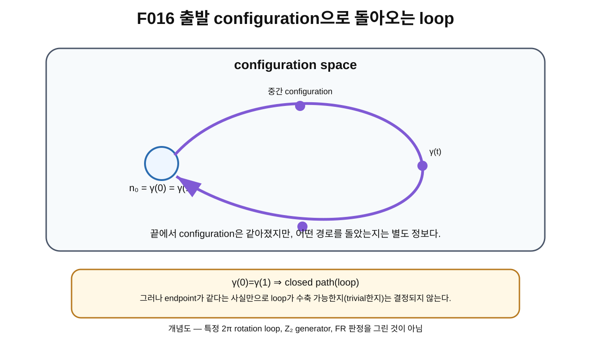

> **STATUS: DRAFT COMPLETE · AUDIT PENDING**
>
> OVERNIGHT BATCH DRAFT MODE에서 작성한 초안이다. 작성 Chat은 PASS를 부여하지 않는다. 이 장은 loop의 표준 언어만 준비하며 $\mathbb Z_2$, FR, 특정 2π rotation generator 결론을 앞당기지 않는다.

# 12장 · 출발점으로 돌아오기: loop

## 현재 상태

- **작성 상태:** DRAFT COMPLETE
- **감사 상태:** AUDIT PENDING
- **선행 장 사용 방식:** 제11장 초안의 path 언어를 사용하되 frozen baseline과 proof ledger의 범위를 우선한다.
- **다음 허용 작업:** Independent sequential audit of Chapters 8–12
- **DO NOT START:** Chapter 13 before overnight batch audit is completed

---

## 이번 장에서 알아낼 질문

1. path의 시작점과 끝점이 같으면 무엇이라고 부를까?
2. loop[^v1c12-loop]는 어떤 수학적 객체일까?
3. 왜 $\gamma(0)=\gamma(1)$이어도 지나온 경로 정보가 남을 수 있을까?
4. endpoint equality[^v1c12-endpoint-equality]와 path triviality[^v1c12-triviality]는 왜 다른 말일까?
5. loop가 실제 시간진화와 반드시 같은 것은 왜 아닐까?
6. 왜 다음 장에서 homotopy가 필요할까?
7. 왜 아직 $\mathbb Z_2$, FR, 2π rotation generator 결론을 말하면 안 될까?

---

## 앞 장에서 배운 것

제11장에서는 configuration space 안의 path를

$$
\gamma:[0,1]\to\mathcal C,
$$

$$
t\mapsto\gamma(t)=n_t
$$

처럼 적었다.

$t$는 path parameter일 수 있고 반드시 physical time은 아니었다.

또 같은 시작점과 끝점을 갖는 path라도 중간에 지나가는 configuration family는 서로 다를 수 있었다.

이번 장에서는 그중 특별한 경우를 본다.

> **시작점과 끝점이 같은 path**

이다.

---

## 왜 새로운 문제가 생겼을까?

집에서 산책을 시작해 다시 집으로 돌아왔다고 하자.

출발할 때와 돌아왔을 때의 위치는 같다.

하지만 산책의 내용은 여러 가지일 수 있다.

- 집 앞만 한 바퀴 돌고 돌아올 수 있다.
- 공원을 크게 돌아올 수 있다.
- 강을 건너 다른 동네까지 갔다 돌아올 수 있다.

최종 위치만 보면 모두 “집”이다.

그러나 지나온 길은 같지 않다.

configuration space에서도 같은 일이 생긴다.

$$
\gamma(0)=\gamma(1)=n_0
$$

라고 해서 path 전체가 아무 정보도 가지지 않는 것은 아니다.

---

## 먼저 생각해 보기 · 집으로 돌아오는 산책

산책 경로를 지도 위에 그렸다고 하자.

출발점과 도착점은 같은 집이다.

이때 경로는 닫힌 모양을 만든다.

수학에서는 이런 닫힌 path를 loop라고 부른다.

configuration space에서는 “집” 대신 출발 configuration $n_0$가 있고, 산책 중간의 각 위치 대신 중간 configuration들이 있다.

즉

$$
n_0\to n_{t_1}\to n_{t_2}\to\cdots\to n_0
$$

처럼 field 전체가 변하다가 다시 원래 configuration으로 돌아온다.

### 비유의 한계

실제 산책은 물리 공간 속 사람이 시간에 따라 움직이는 과정이다. configuration-space loop는 수학적 path일 수 있으며 parameter가 반드시 실제 시간이 아니다.

또 지도에서 두 산책길이 달라 보인다고 해서 그 둘이 위상적으로 다른 loop class라는 결론이 자동으로 나오지는 않는다. 그 비교를 위해 다음 장의 homotopy가 필요하다.

---

## 그림으로 이해하기 · F016

**그림 F016. configuration space에서 출발 configuration $n_0$로 돌아오는 closed path, 즉 loop — 개념도, 실제 차원/metric 아님**

### [이 그림에서 볼 것]

- 출발점은 $\gamma(0)=n_0$다.
- path를 따라 여러 중간 configuration을 지난다.
- 끝에서는 $\gamma(1)=n_0$로 돌아온다.
- 시작과 끝의 configuration은 같지만 path 전체가 하나의 추가 수학적 객체로 남아 있다.

### [이 그림이 뜻하는 것]

loop는

$$
\gamma:[0,1]\to\mathcal C,
\qquad \gamma(0)=\gamma(1)
$$

을 만족하는 closed path[^v1c12-closed-path]다.

### [이 그림이 뜻하지 않는 것]

- 이 loop가 자동으로 nontrivial이라는 뜻이 아니다.
- 이 loop가 특정 2π spatial rotation이라는 뜻이 아니다.
- 이 loop가 $\mathbb Z_2$ generator라는 뜻이 아니다.
- 이 loop가 FR에서 곧바로 $-1$을 준다는 뜻이 아니다.
- 실제 electron이 시간에 따라 이 loop를 돈다는 뜻도 아니다.

---

## 실제 수학에서는 · loop의 최소 정의

공간 $\mathcal C$ 안의 path

$$
\gamma:[0,1]\to\mathcal C
$$

가 있고

$$
\gamma(0)=\gamma(1)=n_0
$$

이면 이 path를 $n_0$를 기준으로 한 loop라고 부를 수 있다.

$n_0$는 나중에 **basepoint**[^v1c12-basepoint]라고 부르는 기준점 역할을 한다.

이 장에서는 basepoint의 정식 기본군 정의까지 들어가지 않는다. 제14장에서 다시 다룬다.

---

## configuration은 돌아왔지만 경로는 남는다

이 문장이 이번 장의 핵심이다.

$$
\gamma(0)=\gamma(1)
$$

은 오직 시작 configuration과 끝 configuration이 같다고 말한다.

하지만 path 전체는

$$
\{\gamma(t):0\le t\le1\}
$$

와 그 순서를 포함한다.

따라서 endpoint가 같다는 사실만으로

> “아무 일도 없었다”

라고 말할 수 없다.

수학적으로는 어떤 loop는 점 하나로 계속 줄일 수 있을 수도 있고, 어떤 loop는 주어진 공간의 topology 때문에 그렇게 줄일 수 없을 수도 있다.

그 구분을 다음 장에서 **homotopy**로 배운다.

---

## endpoint equality ≠ path triviality

두 문장을 분리하자.

### 문장 A

$$
\gamma(0)=\gamma(1).
$$

이것은 loop라는 뜻이다.

### 문장 B

“이 loop는 점 하나에 해당하는 constant loop로 연속적으로 줄일 수 있다.”

이것은 훨씬 더 강한 주장이다.

문장 B가 성립하는 loop를 뒤에서 contractible[^v1c12-contractible] 또는 trivial한 loop라고 부르게 된다.

따라서

> **같은 endpoint를 가진다**
>
> $\neq$
>
> **위상적으로 trivial하다**

이다.

---

## 같은 시작점으로 돌아오는 loop도 여러 개일 수 있다

같은 $n_0$에서 출발해 같은 $n_0$로 돌아오는 두 loop

$$
\gamma_1,\qquad\gamma_2
$$

를 생각하자.

둘 다

$$
\gamma_1(0)=\gamma_1(1)=n_0,
$$

$$
\gamma_2(0)=\gamma_2(1)=n_0
$$

를 만족할 수 있다.

하지만 이 조건만으로

$$
\gamma_1\sim\gamma_2
$$

라고 말할 수 없다.

여기서 $\sim$가 정확히 무엇을 뜻할지는 다음 장의 homotopy에서 정의한다.

---

## loop와 실제 시간진화는 다시 구분한다

제11장의 경계를 그대로 유지한다.

loop parameter를 $t$라고 썼다고 해서 실제 시간이 되는 것은 아니다.

실제 물리 시간 evolution[^v1c12-time-evolution]이라면 action, Hamiltonian, equation of motion, 초기조건 같은 dynamics가 필요하다.

반면 topology에서 loop를 연구할 때는

> “이 configuration family가 공간 안에서 연속적인 닫힌 경로를 이루는가?”

가 먼저 중요하다.

이 두 질문을 섞으면 “수학적으로 가능한 loop”를 “실제 전자가 수행하는 운동”으로 잘못 번역하게 된다.

---

## Planck-S²에서는

G02/G03의 초기 연구 흐름은 degree-one mapping space 안의 loop를 사용해 2π/4π 회전 구조와 기본군 후보를 조사하려 했다.

하지만 이 장에서는 그 후속 결론을 사용하지 않는다.

특히 다음 문장들은 **아직 이 장의 결론이 아니다.**

- 특정 2π spatial rotation path가 nontrivial하다.
- 그 loop가 $\mathbb Z_2$ generator다.
- 그 결과 FR phase가 $-1$이다.
- 실제 physical electron configuration space에서도 같은 loop theorem이 성립한다.

이들은 더 많은 구조와 조건을 필요로 한다.

---

## 당시 연구에서는 무엇을 얻었나

초기 G02/G03에서는 configuration-space loop를 도입함으로써 “최종 configuration만 같은가?”보다 더 정교한 질문을 만들 수 있게 되었다.

즉

> 같은 상태로 돌아와도 그 돌아오는 경로가 위상적으로 다른 종류일 수 있는가?

를 묻기 시작했다.

이 질문이 이후 homotopy, fundamental group, rotation loop 연구의 출발점이다.

---

## 후속 감사에서는 무엇이 바뀌었나

A01과 C02 이후에는 특정 rotation loop에 대한 정리를 **어느 configuration space에서 말하는가**가 매우 중요해졌다.

canonical proof ledger는 ideal/unquotiented $\mathrm{Map}_1(S^2,S^2)$ 안의 특정 위상 결과와 actual physical configuration space의 동일성을 분리한다.

특히 target quotient를 취하는 branch에서는 표준 spatial rotation loop의 해석이 달라질 수 있다는 C02의 경고가 있다.

따라서 제12장에서는 loop의 일반 정의만 SOURCE VERIFIED 언어로 사용하고, specific rotation loop theorem은 제2권으로 유보한다.

---

## 현재 판정

| 주장/항목 | 상태 | 정확한 범위 |
|---|---|---|
| 시작점과 끝점이 같은 path를 loop라 부르는 표준 정의 | **SOURCE VERIFIED** | 표준 위상수학 |
| endpoint equality가 path triviality를 자동 의미하지 않음 | **SOURCE VERIFIED** | loop/homotopy의 표준 구분 |
| G02/G03가 configuration-space loop를 연구 언어로 사용 | **SOURCE VERIFIED AS PROJECT HISTORY** | 프로젝트 역사 |
| ideal/unquotiented Map₁의 특정 loop theorem | **PROVED UNDER ASSUMPTIONS인 후속 항목이 존재** | proof ledger의 명시 범위; 이 장에서는 증명하지 않음 |
| actual physical configuration space = ideal Map₁ | **OPEN** | canonical proof ledger |
| FR-odd $2\pi\to-1$ | **CONDITIONAL** | 이 장에서 유도하지 않음 |
| 완전한 spin-1/2 / $j=1/2$ ground | **OPEN** | 이 장에서 유도하지 않음 |
| Planck-S² 전체 | **WORKING HYPOTHESIS** | 전체 이론 미완성 |

> **AUDIT NOTE:** 이 장은 specific 2π rotation loop나 $\mathbb Z_2$/FR 판정을 새로 부여하지 않는다. 독립 감사에서 범위를 다시 확인해야 한다.

---

## 이것으로 말할 수 있는 것

- loop는 시작점과 끝점이 같은 path다.
- configuration-space loop에서는 full configuration이 변하다가 출발 configuration으로 돌아온다.
- endpoint가 같아도 path 전체는 별도 정보를 가진다.
- loop가 trivial한지 판단하려면 추가 개념이 필요하다.

---

## 이것으로 말할 수 없는 것

- 모든 loop가 trivial하다고 말할 수 없다.
- 모든 loop가 nontrivial하다고 말할 수 없다.
- 같은 endpoint를 가진 두 loop를 즉시 같은 loop class라고 말할 수 없다.
- 특정 2π rotation loop를 이 장에서 $\mathbb Z_2$ generator라고 확정할 수 없다.
- loop 정의만으로 FR phase, spin-1/2, Fermi statistics를 유도할 수 없다.
- ideal mapping-space loop를 actual physical electron loop로 자동 동일시할 수 없다.

---

## 자주 하는 오해

### 오해 1 · “시작점과 끝점이 같으면 경로도 없는 것과 같다.”

아니다. 닫힌 경로 전체는 여전히 남아 있다.

### 오해 2 · “loop면 무조건 nontrivial하다.”

아니다. 어떤 loop는 점으로 수축될 수 있다.

### 오해 3 · “같은 endpoint를 가진 loop는 전부 같은 종류다.”

아니다. 다음 장에서 homotopy를 통해 비교해야 한다.

### 오해 4 · “loop parameter는 실제 시간이다.”

반드시 그렇지 않다.

### 오해 5 · “이제 loop를 배웠으니 2π→−1이 증명됐다.”

아니다. FR-odd 결론은 현재도 CONDITIONAL이며, physical configuration space와 lifted quantum structure 등 추가 조건이 필요하다.

---

## 다음 장이 필요한 이유

이제 loop가 무엇인지 알았다.

하지만 아직 가장 중요한 질문에 답하지 못했다.

> 두 loop가 서로 다른 모양으로 그려져 있어도, 하나를 끊지 않고 조금씩 변형해 다른 하나로 만들 수 있다면 같은 종류로 보아도 될까?

이 질문이 바로 **homotopy**다.

제13장에서는 contractible loop와 noncontractible loop를 구분하는 언어를 배운다.

다만 OVERNIGHT BATCH DRAFT MODE의 지시에 따라 **제13장은 시작하지 않는다.** 먼저 제8~12장의 독립 순차 감사가 필요하다.

---

## 한 문장 기억

> **loop는 출발 configuration으로 돌아오는 path이지만, 돌아왔다는 사실만으로 그 경로가 위상적으로 trivial하다는 뜻은 아니다.**

---

## 용어 카드

| 용어 | 이 장에서의 뜻 |
|---|---|
| loop | 시작점과 끝점이 같은 path |
| closed path | endpoint가 같은 path; 이 장에서는 loop와 같은 직관으로 사용 |
| endpoint equality | $\gamma(0)=\gamma(1)$이라는 조건 |
| basepoint | loop의 출발/종료 기준점 |
| trivial loop | 점으로 연속 수축할 수 있는 loop라는 뒤 장의 개념 |
| contractible | loop를 constant loop로 연속적으로 줄일 수 있다는 성질 |
| homotopy | 두 path/loop를 연속적으로 변형해 비교하는 뒤 장의 개념 |

---

## 확인문제

### 문제 1

loop의 가장 기본적인 endpoint 조건을 식으로 쓰라.

### 문제 2

$\gamma(0)=\gamma(1)$이면 그 loop가 반드시 trivial한가?

### 문제 3

configuration-space loop에서 출발점으로 돌아오는 것은 field value 하나인가, full configuration인가?

### 문제 4

같은 basepoint를 가진 두 loop를 즉시 같은 종류라고 해도 되는가?

### 문제 5

loop parameter가 반드시 physical time인가?

### 문제 6

이 장에서 특정 2π rotation loop가 $\mathbb Z_2$ generator라고 결론냈는가?

---

## 정답과 설명

### 1번

$$
\gamma(0)=\gamma(1)
$$

이다.

### 2번

아니다. endpoint equality와 contractibility/triviality는 별개의 조건이다.

### 3번

full configuration이 출발 configuration으로 돌아온다.

### 4번

안 된다. 두 loop가 homotopic한지 다음 장의 기준으로 비교해야 한다.

### 5번

아니다. 수학적 path parameter일 수 있다.

### 6번

아니다. 이 장은 loop 정의만 준비한다. specific rotation-loop theorem과 FR 연결은 뒤에서 조건과 함께 다룬다.

---

## 이 장의 근거 자료

| 자료 | 위치/역할 | 종류 |
|---|---|---|
| G02 · Planck-S² 양자입자 가설 v0.2 | Map₁와 loop/topology 후보의 초기 흐름 | [일반 연구] |
| G03 · Planck-S² 양자입자 가설 v0.3 | configuration-space loop와 rotation-loop 연구 흐름 | [일반 연구] |
| A01 · 일반연구 MASTER 전수 적대적 논리감사 | ideal Map₁의 rotation-loop 추론 범위와 physical 적용 구분 | [적대적 감사] |
| C02 · Gate C latest frozen baseline | quotient branch에서 rotation-loop 해석이 달라질 수 있다는 경계 | [적대적 감사] |
| `sources/proof-status.md` | ideal π₁ result PROVED UNDER ASSUMPTIONS / FR CONDITIONAL / physical space OPEN | [canonical proof ledger] |
| 표준 위상수학의 loop 정의 | closed path와 homotopy 비교의 기본 언어 | [외부 표준 수학; 독립 SOURCE AUDIT 대상] |

---

## 제12장 제작 기록

- **Canonical file:** `volume-1/12-loop.md`
- **Required figure:** `figures/volume-1/F016.svg`
- **작성 상태:** DRAFT COMPLETE
- **감사 상태:** AUDIT PENDING
- **핵심 경계:** endpoint equality $\neq$ path triviality; loop $\neq$ automatically physical time evolution
- **금지 승격:** specific 2π loop generator / $\mathbb Z_2$ / FR 결론 앞당기기 금지
- **작성자 PASS:** 부여하지 않음
- **DO NOT START:** Chapter 13 before independent sequential audit of Chapters 8–12

[^v1c12-loop]: 시작점과 끝점이 같은 path. configuration space에서는 full configuration이 변하다가 출발 configuration으로 돌아오는 닫힌 경로다.

[^v1c12-endpoint-equality]: path의 시작점과 끝점이 같다는 조건. $\gamma(0)=\gamma(1)$로 쓴다.

[^v1c12-triviality]: loop가 위상적으로 아무 감김도 남기지 않아 점 하나의 constant loop로 연속 수축될 수 있는지에 관한 성질. endpoint가 같다는 사실만으로는 결정되지 않는다.

[^v1c12-closed-path]: 출발점과 끝점이 같은 경로. 이 장에서는 loop의 기본 정의를 설명하는 표현으로 사용한다.

[^v1c12-basepoint]: loop를 시작하고 끝내는 기준점. 기본군에서는 어느 점을 기준으로 loop를 모으는지가 정식 정의에 들어간다.

[^v1c12-contractible]: loop를 끊지 않고 계속 변형해 한 점에 머무는 constant loop로 줄일 수 있다는 뜻. 정식 homotopy 정의는 제13장에서 배운다.

[^v1c12-time-evolution]: 실제 물리계가 물리 시간에 따라 상태를 바꾸는 과정. 수학적 loop가 존재한다는 것만으로 이 시간진화가 실제로 일어난다고 말할 수는 없다.
