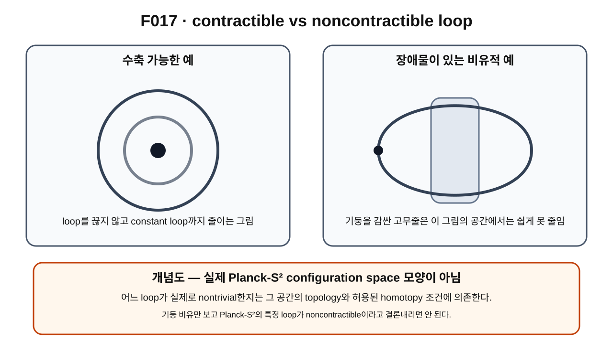

> **STATUS: DRAFT COMPLETE · AUDIT PENDING**
>
> VOLUME 1 FINAL BATCH DRAFT MODE에서 작성한 초안이다. 작성 Chat은 독립 감사 PASS를 부여하지 않는다. actual physical configuration-space topology는 계속 OPEN이다.

# 13장 · 고무줄처럼 줄일 수 있는가: homotopy

## 현재 상태

- **작성 상태:** DRAFT COMPLETE
- **감사 상태:** AUDIT PENDING
- **선행 장:** 제12장 「출발점으로 돌아오기: loop」 — PASS
- **다음 배치 대상:** 제14장 DRAFT
- **핵심 경계:** 표준 homotopy 언어는 SOURCE VERIFIED 범위에서 사용하지만, actual physical Planck-S² configuration space의 homotopy 구조는 OPEN이다.

---

## 이번 장에서 알아낼 질문

1. 모양이 다른 두 path나 loop를 언제 같은 위상적 종류라고 볼 수 있을까?
2. homotopy[^v1c13-homotopy]는 path와 무엇이 다를까?
3. 왜 homotopy를 “변형의 변형”이라고 부를 수 있을까?
4. $H(s,t)$에서 두 parameter $s,t$는 각각 무엇을 뜻할까?
5. loop를 비교할 때 왜 basepoint를 유지하는 조건이 중요할까?
6. constant loop[^v1c13-constant-loop], contractible[^v1c13-contractible], noncontractible[^v1c13-noncontractible]은 무엇일까?
7. 시작점과 끝점이 같다는 것과 점으로 줄일 수 있다는 것은 왜 다른가?
8. 왜 그림이 비슷해 보이는 것만으로 homotopy class를 결정할 수 없을까?

---

## 앞 장에서 배운 것

제12장에서는 loop를

$$
\gamma:[0,1]\to X,
\qquad \gamma(0)=\gamma(1)=x_0
$$

처럼 시작점과 끝점이 같은 path로 배웠다.

하지만 같은 $x_0$에서 출발해 같은 $x_0$로 돌아오는 loop라도 중간 경로는 서로 다를 수 있었다.

그래서 다음 질문이 생겼다.

> 두 loop의 그림이 다르더라도, 하나를 끊지 않고 조금씩 바꾸어 다른 하나로 만들 수 있다면 같은 종류로 세어도 될까?

이 질문에 답하는 언어가 homotopy다.

---

## 왜 새로운 문제가 생겼을까?

loop를 단순히 그림 모양으로만 분류하면 문제가 생긴다.

원 모양 loop와 찌그러진 타원 모양 loop는 그림으로는 다르다. 하지만 고무줄이라면 한쪽을 조금 늘리고 다른 쪽을 줄이면서 서로 바꿀 수 있다.

반대로 겉보기에는 비슷한 두 loop가 어떤 공간에서는 장애물을 서로 다른 방식으로 감싸고 있어 끊지 않고는 서로 바꿀 수 없을 수도 있다.

즉 topology는 “그림이 얼마나 닮았는가?”를 묻기보다

> **허용된 연속변형으로 서로 바꿀 수 있는가?**

를 묻는다.

---

## 먼저 생각해 보기 · 고무줄과 기둥

바닥 위에 고무줄 하나를 놓았다고 하자.

아무 장애물도 없다면 고무줄의 모양을 계속 줄여 결국 한 점 근처로 모을 수 있다.

이번에는 바닥에 기둥 하나가 있고 고무줄이 그 기둥을 한 바퀴 감싸고 있다고 상상하자.

고무줄을

- 끊지 않고,
- 기둥을 통과시키지 않고,
- 계속 이어진 상태로 유지한다면

기둥을 감싼 고무줄은 단순한 점으로 줄이기 어려워 보인다.

이 비유가 contractible/noncontractible의 첫 직관을 준다.

### 비유의 한계

Planck-S²의 configuration space 안에 실제 기둥이나 벽이 있다는 뜻이 아니다.

무한차원 configuration space의 topology는 실제 수학적 정의와 허용된 함수공간, quotient, completion 등에 따라 결정된다. 고무줄 그림은 개념을 이해하기 위한 비유일 뿐 특정 Planck-S² loop의 nontriviality를 증명하지 않는다.

---

## 그림으로 이해하기 · F017

**그림 F017. contractible loop와 장애물이 있는 공간에서의 noncontractible 직관 비교 — 개념도, 실제 Planck-S² configuration space 모양 아님**

### [이 그림에서 볼 것]

- 왼쪽 loop는 연속적으로 줄어 constant loop에 가까워지는 과정을 나타낸다.
- 오른쪽은 기둥 같은 장애물을 감싼 고무줄 비유다.
- 같은 “닫힌 loop”라도 수축 가능성은 공간의 topology에 따라 달라질 수 있다.

### [이 그림이 뜻하는 것]

contractibility는 endpoint가 같은지 여부가 아니라, **loop 전체를 허용된 연속변형으로 constant loop까지 바꿀 수 있는가**를 묻는 성질임을 보여 준다.

### [이 그림이 뜻하지 않는 것]

- 실제 Planck-S² configuration space 안에 물리적 기둥이 있다는 뜻이 아니다.
- 오른쪽 그림처럼 생겼다는 이유만으로 실제 Planck-S² loop가 noncontractible하다는 증명이 아니다.
- 어떤 특정 $2\pi$ rotation loop가 nontrivial하다는 결론도 아니다.
- actual physical configuration space의 topology가 이미 확정됐다는 뜻도 아니다.

---

## path와 homotopy는 무엇이 다를까?

path는 공간의 점들이 어떻게 이어지는지를 기록한다.

$$
\gamma(t),\qquad 0\le t\le1.
$$

반면 homotopy는 **path 자체가 어떻게 변하는지** 기록한다.

예를 들어 두 path

$$
\gamma_0(t),\qquad \gamma_1(t)
$$

이 있다고 하자.

그 사이의 중간 path들을

$$
\gamma_s(t)
$$

라고 생각할 수 있다.

- $s=0$이면 처음 path $\gamma_0$
- $s=1$이면 마지막 path $\gamma_1$
- $0<s<1$이면 그 사이의 중간 path

다.

그래서 homotopy는 “경로 위를 움직이는 것”이 아니라 **경로 자체를 연속적으로 바꾸는 과정**이다.

---

## 최소한의 수학 · H(s,t)

두 path 사이의 homotopy는 보통 연속 map

$$
H:[0,1]\times[0,1]\to X
$$

로 쓸 수 있다.

여기서

$$
H(0,t)=\gamma_0(t),
$$

$$
H(1,t)=\gamma_1(t)
$$

라고 둔다.

두 parameter의 역할을 구분하자.

- $t$: **한 path 안에서 어디에 있는가**를 표시
- $s$: **첫 path에서 마지막 path로 얼마나 변형했는가**를 표시

고정된 $s$를 하나 택하면

$$
t\mapsto H(s,t)
$$

가 path 하나가 된다.

따라서 $s$를 조금씩 바꾸면 path 전체가 조금씩 바뀐다.

---

## loop homotopy에서는 왜 basepoint를 지킬까?

제14장에서 fundamental group을 만들려면 같은 기준점 $x_0$에서 출발하고 돌아오는 based loop[^v1c13-based-loop]를 비교한다.

그래서 loop homotopy에서는 보통 변형하는 동안에도

$$
H(s,0)=H(s,1)=x_0
$$

를 모든 $s$에 대해 유지한다.

쉽게 말하면

> 고무줄 모양은 바꾸되, 손가락으로 잡고 있는 기준점은 놓지 않는다.

는 조건이다.

이 조건을 두는 이유는 나중에 loop들을 이어붙이는 연산을 같은 기준점에서 일관되게 정의하기 위해서다.

---

## constant loop란 무엇일까?

기준점 $x_0$에 계속 머무르는 loop를 생각하자.

$$
c(t)=x_0
\qquad\text{for all }t.
$$

이것을 **constant loop**라고 한다.

경로가 실제로 어디로도 가지 않고 항상 같은 점에 있으므로 fundamental group에서는 identity 역할을 하게 된다. 그 이유는 다음 장에서 다룬다.

---

## contractible loop란 무엇일까?

loop $\gamma$를 basepoint를 유지하면서 constant loop $c$로 homotopy할 수 있다면 $\gamma$를 contractible하다고 한다.

즉

$$
\gamma\simeq c
$$

라고 쓸 수 있는 경우다.

이때 “줄일 수 있다”는 말은 실제 고무 길이를 줄인다는 뜻이 아니라, **공간 안에서 연속적으로 constant loop와 같은 homotopy class로 바꿀 수 있다**는 뜻이다.

---

## noncontractible loop란 무엇일까?

반대로 허용된 loop homotopy로 constant loop까지 바꿀 수 없는 loop를 noncontractible이라고 부른다.

중요한 점은 이것이 loop 그림 자체의 외형만으로 결정되지 않는다는 것이다.

같은 모양의 loop라도 놓여 있는 공간이 다르면 contractibility가 달라질 수 있다.

- 평면 전체에서는 어떤 원형 loop를 점으로 줄일 수 있다.
- 한 점이 빠진 평면에서는 그 빠진 점을 감싼 loop가 다른 성질을 가질 수 있다.

즉 topology는 **loop와 그 loop가 놓인 공간을 함께 본다.**

---

## endpoint equality와 contractibility는 다시 다르다

제12장의 경계를 다시 잠그자.

### endpoint equality

$$
\gamma(0)=\gamma(1)
$$

이면 loop다.

### contractibility

그 loop가 constant loop로 homotopic해야 한다.

따라서

> loop다
>
> $\neq$
>
> contractible하다

이다.

모든 loop는 닫혀 있지만, 모든 loop가 반드시 contractible한 것은 아니다.

---

## 서로 모양이 달라도 homotopic할 수 있다

한 loop가 둥글고 다른 loop가 찌그러져 있어도, 끊지 않고 연속적으로 서로 바꿀 수 있다면 같은 homotopy class에 속한다.

그래서 topology는 정확한 길이, 각도, 곡률 같은 기하적 세부보다 연속변형 아래 무엇이 남는지를 본다.

---

## 서로 비슷해 보여도 homotopic하지 않을 수 있다

반대로 그림에서 거의 비슷해 보여도 서로 다른 장애물을 감싸거나 공간의 다른 위상 구조를 통과하면 같은 class가 아닐 수 있다.

따라서

> “눈으로 보기 비슷하다”

와

> “homotopic하다”

는 같은 말이 아니다.

---

## Planck-S²에서는

제10~12장에서 ideal 후보 configuration space

$$
\mathcal C_1=\mathrm{Map}_1(S^2,S^2)
$$

를 사용해 path와 loop의 언어를 준비했다.

이제 ideal mapping space 안에서 loop들의 homotopy class를 질문할 수 있다.

하지만 반드시 두 층을 분리해야 한다.

1. **ideal/unquotiented mapping-space 안의 표준 수학**
2. **actual physical electron configuration space의 topology**

두 번째가 첫 번째와 같다는 것은 현재 **OPEN**이다.

따라서 ideal Map₁에서의 homotopy 결과를 actual physical space에 자동 이식하지 않는다.

---

## 당시 연구에서는 무엇을 얻었나

G02/G03 연구는 degree-$1$ map들을 모은 공간에서 loop의 종류를 조사하기 위해 homotopy와 fundamental group 언어를 사용했다.

이 단계의 중요한 진전은 “특정 loop 그림 하나”보다

> 이 loop가 다른 loop와 같은 homotopy class인가?

라는 질문을 만들었다는 점이다.

그 질문이 다음 장의 fundamental group으로 이어진다.

---

## 후속 감사에서는 무엇이 바뀌었나

A01과 C02 이후에는 ideal mapping-space 결과와 physical configuration-space 결과를 자동 동일시하지 않는다.

특히

- completion,
- finite-energy 조건,
- EFT-valid subset,
- target quotient,
- physical ontology

가 바뀌면 허용되는 loop와 homotopy 자체가 달라질 수 있다.

따라서 이 장의 표준 homotopy 언어는 안전하게 사용할 수 있지만, actual physical Planck-S² configuration space의 homotopy structure는 **OPEN**이다.

---

## 현재 판정

| 주장/항목 | 상태 | 정확한 범위 |
|---|---|---|
| homotopy를 연속적인 map의 변형으로 정의하는 표준 언어 | **SOURCE VERIFIED** | 표준 위상수학 |
| based loop homotopy에서 basepoint를 유지하는 조건 | **SOURCE VERIFIED** | fundamental-group 준비 |
| constant / contractible / noncontractible loop 개념 | **SOURCE VERIFIED** | 표준 위상수학 |
| ideal $\mathrm{Map}_1$에서 homotopy class를 연구할 수 있음 | **SOURCE VERIFIED** | ideal mapping-space 언어 |
| actual physical configuration-space homotopy = ideal Map₁ homotopy | **OPEN** | physical space 동일성 미증명 |
| 특정 $2\pi$ rotation loop의 physical class | **OPEN / 제2권 유보** | 이 장에서 판정하지 않음 |
| 전체 Planck-S² | **WORKING HYPOTHESIS** | 전체 전자 이론 미완성 |

> **AUDIT NOTE:** 이 장은 표준 homotopy 언어의 교육 초안이다. 작성 Chat은 어떤 특정 Planck-S² loop에도 nontrivial 판정을 새로 부여하지 않는다.

---

## 이것으로 말할 수 있는 것

- path와 homotopy는 서로 다른 층의 map이다.
- $H(s,t)$에서 $s$는 path 자체의 변형 정도, $t$는 각 path 위의 위치를 나타낸다.
- loop를 constant loop로 줄일 수 있는지 여부가 contractibility를 결정한다.
- 모양이 달라도 homotopic할 수 있다.
- 모양이 비슷해도 공간의 topology에 따라 homotopic하지 않을 수 있다.

---

## 이것으로 말할 수 없는 것

- 그림만 보고 Planck-S²의 특정 loop가 noncontractible하다고 말할 수 없다.
- ideal Map₁의 homotopy 구조가 실제 electron configuration space에 그대로 적용된다고 확정할 수 없다.
- 특정 $2\pi$ rotation loop가 generator라고 아직 말하지 않는다.
- homotopy만으로 FR phase나 spin-1/2을 얻었다고 말할 수 없다.

---

## 자주 하는 오해

### 오해 1 · “loop면 전부 한 점으로 줄일 수 있지 않나?”

아니다. contractibility는 공간의 topology에 달려 있다.

### 오해 2 · “그림이 둥글면 같은 homotopy class다.”

아니다. 외형이 아니라 허용된 연속변형 가능성을 본다.

### 오해 3 · “고무줄 비유에서 기둥을 감았으니 Planck-S²에도 기둥 같은 장애물이 있다.”

아니다. 기둥은 위상적 obstruction을 직관화하는 비유일 뿐이다.

### 오해 4 · “시작과 끝이 같으면 trivial loop다.”

아니다. 시작과 끝이 같다는 것은 loop 조건일 뿐이고, triviality는 constant loop와 homotopic한지 따로 봐야 한다.

### 오해 5 · “homotopy parameter s는 실제 시간이다.”

아니다. $s$도 수학적 변형 parameter다. 실제 dynamics와 자동 동일시하지 않는다.

---

## 다음 장이 필요한 이유

이제 loop들을 homotopy class로 묶을 수 있게 되었다.

그러면 다음 질문이 생긴다.

> 한 공간에서 가능한 loop 종류를 전부 모아 하나의 구조로 만들 수 있을까?

그리고 두 loop를 차례로 이어 걸으면 그 “종류”는 어떻게 합쳐질까?

이 질문에서 **fundamental group**이 등장한다.

---

## 한 문장 기억

> **homotopy는 path나 loop 자체를 끊지 않고 연속적으로 바꾸는 변형이며, contractible 여부는 loop 그림이 아니라 그 loop가 놓인 공간의 topology에 의해 결정된다.**

---

## 용어 카드

| 용어 | 이 장에서의 뜻 |
|---|---|
| homotopy | 한 map/path/loop를 다른 것으로 연속적으로 변형하는 과정 |
| homotopy class | 서로 homotopic한 map이나 loop를 한 종류로 묶은 부류 |
| basepoint | based loop가 출발하고 돌아오는 기준점 |
| based loop | 같은 basepoint에서 출발하고 끝나는 loop |
| constant loop | 모든 parameter 값에서 같은 점에 머무는 loop |
| contractible | constant loop로 homotopy할 수 있음 |
| noncontractible | constant loop로 homotopy할 수 없음 |

---

## 확인문제

### 1번
path $\gamma(t)$와 homotopy $H(s,t)$의 가장 큰 차이는 무엇인가?

### 2번
$H(s,t)$에서 $s$와 $t$의 역할을 각각 설명하라.

### 3번
loop가 contractible하다는 것은 무엇을 뜻하는가?

### 4번
$\gamma(0)=\gamma(1)$이면 그 loop는 반드시 contractible한가?

### 5번
왜 loop homotopy에서 basepoint를 유지하는 조건을 쓰는가?

### 6번
고무줄과 기둥 비유가 실제 Planck-S² topology를 증명하지 못하는 이유를 설명하라.

### 7번
서로 모양이 다른 두 loop가 같은 homotopy class에 속할 수 있는가?

### 8번
actual physical configuration space와 ideal Map₁의 homotopy 구조가 같다고 현재 확정할 수 있는가?

---

## 정답과 설명

### 1번
path는 공간 안의 점들을 따라가는 한 경로이고, homotopy는 path 자체가 다른 path로 어떻게 변하는지를 기록한다.

### 2번
$t$는 각 path 위의 위치를 나타내고, $s$는 처음 path에서 마지막 path로 변형되는 정도를 나타낸다.

### 3번
basepoint를 유지하는 연속변형을 통해 constant loop로 바꿀 수 있다는 뜻이다.

### 4번
아니다. endpoint equality는 loop 조건일 뿐 contractibility를 보장하지 않는다.

### 5번
같은 기준점에서 loop들을 비교하고 이어붙이는 fundamental-group 연산을 일관되게 만들기 위해서다.

### 6번
기둥은 단순한 시각적 비유다. 실제 configuration space의 topology는 함수공간, quotient, completion, 물리적 허용조건에 따라 정해야 한다.

### 7번
가능하다. 연속적으로 서로 변형할 수 있다면 외형이 달라도 같은 homotopy class다.

### 8번
아니다. 그 동일성은 현재 **OPEN**이다.

---

## 이 장의 근거 자료

| 자료 | 역할 | 종류 |
|---|---|---|
| Allen Hatcher, *Algebraic Topology*, §1.1 | path homotopy, loop, fundamental-group 준비의 표준 정의 | [외부 수학] |
| G02 | degree-one mapping-space topology 연구의 초기 언어 | [일반 연구] |
| G03 | loop/homotopy/fundamental-group 연구 흐름 | [일반 연구] |
| A01 | ideal mapping-space 결과의 범위와 physical 적용 한계 | [적대적 감사] |
| C02 | quotient 선택이 physical topology에 미치는 경고 | [최신 적대적 감사] |
| `sources/proof-status.md` | actual physical configuration space = ideal Map₁가 OPEN이라는 canonical 판정 | [프로젝트 상태] |

---

## 제13장 제작 기록

- **Canonical file:** `volume-1/13-homotopy.md`
- **필수 그림:** F017
- **작성 상태:** DRAFT COMPLETE
- **감사 상태:** AUDIT PENDING
- **작성자 자체 PASS:** 부여하지 않음
- **핵심 경계:** standard homotopy language와 actual physical configuration-space topology를 분리
- **다음 작업:** FINAL BATCH 규칙에 따른 Chapter 14 DRAFT

[^v1c13-homotopy]: 한 map이나 path를 끊김 없이 다른 map이나 path로 계속 바꾸는 연속변형이다. 단순히 그림 모양이 비슷한지를 보는 것이 아니라 실제로 그런 변형이 가능한지를 본다.

[^v1c13-constant-loop]: 시작점에서 전혀 움직이지 않고 모든 parameter 값에서 같은 점에 머무는 loop다. fundamental group에서는 identity 역할을 한다.

[^v1c13-contractible]: loop를 공간 안에서 끊지 않고 constant loop까지 연속적으로 줄일 수 있다는 뜻이다.

[^v1c13-noncontractible]: 허용된 연속변형으로 constant loop까지 줄일 수 없는 loop를 뜻한다. 어떤 loop가 여기에 해당하는지는 그 loop가 놓인 공간의 topology에 달려 있다.

[^v1c13-based-loop]: 미리 정한 기준점에서 출발해 같은 기준점으로 돌아오는 loop다. fundamental group을 만들 때 이 기준점을 고정해 loop들을 비교한다.
