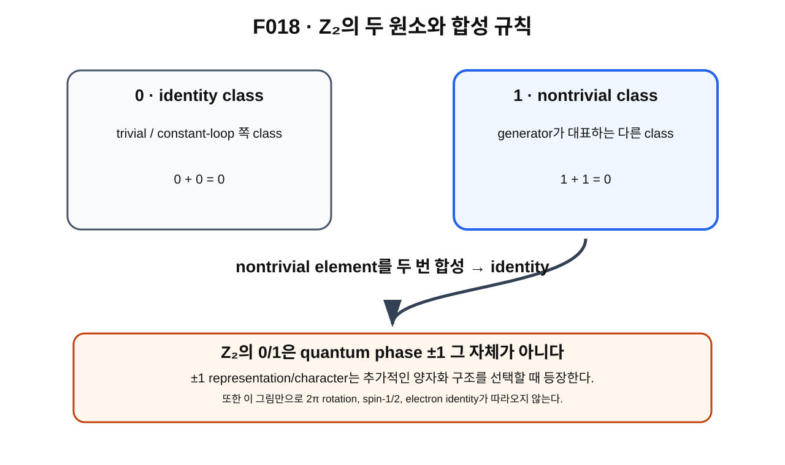

> **STATUS: DRAFT COMPLETE · AUDIT PENDING**
>
> VOLUME 1 FINAL BATCH DRAFT MODE에서 작성한 초안이다. 작성 Chat은 PASS를 부여하지 않는다. ideal/unquotiented mapping-space 결과와 actual physical configuration space를 분리한다.

# 15장 · Z₂: 한 번과 두 번이 다른 세계

## 현재 상태

- **작성 상태:** DRAFT COMPLETE
- **감사 상태:** AUDIT PENDING
- **선행 장 사용 방식:** 제14장 초안의 fundamental-group 언어를 사용하되, frozen baseline과 `sources/proof-status.md`의 판정을 우선한다.
- **다음 배치 대상:** 제16장 DRAFT
- **핵심 경계:** $\pi_1(\mathrm{Map}_1(S^2,S^2))\cong\mathbb Z_2$는 **PROVED UNDER ASSUMPTIONS**이며, actual physical configuration space = ideal Map₁는 **OPEN**이다.

---

## 이번 장에서 알아낼 질문

1. $\mathbb Z_2$[^v1c15-z2]라는 group은 무엇일까?
2. 왜 $0$과 $1$ 두 원소만 있는데 $1+1=0$일까?
3. generator[^v1c15-generator]와 order[^v1c15-order]는 무엇을 뜻할까?
4. “nontrivial loop를 두 번 합성하면 trivial class가 된다”는 말은 정확히 무엇일까?
5. 왜 $\mathbb Z_2$의 원소 $0,1$을 quantum phase $+1,-1$과 직접 동일시하면 안 될까?
6. Planck-S²의 ideal degree-one mapping space에서 $\pi_1\cong\mathbb Z_2$라는 결과는 어느 범위에서 살아남는가?
7. 왜 이 결과만으로 $2\pi\to-1$, spin-$1/2$, electron identity를 얻었다고 말할 수 없을까?

---

## 앞 장에서 배운 것

제14장에서는 fundamental group을

$$
\pi_1(X,x_0)
$$

라고 쓰고, 그 원소가 based loop의 homotopy class라는 것을 배웠다.

두 class를 이어붙이는 concatenation이 group operation을 만들었다.

이제 특정 공간의 fundamental group이 아주 단순한 두 원소짜리 group일 수 있는 경우를 배운다.

그 group이 $\mathbb Z_2$다.

---

## notation부터 고정하자

이 장에서는 기본적으로 **additive notation**[^v1c15-additive-notation]을 사용한다.

$$
\mathbb Z_2=\{0,1\}
$$

이라고 쓰고 연산을 $+$로 나타낸다.

규칙은

$$
0+0=0,
$$

$$
0+1=1,
$$

$$
1+0=1,
$$

$$
1+1=0
$$

이다.

다른 책에서는 identity를 $e$, nontrivial generator를 $g$라고 써서

$$
g\cdot g=e
$$

라고 표현하기도 한다.

두 notation은 같은 구조를 다른 기호로 쓴 것이다.

이 장에서는 혼란을 줄이기 위해 이후 대부분 $0,1$ notation을 쓴다.

---

## 왜 새로운 문제가 생겼을까?

fundamental group에는 여러 loop class가 들어갈 수 있다.

그런데 어떤 공간에서는 class가 정확히 두 종류뿐일 수 있다.

- trivial class $0$
- nontrivial class $1$

그리고 nontrivial class를 자기 자신과 한 번 더 합성하면 trivial class로 돌아온다.

$$
1+1=0.
$$

이것이 $\mathbb Z_2$ 구조의 핵심이다.

---

## 먼저 생각해 보기 · 두 상태 스위치

특수한 스위치를 상상해 보자.

처음 상태를 $0$이라고 하자.

스위치를 한 번 누르면 $1$로 바뀐다.

다시 한 번 누르면 $0$으로 돌아온다.

즉

- 한 번: 상태가 달라짐
- 두 번: 원래 상태로 돌아옴

이라는 두-상태 규칙이 있다.

$\mathbb Z_2$의 $1+1=0$을 처음 이해하는 데 도움이 되는 비유다.

### 비유의 한계

$\mathbb Z_2$가 실제 전자 안에 물리적 on/off 스위치가 있다는 뜻은 아니다.

또 $0,1$이 quantum phase $+1,-1$이라는 뜻도 아니다.

$\mathbb Z_2$는 먼저 **group structure**다. 양자파동함수에 $\pm1$을 붙이는 것은 별도의 representation/character[^v1c15-character]을 선택하는 추가 단계다.

---

## 그림으로 이해하기 · F018

**그림 F018. $\mathbb Z_2$의 trivial class $0$, nontrivial class $1$, 그리고 $1+1=0$을 보여 주는 개념도**

### [이 그림에서 볼 것]

- $0$은 identity/trivial class다.
- $1$은 다른 하나의 nontrivial class다.
- $1$을 두 번 합성하면 $0$으로 돌아온다.

### [이 그림이 뜻하는 것]

$\mathbb Z_2$가 두 원소를 가진 cyclic group[^v1c15-cyclic-group]이고, nontrivial generator의 order가 2라는 뜻을 보여 준다.

### [이 그림이 뜻하지 않는 것]

- $0$과 $1$이 quantum phase $+1$과 $-1$ 그 자체라는 뜻이 아니다.
- $1$이 electric charge 한 단위라는 뜻이 아니다.
- $1$이 전자 한 개라는 뜻이 아니다.
- $1$이 특정 $2\pi$ rotation loop라고 이미 증명됐다는 뜻이 아니다.
- $\mathbb Z_2$가 존재한다는 사실만으로 spin-$1/2$ 또는 electron identity가 따라온다는 뜻이 아니다.

---

## Z₂는 “정수 두 개”가 아니다

$\mathbb Z_2$는 그냥 숫자 $0$과 $1$을 적어 놓은 목록이 아니다.

핵심은 **연산 규칙**까지 포함한다는 것이다.

일반 정수에서는

$$
1+1=2
$$

이지만 $\mathbb Z_2$에서는 결과를 2로 나눈 나머지처럼 생각해

$$
1+1=0
$$

이 된다.

그래서 $\mathbb Z_2$는 “두 원소를 가진 cyclic group”이라고 부른다.

---

## generator와 order 2

$\mathbb Z_2$에서는 nontrivial 원소 $1$ 하나만 있으면 group 전체를 만들 수 있다.

- $1$ 한 번: $1$
- $1$ 두 번: $0$
- 다시 $1$을 더하면: $1$

이런 의미에서 $1$을 generator라고 부를 수 있다.

또 $1$을 자기 자신과 두 번 결합했을 때 처음으로 identity $0$이 되므로

> $1$의 order는 2다.

라고 말한다.

---

## loop class에서 “한 번과 두 번”은 무슨 뜻일까?

fundamental group이 $\mathbb Z_2$라면 어떤 nontrivial loop class $g$를 대표로 골랐을 때

$$
[g]+[g]=0
$$

이라는 구조가 있다.

이 말은

> nontrivial class를 대표하는 loop를 이어붙여 두 번 수행한 concatenated loop가 trivial class에 들어간다

는 뜻이다.

하지만 여기서 “한 번”이 곧 $360^\circ$ 회전이고 “두 번”이 곧 $720^\circ$ 회전이라고 아직 말하지 않는다.

그 연결은 **특정 spatial rotation loop가 어떤 fundamental-group class를 나타내는가**를 별도로 증명해야 한다.

그 구체적 G03/A01 수리 과정은 제2권에서 다룬다.

---

## Planck-S²의 ideal mapping-space 결과

이제 frozen baseline의 조건부 수학 결과를 소개한다.

ideal degree-one mapping space를

$$
\mathrm{Map}_1(S^2,S^2)
$$

라고 하자.

현재 canonical proof ledger는

$$
\pi_1\!\left(\mathrm{Map}_1(S^2,S^2)\right)
\cong
\mathbb Z_2
$$

를 **PROVED UNDER ASSUMPTIONS**로 기록한다.

여기서 isomorphism $\cong$[^v1c15-isomorphism]은 두 group의 연산 구조가 같다는 뜻이다.

### 이 결과의 범위

이 판정은 frozen baseline에서 사용한

- ideal,
- unquotiented,
- 표준 smooth/compact-open mapping-space 설정,
- evaluation-fibration 계산에 필요한 표준 가정

범위에서 읽는다.

이 가정들을 떼어낸 무조건적 physical theorem으로 바꾸지 않는다.

---

## 바로 옆에 반드시 붙는 OPEN 문장

다음 등치는 현재 증명되지 않았다.

$$
\text{actual physical configuration space}
=
\mathrm{Map}_1(S^2,S^2).
$$

현재 판정은 **OPEN**이다.

왜냐하면 실제 physical space를 정하려면 여전히

- finite-energy 조건,
- completion,
- EFT-valid subset,
- target ontology,
- quotient 선택,
- observable 구조

등이 남아 있기 때문이다.

특히 C02는 target quotient branch에서 topology와 표준 spatial rotation loop의 해석이 달라질 수 있음을 경고한다.

따라서

> ideal Map₁의 $\pi_1$가 $\mathbb Z_2$다

와

> 실제 전자의 configuration space의 $\pi_1$가 $\mathbb Z_2$다

는 같은 문장이 아니다.

후자는 현재 확정할 수 없다.

---

## Z₂와 ±1 phase는 다른 층의 객체다

이 장의 가장 중요한 경계 중 하나다.

$\mathbb Z_2$의 두 원소는 **loop homotopy class의 group element**다.

반면 quantum phase $+1,-1$은 wavefunction에 작용하는 수다.

둘을 연결하려면 예를 들어

$$
\chi:\mathbb Z_2\to\{+1,-1\}
$$

같은 character/representation을 선택하는 추가 구조가 필요하다.

FR quantization에서는 이런 종류의 추가 선택이 중요해진다.

하지만 제1권에서는 그 구조를 정식으로 도입하지 않는다.

따라서

$$
\mathbb Z_2\neq\{+1,-1\}\text{ phase itself}
$$

라고 읽어야 한다.

---

## Z₂가 있다고 해서 무엇이 자동으로 따라오지 않는가

오해 방지 상자를 크게 잠그자.

> ### $\mathbb Z_2$에서 자동으로 나오지 않는 것
>
> **$\mathbb Z_2$ 존재**
> $\neq$ 특정 $2\pi$ rotation loop가 generator임
>
> **$\mathbb Z_2$ 존재**
> $\neq$ FR-odd $2\pi\to-1$
>
> **$\mathbb Z_2$ 존재**
> $\neq$ 완전한 spin-$1/2$
>
> **$\mathbb Z_2$ 존재**
> $\neq$ $j=1/2$ ground state
>
> **$\mathbb Z_2$ 존재**
> $\neq$ electron identity

현재 proof ledger에서 FR-odd $2\pi\to-1$은 **CONDITIONAL**, 완전한 spin-$1/2$ 및 $j=1/2$ ground는 **OPEN**이다.

---

## 당시 연구에서는 무엇을 얻었나

G02/G03의 중요한 수학적 방향은 degree-one mapping space의 fundamental group을 조사해 $\mathbb Z_2$ 구조를 찾는 것이었다.

이 결과는 이후 “특정 spatial rotation loop가 그 nontrivial generator를 나타내는가?”라는 더 구체적인 질문을 가능하게 했다.

하지만 그 두 질문은 구분해야 한다.

1. 공간 자체의 $\pi_1$가 $\mathbb Z_2$인가?
2. 특정 회전 loop가 그 generator인가?

제1권은 첫 번째 구조까지만 소개한다.

두 번째의 구체적 증명과 감사 이력은 제2권으로 넘긴다.

---

## 후속 감사에서는 무엇이 바뀌었나

A01은 G03의 mapping-space 계산 중 논리적 빈틈을 수리한 뒤 ideal/unquotiented theorem을 **PROVED UNDER ASSUMPTIONS**로 유지했다.

C02는 다시 physical quotient와 ontology 선택을 문제 삼아 actual physical configuration-space 적용을 OPEN으로 유지한다.

따라서 현재 살아남는 결론은

> **ideal/unquotiented mapping-space theorem은 조건부로 살아남지만, physical electron topology로의 승격은 아직 닫히지 않았다.**

이다.

---

## 현재 판정

| 주장/항목 | 상태 | 정확한 범위 |
|---|---|---|
| $\mathbb Z_2=\{0,1\}$와 $1+1=0$의 group 구조 | **SOURCE VERIFIED** | 표준 대수/위상수학 |
| $\pi_1(\mathrm{Map}_1(S^2,S^2))\cong\mathbb Z_2$ | **PROVED UNDER ASSUMPTIONS** | ideal smooth/unquotiented mapping-space 설정과 frozen baseline의 표준 가정 |
| actual physical configuration space = ideal Map₁ | **OPEN** | physical completion/quotient/ontology 미폐쇄 |
| 실제 physical configuration space의 $\pi_1=\mathbb Z_2$ | **OPEN** | 위 동일성 미증명 |
| specific $2\pi$ spatial rotation loop = $\mathbb Z_2$ generator | **PROVED UNDER ASSUMPTIONS인 ideal-space 결과가 있으나 제2권에서 증명/감사 이력 설명** | 제1권에서 증명하지 않음 |
| FR-odd $2\pi\to-1$ | **CONDITIONAL** | 추가 FR 구조와 physical-space 조건 필요 |
| complete spin-$1/2$ / $j=1/2$ ground | **OPEN** | topology만으로 자동 선택되지 않음 |
| 전체 Planck-S² | **WORKING HYPOTHESIS** | 전체 전자 가설 미완성 |

> **AUDIT NOTE:** 제15장은 ideal $\pi_1$ theorem의 frozen-baseline status를 재서술한다. 작성 Chat은 이를 actual physical electron theorem으로 승격하지 않는다.

---

## 이것으로 말할 수 있는 것

- $\mathbb Z_2$는 두 원소를 가진 cyclic group이다.
- nontrivial generator를 두 번 합성하면 identity가 된다.
- ideal/unquotiented $\mathrm{Map}_1(S^2,S^2)$의 fundamental group은 frozen baseline의 가정 아래 $\mathbb Z_2$다.
- $\mathbb Z_2$의 group element와 quantum phase는 다른 종류의 객체다.

---

## 이것으로 말할 수 없는 것

- actual physical electron configuration space의 $\pi_1$가 확정적으로 $\mathbb Z_2$라고 말할 수 없다.
- $\mathbb Z_2$의 nontrivial element를 자동으로 $-1$ phase라고 부를 수 없다.
- 특정 $2\pi$ rotation loop가 generator라는 증명을 이 장에서 끝냈다고 말할 수 없다.
- $\mathbb Z_2$만으로 spin-$1/2$, Fermi statistics, electron identity를 얻었다고 말할 수 없다.

---

## 자주 하는 오해

### 오해 1 · “Z₂는 숫자 0과 1 두 개다.”

원소 두 개뿐 아니라 $1+1=0$이라는 group operation까지 포함해야 한다.

### 오해 2 · “Z₂의 1이 바로 phase −1이다.”

아니다. group element와 phase representation은 다른 층이다.

### 오해 3 · “1+1=0이니까 360° 두 번이면 720°에서 원상복귀라는 뜻이네.”

그렇게 연결하려면 특정 rotation loop가 generator라는 별도 theorem이 필요하다. 제2권에서 다룬다.

### 오해 4 · “π₁(Map₁)=Z₂가 증명됐으니 실제 전자도 Z₂다.”

아니다. actual physical configuration space = ideal Map₁가 **OPEN**이다.

### 오해 5 · “Z₂가 있으면 fermion이다.”

아니다. FR character와 physical quantization 조건 등 추가 구조가 필요하다.

---

## 다음 장이 필요한 이유

제1권의 수학 사다리는 이제 $\mathbb Z_2$까지 도착했다.

하지만 지금까지의 개념들이 왜 Planck-S² 연구에서 차례대로 등장했는지는 따로 되돌아볼 필요가 있다.

제16장에서는 v0.1에서 v0.3 직전까지의 연구 흐름을 따라

- 어떤 질문에서 시작했고,
- 무엇을 후보로 골랐고,
- 무엇이 후속 감사에서 살아남았으며,
- 무엇이 강등되거나 OPEN으로 남았는지

정리한다.

---

## 한 문장 기억

> **$\mathbb Z_2$는 nontrivial element를 두 번 합성하면 identity가 되는 두 원소 cyclic group이며, ideal Map₁의 $\pi_1\cong\mathbb Z_2$는 조건부 수학 결과이지 곧바로 $-1$ phase·spin-$1/2$·electron을 뜻하지 않는다.**

---

## 용어 카드

| 용어 | 이 장에서의 뜻 |
|---|---|
| $\mathbb Z_2$ | 두 원소 $0,1$과 mod-2 덧셈을 가진 cyclic group |
| identity $0$ | 다른 원소와 결합해도 바꾸지 않는 원소 |
| generator $1$ | 반복 결합으로 group 전체를 만드는 nontrivial 원소 |
| order 2 | 그 원소를 두 번 결합하면 처음 identity가 됨 |
| cyclic group | 한 generator의 반복으로 모든 원소를 만들 수 있는 group |
| character | group element를 phase 같은 수에 일관된 연산 규칙으로 대응시키는 표현의 한 종류 |

---

## 확인문제

### 1번
이 장의 convention에서 $\mathbb Z_2$의 원소와 연산을 적어 보자.

### 2번
왜 $1+1=0$인가?

### 3번
$1$의 order가 2라는 말은 무엇을 뜻하는가?

### 4번
$\mathbb Z_2$의 원소 $1$과 quantum phase $-1$은 같은 객체인가?

### 5번
현재 $\pi_1(\mathrm{Map}_1(S^2,S^2))\cong\mathbb Z_2$의 판정은 무엇인가?

### 6번
actual physical configuration space의 $\pi_1$가 $\mathbb Z_2$라고 확정할 수 있는가?

### 7번
왜 $\mathbb Z_2$만으로 $2\pi\to-1$을 결론낼 수 없는가?

### 8번
$\mathbb Z_2$가 존재한다는 사실만으로 electron identity가 증명되는가?

---

## 정답과 설명

### 1번
$\{0,1\}$이며 mod-2 덧셈을 사용한다. 특히 $1+1=0$이다.

### 2번
연산 결과를 2로 나눈 나머지처럼 계산하는 두 원소 cyclic group이기 때문이다.

### 3번
$1$을 두 번 결합했을 때 처음 identity $0$이 된다는 뜻이다.

### 4번
아니다. phase를 얻으려면 별도의 representation/character가 필요하다.

### 5번
**PROVED UNDER ASSUMPTIONS**이다. ideal smooth/unquotiented mapping-space 설정의 명시 가정 아래다.

### 6번
아니다. actual physical configuration space = ideal Map₁가 **OPEN**이다.

### 7번
특정 spatial rotation loop가 nontrivial generator인지, 그리고 어떤 FR character를 택하는지를 별도로 정해야 하기 때문이다.

### 8번
아니다. spin, charge, statistics, dynamics, observables 등 많은 physical bridge가 남아 있다.

---

## 이 장의 근거 자료

| 자료 | 역할 | 종류 |
|---|---|---|
| G02 | degree-one mapping space와 $\mathbb Z_2$ 후보 도입 | [일반 연구] |
| G03 | evaluation fibration 및 rotation-loop topology 분석 | [일반 연구] |
| A01 | mapping-space $\pi_1$ proof scope와 G03 논리 수리 | [적대적 감사] |
| C02 | quotient topology 및 physical-space 적용 경고 | [최신 적대적 감사] |
| `sources/proof-status.md` | ideal $\pi_1\cong\mathbb Z_2$ = PROVED UNDER ASSUMPTIONS, physical identification = OPEN | [프로젝트 상태] |
| 표준 대수위상수학 | $\mathbb Z_2$, fundamental group, isomorphism의 일반 정의 | [외부 수학] |

---

## 제15장 제작 기록

- **Canonical file:** `volume-1/15-z2.md`
- **필수 그림:** F018
- **notation:** additive $\{0,1\}$ convention을 기본으로 사용
- **작성 상태:** DRAFT COMPLETE
- **감사 상태:** AUDIT PENDING
- **작성자 자체 PASS:** 부여하지 않음
- **핵심 경계:** ideal mapping-space theorem과 physical electron application 분리; $\mathbb Z_2\neq\pm1$ phase
- **다음 작업:** FINAL BATCH 규칙에 따른 Chapter 16 DRAFT

[^v1c15-z2]: 원소가 두 개인 가장 간단한 cyclic group이다. 이 장에서는 $\{0,1\}$로 쓰고 $1+1=0$인 mod-2 덧셈을 사용한다.

[^v1c15-generator]: 반복해서 group operation을 적용하면 group의 모든 원소를 만들 수 있는 원소다. $\mathbb Z_2$에서는 nontrivial 원소 $1$이 generator다.

[^v1c15-order]: 한 group 원소를 자기 자신과 몇 번 결합해야 identity가 되는지를 나타내는 수다. $\mathbb Z_2$의 nontrivial 원소는 두 번 결합하면 identity가 되므로 order 2다.

[^v1c15-additive-notation]: group operation을 덧셈 기호 $+$로 쓰는 표기 방식이다. 실제 보통 숫자의 덧셈과 완전히 같은 규칙이라는 뜻은 아니다.

[^v1c15-character]: group의 원소를 복소수 phase 같은 값에 연산을 보존하며 대응시키는 규칙의 한 종류다. $\mathbb Z_2$ 자체와 그 character를 구분해야 한다.

[^v1c15-cyclic-group]: 하나의 generator를 반복해서 결합하는 것만으로 모든 group 원소를 만들 수 있는 group이다.

[^v1c15-isomorphism]: 두 group이 원소 이름은 달라도 연산 구조가 정확히 같은 방식으로 일대일 대응된다는 뜻이다.
