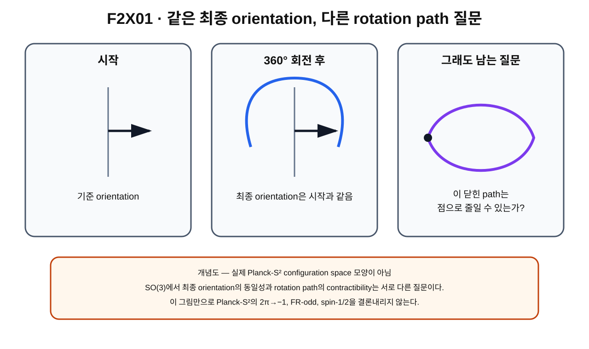

> **STATUS: DRAFT COMPLETE · AUDIT PENDING**
>
> 제2권 첫 초안이다. 작성 Chat은 독립 감사 PASS를 부여하지 않는다. 표준 SO(3) 수학, ideal/unquotiented Planck-S² mapping-space 정리, actual physical electron 해석을 서로 분리한다.

# 1장 · SO(3)과 물리적 회전 — 왜 360°가 단순해 보이지만 위상적으로는 문제가 생기는가

## 현재 상태

- **작성 상태:** DRAFT COMPLETE
- **감사 상태:** AUDIT PENDING
- **선행 권:** 제1권 전체 — 독립 감사 PASS
- **이 장의 역할:** 제1권의 loop/homotopy/fundamental group/$\mathbb Z_2$를 실제 3차원 회전 문제로 연결하기 위한 표준 수학 언어 준비
- **핵심 경계 1:** standard $SO(3)$ rotation topology와 Planck-S²의 physical configuration-space topology를 자동 동일시하지 않는다.
- **핵심 경계 2:** smooth unquotiented $\mathrm{Map}_1(S^2,S^2)$에서 특정 $2\pi$ spatial-rotation loop가 $\mathbb Z_2$ generator라는 프로젝트 결과는 **PROVED UNDER ASSUMPTIONS**이다.
- **핵심 경계 3:** actual physical configuration space $=$ ideal/unquotiented $\mathrm{Map}_1(S^2,S^2)$는 **OPEN**이다.
- **핵심 경계 4:** Gate C overall은 **OPEN**이다.
- **이 장에서 결론내리지 않는 것:** FR-odd $2\pi\to-1$, complete spin-$1/2$, electron identity

---

## 이번 장에서 알아낼 질문

1. 제1권에서 배운 loop, homotopy, fundamental group, $\mathbb Z_2$가 실제 회전 이야기와 어떻게 연결될까?
2. 물체의 **orientation**[^v2c01-orientation]과 물체가 거쳐 간 **rotation path**는 왜 다른 정보일까?
3. $SO(3)$[^v2c01-so3]는 무엇을 모아 놓은 공간이자 group일까?
4. 왜 360° 회전 뒤 물체의 orientation은 처음과 같을까?
5. 그런데 왜 “처음과 같은 orientation으로 돌아왔다”는 것만으로 회전 path가 trivial하다고 말할 수 없을까?
6. 표준 $SO(3)$에서는 360° loop와 720° loop가 위상적으로 어떻게 다른가?
7. 이 표준 회전 사실과 Planck-S² configuration-space 회전 loop 사이에는 어떤 추가 다리가 필요한가?
8. 왜 이 장을 끝내도 아직 $2\pi\to-1$, FR-odd, spin-$1/2$을 확정할 수 없을까?

---

## 앞 권에서 배운 것 · 제1권의 마지막 다섯 계단

제1권 마지막 부분을 아주 짧게 복습하자.

### 1. path

어떤 공간 $X$에서

$$
\gamma:[0,1]\to X
$$

는 공간 안의 점들이 연속적으로 이어지는 path였다.

### 2. loop

시작점과 끝점이 같으면

$$
\gamma(0)=\gamma(1)=x_0
$$

인 loop가 된다.

중요한 것은

> **끝점이 같다는 사실만으로 path 전체가 사라지는 것은 아니다.**

라는 점이었다.

### 3. homotopy

두 loop를 끊지 않고 연속적으로 서로 바꿀 수 있으면 같은 homotopy class로 묶었다.

$$
H:[0,1]\times[0,1]\to X
$$

는 “loop 자체가 어떻게 변하는가”를 나타내는 최소 수학 언어였다.

### 4. fundamental group

based loop들을 homotopy class로 묶고 이어붙이는 연산까지 기록하면

$$
\pi_1(X,x_0)
$$

이라는 fundamental group을 만들 수 있었다.

### 5. $\mathbb Z_2$

제1권에서는 두 class만 가진 group

$$
\mathbb Z_2=\{0,1\},
\qquad 1+1=0
$$

을 배웠다.

그리고 ideal/unquotiented degree-one mapping space에 대해

$$
\pi_1\!\left(\mathrm{Map}_1(S^2,S^2)\right)\cong\mathbb Z_2
$$

라는 결과가 frozen baseline의 명시된 가정 아래 **PROVED UNDER ASSUMPTIONS**임을 확인했다.

하지만 제1권은 바로 여기에서 멈췄다.

> “그렇다면 실제 360° 회전은 configuration space에서 어떤 loop를 만들까?”

이 질문이 제2권의 출발점이다.

---

## 왜 새로운 문제가 생겼을까? · 최종 모습과 지나온 과정은 다르다

책상 위에 화살표가 그려진 작은 상자가 있다고 하자.

상자를 손으로 한 바퀴, 즉 360° 돌린다.

회전이 끝나면 화살표는 처음 방향을 다시 가리킨다.

그래서 눈으로 최종 모습만 보면

> “처음과 완전히 똑같네. 그러면 아무 차이도 없는 것 아닌가?”

라고 생각하기 쉽다.

하지만 제1권에서 이미 배운 경고가 있다.

> **endpoint equality $\neq$ path triviality**

처음 orientation과 마지막 orientation이 같다는 것은 **회전의 끝점**에 관한 정보다.

반면 회전 중간에 orientation이 어떻게 계속 변했는지는 **path 전체**에 관한 정보다.

따라서 360° 회전 문제를 위상수학적으로 보려면 물어야 한다.

> 360° 뒤에 원래 orientation으로 돌아왔는가?

만이 아니라

> 그 회전 path 전체를, 시작과 끝을 고정한 채 아무 회전도 하지 않은 constant path로 연속적으로 줄일 수 있는가?

까지 물어야 한다.

이 질문 때문에 단순해 보이는 360° 회전이 위상수학 문제가 된다.

---

## 먼저 생각해 보기 · 시계바늘 사진 한 장과 동영상 전체

12시를 가리키는 시계바늘을 찍은 사진 A가 있다고 하자.

시계바늘이 한 바퀴 돈 뒤 다시 12시를 가리킬 때 사진 B를 찍는다.

사진 A와 B만 비교하면 바늘의 orientation은 같다.

하지만 두 사진 사이에는 서로 다른 동영상이 가능하다.

- 전혀 움직이지 않았을 수도 있다.
- 시계방향으로 한 바퀴 돌았을 수도 있다.
- 반시계방향으로 한 바퀴 돌았을 수도 있다.
- 여러 번 돌았다가 돌아왔을 수도 있다.

최종 사진만으로 중간의 path를 알 수 없다.

### 비유의 한계

시계바늘은 사실상 한 축 주위 회전만 보여 주므로 전체 3차원 회전 공간 $SO(3)$보다 훨씬 단순하다.

3차원 물체는 서로 다른 축을 따라 회전할 수 있고, 회전의 합성 순서도 중요해질 수 있다. 따라서 시계바늘 비유는 “최종 상태와 path는 다르다”는 한 가지 점만 설명한다.

---

## 그림으로 이해하기 · F2X01

**그림 F2X01. 360° 뒤 orientation이 처음과 같아도 rotation path의 contractibility는 별도 질문임을 보여 주는 개념도**

### [이 그림에서 볼 것]

- 시작 orientation과 360° 회전 뒤 orientation은 같다.
- 그러나 “회전했다”는 과정은 $SO(3)$ 안의 path로 기록할 수 있다.
- 시작과 끝이 같으므로 360° 회전 과정은 $SO(3)$ 안에서 loop가 된다.
- 그 loop가 점으로 줄어드는지는 endpoint만 보고 결정할 수 없다.

### [이 그림이 뜻하는 것]

“최종 orientation이 같다”와 “rotation path가 contractible하다”가 서로 다른 명제라는 뜻이다.

### [이 그림이 뜻하지 않는 것]

- 그림의 평면 곡선이 실제 $SO(3)$의 모양이라는 뜻이 아니다.
- actual Planck-S² configuration space가 이 그림처럼 생겼다는 뜻이 아니다.
- 360° 회전이 곧바로 Planck-S²의 physical $\mathbb Z_2$ generator라는 증명이 아니다.
- $2\pi\to-1$, FR-odd, spin-$1/2$이 이미 결론났다는 뜻이 아니다.

---

## SO(3)란 무엇일까? · 3차원 orientation들의 회전 group

3차원 공간에서 물체를 회전시키는 변환들을 모아 보자.

회전은 길이와 각도를 보존하고, 거울반사처럼 orientation을 뒤집지 않는다.

이러한 3차원 proper rotation[^v2c01-proper-rotation]들의 집합을

$$
SO(3)
$$

라고 부른다.

여기서 이름을 풀면

- $O$: orthogonal[^v2c01-orthogonal]
- $S$: special, 즉 determinant가 $+1$인 부분
- $(3)$: 3차원

이라는 뜻이다.

행렬로 쓰면

$$
SO(3)=\{R\in\mathbb R^{3\times3}:R^TR=I,\;\det R=1\}.
$$

이 식을 처음부터 계산할 필요는 없다.

초보자에게 중요한 번역은 다음이다.

> **$SO(3)$의 한 원소 $R$는 3차원 물체의 가능한 회전 하나를 나타낸다.**

그리고 회전 두 개를 차례로 수행하면 또 하나의 회전이 되므로 $SO(3)$는 group이다.

---

## “SO(3)의 한 점”이라는 말

제1권에서 configuration space의 “점”이 실제 작은 점을 뜻하지 않을 수 있다는 것을 배웠다.

$SO(3)$에서도 비슷하다.

$SO(3)$를 하나의 공간처럼 볼 때 그 공간의 한 점은

> **특정한 3차원 orientation/rotation 상태 하나**

를 뜻한다.

예를 들어 어떤 기준 orientation을 identity rotation[^v2c01-identity-rotation]

$$
I
$$

라고 하자.

물체를 회전시키지 않은 상태가 $I$다.

회전을 계속 변화시키면

$$
R(t)\in SO(3)
$$

라는 path를 만들 수 있다.

즉 회전의 “시간 순서”를 실제 시간이라고 확정하지 않고도, 단순한 path parameter $t$로 orientation들의 연속 family를 기록할 수 있다.

---

## 물리적 회전과 좌표 회전은 구분할 수 있다

회전을 이야기할 때는 한 가지 언어적 주의가 필요하다.

### active rotation

물체 자체를 실제로 돌린다고 생각한다.

### passive rotation

물체는 그대로 두고 좌표축을 돌려 같은 상황을 다른 좌표로 표현한다고 생각한다.

이 둘은 수학적으로 밀접하게 연결되지만 해석의 방향이 다르다.[^v2c01-active-passive]

이 책에서 “spatial rotation path”라고 할 때는 우선 **configuration에 작용하는 물리적 공간회전의 후보 작용**을 생각한다.

하지만 Planck-S²에서 그 회전 작용이 실제 physical electron degrees of freedom에 어떻게 구현되는지는 Gate C와 3+1D matching 문제까지 포함하므로 아직 전체적으로 **OPEN**이다.

---

## 가장 단순한 예 · 한 축 주위 회전

$z$축을 고정하고 각도 $\theta$만큼 회전한다고 하자.

행렬은

$$
R_z(\theta)=
\begin{pmatrix}
\cos\theta & -\sin\theta & 0\\
\sin\theta & \cos\theta & 0\\
0&0&1
\end{pmatrix}
$$

처럼 쓸 수 있다.

$\theta=0$이면

$$
R_z(0)=I.
$$

한 바퀴인 $2\pi$만큼 돌리면

$$
R_z(2\pi)=I
$$

다.

즉 시작과 끝의 rotation matrix는 같다.

따라서

$$
\gamma(\theta)=R_z(\theta),
\qquad 0\le\theta\le2\pi
$$

는 $SO(3)$ 안에서 시작점과 끝점이 $I$인 loop를 만든다.

이것이 “360° 회전은 loop다”라는 말의 최소 수학적 뜻이다.

---

## 그런데 왜 360°가 위상적으로 단순하지 않을까?

여기서 제1권의 homotopy 질문을 그대로 가져온다.

360° 회전 loop를

$$
\gamma_{2\pi}
$$

라고 하자.

질문은

> $\gamma_{2\pi}$가 constant loop와 homotopic한가?

이다.

표준 $SO(3)$ topology에서는 답이 **아니다**.

360° 회전 loop는 noncontractible이다.

반면 같은 방향으로 한 바퀴를 더 돌아 총 720°가 되는 loop는, 즉 360° loop를 두 번 이어붙인 loop는 contractible하다.

이 표준 결과를 group language로 쓰면

$$
\pi_1(SO(3))\cong\mathbb Z_2
$$

이다.[^v2c01-so3-pi1]

초보자 번역은 다음과 같다.

> **3차원 회전 공간에서는 ‘아무것도 하지 않은 loop 종류’와 ‘한 번 꼬인 loop 종류’라는 두 위상적 class가 있고, nontrivial class를 두 번 합치면 trivial class가 된다.**

---

## 360°와 720° 차이의 직관적 토대

이제 세 문장을 분리하자.

### 문장 A · 최종 orientation

360° 뒤에는 처음 orientation으로 돌아온다.

$$
R(2\pi)=R(0).
$$

### 문장 B · 360° rotation path

그럼에도 360°를 수행하는 동안 생긴 loop는 표준 $SO(3)$에서 noncontractible하다.

### 문장 C · 720° rotation path

360° loop를 두 번 이어붙인 720° loop는 표준 $SO(3)$에서 contractible하다.

이 세 문장은 서로 모순이 아니다.

A는 **끝점**을 말하고,
B와 C는 **path의 homotopy class**를 말한다.

이것이 360°/720° 차이를 이해하는 가장 중요한 토대다.

---

## “720°면 물체가 두 번 돌아서 특별하다”가 핵심은 아니다

720°가 특별하다는 말을 단순히 회전 횟수의 숫자 놀음으로 이해하면 안 된다.

핵심은

$$
[\gamma_{2\pi}]\neq e,
$$

하지만

$$
[\gamma_{2\pi}]*[\gamma_{2\pi}]=e
$$

처럼 nontrivial loop class가 order 2를 가진다는 topology다.

여기서 $e$는 constant-loop class다.

즉 720°가 contractible한 것은 “2라는 숫자가 특별해서”가 아니라 $SO(3)$의 fundamental group이 $\mathbb Z_2$ 구조를 갖기 때문이다.

---

## 벨트 트릭은 무엇을 보여 주는가?

360°/720° 차이를 직관적으로 보여 주는 유명한 설명으로 belt trick[^v2c01-belt-trick] 또는 plate trick이 있다.

한쪽 끝이 주변 환경에 연결된 물체를 360° 돌리면 연결된 띠나 팔에 꼬임이 남는 것처럼 보인다. 720°까지 돌리면 물체 자체를 역회전시키지 않고 주변의 변형을 이용해 꼬임을 풀 수 있는 동작이 가능하다.

이 비유는 $SO(3)$의 nontrivial loop와 double traversal의 contractibility를 직관적으로 이해하는 데 도움을 준다.

### 비유의 한계

벨트 트릭 자체가 Planck-S² field configuration의 topology를 증명하는 것은 아니다.

벨트, 팔, 끈은 3차원 물리 공간에 놓인 구체적인 물체다. Planck-S²의 configuration space는 함수들을 원소로 갖는 이상적인 mapping space 후보이며 실제 physical space와의 동일성도 아직 OPEN이다.

따라서

> belt trick이 된다

에서 바로

> Planck-S² electron의 2π loop가 physical generator다

로 점프하면 안 된다.

---

## SO(3)의 표준 topology와 Planck-S²의 topology는 같은 문제가 아니다

여기서 매우 중요한 층 분리를 하자.

### 층 1 · 표준 rotation group $SO(3)$

$SO(3)$ 자체의 표준 수학에서는

$$
\pi_1(SO(3))\cong\mathbb Z_2
$$

이고 360° fixed-axis rotation loop가 nontrivial class를 나타내며 두 번 이어진 720° loop는 trivial class가 된다.

이것은 표준 수학의 결과다.

### 층 2 · ideal Planck-S² mapping space

Planck-S² frozen baseline에서는

$$
\mathcal C_1=\mathrm{Map}_1(S^2,S^2)
$$

라는 ideal/unquotiented degree-one mapping space를 연구했다.

이 공간에 대해서도

$$
\pi_1(\mathcal C_1)\cong\mathbb Z_2
$$

가 **PROVED UNDER ASSUMPTIONS**다.

그리고 더 구체적으로, smooth unquotiented $\mathrm{Map}_1$에서 표준 spatial $2\pi$ rotation loop가 그 $\mathbb Z_2$ generator라는 결과도 frozen baseline에서 **PROVED UNDER ASSUMPTIONS**다.

### 층 3 · actual physical electron configuration space

그러나

$$
\text{actual physical configuration space}
=
\mathrm{Map}_1(S^2,S^2)
$$

는 **OPEN**이다.

따라서 층 2의 결과를 실제 전자의 무조건적 theorem으로 승격할 수 없다.

---

## 같은 Z₂가 보인다고 같은 공간은 아니다

$SO(3)$와 ideal $\mathrm{Map}_1(S^2,S^2)$에서 모두 $\mathbb Z_2$라는 fundamental-group 구조가 등장할 수 있다.

하지만

> 두 공간의 $\pi_1$가 둘 다 $\mathbb Z_2$다

와

> 두 공간이 같은 공간이다

는 전혀 다른 말이다.

fundamental group은 공간의 일부 topology 정보를 담지만 공간 전체를 완전히 결정하지 않는다.

제1권 14장에서 이미 “같은 fundamental group을 가진 서로 다른 공간이 있을 수 있다”고 배웠다.

따라서 $SO(3)$와 $\mathrm{Map}_1$을 단순히 같은 것으로 취급하지 않는다.

---

## Planck-S²에서 “공간회전”은 field에 어떻게 작용할까?

이 장에서는 아직 정식 식을 전개하지 않지만 다음 질문을 준비한다.

field가

$$
n:S^2_{\rm domain}\to S^2_{\rm target}
$$

라면, 물리적 spatial rotation은 domain 쪽 좌표를 회전시켜 새로운 field configuration을 만들 수 있다.

즉 회전 $R$에 따라

$$
n\longmapsto n_R
$$

라는 configuration-space action[^v2c01-group-action]을 생각할 수 있다.

다음 장들에서는 이 action을 더 정확히 써서

> 실제 360° 공간회전이 $\mathrm{Map}_1$ 안에서 어떤 loop를 만드는가?

를 추적하게 된다.

하지만 여기서 중요한 경계가 있다.

- spatial rotation과 target rotation은 같은 개념이 아니다.
- current n-only model의 target $SO(3)$ global symmetry와 external physical spatial rotation을 자동 동일시하지 않는다.
- 어떤 자유도를 quotient할지에 따라 configuration-space topology가 달라질 수 있다.

이 문제가 바로 Gate C와 연결된다.

---

## Gate C가 왜 벌써 등장할까?

Gate C overall은 현재 **OPEN**이다.

C02 이후 frozen baseline에서 살아남은 좁은 model-level statement는 있다.

현재 unreduced n-only CP¹ branch에서 constant target $SO(3)$는 global Noether symmetry로 분류되는 model statement가 **PROVED UNDER ASSUMPTIONS** 범위에서 살아남는다.

하지만 이것만으로는 다음을 확정할 수 없다.

- target $SO(3)$가 실제 electron의 physical internal symmetry인가?
- 어떤 target directions가 observable인가?
- 어떤 자유도를 physical quotient해야 하는가?
- spatial rotation과 target rotation이 quantum theory에서 어떻게 lift되는가?
- external 3+1D physical rotation과 정확히 어떻게 matching되는가?

그래서 Gate C overall은 계속 **OPEN**이다.

이 OPEN을 무시하면 ideal mapping-space topology를 actual electron topology로 잘못 승격하게 된다.

---

## 왜 아직 2π→−1을 말하지 않는가

여기서 독자는 가장 궁금한 질문을 떠올릴 수 있다.

> “360° loop가 nontrivial하고 $\mathbb Z_2$라면, 이제 바로 $-1$이 나오는 것 아닌가?”

아니다.

$\mathbb Z_2$의 nontrivial loop class와 quantum phase $-1$은 **서로 다른 종류의 객체**다.

제1권에서 이미

$$
\mathbb Z_2\neq\{+1,-1\}\text{ phase itself}
$$

라는 경계를 배웠다.

loop class에 $-1$을 대응시키려면 wavefunction이 configuration space의 topology를 어떻게 반영하는지 정하는 추가 양자화 구조가 필요하다.

그 뒤에 등장하는 것이 FR quantization[^v2c01-fr]과 character/line-bundle 문제다.

현재 frozen baseline에서 FR-odd $2\pi\to-1$은 **CONDITIONAL**이다.

따라서 이 장에서는

> 360°/720°의 topology를 이해했다

까지만 말하고

> 360°면 wavefunction이 반드시 $-1$이 된다

라고는 말하지 않는다.

---

## 왜 아직 spin-1/2도 말하지 않는가

$2\pi\to-1$조차 아직 무조건적 결론이 아니므로 complete spin-$1/2$은 더 강한 주장이다.

또 설령 half-integer representation sector가 허용되더라도

$$
j=\frac12,\frac32,\frac52,\ldots
$$

가운데 실제 ground state가 $j=1/2$인지 알려면 dynamics가 더 필요하다.

canonical proof ledger에서

- FR-odd $2\pi\to-1$: **CONDITIONAL**
- half-integer rotation sector: **CONDITIONAL**
- complete spin-$1/2$ / $j=1/2$ ground: **OPEN**

이다.

따라서

> $SO(3)$ topology를 배웠다

$\neq$

> electron spin-$1/2$을 증명했다

이다.

---

## 현재 판정

| 주장/항목 | 상태 | 정확한 범위 |
|---|---|---|
| $SO(3)$가 3차원 proper rotation group이라는 표준 정의 | **SOURCE VERIFIED** | 표준 수학/물리의 rotation-group 정의 |
| 표준 $SO(3)$에서 360° loop noncontractible, 720° double loop contractible | **SOURCE VERIFIED** | 표준 $SO(3)$ topology |
| $\pi_1(SO(3))\cong\mathbb Z_2$ | **SOURCE VERIFIED** | 표준 위상수학 |
| ideal/unquotiented $\pi_1(\mathrm{Map}_1(S^2,S^2))\cong\mathbb Z_2$ | **PROVED UNDER ASSUMPTIONS** | frozen baseline의 smooth/compact-open mapping-space assumptions |
| smooth unquotiented $\mathrm{Map}_1$의 standard spatial $2\pi$ rotation loop가 $\mathbb Z_2$ generator | **PROVED UNDER ASSUMPTIONS** | G03/A01 수리 결과의 ideal/unquotiented 범위 |
| actual physical configuration space $=$ ideal/unquotiented $\mathrm{Map}_1$ | **OPEN** | completion/finite-energy/EFT-valid subset/ontology/quotient 미폐쇄 |
| Gate C overall | **OPEN** | target ontology, quotient, quantum lift, 3+1D matching 미폐쇄 |
| FR-odd $2\pi\to-1$ | **CONDITIONAL** | 올바른 physical space와 quantum lift/FR 선택 등 추가 조건 필요 |
| complete spin-$1/2$ / $j=1/2$ ground | **OPEN** | topology만으로 자동 선택되지 않음 |
| 전체 Planck-S² | **WORKING HYPOTHESIS** | 전체 electron theory 미완성 |

---

## 이것으로 말할 수 있는 것

1. 3차원 orientation-preserving rotations는 $SO(3)$라는 group/space로 정리할 수 있다.
2. 360° 회전은 최종 orientation만 보면 identity로 돌아오므로 $SO(3)$ 안의 loop가 된다.
3. 표준 $SO(3)$에서 그 360° loop는 noncontractible이고, 두 번 이어진 720° loop는 contractible하다.
4. endpoint equality와 path contractibility는 서로 다른 질문이다.
5. ideal smooth/unquotiented Planck-S² mapping-space에서는 특정 spatial $2\pi$ rotation-loop generator 결과가 명시된 가정 아래 존재한다.

---

## 이것으로 말할 수 없는 것

1. 실제 electron의 physical configuration space가 ideal $\mathrm{Map}_1$이라고 확정할 수 없다.
2. $SO(3)$의 표준 360° loop 사실만으로 Planck-S²의 physical rotation loop를 확정할 수 없다.
3. $\mathbb Z_2$ nontrivial class를 quantum phase $-1$과 직접 동일시할 수 없다.
4. $2\pi\to-1$을 무조건적 결론으로 쓸 수 없다.
5. complete spin-$1/2$ 또는 $j=1/2$ ground를 얻었다고 말할 수 없다.
6. electron identity, charge $-e$, QED, Fermi statistics가 따라왔다고 말할 수 없다.

---

## 자주 하는 오해

### 오해 1 · “360° 뒤 모습이 같으니 경로도 아무것도 아니다.”

아니다. 같은 endpoint로 돌아오는 것과 loop가 contractible한 것은 다른 조건이다.

### 오해 2 · “SO(3)의 360° loop가 nontrivial하니 모든 회전 문제에서 360°가 무조건 nontrivial하다.”

아니다. 어떤 configuration space와 어떤 group action을 사용하고 어떤 quotient를 취하는지에 따라 실제 문제의 loop topology는 달라질 수 있다.

### 오해 3 · “720°가 특별한 이유는 두 바퀴라서다.”

핵심은 단순한 숫자 2가 아니라 $SO(3)$ fundamental group의 order-2 topology다.

### 오해 4 · “$\mathbb Z_2$면 곧 $\pm1$ phase다.”

아니다. group element와 wavefunction phase를 연결하는 representation/FR 구조가 추가로 필요하다.

### 오해 5 · “smooth Map₁의 rotation generator가 증명됐으니 실제 전자도 끝났다.”

아니다. 그 결과는 **PROVED UNDER ASSUMPTIONS**이고 actual physical configuration space identification은 **OPEN**이다.

### 오해 6 · “Gate C의 target SO(3) symmetry가 있으니 spatial rotation과 같은 것이다.”

아니다. target action과 external spatial rotation은 구분해야 하며, Gate C overall은 **OPEN**이다.

---

## 다음 장이 필요한 이유

우리는 이제 “3차원 회전의 집합”을 $SO(3)$로 보고, 360°와 720°가 단순히 최종 orientation이 같은가만으로 구분되지 않는다는 것을 이해했다.

하지만 아직 다음 질문이 남는다.

> 3차원 회전을 실제로 어떻게 parameterize하고, 서로 다른 회전축을 가진 rotation들을 하나의 공간으로 어떻게 이해할까?

그리고 더 중요하게는

> 이 spatial rotation을 Planck-S² field $n:S^2\to S^2$에 작용시키면 configuration space 안에서 어떤 path가 만들어질까?

다음 장에서는 3축 회전과 $SO(3)$의 구조를 조금 더 구체적으로 시각화한다. 이후에야 physical rotation이 field configuration을 어떻게 움직이는지 단계적으로 연결한다.

**제2장 본문은 제1장 독립 감사 PASS 전에는 시작하지 않는다.**

---

## 한 문장 기억

> **360° 뒤 orientation이 처음과 같다는 사실은 끝점에 관한 말이고, 그 360° rotation path가 위상적으로 trivial한지는 별도의 homotopy 질문이다.**

---

## 용어 카드

| 용어 | 이 장에서의 뜻 |
|---|---|
| **orientation** | 3차원 물체가 어떤 방향으로 놓여 있는지를 나타내는 회전 상태 |
| **$SO(3)$** | 3차원 proper rotations의 group |
| **identity rotation $I$** | 아무 회전도 하지 않은 기준 rotation |
| **rotation path $R(t)$** | $SO(3)$ 안에서 rotation 상태가 연속적으로 변하는 경로 |
| **360° / $2\pi$ loop** | identity에서 출발해 한 바퀴 회전 후 identity로 돌아오는 rotation path |
| **720° / $4\pi$ loop** | 360° loop를 두 번 이어붙인 rotation path |
| **contractible** | loop를 기준점을 유지하며 constant loop로 연속변형할 수 있음 |
| **spatial rotation** | domain/물리 공간의 회전 작용을 뜻하는 말; target rotation과 구분 필요 |
| **group action** | group 원소가 공간의 상태를 다른 상태로 보내는 일관된 규칙 |
| **Gate C** | target symmetry의 physical ontology/quotient/lift/matching을 감사하는 현재 OPEN 문제 |

---

## 확인문제

### 문제 1

360° 회전 뒤 물체의 orientation이 처음과 같다는 사실만으로 rotation path가 contractible하다고 결론낼 수 있는가?

### 문제 2

$SO(3)$의 한 “점”은 무엇을 뜻하는가?

A. 물리 공간의 위치 한 점  
B. 특정 3차원 rotation/orientation 하나  
C. 전자 한 개  
D. quantum phase 하나

### 문제 3

다음 두 식이 말하는 내용의 차이를 설명하라.

$$
R(2\pi)=R(0)
$$

과

$$
[\gamma_{2\pi}]=e.
$$

### 문제 4

표준 $SO(3)$에서 360° loop와 720° loop의 contractibility는 어떻게 다른가?

### 문제 5

$\pi_1(SO(3))\cong\mathbb Z_2$라는 사실과 actual physical Planck-S² configuration space가 $\mathrm{Map}_1$이라는 주장은 왜 별개의 문제인가?

### 문제 6

현재 frozen baseline에서 smooth unquotiented $\mathrm{Map}_1$의 standard spatial $2\pi$ rotation-loop generator 결과의 상태는 무엇인가?

A. PROVED  
B. PROVED UNDER ASSUMPTIONS  
C. OPEN  
D. FALSIFIED AS WRITTEN

### 문제 7

왜 $\mathbb Z_2$의 nontrivial loop class에서 바로 quantum phase $-1$을 결론낼 수 없는가?

### 문제 8

Gate C overall의 현재 상태와, 그 상태가 회전 문제에서 중요한 이유를 설명하라.

---

## 정답과 설명

### 1번 정답

결론낼 수 없다. orientation이 처음으로 돌아왔다는 것은 endpoint equality이고, contractibility는 loop 전체를 constant loop로 homotopy할 수 있는지에 관한 더 강한 조건이다.

### 2번 정답: B

$SO(3)$를 공간으로 볼 때 한 점은 특정한 3차원 rotation/orientation 하나다.

### 3번 정답

첫 식은 rotation path의 시작과 끝 orientation이 같다는 뜻이다. 두 번째 식은 그 loop의 homotopy class가 identity class라는 훨씬 더 강한 위상적 주장이다. 표준 $SO(3)$의 360° loop에서는 첫 식은 성립하지만 두 번째는 성립하지 않는다.

### 4번 정답

표준 $SO(3)$에서 360° loop는 noncontractible이고, 같은 loop를 두 번 이어붙인 720° loop는 contractible하다.

### 5번 정답

$SO(3)$는 3차원 rotations의 표준 group이고 $\mathrm{Map}_1(S^2,S^2)$는 degree-one maps의 함수공간이다. fundamental group이 같은 $\mathbb Z_2$ 구조를 가질 수 있어도 두 공간 자체가 같다는 뜻은 아니다. 게다가 actual physical Planck-S² configuration space와 ideal Map₁의 동일성은 현재 OPEN이다.

### 6번 정답: B

**PROVED UNDER ASSUMPTIONS**이다. smooth unquotiented ideal mapping-space 설정과 frozen baseline의 명시 조건 안에서만 사용한다.

### 7번 정답

loop class는 topology의 group element이고 quantum phase는 wavefunction에 작용하는 수다. 둘을 연결하려면 FR character/representation 같은 추가 양자화 구조가 필요하다. 현재 FR-odd $2\pi\to-1$은 CONDITIONAL이다.

### 8번 정답

Gate C overall은 **OPEN**이다. target ontology, physical quotient, quantum lift, external 3+1D spatial rotation matching 등이 닫히지 않았기 때문에 ideal rotation-loop theorem을 실제 electron의 무조건적 physical theorem으로 승격할 수 없다.

---

## 이 장의 근거 자료

| 자료 | 위치/역할 | 종류 |
|---|---|---|
| **제1권 마무리** | loop → homotopy → $\pi_1$ → $\mathbb Z_2$ 복습과 Volume 2 진입 경계 | [교과서 선행 권 · PASS] |
| **G03 — Planck-S² v0.3** | spatial $2\pi$ rotation loop와 mapping-space generator 연결 시도의 원 연구 | [일반 연구] |
| **A01 — 일반연구 MASTER 전수 적대적 논리감사** | G03 proof gap 수리 및 smooth unquotiented Map₁ generator 결과의 assumption-scoped 판정 | [적대적 감사] |
| **C01 / C02 — Gate C 검증·적대적 감사** | target SO(3) model statement, quotient/ontology/physical matching 경계, Gate C overall OPEN | [검증/적대적 감사] |
| **sources/proof-status.md** | generator / physical Map₁ / FR / spin / Gate C의 canonical 상태 | [프로젝트 상태] |
| **Wolfram MathWorld — Rotation Group / Special Orthogonal Group** | $SO(3)$의 standard rotation-group 정의와 determinant-one orthogonal formulation | [외부 표준 source · SOURCE VERIFIED] |
| **John Baez, Lie Theory Through Examples, Lecture 5** | $\pi_1(SO(3))\cong\mathbb Z_2$, 360°/720° loop 직관 교차확인 | [외부 표준 source · SOURCE VERIFIED] |

> 외부 표준 source는 $SO(3)$ 자체의 수학을 확인하기 위한 자료다. 그것이 Planck-S²의 physical electron interpretation을 검증하는 자료는 아니다.

---

## 제2권 제1장 제작 기록

- **Canonical file:** `volume-2/01-so3-physical-rotation.md`
- **추가 그림:** `figures/volume-2/F2X01.svg`
- **제1권 선행 상태:** FINAL AUDIT PASS
- **standard SO(3) 정의/topology:** SOURCE VERIFIED
- **smooth unquotiented Map₁ spatial $2\pi$ rotation-loop generator:** PROVED UNDER ASSUMPTIONS
- **actual physical configuration space = ideal Map₁:** OPEN
- **Gate C overall:** OPEN
- **FR-odd $2\pi\to-1$:** CONDITIONAL — 이 장에서 결론내리지 않음
- **complete spin-$1/2$ / $j=1/2$ ground:** OPEN
- **전체 Planck-S²:** WORKING HYPOTHESIS
- **작성 Chat 자체 PASS:** 부여하지 않음
- **현재 상태:** DRAFT COMPLETE · AUDIT PENDING
- **다음 작업:** Independent audit of Volume 2 Chapter 1
- **DO NOT START:** Volume 2 Chapter 2 before Chapter 1 independent audit PASS

[^v2c01-orientation]: 물체가 공간에서 어떤 방향으로 놓여 있는지를 나타내는 상태. 위치가 같아도 orientation은 다를 수 있다.

[^v2c01-so3]: `SO(3)`는 3차원에서 길이와 각도를 보존하고 거울반사를 포함하지 않는 회전들을 모은 group이다. 동시에 이 회전들을 연속적으로 변화시킬 수 있으므로 하나의 위상공간처럼 다룰 수 있다.

[^v2c01-proper-rotation]: 거울반사처럼 손잡이 방향을 뒤집지 않는 순수 회전. 행렬에서는 determinant가 $+1$인 orthogonal transformation으로 나타난다.

[^v2c01-orthogonal]: 행렬이 길이와 각도를 보존한다는 조건을 나타내는 말. 회전행렬 $R$에서는 $R^TR=I$로 쓸 수 있다.

[^v2c01-identity-rotation]: 물체를 전혀 돌리지 않는 회전. group에서 다른 회전과 합성해도 그 회전을 바꾸지 않는 identity 원소다.

[^v2c01-active-passive]: active rotation은 물체를 돌리는 관점이고 passive rotation은 좌표계를 바꾸는 관점이다. 같은 기하 상황을 서로 반대 방향의 행렬 convention으로 표현할 수 있어 계산에서는 convention을 분명히 해야 한다.

[^v2c01-so3-pi1]: 엄밀하게는 이 문장은 $SO(3)$의 fundamental group이 두 원소 cyclic group과 isomorphic하다는 뜻이다. 이 표준 수학 결과가 Planck-S²의 actual physical configuration space의 fundamental group을 자동 결정하지는 않는다.

[^v2c01-belt-trick]: 360°와 720° 회전 path의 위상적 차이를 끈·띠·팔의 움직임으로 보여 주는 유명한 직관적 시연. 시연은 $SO(3)$ topology의 이해를 돕지만 특정 field theory의 physical configuration-space theorem을 대신하지 않는다.

[^v2c01-group-action]: group의 각 원소가 어떤 공간의 원소를 다른 원소로 보내면서, group의 합성 규칙과 일관되게 작용하는 구조. 쉽게 말해 “회전을 한 뒤 또 회전한 결과”와 “두 회전을 먼저 합친 뒤 한 번에 작용한 결과”가 맞아야 한다.

[^v2c01-fr]: Finkelstein–Rubinstein quantization. configuration space의 nontrivial topology를 양자 wavefunction의 boundary condition/character와 연결하는 방법이다. 제2권 뒤에서 조건과 감사 이력을 포함해 정식으로 다룬다.
