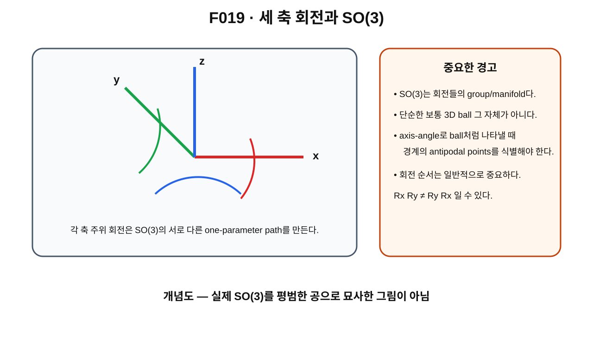

> **STATUS: DRAFT COMPLETE · AUDIT PENDING**
>
> VOLUME 2 FULL BATCH DRAFT MODE에서 작성한 초안이다. 작성 Chat은 PASS를 부여하지 않는다. 이 장은 표준 3차원 회전군 $SO(3)$의 언어를 준비하며 Planck-S²의 physical configuration-space topology를 확정하지 않는다.

# 2장 · 세 축으로 돌린다는 것 — 3차원 회전과 SO(3)

## 현재 상태

- **작성 상태:** DRAFT COMPLETE
- **감사 상태:** AUDIT PENDING
- **선행 장 사용 방식:** 제1장 초안의 orientation/path 구분을 사용하되 표준 source와 canonical proof ledger를 우선한다.
- **핵심 경계:** $SO(3)$의 표준 수학과 Planck-S² physical state space는 같은 객체가 아니다.

---

## 이번 장에서 알아낼 질문

1. 3차원에서는 왜 한 축 회전만 알아서는 부족할까?
2. $x,y,z$축 회전은 행렬로 어떻게 표현할까?
3. 회전 두 개를 연달아 하는 composition은 왜 다시 회전일까?
4. identity와 inverse는 회전에서 무엇을 뜻할까?
5. 왜 3차원 회전은 일반적으로 순서를 바꾸면 결과가 달라질까?
6. $SO(3)$를 orientation들의 공간으로 보면 무엇이 보일까?
7. axis-angle[^v2c02-axis-angle] 표현은 왜 유용하고, 왜 $SO(3)$를 단순한 보통 3차원 공이라고 말하면 안 될까?

---

## 앞 장에서 배운 것

제1장에서는 물체의 최종 orientation과 그 orientation에 도달하는 rotation path를 구분했다.

360° 뒤에는 orientation이 처음과 같을 수 있지만, 그것만으로 path가 constant path와 homotopic하다고 결론낼 수 없었다.

이제 그 path들이 실제로 놓이는 표준 회전 공간 $SO(3)$를 조금 더 자세히 본다.

---

## 왜 한 축만 보면 부족할까?

시계바늘은 거의 한 축만 생각하면 된다. 하지만 책, 휴대전화, 정육면체 같은 3차원 물체는 다양한 축 주위로 돌릴 수 있다.

- 좌우로 기울이는 회전
- 앞뒤로 숙이는 회전
- 수직축 주위로 도는 회전

이들을 좌표축에 맞춰 $x,y,z$축 회전이라고 부를 수 있다.

중요한 점은 **서로 다른 축의 회전을 이어서 했을 때 순서가 결과에 영향을 줄 수 있다**는 것이다. 이것이 3차원 회전군이 단순한 숫자 각도 하나의 덧셈보다 복잡한 이유다.

---

## 그림으로 이해하기 · F019

**그림 F019. 세 축 주위 회전과 $SO(3)$의 구조를 위한 개념도**

### [이 그림에서 볼 것]

- $x,y,z$축 각각에 대해 회전 path를 생각할 수 있다.
- 서로 다른 축의 회전은 서로 다른 방향의 변화다.
- 회전들의 전체를 하나의 group이자 manifold[^v2c02-manifold]로 생각할 수 있다.

### [이 그림이 뜻하는 것]

$SO(3)$는 3차원 물체의 가능한 proper rotation들을 모은 공간이며, 회전 합성이 group operation을 이룬다는 직관을 준다.

### [이 그림이 뜻하지 않는 것]

- $SO(3)$가 그림 속 평범한 3차원 공이라는 뜻이 아니다.
- $x,y,z$ 세 숫자를 아무 범위로나 고르면 중복 없이 모든 회전을 표현한다는 뜻이 아니다.
- Planck-S²의 실제 configuration space가 $SO(3)$ 그 자체라는 뜻도 아니다.

---

## 최소한의 수학 · 세 축 회전행렬

각도 $\theta$만큼의 대표 회전은 다음처럼 쓸 수 있다.

$$
R_x(\theta)=
\begin{pmatrix}
1&0&0\\
0&\cos\theta&-\sin\theta\\
0&\sin\theta&\cos\theta
\end{pmatrix},
$$

$$
R_y(\theta)=
\begin{pmatrix}
\cos\theta&0&\sin\theta\\
0&1&0\\
-\sin\theta&0&\cos\theta
\end{pmatrix},
$$

$$
R_z(\theta)=
\begin{pmatrix}
\cos\theta&-\sin\theta&0\\
\sin\theta&\cos\theta&0\\
0&0&1
\end{pmatrix}.
$$

이 행렬들은 길이와 각도를 보존하고 determinant[^v2c02-determinant]가 $+1$이다.

그래서 표준 정의는

$$
SO(3)=\{R\in\mathbb R^{3\times3}:R^TR=I,\det R=1\}
$$

이다.

---

## composition · 회전 다음에 회전

먼저 $R_1$, 그 다음 $R_2$를 적용하면 전체 변환은

$$
R_2R_1
$$

이다.

두 proper rotation의 곱도 proper rotation이므로 다시 $SO(3)$ 안에 있다.

이것이 group의 **closure**다.

아무 회전도 하지 않는 행렬

$$
I
$$

는 identity이고, 어떤 회전 $R$에는 되돌리는 inverse

$$
R^{-1}=R^T
$$

가 있다.

---

## noncommutativity · 순서가 중요하다

3차원 회전의 중요한 특징은 일반적으로

$$
R_x(\alpha)R_y(\beta)
\neq
R_y(\beta)R_x(\alpha)
$$

라는 것이다.

이 성질을 **noncommutativity**[^v2c02-noncommutative]라고 한다.

작은 상자를 직접 생각해 보자. 먼저 앞으로 90° 돌린 뒤 옆으로 90° 돌리는 것과, 옆으로 먼저 돌린 뒤 앞으로 돌리는 것은 최종 윗면 방향이 다를 수 있다.

즉 $SO(3)$는 일반적인 덧셈처럼 순서를 바꾸어도 항상 같은 group이 아니다.

---

## SO(3)를 orientation space로 보기

$SO(3)$의 원소 하나를 특정 orientation 하나로 생각할 수 있다.

그러면 연속 회전

$$
R:[0,1]\to SO(3),\qquad t\mapsto R(t)
$$

은 orientation space 안의 path다.

이 표현은 제1권의 path 언어와 정확히 맞물린다.

- $R(0)$: 시작 orientation
- $R(1)$: 끝 orientation
- 중간 $R(t)$: 중간 orientation

시작과 끝이 모두 identity면 rotation loop가 된다.

---

## axis-angle 표현

3차원 proper rotation 하나는 회전축의 방향과 회전각을 사용해 표현할 수 있다.

단위축을 $\hat a$라고 하고 각도를 $\theta$라고 하자.

그러면 회전을 개념적으로

> “$\hat a$축 주위로 $\theta$만큼 회전”

이라고 지정할 수 있다.

이를 axis-angle representation이라고 한다.

이 표현을 이용하면 $\theta\in[0,\pi]$의 회전을 반지름 $\theta$인 벡터처럼 그려 $SO(3)$를 3차원 ball로 **표현하는 방법**이 생긴다.

하지만 여기서 매우 중요한 식별이 있다.

$$
(\hat a,\pi)\sim(-\hat a,\pi).
$$

180° 회전에서는 반대 방향 축이 같은 회전을 나타내기 때문이다.

따라서 ball의 경계면에서는 antipodal points[^v2c02-antipodal]를 서로 붙여야 한다.

이 때문에

> **$SO(3)$는 평범한 닫힌 3-ball 그 자체가 아니다.**

표준 위상수학에서는

$$
SO(3)\cong\mathbb{RP}^3
$$

로 이해할 수 있다.[^v2c02-rp3]

---

## 왜 이 경계 식별이 중요한가

일반적인 3-ball 안에서는 모든 loop가 쉽게 줄어드는 것처럼 생각하기 쉽다.

하지만 경계의 반대점들을 서로 식별하면 공간의 global topology가 달라진다.

이 변화 때문에 다음 장에서

- 360° 회전 loop
- 720° 회전 loop

가 서로 다른 homotopy 행동을 보이게 된다.

---

## standard/source result

표준 Lie group·위상수학 문헌에서 다음을 확인할 수 있다.

- $SO(3)$는 3차원 proper rotation group이다.
- axis-angle 표현에서 반지름 $\pi$인 ball의 antipodal boundary identification으로 $SO(3)\cong\mathbb{RP}^3$를 볼 수 있다.
- $SO(3)$는 비가환 group이다.

이들은 Planck-S²의 새 발견이 아니라 **SOURCE VERIFIED** 표준 수학이다.

---

## Planck-S²에서는

Planck-S²에서 중요한 것은 $SO(3)$라는 표준 회전군이 candidate field configuration에 어떻게 작용하는가다.

하지만 아직 두 종류의 $SO(3)$를 섞으면 안 된다.

1. **spatial $SO(3)$** — domain의 물리적 공간 방향을 회전시키는 작용
2. **target $SO(3)$** — target $S^2$ 값들을 회전시키는 내부 model action

현재 Gate C overall은 **OPEN**이고, 이 둘의 physical interpretation·quotient·external 3+1D matching은 완전히 닫히지 않았다.

제4장에서 이 차이를 수식으로 직접 본다.

---

## 현재 판정

| 주장 | 상태 | 범위 |
|---|---|---|
| $SO(3)$의 표준 정의와 group structure | **SOURCE VERIFIED** | 표준 선형대수/Lie group |
| $SO(3)\cong\mathbb{RP}^3$ | **SOURCE VERIFIED** | 표준 topology |
| 3차원 회전이 일반적으로 noncommutative | **SOURCE VERIFIED** | 표준 rotation group |
| standard $SO(3)$ topology = Planck-S² physical configuration-space topology | **OPEN / NOT IDENTIFIED** | 자동 동일시 금지 |
| Gate C overall | **OPEN** | canonical proof ledger |
| 전체 Planck-S² | **WORKING HYPOTHESIS** | 전체 가설 미완성 |

---

## 이것으로 말할 수 있는 것

- $SO(3)$는 3차원 proper rotation들의 group이다.
- 회전 합성은 일반적으로 순서에 의존한다.
- axis-angle 표현은 유용하지만 180° 경계에서 식별이 필요하다.
- 이 global identification이 360°/720° topology를 이해하는 씨앗이다.

## 이것으로 말할 수 없는 것

- $SO(3)$ 자체가 electron의 configuration space라고 말할 수 없다.
- target $SO(3)$와 spatial $SO(3)$를 자동으로 같은 physical symmetry라고 말할 수 없다.
- 이 장만으로 FR sign이나 spin-$1/2$을 얻었다고 말할 수 없다.

---

## 다음 장이 필요한 이유

이제 $SO(3)$가 평범한 ball이 아니라는 것을 알았다.

다음 질문은 자연스럽다.

> identity에서 출발해 360° 돌고 identity로 돌아오는 loop는 정말 점으로 줄어들까?

다음 장에서 360°와 720°를 loop/homotopy 관점에서 직접 비교한다.

---

## 한 문장 기억

> **$SO(3)$는 3차원 회전들의 비가환 group이며, axis-angle ball의 경계를 서로 식별한 global topology 때문에 단순한 보통 3-ball과 다르다.**

---

## 용어 카드

| 용어 | 뜻 |
|---|---|
| composition | 회전을 차례로 합성하는 연산 |
| identity | 아무 회전도 하지 않는 원소 $I$ |
| inverse | 주어진 회전을 되돌리는 회전 |
| noncommutative | 연산 순서를 바꾸면 결과가 달라질 수 있음 |
| axis-angle | 회전축+회전각으로 회전을 표현하는 방식 |
| antipodal identification | 경계의 서로 반대점을 같은 점으로 보는 식별 |

---

## 확인문제

1. 왜 $R_xR_y$와 $R_yR_x$가 항상 같지 않은가?
2. $SO(3)$에서 identity와 inverse는 무엇인가?
3. axis-angle ball이 평범한 ball과 다른 핵심 이유를 말해 보라.
4. $SO(3)$ 표준 topology와 Planck-S² physical configuration space를 왜 구분해야 하는가?

## 정답과 설명

1. 서로 다른 축 회전은 일반적으로 비가환이므로 순서가 최종 orientation을 바꿀 수 있다.
2. identity는 $I$, inverse는 회전을 되돌리는 $R^{-1}=R^T$다.
3. $\theta=\pi$ 경계에서 반대축이 같은 회전을 나타내므로 antipodal boundary points를 식별한다.
4. 전자는 어떤 physical configuration space를 가져야 하는지가 아직 OPEN이며, $SO(3)$ 표준 수학이 이를 자동 결정하지 않기 때문이다.

---

## 이 장의 근거 자료

| 구분 | 자료 | 사용 범위 |
|---|---|---|
| external standard | Allen Hatcher, *Algebraic Topology*, SO(3) as $\mathbb{RP}^3$ discussion | axis-angle/global topology — SOURCE VERIFIED |
| external standard | Michael Taylor, *Lectures on Lie Groups*, rotations/SO(3) | group structure — SOURCE VERIFIED |
| external standard | MIT OpenCourseWare 8.321, Rotation Groups lecture notes | physics rotation-group background — SOURCE VERIFIED |
| project | G03–G04 | project rotation language/history only |
| audit | A01, C02 | physical-space/rotation bridge scope |

## 제작 기록

- VOLUME 2 FULL BATCH DRAFT MODE.
- F019 실제 SVG 반영.
- scientific PASS 미부여.

[^v2c02-axis-angle]: 회전축의 방향과 회전각 하나로 3차원 회전을 나타내는 표현법. 180° 경계에서는 반대축 표현이 같은 회전을 가리켜 식별이 필요하다.
[^v2c02-manifold]: 각 점 근처를 좌표로 부드럽게 설명할 수 있는 공간. $SO(3)$에서는 각 '점'이 회전 하나다.
[^v2c02-determinant]: 정사각행렬에 붙는 수로, 회전행렬에서는 $+1$이 orientation을 보존하는 proper rotation임을 구분하는 데 쓰인다.
[^v2c02-noncommutative]: 두 연산의 순서를 바꾸면 결과가 달라질 수 있다는 뜻. 3차원 회전은 일반적으로 이 성질을 가진다.
[^v2c02-antipodal]: 구나 구면에서 중심을 사이에 두고 정확히 반대편에 있는 두 점.
[^v2c02-rp3]: real projective 3-space. 여기서는 3-ball의 경계에서 서로 반대인 점들을 같은 점으로 붙인 공간으로 직관적으로 이해하면 된다.
