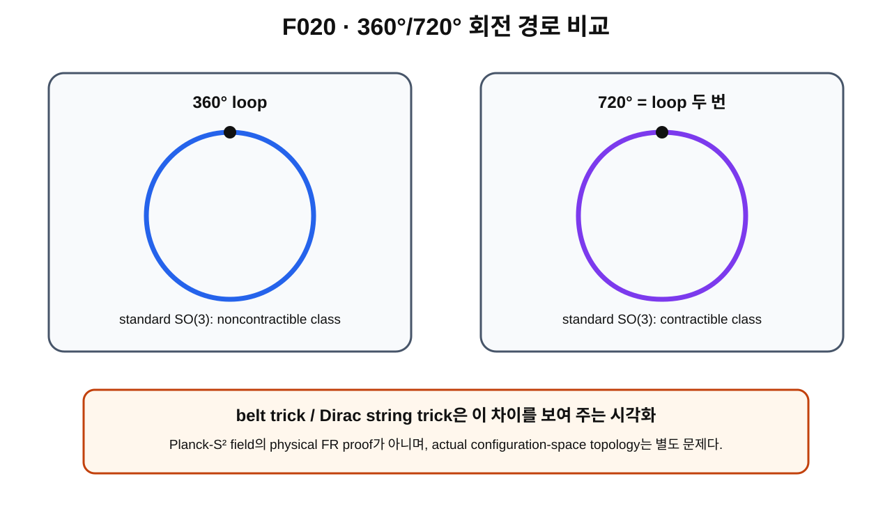

> **STATUS: DRAFT COMPLETE · AUDIT PENDING**
>
> 작성 Chat은 PASS를 부여하지 않는다. 이 장의 360°/720° 결론은 **standard $SO(3)$ topology**에 관한 것이며 Planck-S² physical FR 결론이 아니다.

# 3장 · 360°와 720° — 같은 끝점, 다른 회전 경로

## 현재 상태
- **작성 상태:** DRAFT COMPLETE
- **감사 상태:** AUDIT PENDING
- **핵심 경계:** $\pi_1(SO(3))\cong\mathbb Z_2$는 표준 수학. Planck-S²의 physical rotation loop와 FR sign은 별도 문제.

---

## 이번 장의 질문

1. 왜 0°와 360°는 같은 orientation인가?
2. 그런데 360° rotation path는 왜 $SO(3)$에서 noncontractible[^v2c03-noncontractible]인가?
3. 왜 720° path는 contractible해질 수 있는가?
4. $\pi_1(SO(3))\cong\mathbb Z_2$는 정확히 무슨 뜻인가?
5. belt trick[^v2c03-belt-trick]은 무엇을 보여 주고 무엇을 증명하지 않는가?

---

## 앞 장 복습

제2장에서 $SO(3)$를 3차원 proper rotations의 group이자 orientation space로 보았다. axis-angle 표현에서는 반지름 $\pi$인 ball의 경계에서 antipodal points를 식별해야 했다.

이 식별이 바로 360° loop의 위상적 성질을 만든다.

---

## 먼저 생각해 보기 · 끝점만 같으면 같은 경로일까?

한 손을 앞으로 뻗고 손바닥 위에 책을 올렸다고 하자. 책을 360° 돌리면 책 자체의 orientation은 처음으로 돌아온다.

하지만 제1권에서 배운 것처럼

> endpoint equality $\neq$ path triviality

다.

360° 회전은

$$
R(0)=I,\qquad R(1)=I
$$

인 loop지만, 이 loop가 constant loop로 줄어드는지는 별도 질문이다.

---

## 그림으로 이해하기 · F020

**그림 F020. standard $SO(3)$에서 360°와 720° rotation path의 homotopy 차이를 보여 주는 개념도**

### [이 그림에서 볼 것]
- 360° path는 identity에서 출발해 identity로 돌아오는 loop다.
- 720°는 그 loop를 두 번 이어붙인 것으로 생각할 수 있다.
- 표준 $SO(3)$에서 한 번은 nontrivial class, 두 번은 trivial class다.

### [이 그림이 뜻하는 것]
$$
\pi_1(SO(3))\cong\mathbb Z_2
$$
의 직관을 보여 준다.

### [이 그림이 뜻하지 않는 것]
- belt trick이 Planck-S² field의 physical proof라는 뜻이 아니다.
- 360°가 자동으로 wavefunction $-1$을 만든다는 뜻이 아니다.
- actual physical electron configuration space의 $\pi_1$가 곧 $\mathbb Z_2$라는 뜻이 아니다.

---

## SO(3)의 두 loop class

표준 topology에서

$$
SO(3)\cong\mathbb{RP}^3,
$$

그리고

$$
\pi_1(SO(3))\cong\mathbb Z_2.
$$

따라서 based loop의 homotopy class는 두 종류뿐이다.

- trivial class $0$
- nontrivial class $1$

360° rotation loop는 nontrivial class를 대표하고, 두 번 이어붙인 720° loop는

$$
1+1=0
$$

이므로 trivial class에 들어간다.

이것은 **SOURCE VERIFIED** standard topology다.

---

## axis-angle ball로 보는 360° loop

axis-angle ball 중심은 identity rotation이다.

한 축을 고정하고 회전각을 0에서 $\pi$까지 늘리면 중심에서 경계로 간다. $\pi$를 넘어서 $2\pi$까지 회전하면, 경계에서 antipodal identification을 통해 반대쪽 표현으로 이어져 다시 중심의 identity에 도달한다.

이 path는 닫히지만 한 번만 경계 identification을 통과하는 nontrivial loop가 된다.

같은 과정을 두 번 하면 $\mathbb Z_2$에서 두 nontrivial class가 합쳐져 trivial class가 된다.

---

## belt trick / Dirac string trick

허리띠 한쪽 끝이나 물체를 고정한 채 360° 비틀면 꼬임을 완전히 없애기 어려워 보인다. 720° 비틀림에서는 손과 끈을 공간 안에서 움직여 끈을 끊지 않고 원래 상태로 풀 수 있는 시각화가 가능하다.

이것이 흔히 belt trick 또는 Dirac string trick으로 불리는 직관이다.

### 비유의 한계

이 trick은 $SO(3)$와 그 double cover의 위상적 차이를 눈으로 느끼게 해 주지만,

> 실제 Planck-S² field의 configuration space가 어떤 topology를 가지는가

를 증명하지 않는다.

또 belt나 팔이 물리적으로 존재해야 FR quantization이 성립한다는 뜻도 아니다.

---

## 360°와 720°의 차이는 “최종 orientation” 차이가 아니다

360°와 720° 모두 최종 orientation은 identity다.

차이는 **rotation space 안에서 지나온 loop의 homotopy class**다.

이 점은 이후 Planck-S²에서 매우 중요하다. 왜냐하면 candidate field를 회전시키면 $SO(3)$의 회전 path가 configuration space 안의 path를 유도할 수 있기 때문이다.

하지만 이 유도된 path가 어떤 class인지 알려면 spatial action을 정확히 정의해야 한다.

---

## standard SO(3) theorem vs Planck-S² theorem

다음 두 문장을 분리하자.

### 표준 문장

> $SO(3)$에서 360° rotation loop는 nontrivial이고 720° double loop는 trivial이다.

**SOURCE VERIFIED.**

### Planck-S² 문장

> smooth unquotiented $\mathrm{Map}_1(S^2,S^2)$에서 특정 $2\pi$ spatial rotation loop가 $\mathbb Z_2$ generator다.

이것은 project-specific result이며 canonical ledger에서 **PROVED UNDER ASSUMPTIONS**다.

두 번째는 첫 번째만으로 자동으로 나오지 않는다. 회전군에서 mapping space로 가는 induced map을 확인해야 한다. 그 작업이 제4~7장의 주제다.

---

## 현재 판정

| 주장 | 상태 | 범위 |
|---|---|---|
| $\pi_1(SO(3))\cong\mathbb Z_2$ | **SOURCE VERIFIED** | 표준 topology |
| 360° loop noncontractible / 720° double loop contractible | **SOURCE VERIFIED** | standard $SO(3)$ |
| smooth unquotiented Map₁의 $2\pi$ spatial loop generator | **PROVED UNDER ASSUMPTIONS** | G03/A01 frozen baseline |
| actual physical configuration space = Map₁ | **OPEN** | physical bridge 미폐쇄 |
| FR-odd $2\pi\to-1$ | **CONDITIONAL** | character/lift/physical branch 필요 |
| 전체 Planck-S² | **WORKING HYPOTHESIS** | 전체 가설 |

---

## 자주 하는 오해

> **“360° loop가 nontrivial이니까 파동함수는 반드시 −1이다.”**

아니다. topology가 두 loop class를 준다고 해서 어떤 quantum character를 택할지는 자동 결정되지 않는다.

> **“720°에서 풀리니까 전자는 spin-1/2임이 증명됐다.”**

아니다. 표준 회전 topology는 필요한 배경이지만 complete spin-$1/2$ physical statement에는 추가 양자구조와 dynamics가 필요하다.

---

## 다음 장이 필요한 이유

이제 standard rotation group의 360° loop를 이해했다. 다음에는 이 회전이 candidate field

$$
n:S^2\to S^2
$$

자체를 어떻게 변화시키는지 써야 한다.

핵심 질문은

> “공간을 돌리면 왜 $n_R(x)=n(R^{-1}x)$ 같은 식이 나오는가?”

다.

---

## 한 문장 기억

> **360°와 720°의 차이는 최종 orientation이 아니라 standard $SO(3)$ 안에서의 loop homotopy class 차이다.**

---

## 확인문제
1. 왜 360° rotation path는 loop인가?
2. $\pi_1(SO(3))\cong\mathbb Z_2$에서 720°가 trivial한 이유는?
3. belt trick이 Planck-S²의 physical FR proof가 아닌 이유는?

## 정답
1. 시작과 끝 orientation이 모두 identity이기 때문이다.
2. 360° nontrivial class를 두 번 합성하면 $1+1=0$이기 때문이다.
3. belt trick은 standard rotation topology의 시각화이고, Planck-S² actual physical configuration space의 선택과 quantum lift는 별도 문제이기 때문이다.

---

## 이 장의 근거 자료

| 구분 | 자료 | 범위 |
|---|---|---|
| external standard | Allen Hatcher, *Algebraic Topology*: $SO(3)\cong\mathbb{RP}^3$ | SOURCE VERIFIED |
| external standard | Harvard Math 222 Lie Groups notes: $\pi_1(SO(n))\cong\mathbb Z/2$ for $n\ge3$ | SOURCE VERIFIED |
| project | G03 | rotation-loop/generator project history |
| audit | A01 | G03 proof gap 및 repair scope |
| audit | C02 | physical quotient caveat |

[^v2c03-noncontractible]: loop를 시작점 조건을 유지하면서 constant loop로 연속적으로 줄일 수 없다는 뜻.
[^v2c03-belt-trick]: 360°와 720° 회전 경로의 위상 차이를 끈이나 벨트의 꼬임으로 시각화하는 유명한 비유. 그 자체가 특정 field theory의 physical proof는 아니다.
