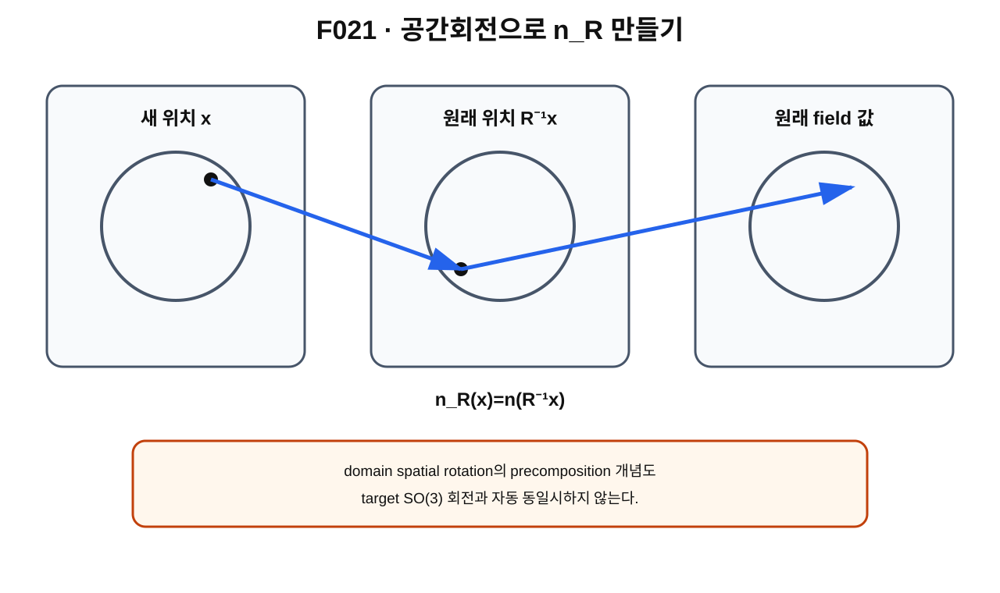

> **STATUS: DRAFT COMPLETE · AUDIT PENDING**
>
> 작성 Chat은 PASS를 부여하지 않는다. spatial $SO(3)$와 target $SO(3)$를 구분하고, Gate C overall = **OPEN**을 유지한다.

# 4장 · 회전은 장을 어떻게 바꾸는가 — spatial action과 precomposition

## 현재 상태
- **작성 상태:** DRAFT COMPLETE
- **감사 상태:** AUDIT PENDING
- **핵심 경계:** domain spatial rotation $\neq$ target rotation.

---

## 이번 장의 질문

1. field $n:S^2\to S^2$ 전체를 공간에서 회전시키면 새 field는 어떻게 적을까?
2. 왜
$$
n_R(x)=n(R^{-1}x)
$$
같은 식에 $R^{-1}$이 나타날까?
3. precomposition[^v2c04-precomposition]은 무엇인가?
4. spatial $SO(3)$와 target $SO(3)$는 왜 다른 작용인가?

---

## 앞 장 복습

제3장에서는 $SO(3)$ 안의 rotation path 자체를 봤다. 이제 그 회전이 configuration에 **작용**할 때 무엇이 되는지 본다.

제1권의 candidate field는

$$
n:S^2_{\rm domain}\to S^2_{\rm target}
$$

였다.

field 전체를 회전시키려면 domain의 점들이 어디에서 왔는지 추적해야 한다.

---

## 먼저 생각해 보기 · 회전한 지도를 읽기

지도가 종이 위에 있고 각 위치마다 색이 칠해져 있다고 하자. 종이 자체를 돌린 뒤 새 화면의 위치 $x$에서 어떤 색을 보게 될까?

새 위치 $x$에 도착한 종이 조각은 회전 전에는 $R^{-1}x$에 있던 조각이다.

따라서 새 값은 원래 함수의

$$
n(R^{-1}x)
$$

이다.

이것이 inverse가 등장하는 가장 쉬운 이유다.

---

## 그림으로 이해하기 · F021

**그림 F021. domain spatial rotation으로 새 field $n_R$를 만드는 precomposition 개념도**

### [이 그림에서 볼 것]
- 새 위치 $x$의 값은 원래 위치 $R^{-1}x$에서 읽는다.
- field value를 직접 target에서 돌리는 식과는 다른 조작이다.
- spatial action은 domain argument를 먼저 바꾼다.

### [이 그림이 뜻하는 것]
대표 convention에서
$$
n_R(x)=n(R^{-1}x)
$$
로 spatial rotation action을 쓸 수 있음을 뜻한다.

### [이 그림이 뜻하지 않는 것]
- target vector를 $Rn(x)$로 돌리는 것과 같은 작용이라는 뜻이 아니다.
- spatial/target $SO(3)$가 물리적으로 동일한 symmetry라는 뜻이 아니다.
- Gate C가 닫혔다는 뜻이 아니다.

---

## active spatial rotation

이 책에서는 우선 active rotation[^v2c04-active-rotation] convention을 사용한다.

물체 또는 field configuration을 실제로 회전시키고 좌표계는 그대로 둔다고 생각한다.

회전 전 configuration을 $n$이라 하고 회전 $R$ 뒤를 $R\cdot n$이라고 쓰면

$$
(R\cdot n)(x)=n(R^{-1}x).
$$

이 식은 group action[^v2c04-group-action]과 잘 맞는다.

두 회전 $R_1,R_2$를 차례로 적용하면

$$
R_2\cdot(R_1\cdot n)=(R_2R_1)\cdot n.
$$

---

## 왜 inverse인가?

새 좌표 $x$에서 보이는 field value의 원래 출처를 찾아야 하기 때문이다.

회전 전 점 $y$가 회전 뒤 $x$로 갔다면

$$
x=Ry,
$$

따라서

$$
y=R^{-1}x.
$$

새 field의 $x$값은 원래 $y$값이므로

$$
n_R(x)=n(y)=n(R^{-1}x).
$$

---

## precomposition이라는 말

원래 map이

$$
n:S^2\to S^2
$$

이고 domain rotation이

$$
R^{-1}:S^2\to S^2
$$

이면

$$
n\circ R^{-1}
$$

을 만든다.

원래 함수 **앞쪽 입력에 다른 map을 합성**하기 때문에 precomposition이라고 부른다.

---

## target rotation은 다른 작용이다

이번에는 domain point는 그대로 두고 target direction 자체를 어떤 $A\in SO(3)_{\rm target}$로 돌려 보자.

그때는 대표적으로

$$
(A\cdot n)(x)=A\,n(x)
$$

형태다.

비교하면

$$
\text{spatial: }n(x)\mapsto n(R^{-1}x),
$$

$$
\text{target: }n(x)\mapsto A n(x).
$$

이다.

둘은 수학적으로 다른 action이다.

---

## identity background에서 생기는 특별한 관계

특정 background $n_0(x)=x$ 같은 매우 대칭적인 경우에는 spatial precomposition과 target rotation이 서로 관련되어 보일 수 있다.

예를 들어

$$
n_0(R^{-1}x)=R^{-1}x=R^{-1}n_0(x).
$$

하지만 이것은 **특정 background에서의 관계**이지 spatial group과 target group이 일반적으로 동일하다는 뜻은 아니다.

이 차이가 제15장 Gate C의 핵심으로 다시 돌아온다.

---

## Planck-S² 현재 범위

G03은 spatial rotation path가 ideal degree-one mapping space 안에 path를 유도하는 구조를 사용했다.

A01은 이 ideal smooth/unquotiented setting에서 generator 계산을 수리했다.

그러나 actual physical space의 정의, target quotient 여부, external 3+1D rotation matching은 현재 **OPEN**이다.

C02 기준 Gate C overall도 **OPEN**이다.

---

## 현재 판정

| 주장 | 상태 | 범위 |
|---|---|---|
| precomposition으로 spatial action을 표현 | **SOURCE VERIFIED** | 표준 group action/function language |
| $n_R(x)=n(R^{-1}x)$ convention | **SOURCE VERIFIED / PROJECT MODELING LANGUAGE** | active spatial rotation convention |
| spatial $SO(3)$ = target $SO(3)$ | **NOT ESTABLISHED** | 자동 동일시 금지 |
| Gate C overall | **OPEN** | C02 |
| actual physical configuration space = ideal Map₁ | **OPEN** | canonical ledger |

---

## 이것으로 말할 수 있는 것
- spatial rotation은 field의 domain argument를 바꾸는 precomposition으로 표현할 수 있다.
- inverse는 새 위치에 도착한 원래 점을 찾기 위해 등장한다.
- target rotation은 field value를 직접 돌리는 별도 action이다.

## 이것으로 말할 수 없는 것
- 두 action이 실제 전자에서 같은 symmetry라고 말할 수 없다.
- target $SO(3)$가 gauge라고 자동 판단할 수 없다.
- 이 장만으로 2π rotation loop의 class나 FR sign을 얻을 수 없다.

---

## 다음 장이 필요한 이유

회전을 parameter $t$에 따라 연속적으로 바꾸면

$$
R(t)\mapsto n_t
$$

라는 configuration family가 생긴다.

2π 뒤 $n_1=n_0$가 되면 configuration space 안에서 loop가 된다. 다음 장에서 그 구조를 본다.

---

## 한 문장 기억

> **spatial rotation은 입력점을 돌리는 precomposition이고, target rotation은 출력값을 돌리는 별도 action이다.**

---

## 확인문제
1. $R^{-1}$이 필요한 이유를 한 문장으로 설명하라.
2. spatial action과 target action의 대표 식을 각각 써 보라.
3. identity background에서 둘이 관련돼 보여도 일반 동일시가 안 되는 이유는?

## 정답
1. 회전 뒤 새 위치 $x$에 온 원래 점이 $R^{-1}x$이기 때문이다.
2. spatial: $n(R^{-1}x)$, target: $A n(x)$.
3. 특정 대칭 background의 관계일 뿐 두 group action의 정의와 physical ontology가 같다는 증명이 아니기 때문이다.

---

## 근거 자료
- **G03**: spatial rotation action과 configuration-space loop construction.
- **A01 §2.2**: rotation-generator proof repair의 적용 범위.
- **C01/C02**: spatial/target action과 physical Gate C scope 분리.
- 표준 group action/function composition language: **SOURCE VERIFIED**.

[^v2c04-precomposition]: 함수 $n$ 앞에 domain map을 먼저 합성해 $n\circ R^{-1}$처럼 만드는 것.
[^v2c04-active-rotation]: 좌표축은 그대로 두고 물체나 field configuration 자체를 돌린다고 해석하는 회전.
[^v2c04-group-action]: group의 각 원소가 어떤 공간의 원소를 변환하는 규칙이며, identity와 composition 규칙을 보존한다.
