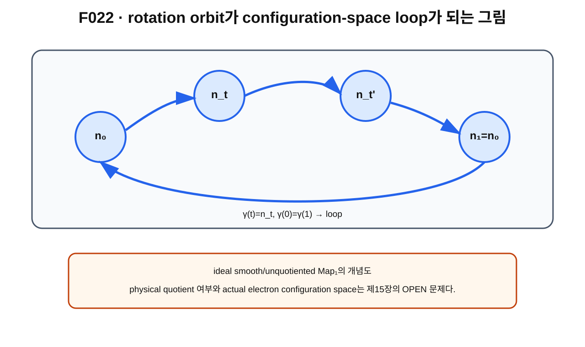

> **STATUS: DRAFT COMPLETE · AUDIT PENDING**
>
> 작성 Chat은 PASS를 부여하지 않는다. ideal smooth/unquotiented setting과 actual physical configuration space를 분리한다.

# 5장 · 회전 orbit는 왜 loop가 되는가 — configuration space 안의 2π 경로

## 현재 상태
- **작성 상태:** DRAFT COMPLETE
- **감사 상태:** AUDIT PENDING
- **핵심 경계:** ideal rotation orbit의 loop construction $\neq$ physical electron loop의 확정.

---

## 이번 장의 질문
1. 회전 path $R(t)$는 field configuration $n_t$를 어떻게 만들까?
2. 왜 $2\pi$ 뒤 field가 원래 configuration으로 돌아오면 loop가 될까?
3. rotation orbit[^v2c05-orbit]이란 무엇인가?
4. 왜 loop의 존재와 그 loop가 generator라는 사실은 별개의 주장일까?

---

## 앞 장 복습

제4장에서 active spatial rotation convention을

$$
(R\cdot n)(x)=n(R^{-1}x)
$$

로 정했다.

이제 $R$ 하나가 아니라 연속 family

$$
R(t),\qquad 0\le t\le1
$$

를 생각한다.

---

## 먼저 생각해 보기 · 회전 영상을 configuration으로 번역하기

물체를 천천히 돌리는 영상을 프레임별로 저장한다고 하자.

각 프레임에는 orientation 하나가 있다. field theory에서는 각 프레임에 **full field configuration 하나**가 있다.

즉

$$
R(t)\longmapsto n_t
$$

이다.

대표적으로

$$
n_t(x)=n_0(R(t)^{-1}x).
$$

$t$마다 $S^2\to S^2$ map 하나가 나온다.

---

## 그림으로 이해하기 · F022

**그림 F022. spatial rotation family가 configuration space 안의 loop를 만드는 개념도**

### [이 그림에서 볼 것]
- $n_0$에서 출발한다.
- 중간 $n_t$들은 full configuration들이다.
- $2\pi$ 뒤 $n_1=n_0$이면 path가 닫힌다.

### [이 그림이 뜻하는 것]
ideal mapping-space setting에서

$$
\gamma:[0,1]\to\mathrm{Map}_1(S^2,S^2),\qquad \gamma(t)=n_t
$$

라는 configuration-space path를 만들 수 있고, endpoint가 같으면 loop가 된다는 뜻이다.

### [이 그림이 뜻하지 않는 것]
- 이 loop가 자동으로 nontrivial하다는 뜻이 아니다.
- 이 loop가 physical quotient에서도 살아남는다는 뜻이 아니다.
- actual electron이 물리 시간에 따라 이 loop를 실제로 돈다는 뜻이 아니다.

---

## rotation orbit란 무엇인가

어떤 configuration $n_0$를 정하고 $SO(3)$의 여러 회전을 작용시키면

$$
\{R\cdot n_0:R\in SO(3)\}
$$

라는 configuration들의 모음을 얻는다.

이를 $n_0$의 rotation orbit라고 부를 수 있다.

orbit는 group action으로 한 상태에서 도달할 수 있는 상태들의 집합이다.

---

## 2π가 loop를 만드는 조건

표준 spatial rotation path를

$$
R(0)=I,\qquad R(1)=R_{2\pi}=I
$$

로 두면 $SO(3)$에서는 시작과 끝 transformation이 같다.

그러면

$$
n_1(x)=n_0(R(1)^{-1}x)=n_0(x),
$$

따라서

$$
\gamma(0)=\gamma(1)=n_0.
$$

즉 configuration-space loop가 된다.

이 단계는 “loop가 생긴다”는 말일 뿐 **그 loop의 homotopy class가 무엇인지**는 아직 말하지 않는다.

---

## loop 존재 ≠ generator 판정

다음 두 문장을 분리하자.

1. $2\pi$ rotation이 closed path를 만든다.
2. 그 closed path가 $\pi_1$의 nontrivial generator다.

1은 endpoint를 확인하면 된다.

2는 훨씬 강한 위상수학 명제다. configuration-space의 fundamental group과 rotation action이 유도하는 homomorphism을 조사해야 한다.

제6~7장이 바로 그 계산의 언어와 감사 이력을 다룬다.

---

## ideal Map₁에서의 project statement

G03/A01 frozen baseline에서는 degree-one smooth unquotiented mapping space 안에서 이 rotation loop의 class를 분석했다.

현재 canonical ledger는

> smooth unquotiented $\mathrm{Map}_1(S^2,S^2)$에서 $2\pi$ spatial rotation loop가 $\mathbb Z_2$ generator

를 **PROVED UNDER ASSUMPTIONS**로 기록한다.

하지만 이 판정을 actual physical electron space로 확대하지 않는다.

---

## physical quotient가 왜 중요할까

C02가 강조한 핵심은 다음이다.

어떤 transformation을 physical redundancy로 quotient하면, unquotiented space에서 움직이던 path가 quotient space에서는 같은 점으로 눌릴 수 있다.

특히 identity background에서 standard spatial loop가 target orbit과 동치로 quotient되는 branch에서는 그 loop가 constant class가 될 수 있다.

이 문제는 제15장에서 자세히 다룬다.

---

## 현재 판정

| 주장 | 상태 | 범위 |
|---|---|---|
| rotation family로 configuration-space path 구성 | **SOURCE VERIFIED / MODELING LANGUAGE** | group action |
| $2\pi$ 뒤 configuration이 같으면 loop | **SOURCE VERIFIED** | endpoint condition |
| smooth unquotiented Map₁에서 loop가 $\mathbb Z_2$ generator | **PROVED UNDER ASSUMPTIONS** | G03/A01 |
| actual physical configuration space = Map₁ | **OPEN** | physical completion/quotient |
| quotient 후 standard loop 생존 | **branch-dependent; not automatic** | C02 |
| Gate C overall | **OPEN** | C02 |

---

## 오해 방지

> **“2π 뒤 field가 돌아왔으니 generator다.”** — 아니다. closed loop와 nontrivial generator는 다른 주장이다.

> **“ideal Map₁에서 generator니까 physical electron에서도 generator다.”** — 아니다. physical configuration space와 quotient가 OPEN이다.

---

## 다음 장이 필요한 이유

그렇다면 $\mathrm{Map}_1(S^2,S^2)$의 $\pi_1$를 어떻게 계산했을까?

다음 장에서는 evaluation map

$$
\mathrm{ev}(n)=n(x_0)
$$

을 이용해 fiber, total space, base를 연결하는 evaluation fibration을 배운다.

---

## 한 문장 기억

> **2π spatial rotation이 configuration-space loop를 만드는 것과 그 loop가 nontrivial generator라는 것은 서로 다른 단계다.**

---

## 확인문제
1. $n_t$의 대표 식을 써 보라.
2. loop가 되기 위한 endpoint 조건은?
3. physical quotient가 loop class를 바꿀 수 있는 이유는?

## 정답
1. $n_t(x)=n_0(R(t)^{-1}x)$.
2. $n_1=n_0$ 또는 $\gamma(1)=\gamma(0)$.
3. 서로 다른 configuration을 같은 physical state로 식별하면 path 자체가 quotient에서 줄어들거나 상수가 될 수 있기 때문이다.

---

## 근거 자료
- **G03**: spatial rotation orbit와 configuration-space loop.
- **A01 §2.2**: generator proof repair.
- **C02**: target quotient에서 standard loop의 fate 및 Gate C scope.

[^v2c05-orbit]: group의 모든 허용 transformation을 한 상태에 적용했을 때 얻는 상태들의 집합. 여기서는 spatial rotation으로 생성되는 configuration들의 모음이다.
