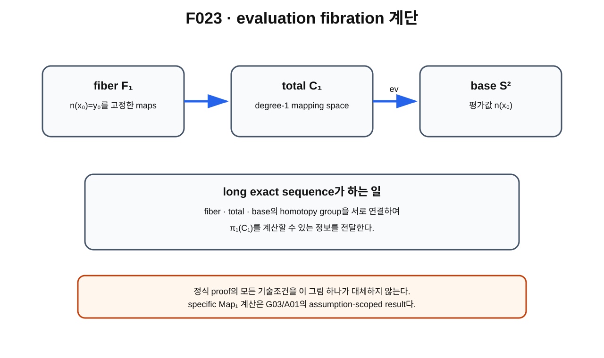

> **STATUS: DRAFT COMPLETE · AUDIT PENDING**
>
> 작성 Chat은 PASS를 부여하지 않는다. 이 장은 evaluation fibration의 표준 언어와 G03/A01의 assumption-scoped mapping-space 계산을 분리한다.

# 6장 · evaluation fibration — mapping space의 topology를 읽는 계단

## 현재 상태
- **작성 상태:** DRAFT COMPLETE
- **감사 상태:** AUDIT PENDING
- **난도 주의:** 제2권에서 첫 번째로 추상도가 크게 올라가는 장이다.
- **핵심 경계:** long exact sequence의 존재는 표준 수학이고, 특정 $\mathrm{Map}_1(S^2,S^2)$ 계산은 명시 가정 아래의 project-used theorem이다.

---

## 이번 장의 질문
1. mapping space의 $\pi_1$를 직접 보기 어려울 때 어떤 우회로를 쓸 수 있을까?
2. evaluation map[^v2c06-evaluation-map]은 무엇인가?
3. fiber[^v2c06-fiber], base, total space는 각각 무엇일까?
4. based map[^v2c06-based-map]은 왜 유용할까?
5. fibration[^v2c06-fibration]과 long exact sequence[^v2c06-les]는 무엇을 연결해 줄까?
6. G03/A01에서 왜 boundary map $\times2$가 핵심이었을까?

---

## 왜 새로운 도구가 필요한가

configuration space

$$
\mathcal C_1=\mathrm{Map}_1(S^2,S^2)
$$

의 점 하나는 함수 전체다. 그래서 이 공간은 평면이나 구면처럼 눈으로 그리기 어렵다.

그런데 우리가 알고 싶은 것은

$$
\pi_1(\mathcal C_1)
$$

이다.

복잡한 전체 공간을 한꺼번에 보지 말고, map 하나에서 **한 기준점의 값만 읽어 내는 함수**를 만들면 구조를 계단식으로 나눌 수 있다.

---

## 먼저 생각해 보기 · 학교 전체를 반 하나씩 분류하기

학생 전체를 매우 복잡한 정보로 기록했다고 하자. 모든 정보를 한꺼번에 비교하기 어렵다면, 우선 “이 학생의 반은 어디인가?”라는 간단한 정보를 읽는다.

같은 반으로 보내지는 학생들을 묶으면 fiber 같은 구조가 생긴다.

mapping space에서도 비슷하게 map $n$에서 특정 domain point $x_0$의 값

$$
n(x_0)
$$

만 읽는다.

### 비유의 한계

실제 fibration은 단순한 분류표가 아니다. local triviality와 homotopy lifting 성질 같은 기술적 조건이 있으며, 이 비유가 정식 proof를 대체하지 않는다.

---

## 그림으로 이해하기 · F023

**그림 F023. fiber → total mapping space → base를 잇는 evaluation fibration의 계단식 개념도**

### [이 그림에서 볼 것]
- total space는 degree-one maps 전체다.
- evaluation map은 $n$을 한 점의 값 $n(x_0)$로 보낸다.
- fiber는 그 값이 고정된 maps를 모은 공간이다.

### [이 그림이 뜻하는 것]
복잡한 mapping space의 homotopy 정보를 fiber와 base의 homotopy 정보와 연결할 수 있다는 뜻이다.

### [이 그림이 뜻하지 않는 것]
- 그림의 세 상자가 실제 공간의 기하 모양이라는 뜻이 아니다.
- long exact sequence의 모든 기술 조건이 그림만으로 증명됐다는 뜻이 아니다.
- actual physical electron configuration space에 같은 fibration이 자동 적용된다는 뜻이 아니다.

---

## evaluation map

기준 domain point $x_0\in S^2$를 하나 고른다.

그러면

$$
\mathrm{ev}_{x_0}:\mathrm{Map}_1(S^2,S^2)\to S^2,
$$

$$
\mathrm{ev}_{x_0}(n)=n(x_0)
$$

를 정의할 수 있다.

즉 full map을 받아 target의 점 하나를 출력한다.

---

## fiber는 무엇인가

target에서 기준값 $y_0$를 고르고

$$
n(x_0)=y_0
$$

를 만족하는 maps만 모아 보자.

이 모음이 evaluation map의 fiber다.

이런 maps를 based maps라고 부를 수 있다. domain basepoint와 target basepoint를 고정하기 때문이다.

G03/A01의 표기에서는 이 based mapping space가 $F_1$ 같은 fiber 역할을 한다.

---

## total / base / fiber

정리하면

- **total space:** $\mathcal C_1=\mathrm{Map}_1(S^2,S^2)$
- **base:** target $S^2$
- **fiber:** $x_0$에서 값을 고정한 degree-one based maps

이다.

개념적으로

$$
F_1\longrightarrow \mathcal C_1\xrightarrow{\mathrm{ev}}S^2
$$

라는 계단이 생긴다.

---

## fibration은 왜 유용한가

좋은 fibration은 homotopy groups 사이에 long exact sequence를 준다.

초보 단계에서는 전체 식을 암기할 필요가 없다.

우리에게 필요한 부분은 대략

$$
\pi_2(S^2)\xrightarrow{\partial}\pi_1(F_1)
\longrightarrow \pi_1(\mathcal C_1)
\longrightarrow \pi_1(S^2)
$$

이다.

표준 사실로

$$
\pi_1(S^2)=0
$$

이므로, $\pi_1(\mathcal C_1)$를 이해하는 데 boundary map[^v2c06-boundary-map]

$$
\partial:\pi_2(S^2)\to\pi_1(F_1)
$$

가 결정적 역할을 한다.

---

## G03/A01에서의 핵심 계산

frozen baseline 감사 A01은 degree-one mapping-space evaluation fibration에서

$$
\pi_2(S^2)\cong\mathbb Z,
\qquad
\pi_1(F_1)\cong\mathbb Z
$$

이고, boundary map이 orientation 부호를 제외하고

$$
\partial=\times2
$$

라고 정리한다.

그러면 exactness로

$$
\pi_1(\mathcal C_1)\cong\mathrm{coker}(\times2)
\cong\mathbb Z/2\mathbb Z
\cong\mathbb Z_2
$$

를 얻는다.

canonical 판정은 **PROVED UNDER ASSUMPTIONS**다.

---

## 왜 ×2인가

A01은 이 부분을 degree-one Whitehead product 구조와 연결해 정리한다. 여기서 Whitehead product[^v2c06-whitehead]의 기술적 proof 전체를 제2권 초보 장에서 전개하지 않는다.

독자가 기억할 핵심은 다음이다.

> evaluation fibration의 boundary map이 정수 generator를 두 배로 보내기 때문에 quotient/cokernel에 mod 2가 남고 $\mathbb Z_2$가 나타난다.

---

## long exact sequence는 무엇을 해 주는가

이 도구의 철학은 간단하다.

> total space가 너무 복잡하면 fiber와 base의 알려진 topology를 이용해 total space의 topology를 제한한다.

그래서 evaluation fibration은 “mapping space의 topology를 읽는 계단”이다.

---

## external standard source audit

covering/fibration과 homotopy exact sequence의 일반 언어는 Allen Hatcher의 *Algebraic Topology* 같은 표준 자료와 대조했다.

C02가 외부 대조에서 사용한 mapping-space 문헌도 evaluation-fibration 계산과 $\mathbb Z/(2n)$ 구조를 독립적으로 언급한다. 다만 이 책의 frozen project 판정은 **G03/A01/C02 canonical ledger**를 기준으로 유지한다.

---

## actual physical space와의 경계

이 계산은 ideal smooth/compact-open, unquotiented mapping-space 설정이다.

다음은 아직 **OPEN**이다.

$$
\text{actual physical configuration space}
=
\mathrm{Map}_1(S^2,S^2).
$$

Sobolev/finite-energy completion, EFT-valid subset, target quotient와 ontology가 바뀌면 topology도 자동 보존되지 않는다.

---

## 현재 판정

| 주장 | 상태 | 범위 |
|---|---|---|
| evaluation map/fibration/LES 일반 언어 | **SOURCE VERIFIED** | 표준 algebraic topology |
| degree-one Map₁에서 $\partial=\times2$ | **PROVED UNDER ASSUMPTIONS** | G03/A01 setting |
| $\pi_1(\mathrm{Map}_1)\cong\mathbb Z_2$ | **PROVED UNDER ASSUMPTIONS** | ideal smooth/unquotiented |
| physical space 동일성 | **OPEN** | canonical ledger |

---

## 말할 수 있는 것
- evaluation map은 full map에서 한 basepoint 값을 읽는다.
- fiber는 그 값을 고정한 maps의 공간이다.
- long exact sequence를 이용해 ideal Map₁의 $\pi_1$ 계산을 조직할 수 있다.

## 말할 수 없는 것
- 이 fibration 계산만으로 actual electron configuration space를 확정할 수 없다.
- $\pi_1=\mathbb Z_2$만으로 FR-odd sign을 선택할 수 없다.

---

## 다음 장이 필요한 이유

$\pi_1(\mathcal C_1)=\mathbb Z_2$를 알았다고 해도, 우리가 만든 **specific 2π rotation loop**가 nontrivial generator인지 아직 따로 확인해야 한다.

G03은 이를 시도했고 proof presentation에 작은 논리 공백이 있었다. A01은 그 공백을 수리했다.

---

## 한 문장 기억

> **evaluation fibration은 map 전체의 복잡한 공간을 fiber와 base로 나누고, long exact sequence를 통해 ideal Map₁의 $\mathbb Z_2$ topology를 읽게 해 준다.**

---

## 확인문제
1. $\mathrm{ev}_{x_0}(n)$은 무엇인가?
2. fiber는 어떤 maps를 모은 공간인가?
3. $\partial=\times2$가 왜 mod 2 구조와 연결되는가?

## 정답
1. $n(x_0)$.
2. 기준점에서 target 값을 고정한 based maps.
3. $\mathbb Z$에서 $2\mathbb Z$를 quotient하면 $\mathbb Z/2\mathbb Z$가 남기 때문이다.

---

## 근거 자료
- **G03**: evaluation fibration 구성과 generator 연결 시도.
- **A01 §2.1–2.2**: $\partial=\times2$, $\pi_1=\mathbb Z_2$, proof repair.
- **C02 external cross-check**: mapping-space evaluation-fibration literature 대조.
- Allen Hatcher, *Algebraic Topology*: fibration/long exact sequence 표준 배경.

[^v2c06-evaluation-map]: 함수 전체를 받아 특정 기준점에서의 함수값만 꺼내는 map. 여기서는 $\mathrm{ev}(n)=n(x_0)$.
[^v2c06-fiber]: 어떤 map의 출력값 하나를 고정했을 때 그 값으로 보내지는 모든 입력들의 공간. 여기서는 특정 basepoint 값을 갖는 maps의 모음이다.
[^v2c06-based-map]: domain과 target의 기준점을 정하고 그 기준점끼리 대응시키도록 제한한 map.
[^v2c06-fibration]: fiber가 base 위에서 연속적으로 배치되어 homotopy 정보를 체계적으로 연결할 수 있는 구조. 단순한 곱공간과 같을 필요는 없다.
[^v2c06-les]: fiber, total space, base의 homotopy group들을 연속된 사상으로 연결하는 도구. exactness는 앞 사상의 image와 다음 사상의 kernel이 맞아떨어진다는 뜻이다.
[^v2c06-boundary-map]: long exact sequence에서 한 homotopy group의 정보를 다른 차수의 fiber homotopy group으로 넘기는 연결 사상.
[^v2c06-whitehead]: 구면들의 homotopy class 사이에서 생기는 표준 위상수학적 연산. 이 장에서는 ×2가 나오는 정밀 근거의 이름만 소개한다.
