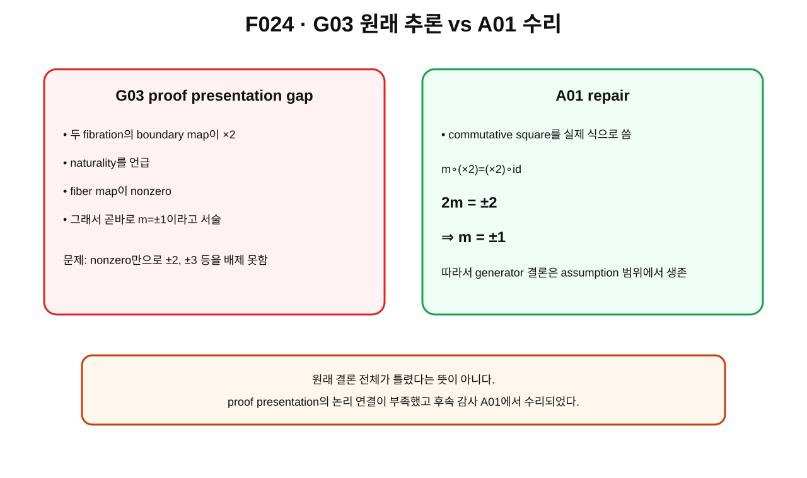

> **STATUS: DRAFT COMPLETE · AUDIT PENDING**
>
> 작성 Chat은 PASS를 부여하지 않는다. 이 장은 G03의 proof presentation gap과 A01의 수리를 역사적으로 분리해 기록한다.

# 7장 · generator를 정말 찾았는가 — G03의 논리 빈틈과 A01의 수리

## 현재 상태
- **작성 상태:** DRAFT COMPLETE
- **감사 상태:** AUDIT PENDING
- **현재 canonical 결과:** smooth unquotiented $\mathrm{Map}_1(S^2,S^2)$에서 $2\pi$ spatial rotation loop가 $\mathbb Z_2$ generator라는 명제는 **PROVED UNDER ASSUMPTIONS**.
- **physical 확대 금지:** actual physical configuration space = Map₁는 **OPEN**.

---

## 이번 장의 질문
1. G03은 무엇을 증명하려 했는가?
2. “fiber map이 nonzero이므로 $\pm1$”이라는 문장은 왜 충분하지 않았는가?
3. naturality[^v2c07-naturality]와 commutative diagram[^v2c07-commutative]을 실제 식으로 쓰면 어떻게 수리되는가?
4. 왜 proof gap이 있었다고 해서 최종 generator 결론 전체가 무너지는 것은 아닌가?

---

## A. G03이 원래 무엇을 주장했는가

G03의 목표는 단순히

$$
\pi_1(\mathrm{Map}_1(S^2,S^2))\cong\mathbb Z_2
$$

를 계산하는 데서 끝나지 않았다.

실제 spatial rotation group의 standard 360° loop가 mapping space 안에서 **어느 class로 가는지** 확인하려 했다.

이를 위해 두 fibration을 비교했다.

위쪽에는 표준 회전 fibration의 구조,

$$
SO(2)\longrightarrow SO(3)\longrightarrow S^2,
$$

아래쪽에는 mapping-space evaluation fibration,

$$
F_1\longrightarrow \mathcal C_1\longrightarrow S^2
$$

를 놓고, rotation action이 이 둘 사이에 map을 만든다고 보았다.

양쪽 boundary map이 모두 $\times2$ 구조를 갖는다는 점이 핵심이었다.

---

## 그림으로 이해하기 · F024

**그림 F024. G03의 원래 proof presentation과 A01의 수리를 비교한 감사 개념도**

### [이 그림에서 볼 것]
- G03은 naturality와 nonzero fiber map을 이용했다.
- 그러나 “nonzero”만으로 $\pm1$을 결론내릴 수는 없다.
- A01은 commutative square를 식으로 써 $2m=\pm2$를 얻고 $m=\pm1$을 도출했다.

### [이 그림이 뜻하는 것]
후속 감사가 **결론을 무조건 폐기한 것이 아니라 논리적 연결을 수리**했다는 뜻이다.

### [이 그림이 뜻하지 않는 것]
- G03 전체가 FALSIFIED였다는 뜻이 아니다.
- physical electron space에서 generator theorem이 무조건 성립한다는 뜻도 아니다.

---

## B. 원래 proof presentation의 논리 gap

정수군 사이의 fiber map을

$$
m:\mathbb Z\to\mathbb Z
$$

라고 하자.

정수군 homomorphism은 어떤 정수 $k$에 대해

$$
m(r)=kr
$$

꼴이다.

G03의 서술은 대략

> naturality 때문에 fiber map은 nonzero이고, 따라서 부호를 제외하면 $\pm1$

이라는 방향이었다.

하지만

$$
k\neq0
$$

이라는 사실만으로

$$
k=\pm1
$$

이 나오지는 않는다.

$k=\pm2,\pm3,\ldots$도 nonzero이기 때문이다.

따라서 이 추론은 **FALSIFIED AS AN INFERENCE**였다는 것이 A01의 감사다.

---

## C. A01은 어떻게 수리했는가

핵심은 naturality를 말로만 쓰지 않고 commutative square의 실제 식으로 쓰는 것이다.

양쪽 boundary map이 orientation convention을 제외하면 $\times2$이고, base의 유도사상이 degree $\pm1$이면

$$
m\circ(\times2)=(\times2)\circ(\pm\mathrm{id})
$$

가 된다.

fiber map이 정수 $k$배라고 쓰면

$$
2k=\pm2.
$$

따라서

$$
k=\pm1.
$$

이제 $m$은 정수 generator를 generator로 보낸다.

mod 2로 내려가면 부호 $+$와 $-$는 같은 nontrivial element이므로 induced map은

$$
\pi_1(SO(3))\cong\mathbb Z_2
\longrightarrow
\pi_1(\mathcal C_1)\cong\mathbb Z_2
$$

에서 nontrivial element를 nontrivial element로 보낸다.

그 결과 standard $2\pi$ spatial rotation loop는 ideal smooth/unquotiented $\mathcal C_1$에서 generator다.

---

## 왜 이 수리가 중요한가

수학에서 결론이 맞아 보이는 것과 proof가 실제로 닫혀 있는 것은 다르다.

- “nonzero니까 generator겠지”는 직관이다.
- “commutative relation이 $2k=\pm2$를 강제하므로 $k=\pm1$”은 proof다.

이 장은 Planck-S² 연구에서 **감사가 단순히 PASS/FAIL 도장을 찍는 것이 아니라, 살아남을 수 있는 결론의 논리 사슬을 수리하는 과정**임을 보여 주는 대표 사례다.

---

## 정확한 현재 범위

현재 canonical ledger의 문장은 다음과 같다.

> **smooth unquotiented $\mathrm{Map}_1(S^2,S^2)$에서 $2\pi$ spatial rotation loop가 $\mathbb Z_2$ generator: PROVED UNDER ASSUMPTIONS.**

여기에는 중요한 형용사가 붙어 있다.

- smooth
- unquotiented
- ideal mapping-space setting
- frozen baseline의 standard assumptions

이 조건을 삭제하면 판정 범위를 벗어난다.

---

## actual physical space에서는 왜 아직 OPEN인가

실제 Planck-S² physical configuration space가

$$
\mathrm{Map}_1(S^2,S^2)
$$

그 자체라는 증명은 없다.

특히 C02는 target quotient branch에서 identity background의 standard spatial loop가 quotient에서 constant loop가 될 수 있음을 보여 준다.

따라서

> ideal unquotiented generator theorem

과

> actual electron physical generator theorem

은 동일하지 않다.

---

## 현재 판정

| 항목 | 현재 판정 |
|---|---|
| $\partial=\times2$ mapping-space 계산 | **PROVED UNDER ASSUMPTIONS** |
| G03의 “nonzero ⇒ ±1” 서술 | **FALSIFIED AS AN INFERENCE / proof presentation gap** |
| A01의 $2m=\pm2\Rightarrow m=\pm1$ repair | **PROVED UNDER ASSUMPTIONS** |
| smooth unquotiented Map₁의 $2\pi$ loop generator | **PROVED UNDER ASSUMPTIONS** |
| actual physical configuration space = Map₁ | **OPEN** |
| Gate C overall | **OPEN** |

---

## 이것으로 말할 수 있는 것
- G03의 generator 결론은 A01 수리 뒤 assumption 범위에서 살아남는다.
- proof gap은 “nonzero”와 “generator” 사이의 정수배 가능성을 제거하지 못한 데 있었다.
- naturality를 실제 commutative relation으로 쓰면 그 공백이 닫힌다.

## 이것으로 말할 수 없는 것
- actual electron configuration space에서도 같은 loop가 generator라고 무조건 말할 수 없다.
- generator라는 사실만으로 FR-odd character가 선택됐다고 말할 수 없다.

---

## 다음 장이 필요한 이유

nontrivial loop가 있다면 quantum state를 정의할 때 그 loop를 어떻게 다룰까?

한 방법은 configuration space를 **universal cover**로 펼쳐 loop의 꼬임을 열린 path로 바꾸는 것이다.

---

## 한 문장 기억

> **G03의 결론은 ‘nonzero ⇒ generator’라는 서술만으로는 부족했지만, A01이 $2m=\pm2\Rightarrow m=\pm1$로 수리하여 ideal unquotiented generator theorem을 살렸다.**

---

## 확인문제
1. nonzero 정수 homomorphism이 왜 자동으로 generator-preserving이 아닌가?
2. A01 repair의 핵심 식은?
3. 이 proof가 physical electron space에 자동 적용되지 않는 이유는?

## 정답
1. $\pm2,\pm3$배도 nonzero이기 때문이다.
2. $2m=\pm2\Rightarrow m=\pm1$.
3. actual physical configuration space와 quotient/ontology가 OPEN이기 때문이다.

---

## 근거 자료
- **G03**: evaluation-fibration comparison과 rotation generator 원래 proof presentation.
- **A01 §2.1–2.2**: gap 판정과 commutative-square repair.
- **C02**: quotient branch의 physical caveat.

[^v2c07-naturality]: 같은 종류의 수학적 구조 사이의 map을 만들었을 때 관련 연산들이 서로 호환되어 diagram이 맞물리는 성질. 여기서는 두 fibration의 boundary map과 fiber map의 관계를 강제한다.
[^v2c07-commutative]: diagram에서 서로 다른 경로로 사상을 합성해도 같은 결과가 나오는 성질. 말로 ‘자연스럽다’고 하는 대신 실제 등식을 제공한다.
