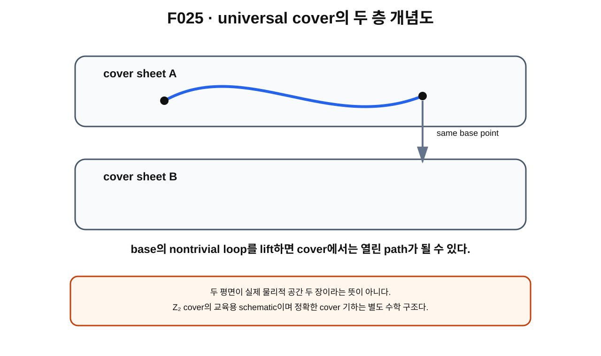

> **STATUS: DRAFT COMPLETE · AUDIT PENDING**
>
> 작성 Chat은 PASS를 부여하지 않는다. universal cover의 표준 topology와 Planck-S² physical Hilbert-space 적용을 구분한다.

# 8장 · loop를 펼쳐 올리기 — universal cover

## 현재 상태
- **작성 상태:** DRAFT COMPLETE
- **감사 상태:** AUDIT PENDING
- **핵심 경계:** cover의 존재/표준 수학 $\neq$ physical FR sector의 자동 선택.

---

## 이번 장의 질문
1. loop가 꼬인 공간을 더 단순한 공간으로 펼쳐 볼 수 있을까?
2. covering space[^v2c08-covering-space]와 lift[^v2c08-lift]는 무엇인가?
3. simply connected[^v2c08-simply-connected] universal cover[^v2c08-universal-cover]는 어떤 역할을 할까?
4. base에서는 닫힌 loop가 cover에서는 왜 열린 path가 될 수 있을까?
5. 열린 path의 두 endpoint를 무엇이 연결할까?

---

## 앞 장 복습

제7장에서 ideal smooth/unquotiented $\mathrm{Map}_1(S^2,S^2)$에는 $\mathbb Z_2$ fundamental group이 있고, $2\pi$ spatial rotation loop가 그 generator라는 assumption-scoped result를 확인했다.

그런데 quantum state를 loop가 있는 공간 위에 정의할 때는 한 가지 문제가 생긴다.

> nontrivial loop를 따라 한 바퀴 돌았을 때 state를 어떻게 비교할 것인가?

이를 조직하는 표준 방법 중 하나가 cover다.

---

## 먼저 생각해 보기 · 원을 나선으로 펼치기

원 $S^1$ 위에서 계속 같은 방향으로 걸으면 출발점으로 돌아온다. 하지만 원을 실수선 $\mathbb R$ 위에 펼쳐 생각하면 한 바퀴는

$$
0\to2\pi
$$

라는 열린 path가 된다.

base circle에서는 같은 점이었던 $0$과 $2\pi$가 cover에서는 다른 점이다.

이 예는 “loop를 더 단순한 위 공간에서 열린 path로 lift한다”는 핵심 직관을 준다.

### 비유의 한계

모든 universal cover가 실제로 평평한 선이나 여러 장의 종이처럼 생기는 것은 아니다. cover는 topology의 관계이지 물리적 층이 실제 공간에 겹쳐 있다는 주장도 아니다.

---

## 그림으로 이해하기 · F025

**그림 F025. base의 nontrivial loop가 Z₂형 cover에서 서로 다른 endpoint를 잇는 열린 lifted path가 되는 교육용 개념도**

### [이 그림에서 볼 것]
- base에서는 출발점과 끝점이 같은 loop다.
- cover에서는 lift의 시작점과 끝점이 서로 다른 sheet에 놓일 수 있다.
- 두 endpoint는 base로 projection하면 같은 점으로 내려간다.

### [이 그림이 뜻하는 것]
nontrivial fundamental-group element가 cover에서 endpoint 이동으로 기록될 수 있다는 직관을 준다.

### [이 그림이 뜻하지 않는 것]
- universal cover가 실제로 평면 두 장이라는 뜻이 아니다.
- 두 sheet가 electron 내부의 두 물리적 층이라는 뜻이 아니다.
- endpoint가 달라졌다는 사실만으로 wavefunction sign을 $-1$로 정했다는 뜻이 아니다.

---

## covering map의 최소 정의

covering space $\widetilde X$와 base space $X$ 사이에

$$
p:\widetilde X\to X
$$

가 있다고 하자.

base의 각 작은 neighborhood를 보면 그 위의 preimage가 서로 겹치지 않는 여러 복사본처럼 보이고, 각 복사본이 $p$에 의해 base neighborhood와 똑같이 대응되는 것이 covering의 기본 구조다.

이 local 구조 덕분에 base의 path를 시작점 하나를 정해 cover 위로 **lift**할 수 있다.

---

## path lifting

base path를

$$
\gamma:[0,1]\to X
$$

라고 하자.

cover에서 시작점 $\tilde x_0$를 골라

$$
p(\tilde x_0)=\gamma(0)
$$

가 되게 한다.

그러면 적절한 covering 조건 아래 base path를 따라가는 lifted path

$$
\widetilde\gamma:[0,1]\to\widetilde X
$$

를 생각할 수 있고

$$
p\circ\widetilde\gamma=\gamma
$$

를 만족한다.

---

## loop인데 왜 cover에서는 안 닫힐까?

base에서

$$
\gamma(0)=\gamma(1)=x_0
$$

이어도 lift의 endpoint는

$$
\widetilde\gamma(1)
$$

이 $\widetilde\gamma(0)$와 다를 수 있다.

둘은 projection 아래 같은 basepoint로 내려갈 뿐이다.

이 endpoint 차이가 fundamental group의 정보를 cover에서 눈에 보이게 기록한다.

---

## universal cover

connected space의 cover 중 cover 자체가 simply connected인 것을 universal cover라고 부른다.

simply connected는

- 공간이 path-connected이고,
- 모든 based loop가 contractible하여
$$
\pi_1(\widetilde X)=0
$$

인 상황을 뜻한다.

즉 base의 loop 꼬임을 cover 쪽에서는 가능한 한 풀어 놓은 공간이라고 생각할 수 있다.

---

## Z₂의 경우 왜 두 층이 자연스러운가

base의 fundamental group이

$$
\pi_1(X)\cong\mathbb Z_2
$$

이고 적절한 universal cover가 존재하면, nontrivial class는 cover의 두 lift endpoint를 교환하는 구조와 연결된다.

한 번 nontrivial loop를 돌면 다른 endpoint로 가고, 두 번 돌면 다시 원래 endpoint로 돌아오는 직관이다.

하지만 아직 이것은 **topology**다.

wavefunction이 두 endpoint에서 같은 값을 가져야 하는지, 반대 부호를 가져야 하는지는 다음 단계의 quantum rule이다.

---

## Planck-S²에서의 사용

G04는 ideal configuration space의 nontrivial loop를 universal-cover/FR language로 옮겨 quantum sectors를 논의했다.

canonical proof ledger는 FR-odd physical 적용을 **CONDITIONAL**로 둔다.

그 이유는 cover 자체의 표준 수학 외에도

- actual physical configuration space,
- line bundle 또는 lifted state construction,
- physical rotation action,
- Hilbert space/domain

이 필요하기 때문이다.

---

## 현재 판정

| 주장 | 상태 | 범위 |
|---|---|---|
| covering space, lift, universal cover | **SOURCE VERIFIED** | 표준 topology |
| nontrivial loop lift가 다른 endpoint에 도달할 수 있음 | **SOURCE VERIFIED** | covering-space theory |
| ideal Map₁의 Z₂ topology | **PROVED UNDER ASSUMPTIONS** | frozen baseline |
| physical FR cover/lift realization | **CONDITIONAL / OPEN ingredients** | physical bridge |
| actual physical configuration space = Map₁ | **OPEN** | canonical ledger |

---

## 오해 방지

> **“cover에 두 층이 있으니 quantum state도 반드시 두 상태다.”** — 아니다. cover sheet와 Hilbert-state count는 다른 문제다.

> **“nontrivial loop lift가 다른 endpoint에 가니 부호는 −1이다.”** — 아직 아니다. endpoint 관계에 어떤 character를 붙일지 결정해야 한다.

---

## 다음 장이 필요한 이유

lift의 시작점과 끝점이 서로 다른 cover point가 될 수 있다. 그런데 이 두 점을 base 관점에서 서로 교환하는 cover symmetry가 있다.

다음 장에서 그 symmetry를 **deck transformation**이라고 부른다.

---

## 한 문장 기억

> **universal cover는 base의 nontrivial loop를 열린 lifted path로 펼쳐 보여 주지만, 그 endpoint에 +1이나 −1을 붙이는 것은 아직 추가 양자구조다.**

---

## 확인문제
1. base loop가 cover에서 열린 path가 될 수 있는 이유는?
2. universal cover의 핵심 성질은?
3. cover topology만으로 FR-odd sign을 고를 수 없는 이유는?

## 정답
1. base에서 같은 점으로 projection되는 서로 다른 cover point가 존재할 수 있기 때문이다.
2. cover 자체가 simply connected라는 점.
3. topology는 endpoint 관계를 주지만 wavefunction transformation law인 character 선택은 별도이기 때문이다.

---

## 근거 자료
- Allen Hatcher, *Algebraic Topology*, covering spaces/universal covers — **SOURCE VERIFIED**.
- **G04**: universal cover와 FR character를 project quantization language로 도입.
- **A01/C02**: physical application scope와 OPEN 조건.

[^v2c08-covering-space]: 작은 범위에서는 base 공간의 복사본 여러 장이 겹쳐 있는 것처럼 보이는 위 공간. 각 sheet는 projection으로 base의 같은 작은 영역에 대응한다.
[^v2c08-lift]: base에 있는 path나 map을 covering space 위의 객체로 올려 projection하면 원래 객체가 되게 하는 것.
[^v2c08-simply-connected]: 한 덩어리로 연결되어 있고 모든 loop가 점으로 줄어드는 공간. fundamental group이 trivial하다.
[^v2c08-universal-cover]: connected base의 loop 꼬임을 가장 완전히 펼친 simply-connected covering space.
