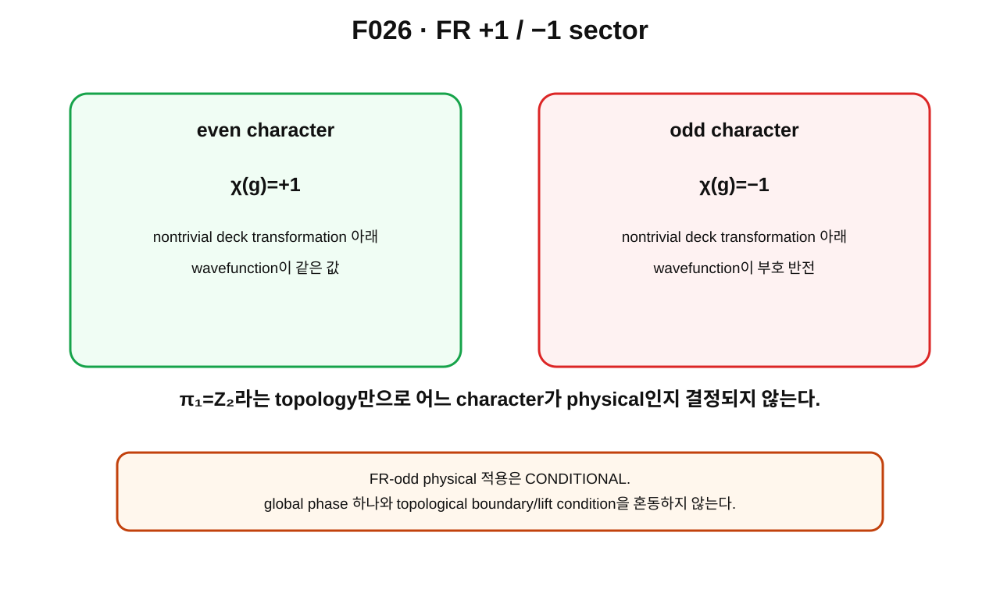

> **STATUS: DRAFT COMPLETE · AUDIT PENDING**
>
> 작성 Chat은 PASS를 부여하지 않는다. $\pi_1=\mathbb Z_2$ topology와 FR character 선택을 분리하며, FR-odd의 physical 적용은 **CONDITIONAL**로 유지한다.

# 10장 · FR character — 위상적 loop에 +1/−1 규칙을 붙이는 법

## 현재 상태
- **작성 상태:** DRAFT COMPLETE
- **감사 상태:** AUDIT PENDING
- **핵심 경계:** $\mathbb Z_2$ topology $\neq$ FR-odd character 자동 선택.

---

## 이번 장의 질문
1. cover 위에 quantum wavefunction[^v2c10-wavefunction]을 정의한다는 것은 어떤 뜻일까?
2. character[^v2c10-character]는 무엇을 정하는가?
3. $\mathbb Z_2$에는 왜 $+1$과 $-1$ 두 1차원 character가 있는가?
4. even sector와 odd sector는 어떻게 다른가?
5. Finkelstein–Rubinstein(FR) quantization[^v2c10-fr]은 topology와 quantum state를 어떻게 연결하는가?
6. 왜 FR-odd sector의 **physical 선택**은 여전히 CONDITIONAL인가?

---

## 앞 장 복습

제9장에서 universal cover의 nontrivial deck transformation을 $g$라고 썼다.

$$
g^2=e.
$$

nontrivial base loop를 한 번 돌면 lifted endpoint가

$$
\tilde q\to g\tilde q
$$

로 바뀔 수 있었다.

하지만 아직

$$
\Psi(g\tilde q)
$$

가 어떤 값을 가져야 하는지는 정하지 않았다.

---

## 먼저 생각해 보기 · 같은 base 상태의 두 lift에 규칙 붙이기

cover 위에 두 점 $\tilde q$와 $g\tilde q$가 있고 둘 다 base에서는 같은 configuration $q$로 내려간다고 하자.

quantum state를 cover 위 함수

$$
\Psi:\widetilde{\mathcal C}\to\mathbb C
$$

로 나타낸다면, 두 lift point의 함수값 사이에 일관된 규칙이 필요하다.

가능한 가장 단순한 규칙은

$$
\Psi(g\tilde q)=\chi(g)\Psi(\tilde q)
$$

이다.

여기서 $\chi(g)$가 character다.

---

## 그림으로 이해하기 · F026

**그림 F026. nontrivial deck transformation 아래 가능한 $+1/-1$ 1차원 FR character 두 sector의 개념도**

### [이 그림에서 볼 것]
- even character: $\chi(g)=+1$.
- odd character: $\chi(g)=-1$.
- 둘 다 같은 $\mathbb Z_2$ topology 위에 정의될 수 있다.

### [이 그림이 뜻하는 것]
$\pi_1=\mathbb Z_2$라는 사실과 wavefunction transformation rule을 분리한 뒤, 1차원 unitary character[^v2c10-unitary-character]로 quantum sector를 정할 수 있다는 뜻이다.

### [이 그림이 뜻하지 않는 것]
- topology가 자동으로 odd sector를 고른다는 뜻이 아니다.
- odd sector라고 부른 순간 actual electron이 증명됐다는 뜻이 아니다.
- $+1/-1$ 두 character가 곧 Hilbert space에 상태가 두 개뿐이라는 뜻도 아니다.

---

## character란 무엇인가

group element에 복소수 phase를 붙이되 group multiplication을 보존하는 map을 생각하자.

$$
\chi:\pi_1(\mathcal C)\to U(1).
$$

그리고

$$
\chi(g_1g_2)=\chi(g_1)\chi(g_2)
$$

를 만족하게 한다.

이런 1차원 representation[^v2c10-representation]을 character라고 부른다.

$\mathbb Z_2=\{e,g\}$에서 $g^2=e$이므로

$$
\chi(g)^2=\chi(e)=1.
$$

따라서 unitary 1차원 character에서는

$$
\chi(g)=+1\quad\text{또는}\quad-1
$$

이다.

---

## even sector와 odd sector

### even sector

$$
\chi_+(g)=+1.
$$

따라서

$$
\Psi(g\tilde q)=+\Psi(\tilde q).
$$

### odd sector

$$
\chi_-(g)=-1.
$$

따라서

$$
\Psi(g\tilde q)=-\Psi(\tilde q).
$$

이 두 규칙은 topology 위에 추가된 quantum boundary/lift condition[^v2c10-boundary-condition]이다.

---

## FR quantization의 핵심 아이디어

Finkelstein과 Rubinstein의 고전적 아이디어는 soliton/kink 같은 field configuration을 양자화할 때 configuration-space topology를 무시하지 않고, nontrivial loops에 대한 state-functional의 transformation law를 허용하는 것이다.

원 논문은 1968년 *Journal of Mathematical Physics*의 “Connection between spin, statistics, and kinks”로 확인했다.

현대 soliton 문헌에서도 configuration-space loops의 contractibility와 FR constraints가 quantum state 제약에 연결된다는 방식으로 사용된다.

이 책에서는 그 일반 철학을 Planck-S² frozen project source G04의 language와 비교해 사용한다.

---

## topology 자체와 character 선택은 다르다

다시 층을 나누자.

### 층 A · topology

$$
\pi_1(\mathcal C)\cong\mathbb Z_2.
$$

### 층 B · character

$$
\chi(g)=+1\quad\text{or}\quad-1.
$$

A만으로 B의 부호는 결정되지 않는다.

그래서

> **$\pi_1=\mathbb Z_2$이므로 반드시 $\Psi\to-\Psi$**

는 잘못된 자동 승격이다.

---

## G04에서의 project use

G04는 ideal cover setting에서

$$
\Psi(g\tilde q)=\pm\Psi(\tilde q)
$$

형태의 두 sector를 사용했다.

A01 감사에서는 이것을 $\pi_1=\mathbb Z_2$의 1차원 unitary character 두 개라는 수학 구조로 assumption 범위에서 생존시켰다.

하지만 **어느 sector가 실제 Planck-S² electron sector인가**는 topology만으로 정해지지 않는다.

---

## 왜 physical FR-odd는 CONDITIONAL인가

odd character를 actual particle physics에 적용하려면 적어도 다음이 맞아야 한다.

1. actual physical configuration space가 무엇인지 정해져야 한다.
2. relevant $\mathbb Z_2$ loop가 physical space에서도 살아 있어야 한다.
3. wavefunction/line-bundle 또는 cover realization이 정의돼야 한다.
4. spatial rotation action이 quantum state에 올바르게 lift돼야 한다.
5. Gate C의 quotient/ontology 문제가 해결돼야 한다.

현재 이 chain 전체는 닫히지 않았다.

따라서 canonical status:

> **FR-odd physical sector: CONDITIONAL.**

---

## global sign과 boundary condition을 구분하기

한 고정된 quantum state 전체에

$$
\Psi\to-\Psi
$$

를 한 번 곱하는 단독 global phase는 일반적으로 같은 ray를 나타낼 수 있다.

하지만 FR condition은

$$
\Psi(g\tilde q)=-\Psi(\tilde q)
$$

처럼 **configuration space의 서로 관련된 lift points 사이의 일관된 transformation rule**이다.

따라서 단순히 “마이너스 부호는 관측 안 되니까 의미 없다”라고 끝낼 수도 없고, 반대로 “마이너스 부호가 곧 관측량이다”라고 말할 수도 없다.

---

## 현재 판정

| 주장 | 상태 | 범위 |
|---|---|---|
| $\mathbb Z_2$의 두 1D unitary characters | **SOURCE VERIFIED** | 표준 group representation |
| FR quantization의 cover/character 원리 | **SOURCE VERIFIED** | Finkelstein–Rubinstein 및 후속 soliton literature |
| G04의 $\Psi(g\tilde q)=\pm\Psi(\tilde q)$ toy/ideal structure | **PROVED UNDER ASSUMPTIONS** | covering assumptions |
| actual Planck-S² FR-odd sector | **CONDITIONAL** | physical space/lift/rotation 조건 |
| complete spin-1/2 | **OPEN** | 아직 미도출 |

---

## 말할 수 있는 것
- $\mathbb Z_2$ topology는 two-character choice를 허용한다.
- odd character를 택하면 nontrivial deck transformation 아래 wavefunction sign이 바뀐다.

## 말할 수 없는 것
- topology가 odd character를 자동 선택한다고 말할 수 없다.
- odd character만으로 actual electron, Fermi statistics, QED를 증명할 수 없다.

---

## 다음 장이 필요한 이유

이제 **odd character를 가정하면** $2\pi$ generator와 $4\pi$ double loop에 어떤 sign이 붙는지 계산할 수 있다.

다음 장에서는 정확히 어디까지가 CONDITIONAL implication인지 선을 긋는다.

---

## 한 문장 기억

> **FR character는 topology가 준 loop class에 quantum transformation rule을 추가하는 구조이며, $\mathbb Z_2$ 자체가 $-1$을 자동 선택하지 않는다.**

---

## 확인문제
1. $\chi(g)^2=1$에서 가능한 unitary 1D character 값은?
2. topology와 character는 왜 다른 층인가?
3. FR-odd physical 적용이 CONDITIONAL인 이유를 두 가지 쓰라.

## 정답
1. $+1,-1$.
2. topology는 loop/deck group을 정하고 character는 그 group이 wavefunction에 어떻게 작용하는지를 추가로 정하기 때문이다.
3. physical configuration space와 quantum lift/rotation action 등이 아직 OPEN이기 때문이다.

---

## 근거 자료
- D. Finkelstein & J. Rubinstein, “Connection between spin, statistics, and kinks,” *J. Math. Phys.* 9 (1968), DOI 10.1063/1.1664510 — bibliographic/source identity 직접 확인.
- Krusch & Speight, “Fermionic quantization of Hopf solitons,” arXiv:hep-th/0503067 — FR constraints와 loop contractibility의 현대 soliton 사용 예.
- **G04**: project universal-cover/FR character construction.
- **A01/C02**: physical scope와 Gate C caveat.

[^v2c10-wavefunction]: 양자상태의 확률진폭을 나타내는 복소함수. 여기서는 configuration-space cover 위에 정의되는 state functional이라는 의미로 사용한다.
[^v2c10-character]: group의 각 원소를 복소 phase에 대응시키면서 multiplication을 보존하는 1차원 representation.
[^v2c10-fr]: configuration-space topology와 cover를 이용해 soliton 같은 field configuration의 quantum boundary condition을 정하는 Finkelstein–Rubinstein 방식.
[^v2c10-unitary-character]: 값의 절댓값이 1인 복소수 phase로 가는 character.
[^v2c10-representation]: abstract group element를 벡터공간/Hilbert space 위의 선형 transformation으로 나타내는 규칙.
[^v2c10-boundary-condition]: 허용되는 wavefunction이 공간의 경계나 서로 식별된 점에서 어떤 관계를 만족해야 하는지 정하는 조건. FR에서는 cover 관련 점들 사이의 transformation law가 이에 해당한다.
