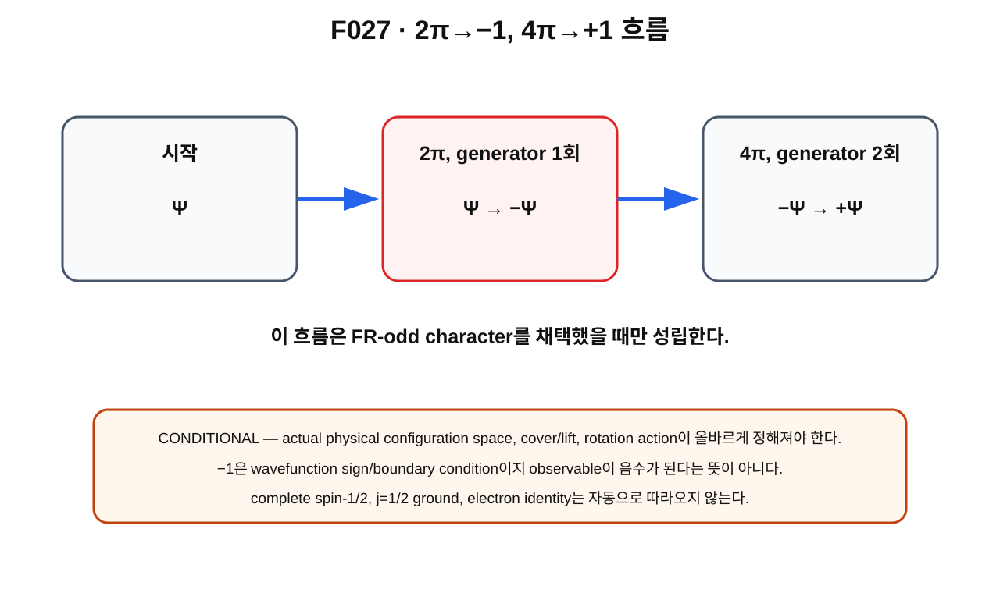

> **STATUS: DRAFT COMPLETE · AUDIT PENDING**
>
> 작성 Chat은 PASS를 부여하지 않는다. 이 장의 $2\pi\to-1$, $4\pi\to+1$은 **FR-odd character가 physical하게 적용된다는 조건 아래의 CONDITIONAL implication**이다.

# 11장 · 2π→−1, 4π→+1 — 정확히 무엇이 조건부로 따라오는가

## 현재 상태
- **작성 상태:** DRAFT COMPLETE
- **감사 상태:** AUDIT PENDING
- **핵심 경계:** $2\pi\to-1$ 가능 $\neq$ complete spin-$1/2$ proof.

---

## 이번 장의 질문
1. FR-odd character를 가정하면 nontrivial generator에 어떤 sign이 붙을까?
2. 왜 generator를 두 번 합성한 $4\pi$ loop에는 다시 $+1$이 붙을까?
3. “wavefunction sign이 −1”은 observable가 음수가 된다는 뜻일까?
4. 왜 이 결과만으로 spin-$1/2$, Fermi statistics, Dirac/QED를 얻었다고 말할 수 없을까?

---

## 앞 장 복습

$\mathbb Z_2=\{e,g\}$에서

$$
g^2=e.
$$

FR-odd character는

$$
\chi_-(g)=-1
$$

로 정했다.

따라서 cover 위 wavefunction은

$$
\Psi(g\tilde q)=-\Psi(\tilde q)
$$

를 만족한다.

이제 **specific $2\pi$ rotation loop가 $g$를 나타낸다는 assumption-scoped generator result**를 결합한다.

---

## 그림으로 이해하기 · F027

**그림 F027. FR-odd 조건 아래 $2\pi\to-1$, $4\pi\to+1$의 logical flow**

### [이 그림에서 볼 것]
- 한 번의 nontrivial generator에 odd character $-1$이 붙는다.
- 두 번 합성하면 $g^2=e$이고 sign도 $(-1)^2=+1$이 된다.
- 이 흐름은 첫 줄의 **FR-odd physical assumption**에 의존한다.

### [이 그림이 뜻하는 것]
명시 조건 아래

$$
2\pi:\Psi\mapsto-\Psi,
$$

$$
4\pi:\Psi\mapsto+\Psi
$$

라는 transformation law가 나온다는 뜻이다.

### [이 그림이 뜻하지 않는 것]
- actual electron proof가 아니다.
- complete spin-$1/2$ representation의 증명이 아니다.
- $j=1/2$이 ground state라는 뜻이 아니다.
- Fermi statistics, Dirac equation, QED가 자동으로 유도됐다는 뜻이 아니다.

---

## 논리 사슬을 한 줄씩 쓰기

### 1. ideal topology

$$
\pi_1(\mathrm{Map}_1(S^2,S^2))\cong\mathbb Z_2
$$

— **PROVED UNDER ASSUMPTIONS**.

### 2. specific rotation loop

ideal smooth/unquotiented setting의 $2\pi$ spatial rotation loop가 nontrivial generator $g$다.

— **PROVED UNDER ASSUMPTIONS**.

### 3. FR character choice

physical quantum sector가 odd character를 사용한다고 가정한다.

$$
\chi(g)=-1.
$$

— **CONDITIONAL** physical application.

### 4. implication

그러면

$$
2\pi\to-1.
$$

또 $4\pi$는 generator를 두 번 적용하므로

$$
\chi(g^2)=\chi(g)^2=(-1)^2=+1.
$$

따라서

$$
4\pi\to+1.
$$

---

## 왜 2π 결과 전체가 CONDITIONAL인가

중간의 1·2번 수학 result가 assumption 범위에서 살아남았더라도, 실제 particle에 적용하려면 3번이 필요하다.

또 C02 때문에 더 앞 단계인 “actual physical configuration space가 unquotiented Map₁인가?”도 OPEN이다.

따라서 실제 Planck-S² particle에 대한 전체 statement는

> **FR-odd $2\pi\to-1$, $4\pi\to+1$: CONDITIONAL**

이다.

---

## wavefunction sign과 observable는 다르다

양자역학에서 state vector 전체에 공통 phase를 곱한 것은 같은 physical ray를 나타낼 수 있다.

따라서 단독으로

$$
\Psi\to-\Psi
$$

만 보고 “어떤 observable가 −1이 됐다”고 말하면 틀린다.

FR에서 중요한 것은 configuration-space loop와 cover의 식별 규칙 아래 state functional이 **일관되게 어떤 transformation law를 만족하는가**다.

그 sign은 interference, representation, boundary condition 같은 더 큰 구조 안에서 의미를 갖는다.

---

## global phase와 topological condition의 차이

### 단독 global phase

한 state 전체에 $-1$을 곱한다.

### FR topological condition

cover의 관련된 points 사이에

$$
\Psi(g\tilde q)=-\Psi(\tilde q)
$$

라는 rule을 공간 전체에서 일관되게 요구한다.

이것은 “한 번 아무 이유 없이 minus를 붙였다”와 다르다.

---

## 왜 아직 spin-1/2가 아닌가

spin-$1/2$이라는 말에는 3차원 arbitrary-axis rotation에 대한 full representation structure가 필요하다.

$2\pi$에서 $-1$이라는 조건은 중요한 특징이지만, 그것만으로

- 모든 rotation generator의 algebra,
- representation label $j$,
- physical Hilbert space,
- Hamiltonian spectrum

이 자동 결정되지는 않는다.

다음 장부터 $SO(3)$와 $SU(2)$의 double cover를 통해 이 차이를 더 정확히 배운다.

---

## 현재 판정

| 주장 | 상태 |
|---|---|
| ideal Map₁의 $\pi_1\cong\mathbb Z_2$ | **PROVED UNDER ASSUMPTIONS** |
| ideal Map₁의 $2\pi$ spatial loop generator | **PROVED UNDER ASSUMPTIONS** |
| FR-odd $2\pi\to-1$, $4\pi\to+1$ physical application | **CONDITIONAL** |
| half-integer rotation sector | **CONDITIONAL** |
| complete spin-$1/2$ | **OPEN** |
| $j=1/2$ ground | **OPEN** |
| Fermi statistics / Dirac / QED | **OPEN** |
| actual physical configuration space = Map₁ | **OPEN** |

---

## 자주 하는 오해

> **“−1이 나왔으니 observable가 음수다.”** — 아니다. wavefunction transformation sign과 observable value를 구분한다.

> **“2π→−1이면 spin-1/2이다.”** — 아직 충분하지 않다. half-integer representation family와 $j$ 선택, dynamics가 남아 있다.

> **“4π→+1은 실험까지 자동 예측한다.”** — physical configuration space와 coupling/observable bridge가 먼저 필요하다.

---

## 다음 장이 필요한 이유

왜 ordinary rotations $SO(3)$에서 half-integer representation을 직접 single-valued representation으로 다루기 어려우며, $SU(2)$가 자연스럽게 등장할까?

다음 장에서 $SU(2)\to SO(3)$ double cover를 배운다.

---

## 한 문장 기억

> **FR-odd를 physical sector로 채택한다는 조건 아래에서만 $2\pi\to-1$, $4\pi\to+1$이 따라오며, 이 sign pattern만으로 complete spin-$1/2$은 아직 아니다.**

---

## 확인문제
1. $4\pi$에서 sign이 $+1$로 돌아오는 algebraic 이유는?
2. 왜 wavefunction $-1$과 observable $-1$을 구분해야 하는가?
3. spin-$1/2$을 위해 추가로 필요한 구조를 하나 말하라.

## 정답
1. $g^2=e$이고 $(-1)^2=+1$이기 때문이다.
2. state vector phase와 측정 observable 값은 서로 다른 객체이기 때문이다.
3. $SU(2)$ representation structure, physical Hilbert space, Hamiltonian dynamics 등.

---

## 근거 자료
- **G04**: FR-odd $2\pi/4\pi$ sign implication.
- **A01**: FR odd/half-integer implication의 조건과 $j=1/2$ OPEN.
- **C02**: physical quotient/lift/3+1D matching caveat.
- Finkelstein–Rubinstein original framework 및 후속 soliton literature: **SOURCE VERIFIED**.
