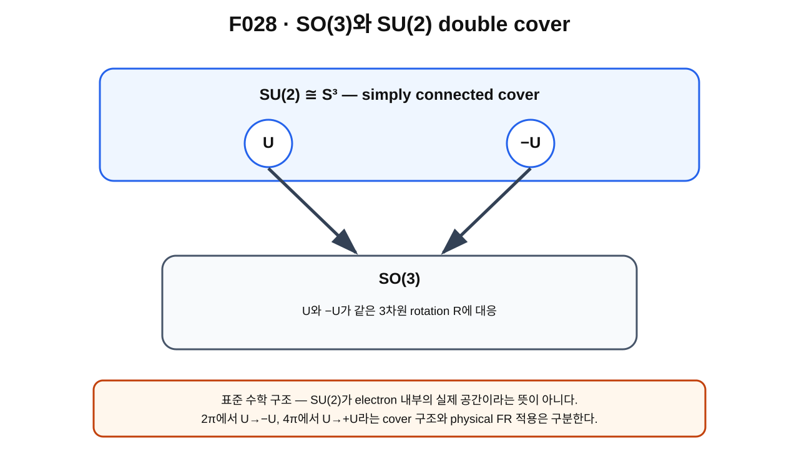

> **STATUS: DRAFT COMPLETE · AUDIT PENDING**
>
> 작성 Chat은 PASS를 부여하지 않는다. $SU(2)\to SO(3)$ double cover는 **SOURCE VERIFIED** 표준 수학이며, $SU(2)$를 Planck-S² electron 내부의 실제 공간으로 해석하지 않는다.

# 12장 · SO(3)와 SU(2) — 왜 double cover가 나타나는가

## 현재 상태
- **작성 상태:** DRAFT COMPLETE
- **감사 상태:** AUDIT PENDING
- **핵심 경계:** standard $SU(2)$ representation theory $\neq$ physical Planck-S² Hilbert space의 자동 확정.

---

## 이번 장의 질문
1. $SU(2)$[^v2c12-su2]는 어떤 matrix group인가?
2. 왜 $SU(2)$는 topologically $S^3$와 같은 공간으로 볼 수 있을까?
3. 왜 $U$와 $-U$가 같은 $SO(3)$ rotation에 대응할까?
4. double cover[^v2c12-double-cover]는 360°/720° 이야기와 어떻게 연결될까?
5. Pauli matrices[^v2c12-pauli]는 어디에서 나타날까?
6. 왜 이 표준 구조만으로 Planck-S² electron의 spin-$1/2$이 완성되지는 않을까?

---

## 앞 장 복습

제11장까지는 configuration-space topology와 FR character를 이용해 **조건부로**

$$
2\pi\to-1,
\qquad
4\pi\to+1
$$

이라는 sign pattern을 얻었다.

이제 표준 rotation theory에서도 왜 비슷한 double-valued 구조가 자연스럽게 나타나는지 본다.

---

## SU(2)의 최소 정의

$SU(2)$는 complex $2\times2$ matrix $U$ 중

$$
U^\dagger U=I,
\qquad
\det U=1
$$

을 만족하는 것들의 group이다.

여기서 unitary[^v2c12-unitary]라는 말은 complex vector의 inner product를 보존한다는 뜻이다.

일반 원소는

$$
U=
\begin{pmatrix}
a&b\\
-b^*&a^*
\end{pmatrix},
\qquad |a|^2+|b|^2=1
$$

처럼 쓸 수 있다.

$a,b$가 complex number이므로 real number 네 개가 있고, 마지막 조건 하나가 자유도를 하나 줄인다. 그래서 $SU(2)$는 topologically 3-sphere

$$
SU(2)\cong S^3
$$

와 연결된다.

---

## 그림으로 이해하기 · F028

**그림 F028. 두 $SU(2)$ 원소 $U$와 $-U$가 같은 $SO(3)$ rotation으로 내려가는 double-cover 개념도**

### [이 그림에서 볼 것]
- cover 쪽의 $U$와 $-U$가 서로 다른 점이다.
- projection하면 둘 다 같은 $R\in SO(3)$에 대응한다.
- kernel이 $\{I,-I\}$인 2-to-1 map이 있다.

### [이 그림이 뜻하는 것]
표준 group homomorphism

$$
p:SU(2)\to SO(3)
$$

이 double cover임을 직관적으로 보여 준다.

### [이 그림이 뜻하지 않는 것]
- $SU(2)$가 electron 내부에 실제로 존재하는 물리적 $S^3$ 공간이라는 뜻이 아니다.
- 두 cover point가 곧 두 electron state라는 뜻이 아니다.
- Planck-S²의 FR lift가 이미 physical하게 완성됐다는 뜻이 아니다.

---

## Pauli matrices와 3차원 벡터

세 Pauli matrix를

$$
\sigma_x=
\begin{pmatrix}0&1\\1&0\end{pmatrix},\quad
\sigma_y=
\begin{pmatrix}0&-i\\i&0\end{pmatrix},\quad
\sigma_z=
\begin{pmatrix}1&0\\0&-1\end{pmatrix}
$$

라고 하자.

3차원 vector $\mathbf x=(x,y,z)$를

$$
X=\mathbf x\cdot\boldsymbol\sigma
$$

라는 Hermitian traceless matrix에 대응시킬 수 있다.

$U\in SU(2)$가

$$
X\mapsto UXU^\dagger
$$

로 작용하면 $\mathbf x$의 길이가 보존되고 3차원 proper rotation이 유도된다.

이 방식으로 $SU(2)\to SO(3)$ map을 만들 수 있다.

---

## 왜 U와 −U가 같은 회전인가

위 작용에 $-U$를 넣으면

$$
(-U)X(-U)^\dagger=UXU^\dagger.
$$

부호가 두 번 나타나 서로 지워진다.

따라서

$$
p(U)=p(-U).
$$

kernel은

$$
\ker p=\{I,-I\}
$$

이고 $SU(2)$는 $SO(3)$를 두 겹으로 덮는다.

---

## 2π와 4π를 SU(2)에서 보기

축 $\hat n$ 주위 angle $\theta$ rotation에 대응하는 $SU(2)$ element를 표준적으로

$$
U(\theta)=\exp\left(-\frac{i\theta}{2}\hat n\cdot\boldsymbol\sigma\right)
$$

처럼 쓸 수 있다.

그러면

$$
U(0)=I,
$$

$$
U(2\pi)=-I,
$$

$$
U(4\pi)=+I.
$$

하지만 $SO(3)$ projection에서는 $I$와 $-I$가 같은 identity rotation에 대응한다.

그래서 360° path가 $SO(3)$에서는 닫히지만 $SU(2)$ cover에서는 $I$에서 $-I$로 가는 열린 path로 보이고, 720°에야 $+I$로 돌아온다.

---

## SU(2)가 왜 ‘억지 장치’가 아닌가

$SU(2)$는 electron spin을 설명하기 위해 임의로 발명한 기호가 아니다.

- $SU(2)$는 독립적으로 잘 정의된 Lie group이다.
- topologically $S^3$다.
- $SO(3)$의 simply-connected double cover다.
- Lie algebra 수준에서 $\mathfrak{su}(2)$와 $\mathfrak{so}(3)$가 같은 commutation structure를 가진다.

이 때문에 회전의 half-integer representations를 다룰 때 자연스럽게 등장한다.

---

## SO(3) representation과 SU(2) representation

ordinary single-valued $SO(3)$ irreducible representations에는 integer $j$가 대응한다.

$SU(2)$에서는

$$
j=0,\frac12,1,\frac32,2,\ldots
$$

처럼 half-integer label도 포함된다.

다음 장에서 왜 $-I$의 작용이 integer/half-integer를 구분하는지 본다.

---

## standard/source result

UNC Michael Taylor의 Lie group 강의와 대학 수준의 $SU(2)$/$SO(3)$ 자료를 직접 대조해 다음을 확인했다.

- $SU(2)$는 determinant 1인 $2\times2$ unitary matrices의 group.
- $SU(2)\cong S^3$.
- $SU(2)\to SO(3)$는 kernel $\{\pm I\}$를 갖는 double cover.
- $SU(2)$가 simply connected이므로 $SO(3)$의 universal cover로 볼 수 있다.

MIT Quantum Theory lecture notes도 $SO(3)$ versus $SU(2)$와 angular-momentum representation을 표준 quantum-mechanics 배경으로 다룬다.

---

## Planck-S²와의 관계

Planck-S²에서 $SU(2)$ 구조가 의미를 가지려면 **physical rotation action을 quantum state space에 어떻게 lift하는가**가 필요하다.

C02 canonical baseline에서는 quantum lift와 external 3+1D rotation matching이 아직 OPEN이다.

따라서 표준 $SU(2)$ 수학이 맞다는 사실을

> “Planck-S² electron이 실제 $SU(2)$ spinor임이 증명됐다”

로 바꾸면 안 된다.

---

## 현재 판정

| 주장 | 상태 |
|---|---|
| $SU(2)$ 정의, $SU(2)\cong S^3$ | **SOURCE VERIFIED** |
| $SU(2)\to SO(3)$ double cover, kernel $\{\pm I\}$ | **SOURCE VERIFIED** |
| $2\pi:I\to-I$, $4\pi:I\to I$ cover path | **SOURCE VERIFIED** |
| Planck-S² physical $SU(2)$ lift | **OPEN / CONDITIONAL ingredients** |
| FR-odd physical sector | **CONDITIONAL** |
| complete spin-$1/2$ | **OPEN** |

---

## 자주 하는 오해

> **“SU(2)=전자 내부 공간이다.”** — 아니다. 표준 rotation-cover group이다.

> **“2π에서 −I니까 electron wavefunction은 무조건 −1이다.”** — standard cover matrix와 physical FR character/lift를 구분해야 한다.

---

## 다음 장이 필요한 이유

$SU(2)$에는 integer와 half-integer $j$가 모두 있다. 그렇다면 FR-odd 조건은 어떤 $j$들을 허용하고 어떤 $j$들을 배제할까?

---

## 한 문장 기억

> **$SU(2)$는 $SO(3)$의 simply-connected double cover이며 $U$와 $-U$가 같은 spatial rotation에 대응하지만, 이 표준 사실을 Planck-S² physical spin proof로 자동 승격할 수는 없다.**

---

## 확인문제
1. $SU(2)$의 두 defining conditions는?
2. 왜 $U$와 $-U$가 같은 $SO(3)$ rotation을 주는가?
3. $U(2\pi)$와 $U(4\pi)$는 각각 무엇인가?

## 정답
1. $U^\dagger U=I$, $\det U=1$.
2. conjugation에서 두 minus sign이 상쇄되기 때문이다.
3. $-I$, $+I$.

---

## 근거 자료
- Michael Taylor, *Lectures on Lie Groups*, §18 representations of $SU(2)$ and $SU(2)\to SO(3)$ — **SOURCE VERIFIED**.
- University of Rochester, “SU(2)'s Double-Covering of SO(3)” — double-cover derivation cross-check.
- MIT OpenCourseWare 8.321, lecture on $SO(3)$ versus $SU(2)$ — physics representation background.
- **G04/A01/C02** — Planck-S² application scope.

[^v2c12-su2]: special unitary group of degree 2. $2\times2$ unitary matrices 중 determinant가 1인 것들의 group.
[^v2c12-double-cover]: cover의 서로 다른 두 점이 base의 한 점에 대응하는 2-to-1 covering structure.
[^v2c12-pauli]: spin-$1/2$ quantum mechanics와 $SU(2)$ algebra에서 널리 쓰이는 세 개의 $2\times2$ Hermitian matrices.
[^v2c12-unitary]: complex inner product와 vector norm을 보존하는 matrix transformation.
