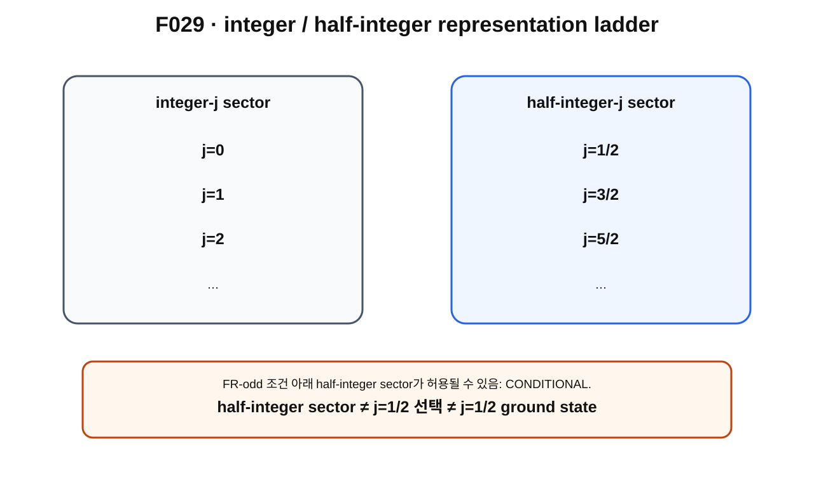

> **STATUS: DRAFT COMPLETE · AUDIT PENDING**
>
> 작성 Chat은 PASS를 부여하지 않는다. half-integer rotation sector의 physical 적용은 **CONDITIONAL**이며, 이 장은 $j=1/2$ 또는 ground state를 자동 선택하지 않는다.

# 13장 · half-integer representation — j=1/2, 3/2, 5/2, ...

## 현재 상태
- **작성 상태:** DRAFT COMPLETE
- **감사 상태:** AUDIT PENDING
- **핵심 경계:** half-integer sector $\neq$ $j=1/2$ 선택 $\neq$ $j=1/2$ ground state.

---

## 이번 장의 질문
1. $SU(2)$의 irreducible representation[^v2c13-irrep]은 왜 $j$라는 label로 분류할 수 있을까?
2. integer $j$와 half-integer[^v2c13-half-integer] $j$는 어떻게 다른가?
3. 중앙 원소 $-I$는 representation에서 어떻게 작용할까?
4. 왜 $(-1)^{2j}$가 integer/half-integer sector를 구분할까?
5. FR-odd 조건이 성립하면 왜 integer-$j$ sector가 배제되고 half-integer-$j$가 허용될 수 있을까?
6. 왜 이것이 아직 $j=1/2$ 선택은 아닌가?

---

## 앞 장 복습

제12장에서

$$
SU(2)\to SO(3)
$$

가 double cover이고

$$
U\sim -U
$$

가 같은 $SO(3)$ rotation으로 내려간다는 것을 배웠다.

특히 cover에서

$$
2\pi: I\to -I,
\qquad
4\pi:I\to+I
$$

라는 구조가 있었다.

이제 $SU(2)$가 quantum state space에 representation으로 작용할 때 $-I$가 무엇을 하는지 본다.

---

## 그림으로 이해하기 · F029

**그림 F029. integer-$j$와 half-integer-$j$ representation ladder를 분리한 개념도**

### [이 그림에서 볼 것]
- integer sector에는 $j=0,1,2,\ldots$가 있다.
- half-integer sector에는 $j=\frac12,\frac32,\frac52,\ldots$가 있다.
- half-integer sector 안에도 여러 $j$가 있으므로 $j=1/2$만 남는 것이 아니다.

### [이 그림이 뜻하는 것]
$SU(2)$ representation label $j$의 두 계열과 FR-odd condition이 허용할 수 있는 sector의 범위를 보여 준다.

### [이 그림이 뜻하지 않는 것]
- $j=1/2$이 자동으로 선택됐다는 뜻이 아니다.
- $j=1/2$이 lowest energy state라는 뜻이 아니다.
- 실제 electron spectrum을 그린 그림이 아니다.

---

## representation label j

$SU(2)$의 finite-dimensional irreducible representations는 표준적으로

$$
j=0,\frac12,1,\frac32,2,\ldots
$$

로 label할 수 있다.

각 $j$ representation의 dimension은

$$
2j+1
$$

이다.

예를 들어

- $j=0$: 1차원
- $j=1/2$: 2차원
- $j=1$: 3차원
- $j=3/2$: 4차원

이다.

이 dimension 공식은 **하나의 $SU(2)$ irreducible representation**에 관한 표준 결과다. full rotor Hilbert block의 상태수를 곧바로 뜻하는 것은 아니다.

---

## 중앙 원소 −I

$SU(2)$의 $-I$는 모든 group element와 commute하는 central element[^v2c13-central]다.

spin-$j$ irreducible representation에서 이 중앙 원소는

$$
D^{(j)}(-I)=(-1)^{2j}I
$$

로 작용한다.

따라서

### integer j

$2j$가 짝수이므로

$$
(-1)^{2j}=+1.
$$

### half-integer j

$2j$가 홀수이므로

$$
(-1)^{2j}=-1.
$$

이것이 $2\pi$ rotation sign과 representation label이 연결되는 표준 representation-theory 구조다.

---

## FR-odd와 결합하면 무엇이 생기나

FR-odd physical condition을 가정하면 $2\pi$ rotation의 lifted action이 state에 $-1$을 주어야 한다.

표준 $SU(2)$ representation에서 $2\pi$에 해당하는 central element $-I$가 $-1$로 작용하려면

$$
(-1)^{2j}=-1
$$

이어야 하므로 $j$는 half-integer다.

따라서 조건부로

$$
j=\frac12,\frac32,\frac52,\ldots
$$

sector가 허용되고 integer $j$는 배제된다.

canonical status:

> **half-integer rotation sector: CONDITIONAL.**

---

## 왜 CONDITIONAL인가

이 implication은 다음 조건들에 의존한다.

- actual physical configuration-space branch가 relevant $\mathbb Z_2$ loop를 유지한다.
- FR-odd character가 physical sector에 적용된다.
- spatial rotation action이 quantum Hilbert space에 올바르게 lift된다.
- $SU(2)$ representation language가 그 physical rotation action을 나타낸다.

C02 기준으로 이 physical chain은 완전히 닫히지 않았다.

---

## 가장 중요한 경계 · half-integer ≠ j=1/2

half-integer sector에는

$$
\frac12,\frac32,\frac52,\ldots
$$

가 모두 포함된다.

따라서 topology/FR이 half-integer를 허용하더라도

> “그러므로 $j=1/2$이다”

는 나오지 않는다.

$j=1/2$을 고르려면 Hamiltonian과 spectrum이 어떤 $j$ state의 energy를 가장 낮게 만드는지 알아야 한다.

즉 **dynamics**가 필요하다.

---

## standard/source result

표준 $SU(2)$ representation theory에서

- irreducible labels $j=0,1/2,1,3/2,\ldots$,
- dimension $2j+1$,
- central $-I$의 action $(-1)^{2j}$

를 확인할 수 있다.

이들은 **SOURCE VERIFIED** 표준 결과다.

---

## Planck-S² 현재 판정

| 주장 | 상태 |
|---|---|
| $SU(2)$ irrep labels와 $(-1)^{2j}$ | **SOURCE VERIFIED** |
| FR-odd 조건 아래 half-integer sector | **CONDITIONAL** |
| $j=1/2$ representation의 physical 선택 | **OPEN** |
| $j=1/2$ ground state | **OPEN** |
| physical Hilbert-space realization | **OPEN** |
| 전체 Planck-S² | **WORKING HYPOTHESIS** |

---

## 자주 하는 오해

> **“half-integer면 곧 spin-1/2이다.”** — 아니다. $3/2,5/2,\ldots$도 half-integer다.

> **“dimension $2j+1$이니까 $j=1/2$이면 전체 rotor 상태는 2개다.”** — 이 책의 frozen audit에서는 과거 G06의 그 식의 과대적용이 반증됐다. 자세한 state-count 문제는 제3권에서 다룬다.

> **“FR topology가 ground state를 정한다.”** — 아니다. energy ordering은 dynamics의 문제다.

---

## 다음 장이 필요한 이유

이제 우리가 얻은 것과 아직 못 얻은 것을 세 단계로 정확히 분리할 때다.

A. half-integer sector 허용

B. $j=1/2$ representation 선택

C. $j=1/2$ ground state

다음 장은 이 셋을 의도적으로 분리한다.

---

## 한 문장 기억

> **FR-odd가 physical하게 성립하면 half-integer $j$ sector를 조건부로 허용할 수 있지만, 그 안에서 $j=1/2$을 고르는 것은 별도의 동역학 문제다.**

---

## 확인문제
1. $j=3/2$에서 $(-1)^{2j}$는?
2. half-integer sector가 $j=1/2$ 하나만 뜻하지 않는 이유는?
3. $j=1/2$ ground를 결정하려면 무엇이 필요한가?

## 정답
1. $(-1)^3=-1$.
2. $3/2,5/2,\ldots$도 모두 half-integer이기 때문이다.
3. physical Hamiltonian과 spectrum/energy ordering이 필요하다.

---

## 근거 자료
- Michael Taylor, *Lectures on Lie Groups*, $SU(2)$ representation classification — **SOURCE VERIFIED**.
- MIT OpenCourseWare 8.321 rotation/angular-momentum representation background — **SOURCE VERIFIED**.
- **G04/A01**: FR-odd → half-integer implication과 $j=1/2$ OPEN 경계.
- **C02**: quantum lift/physical Hilbert space OPEN.

[^v2c13-irrep]: irreducible representation. 더 작은 invariant subspace들의 직접합으로 분해되지 않는 기본 representation block.
[^v2c13-half-integer]: 정수에 $1/2$을 더한 꼴의 수. 여기서는 $1/2,3/2,5/2,\ldots$ 같은 $SU(2)$ representation label을 뜻한다.
[^v2c13-central]: group의 모든 원소와 순서를 바꾸어 곱해도 같은 결과를 내는 원소. $SU(2)$의 $\pm I$는 center에 있다.
