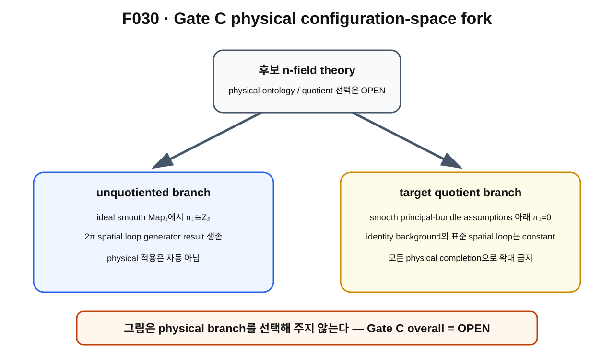

> **STATUS: DRAFT COMPLETE · AUDIT PENDING**
>
> 작성 Chat은 PASS를 부여하지 않는다. 최신 hostile audit C02를 현재 판정에서 우선하며 Gate C overall = **OPEN**을 유지한다.

# 15장 · Gate C의 갈림길 — unquotiented space와 quotient space

## 현재 상태
- **작성 상태:** DRAFT COMPLETE
- **감사 상태:** AUDIT PENDING
- **핵심 경계:** current provisional n-only CP¹ branch의 target $SO(3)$ model statement와 actual physical configuration-space choice를 분리한다.

---

## 이번 장의 질문
1. target $SO(3)$를 실제 physical degree of freedom으로 남길지, redundancy로 quotient할지 왜 중요한가?
2. Noether symmetry[^v2c15-noether]와 gauge redundancy는 어떻게 다른가?
3. C01은 무엇을 계산했고, C02는 무엇을 강등했는가?
4. unquotiented branch와 target quotient branch에서 topology는 어떻게 달라질 수 있는가?
5. smooth quotient에서 $\pi_1=0$이라는 C02 결과의 범위는 어디까지인가?
6. 왜 어느 branch가 actual electron에 맞는지는 아직 OPEN인가?

---

## 앞 장 복습

제2권의 FR chain은 대부분 ideal smooth **unquotiented** mapping space를 기준으로 설명했다.

그 branch에서는 frozen baseline에서

$$
\pi_1(\mathrm{Map}_1(S^2,S^2))\cong\mathbb Z_2
$$

와 specific $2\pi$ spatial rotation generator theorem이 **PROVED UNDER ASSUMPTIONS**로 살아남는다.

하지만 physical state space를 만들 때 target $SO(3)$ 방향을 서로 다른 state로 셀 것인지, 같은 physical state의 다른 표현으로 quotient할 것인지는 별도 문제다.

---

## 그림으로 이해하기 · F030

**그림 F030. unquotiented branch와 target quotient branch의 configuration-space topology 차이를 보여 주는 개념도**

### [이 그림에서 볼 것]
- 왼쪽 unquotiented branch에서는 ideal Map₁의 $\mathbb Z_2$ result와 rotation generator result가 살아 있다.
- 오른쪽 smooth target quotient branch에서는 C02의 명시 가정 아래 quotient $\pi_1$가 trivial해질 수 있고 standard spatial loop가 constant가 된다.
- 위쪽의 physical branch 선택 자체는 OPEN이다.

### [이 그림이 뜻하는 것]
configuration space에서 무엇을 quotient하는지가 fundamental group과 FR loop의 fate를 바꿀 수 있다는 뜻이다.

### [이 그림이 뜻하지 않는 것]
- 오른쪽 branch가 실제 electron의 정답이라고 판정한 그림이 아니다.
- 왼쪽 branch가 실제 electron의 정답이라고 판정한 그림도 아니다.
- smooth quotient theorem이 모든 Sobolev/EFT/physical completion에 자동 적용된다는 뜻이 아니다.

---

## C01이 계산한 것

C01은 current provisional unreduced n-only CP¹ $O(p^2)$ action에서 constant target rotation

$$
n(x)\mapsto A n(x),\qquad A\in SO(3)_{\rm target}
$$

에 대한 action invariance와 local-gauge 여부를 조사했다.

현재 C02까지 살아남은 model-level statement는 다음이다.

> **명시된 current action과 branch assumptions 아래 constant target $SO(3)$는 global Noether symmetry이고, unchanged action의 nontrivial local target gauge가 아니다.**

canonical label은 **PROVED UNDER ASSUMPTIONS** 범위의 model statement다.

---

## global Noether symmetry와 gauge redundancy

### global symmetry

모든 시공간점에서 같은 constant group element를 적용했을 때 action이 invariant하고, 일반적으로 서로 다른 configurations 사이를 실제 symmetry orbit로 연결할 수 있다.

### gauge redundancy

시공간에 따라 arbitrary하게 변하는 transformation이 물리적으로 같은 state의 다른 표현을 나타내며 first-class constraints/Noether identities 같은 구조와 연결되는 경우다.[^v2c15-gauge]

C01/C02는 **unchanged current n-only action**의 target $SO(3)$를 nontrivial local gauge라고 부르는 해석을 유지하지 않는다.

그 해석은 canonical ledger에서 **FALSIFIED AS WRITTEN**이다.

---

## 그런데 왜 physical Gate C는 닫히지 않았나

model action에서 global symmetry를 보였다고 해서 그 symmetry가 final Planck-S²에서 실제 internal observable symmetry라는 것이 자동 증명되는 것은 아니다.

C02가 남긴 OPEN 항목은 다음과 같다.

- final physical action
- target ontology[^v2c15-ontology]
- observable algebra
- physical quotient choice
- quantum group-action lift
- external 3+1D spatial rotation matching

따라서

> **Gate C overall = OPEN.**

C01의 이전 overall CONDITIONAL-PASS 제안은 현재 canonical 판정이 아니다.

---

## unquotiented branch

상대적으로 단순한 ideal branch에서는 target-related configurations를 quotient하지 않고 모두 mapping space 안에 남겨 둔다.

이때 frozen baseline의 smooth setting에서는

$$
\pi_1(\mathrm{Map}_1(S^2,S^2))\cong\mathbb Z_2
$$

와 $2\pi$ spatial generator theorem이 assumption 범위에서 생존한다.

그러나 이것을 곧 actual physical electron state space라고 부를 수는 없다.

---

## target quotient branch

이번에는 constant target rotations로 연결되는 configurations를 같은 physical point로 식별한다고 가정하자.

개념적으로

$$
\mathrm{Map}_1(S^2,S^2)/SO(3)_{\rm target}
$$

같은 quotient[^v2c15-quotient]를 생각하게 된다.

identity background $n_0(x)=x$에서는 spatial rotation path와 target rotation orbit가 특별히 맞물린다.

$$
n_0\circ R(t)^{-1}=R(t)^{-1}n_0.
$$

따라서 target orbit 전체를 quotient하면 standard spatial rotation loop도 quotient space에서 한 point에 머무는 constant loop로 내려갈 수 있다.

A01은 이 standard loop 제거를 explicit counterexample로 사용했고, C02는 더 나아가 smooth quotient branch를 분석했다.

---

## C02의 smooth quotient π₁ result

C02 hostile audit는 **smooth principal-bundle 관련 가정 아래** target quotient의 fundamental group이 trivial해지는 결과를 제시한다.

즉 그 branch에서는

$$
\pi_1\big(\mathrm{Map}_1/SO(3)_{\rm target}\big)=0
$$

라는 assumption-scoped theorem이 있다.

현재 교과서에서는 이를

> **PROVED UNDER ASSUMPTIONS — smooth quotient branch**

로만 읽는다.

여기서 principal bundle[^v2c15-principal-bundle]이란 group이 적절히 free/proper하게 작용할 때 total space와 quotient base 사이의 symmetry-orbit 구조를 정리하는 표준 bundle이다.

---

## 절대 반대 방향으로도 과장하지 않는다

C02의 quotient result가 있다고 해서

> “그러므로 모든 possible physical Planck-S² completion에서 FR은 틀렸다”

라고 말할 수 없다.

왜냐하면 아직

- 어떤 completion을 쓸지,
- finite-energy/EFT-valid subset이 무엇인지,
- target $SO(3)$를 실제로 quotient해야 하는지,
- action이 final theory에서 어떻게 바뀌는지

가 OPEN이기 때문이다.

따라서 두 과장 모두 금지다.

### 금지 A

> unquotiented theorem이 있으니 actual electron에서도 FR 확정.

### 금지 B

> smooth quotient theorem이 있으니 모든 physical theory에서 FR 불가능.

둘 다 canonical 범위를 넘는다.

---

## stabilizer가 왜 등장하나

모든 configuration에서 group action이 free한 것은 아니다.

어떤 configuration은 일부 rotations 아래 자기 자신으로 남을 수 있다. 그런 group 원소들의 모음을 stabilizer[^v2c15-stabilizer]라고 한다.

C02는 background에 따라 orbit rank와 stabilizer 구조가 달라져 Gate B의 zero-mode/collective-coordinate counting에도 영향을 줄 수 있음을 지적한다.

이 상세 문제는 제3·5권에서 더 깊게 다룬다.

---

## 현재 판정

| 주장 | 상태 | 정확한 범위 |
|---|---|---|
| current unreduced n-only action의 constant target $SO(3)$ global Noether symmetry | **PROVED UNDER ASSUMPTIONS** | provisional model statement |
| same unchanged action을 nontrivial local target gauge로 해석 | **FALSIFIED AS WRITTEN** | C01/C02 |
| target $SO(3)$가 final physical internal symmetry임 | **CONDITIONAL** | ontology/action/observable 미폐쇄 |
| smooth unquotiented Map₁ topology/generator | **PROVED UNDER ASSUMPTIONS** | frozen ideal setting |
| smooth target quotient의 $\pi_1=0$ | **PROVED UNDER ASSUMPTIONS** | C02 principal-bundle-related assumptions |
| quotient result가 모든 physical completion에 적용 | **OPEN / NOT ESTABLISHED** | 자동 확대 금지 |
| actual physical quotient 선택 | **OPEN** | Gate C 핵심 |
| Gate C overall | **OPEN** | canonical current verdict |
| 전체 Planck-S² | **WORKING HYPOTHESIS** | 전체 theory |

---

## 이것으로 말할 수 있는 것
- configuration-space topology는 quotient choice에 민감할 수 있다.
- current unreduced model에서 target $SO(3)$는 global Noether symmetry로 분류되는 model result가 있다.
- smooth quotient branch에는 C02의 trivial-$\pi_1$ assumption-scoped result가 있다.

## 이것으로 말할 수 없는 것
- 어느 branch가 actual electron의 physical configuration space인지 확정할 수 없다.
- C02 quotient theorem을 모든 completion에 일반화할 수 없다.
- unquotiented result를 actual electron FR proof로 확대할 수 없다.
- Gate C를 PASS라고 부를 수 없다.

---

## 다음 장이 필요한 이유

이제 제2권의 전체 논리 사슬과 갈림길을 한 번에 정리해야 한다.

우리는 어디까지 조건부로 연결했고, 어떤 벽 때문에 아직 complete spin-$1/2$과 electron identity에 도달하지 못했을까?

---

## 한 문장 기억

> **Gate C의 핵심은 ‘target rotation을 무엇으로 볼 것인가’가 configuration-space topology와 FR loop를 바꿀 수 있다는 것이며, 현재 physical branch 선택 자체가 OPEN이다.**

---

## 확인문제
1. global Noether symmetry와 local gauge redundancy의 차이를 말하라.
2. quotient에서 identity-background spatial loop가 constant가 될 수 있는 이유는?
3. 왜 C02의 quotient $\pi_1=0$을 모든 physical completion에 적용하면 안 되는가?

## 정답
1. global symmetry는 constant transformation의 physical symmetry action이고, gauge redundancy는 local transformation이 같은 physical state의 표현을 바꾸는 구조다.
2. identity background에서는 spatial precomposition이 target rotation orbit과 일치할 수 있고 그 orbit을 quotient하면 모두 같은 point가 되기 때문이다.
3. completion, EFT-valid subset, final action, target ontology, actual quotient choice가 아직 OPEN이기 때문이다.

---

## 근거 자료
- **C01**: provisional n-only action의 target $SO(3)$ symmetry/non-gauge 분석.
- **C02**: current official Gate C overall OPEN, quotient topology, standard loop fate, physical caveats.
- **A01 §2.3**: target quotient에서 standard spatial loop가 constant가 되는 explicit counterexample.
- standard principal-bundle/quotient language: external topology background — **SOURCE VERIFIED**.

[^v2c15-noether]: 연속적인 global symmetry가 있을 때 conserved current/charge와 연결되는 Noether theorem의 symmetry 개념. 여기서는 current model action의 constant target rotations를 분류하는 데 쓰인다.
[^v2c15-gauge]: 서로 다른 field 표현이 실제로 같은 physical state를 나타내는 local redundancy. 단순한 global symmetry와는 다르다.
[^v2c15-ontology]: 이론에서 어떤 수학적 자유도가 실제 물리적으로 존재하거나 서로 다른 상태를 나타내는지에 관한 해석 구조.
[^v2c15-quotient]: symmetry로 서로 연결된 points를 하나의 equivalence class로 묶어 같은 point로 보는 새로운 공간을 만드는 과정.
[^v2c15-principal-bundle]: group이 fiber처럼 작용하여 total space를 symmetry orbit들과 quotient base로 조직하는 표준 bundle 구조. free/proper action 같은 조건이 중요하다.
[^v2c15-stabilizer]: 어떤 configuration을 그대로 두는 group transformations의 subgroup.
